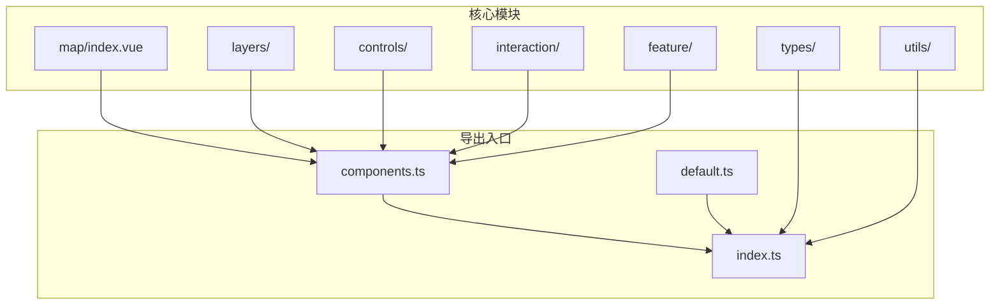
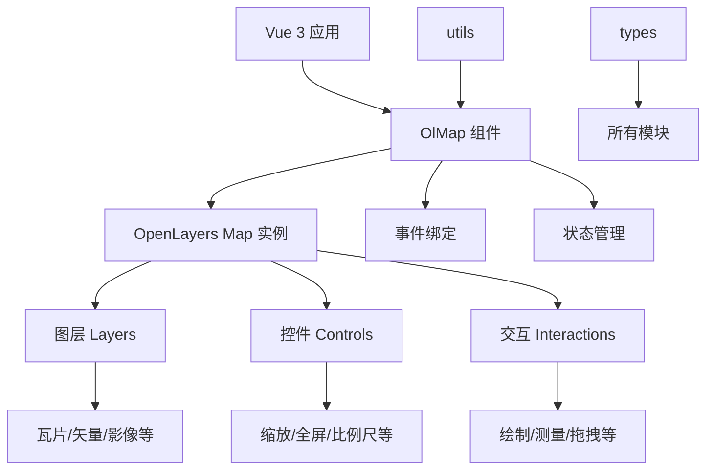
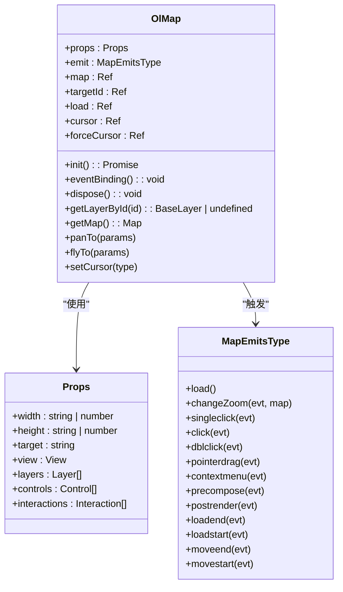
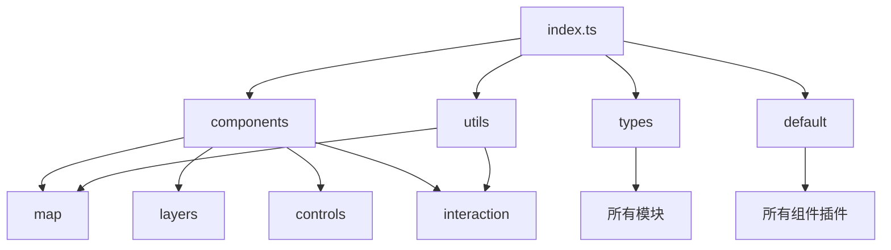

# API 参考

<cite>
**本文档中引用的文件**   
- [index.ts](file://src/packages/index.ts)
- [default.ts](file://src/packages/default.ts)
- [components.ts](file://src/packages/components.ts)
- [map/index.vue](file://src/packages/map/index.vue)
- [types/index.ts](file://src/packages/types/index.ts)
</cite>

## 目录
1. [简介](#简介)
2. [项目结构](#项目结构)
3. [核心组件](#核心组件)
4. [架构概览](#架构概览)
5. [详细组件分析](#详细组件分析)
6. [依赖分析](#依赖分析)
7. [性能考虑](#性能考虑)
8. [故障排除指南](#故障排除指南)
9. [结论](#结论)

## 简介
本项目是一个基于 OpenLayers 的 Vue 3 地图组件库，提供了一系列可复用的地图功能模块，包括图层、控件、交互、矢量渲染等。该库通过 TypeScript 和 Vue Composition API 实现类型安全和响应式能力，支持按需引入和全局配置注入，适用于构建现代化的地理信息可视化应用。

## 项目结构
项目采用模块化设计，主要功能集中在 `src/packages` 目录下，按功能划分为多个子模块。每个模块包含 `.ts` 逻辑文件和 `.vue` 组件文件，遵循 Vue 3 单文件组件规范。核心导出通过 `index.ts` 和 `components.ts` 统一管理，支持命名导出和默认安装器。

**图源**
- [index.ts](file://src/packages/index.ts)
- [components.ts](file://src/packages/components.ts)
- [default.ts](file://src/packages/default.ts)

**节源**
- [index.ts](file://src/packages/index.ts#L0-L7)
- [components.ts](file://src/packages/components.ts#L0-L93)

## 核心组件
本库的核心组件包括地图容器 `OlMap`、各类图层（瓦片、矢量、热力图等）、地图控件（缩放、全屏、鹰眼等）以及交互功能（绘制、测量、拖拽旋转缩放等）。所有组件均通过 `components.ts` 导出，并在 `default.ts` 中注册为插件，支持通过 `app.use()` 全局安装。

**节源**
- [components.ts](file://src/packages/components.ts#L0-L93)
- [default.ts](file://src/packages/default.ts#L0-L163)

## 架构概览
整个库采用分层架构，上层为 Vue 组件封装，中层为业务逻辑与 OpenLayers API 适配，底层依赖 OpenLayers 原生库。通过 `types` 目录统一类型定义，`utils` 提供通用工具函数，`hooks` 封装可复用逻辑，确保类型安全和代码复用。

**图源**
- [map/index.vue](file://src/packages/map/index.vue#L0-L218)
- [types/index.ts](file://src/packages/types/index.ts#L0-L24)

## 详细组件分析

### OlMap 组件分析
`OlMap` 是地图的根容器组件，负责初始化 OpenLayers 的 `Map` 实例，管理生命周期、事件绑定和子组件注入。

#### Props 属性
- **width**: 地图容器宽度，默认值 `"100%"`
- **height**: 地图容器高度，默认值 `"100%"`
- **target**: 地图容器 ID，若未指定则自动生成
- 其他继承自 `VMap` 类型的属性（如 view、layers、controls 等）

#### Emits 事件
- **load**: 地图初始化完成后触发
- **changeZoom**: 视图层级变化时触发，携带当前 zoom 值
- **singleclick**: 单击事件
- **click**: 点击事件
- **dblclick**: 双击事件
- **pointerdrag**: 拖拽事件
- **contextmenu**: 右键菜单事件
- **precompose/postrender/loadend/loadstart/moveend/movestart**: OpenLayers 生命周期事件

#### Slots 插槽
- 默认插槽：用于插入子组件（如图层、控件等），仅在地图加载完成后渲染

#### 暴露方法（defineExpose）
- **getMap**: 获取原生 OpenLayers Map 实例
- **getLayerById(id)**: 根据 ID 获取图层对象
- **panTo(params)**: 平滑移动到指定位置
- **flyTo(params)**: 飞行动画到指定位置
- **readFeatures**: 读取要素（来自 utils）
- **setCursor(type)**: 设置鼠标指针样式

**图源**
- [map/index.vue](file://src/packages/map/index.vue#L0-L218)

**节源**
- [map/index.vue](file://src/packages/map/index.vue#L0-L218)

## 依赖分析
本库依赖 OpenLayers 作为底层地图引擎，通过 Vue 3 的 Composition API 实现响应式封装。各模块之间通过 `index.ts` 和 `components.ts` 进行解耦，`types` 模块被所有组件共享，`utils` 提供通用函数（如坐标转换、动画等），`default.ts` 实现配置注入机制。

**图源**
- [index.ts](file://src/packages/index.ts#L0-L7)
- [default.ts](file://src/packages/default.ts#L0-L163)
- [components.ts](file://src/packages/components.ts#L0-L93)

**节源**
- [index.ts](file://src/packages/index.ts#L0-L7)
- [default.ts](file://src/packages/default.ts#L0-L163)

## 性能考虑
- 使用 `shallowRef` 管理 `map` 实例，避免深度监听
- 在 `onBeforeUnmount` 中清理事件监听，防止内存泄漏
- 支持按需引入，减少打包体积
- 提供 `flyTo` 和 `panTo` 动画优化用户体验
- 通过 `configProvider` 实现全局配置共享，避免重复创建

## 故障排除指南
- **地图不显示**：检查 `targetId` 是否正确，确保父容器有固定宽高
- **事件未触发**：确认子组件是否在 `<slot>` 内，且地图已加载完成（`load` 为 true）
- **图层不渲染**：检查图层 `source` 配置和 `url` 模板是否正确
- **类型错误**：确保使用正确的 `types` 导出类型，如 `VMap`、`View` 等
- **全屏失效**：检查浏览器是否阻止全屏 API，或元素未正确挂载

**节源**
- [map/index.vue](file://src/packages/map/index.vue#L0-L218)
- [default.ts](file://src/packages/default.ts#L0-L163)

## 结论
该地图组件库结构清晰、类型安全、易于扩展，适合在 Vue 3 项目中快速集成 OpenLayers 功能。通过合理的模块划分和依赖管理，实现了高内聚低耦合的设计目标，具备良好的可维护性和可复用性。