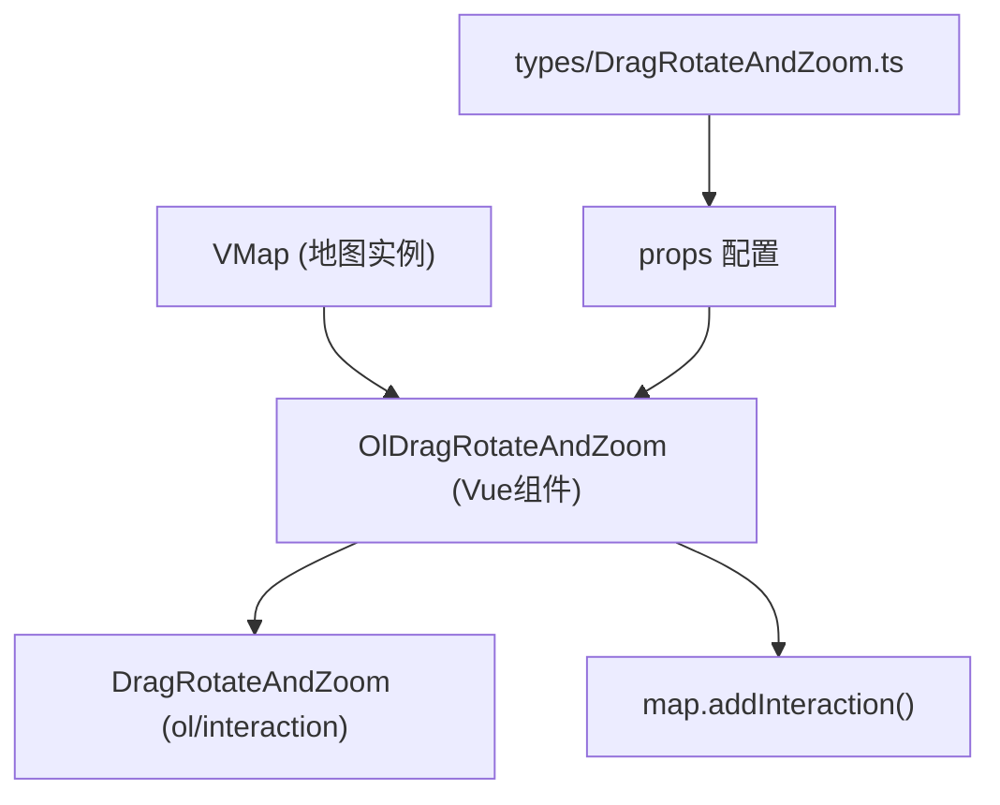
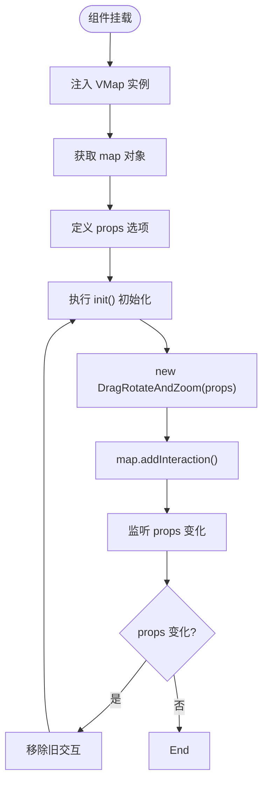

# OlDragRotateAndZoom 交互 API

<cite>
**本文档引用文件**  
- [index.vue](file://src/packages/interaction/DragRotateAndZoom/index.vue#L0-L31)
- [index.ts](file://src/packages/interaction/DragRotateAndZoom/index.ts#L0-L6)
- [DragRotateAndZoom.ts](file://src/packages/types/DragRotateAndZoom.ts#L0-L5)
- [example.vue](file://src/examples/dragRotateAndZoom/index.vue#L0-L18)
</cite>

## 目录
1. [简介](#简介)
2. [项目结构](#项目结构)
3. [核心组件分析](#核心组件分析)
4. [API 属性详解](#api-属性详解)
5. [使用示例](#使用示例)
6. [底层交互控制与 ref 访问](#底层交互控制与-ref-访问)
7. [移动设备兼容性与替代方案](#移动设备兼容性与替代方案)
8. [总结](#总结)

## 简介
`OlDragRotateAndZoom` 是一个基于 OpenLayers 的 Vue 组件，封装了 `ol/interaction/DragRotateAndZoom` 类，允许用户通过鼠标拖拽同时实现地图的旋转与缩放操作。该组件适用于需要高级地图导航控制的场景，如三维视角调整、倾斜地图浏览等。

本 API 文档详细说明其属性配置、触发条件、动画时长控制、与其他交互的协同使用方式，并提供实际代码示例和移动端适配建议。

## 项目结构
该组件位于项目的 `/src/packages/interaction/DragRotateAndZoom/` 路径下，采用 Vue 3 的 `<script setup>` 语法编写，遵循模块化封装原则。

主要文件包括：
- `index.vue`：主组件实现，负责初始化交互并绑定到地图实例
- `index.ts`：组件注册逻辑，用于全局安装
- `types/DragRotateAndZoom.ts`：类型定义文件，继承 OpenLayers 原生选项类型

该结构体现了清晰的职责分离：UI 组件、类型定义、安装逻辑相互独立。



**图示来源**
- [index.vue](file://src/packages/interaction/DragRotateAndZoom/index.vue#L0-L31)
- [DragRotateAndZoom.ts](file://src/packages/types/DragRotateAndZoom.ts#L0-L5)

## 核心组件分析
`OlDragRotateAndZoom` 组件通过 Vue 的依赖注入机制获取当前地图实例（`VMap`），并在组件挂载后创建 `DragRotateAndZoom` 交互对象并添加至地图。

### 组件初始化流程


**图示来源**
- [index.vue](file://src/packages/interaction/DragRotateAndZoom/index.vue#L0-L31)

### 关键代码解析
```ts
const VMap = inject("VMap") as OlMap;
const map = unref(VMap).map;
const props = withDefaults(defineProps<DragRotateAndZoomOptions>(), {});
const dragRotateAndZoom = shallowRef<DragRotateAndZoom>();

const init = () => {
  dragRotateAndZoom.value = new DragRotateAndZoom(props);
  map.addInteraction(dragRotateAndZoom.value);
};

onMounted(init);

watchEffect(() => {
  if (dragRotateAndZoom.value) map.removeInteraction(dragRotateAndZoom.value);
  init();
});
```

- **依赖注入**：通过 `inject("VMap")` 获取外部提供的地图上下文
- **响应式更新**：使用 `watchEffect` 实现 props 变更时自动重建交互
- **资源管理**：每次更新前先移除旧交互，避免内存泄漏

**Section sources**
- [index.vue](file://src/packages/interaction/DragRotateAndZoom/index.vue#L0-L31)

## API 属性详解
`OlDragRotateAndZoom` 的所有属性均继承自 OpenLayers 的 `DragRotateAndZoomOptions` 接口，通过 `DragRotateAndZoomOptions` 类型定义引入。

### 支持的配置项
:condition:  
触发交互的条件函数。接收一个 `MapBrowserEvent` 参数，返回布尔值决定是否启用拖拽旋转缩放。常用于结合键盘修饰键触发。

示例：仅当按下 Shift 键时启用
```ts
condition: (event) => event.originalEvent.shiftKey
```

:duration:  
动画持续时间（毫秒）。控制拖拽释放后的惯性动画长度。默认值通常为 250ms。

:out:  
布尔值，若为 `true`，则拖拽方向与常规相反（例如向上拖动导致地图放大）。适用于特定交互习惯场景。

:constrainResolution:  
是否限制地图分辨率到最接近的整数层级。设为 `true` 可使缩放更“卡位”，适合瓦片地图。

### 类型定义源码
```ts
import { Options } from "ol/interaction/DragRotateAndZoom";
export declare type DragRotateAndZoomOptions = Options;
```

该类型直接映射 OpenLayers 原生接口，确保类型安全和 IDE 智能提示。

**Section sources**
- [DragRotateAndZoom.ts](file://src/packages/types/DragRotateAndZoom.ts#L0-L5)
- [index.vue](file://src/packages/interaction/DragRotateAndZoom/index.vue#L0-L31)

## 使用示例
### 基础用法
在模板中直接使用组件标签即可启用默认行为：

```vue
<template>
  <ol-map :view="{ rotation: -Math.PI / 8 }">
    <ol-tile tile-type="BAIDU"></ol-tile>
    <ol-drag-rotate-and-zoom />
  </ol-map>
</template>
```

### 结合 Shift 键触发
通过 `condition` 属性限定仅在按住 Shift 时激活：

```vue
<script setup lang="ts">
const condition = (event) => event.originalEvent.shiftKey;
</script>

<template>
  <ol-map>
    <ol-tile tile-type="OSM" />
    <ol-drag-rotate-and-zoom :condition="condition" :duration="350" />
  </ol-map>
</template>
```

### 限制旋转角度范围
虽然 `DragRotateAndZoom` 本身不支持角度限制，但可通过监听地图 `rotate` 事件进行干预：

```ts
map.on('rotatestart', () => {
  // 记录初始角度
});
map.on('rotating', (e) => {
  const rotation = e.map.getView().getRotation();
  if (rotation > Math.PI / 4 || rotation < -Math.PI / 4) {
    e.preventDefault(); // 阻止超出范围
  }
});
```

**Section sources**
- [example.vue](file://src/examples/dragRotateAndZoom/index.vue#L0-L18)
- [index.vue](file://src/packages/interaction/DragRotateAndZoom/index.vue#L0-L31)

## 底层交互控制与 ref 访问
可通过 `ref` 获取组件实例，进而访问其内部的 `dragRotateAndZoom` 引用，实现动态启用/禁用。

### 动态控制示例
```vue
<script setup lang="ts">
import { ref } from 'vue';
import type { OlDragRotateAndZoomInstance } from '@/packages/types';

const dragRotateRef = ref<OlDragRotateAndZoomInstance>();

// 禁用交互
const disableInteraction = () => {
  const interaction = dragRotateRef.value?.dragRotateAndZoom;
  if (interaction) {
    interaction.setActive(false);
  }
};

// 启用交互
const enableInteraction = () => {
  const interaction = dragRotateRef.value?.dragRotateAndZoom;
  if (interaction) {
    interaction.setActive(true);
  }
};
</script>

<template>
  <ol-map>
    <ol-drag-rotate-and-zoom ref="dragRotateRef" />
  </ol-map>
  <button @click="disableInteraction">禁用旋转缩放</button>
  <button @click="enableInteraction">启用旋转缩放</button>
</template>
```

> 注意：需在组件类型中暴露 `dragRotateAndZoom` 的引用，当前实现中为 `shallowRef`，可通过 `$refs` 或 `ref` 访问。

**Section sources**
- [index.vue](file://src/packages/interaction/DragRotateAndZoom/index.vue#L0-L31)
- [DragRotateAndZoom.ts](file://src/packages/types/DragRotateAndZoom.ts#L0-L5)

## 移动设备兼容性与替代方案
### 兼容性限制
`DragRotateAndZoom` 主要设计用于桌面端鼠标操作，在移动设备上存在以下问题：
- 触摸事件未优化，多指操作易与其他手势冲突
- 缺少对触摸惯性、双指缩放旋转的原生支持
- 默认行为可能干扰地图平移

### 替代方案建议
1. **条件性启用**：检测设备类型，仅在桌面端启用此交互
```ts
const condition = () => !isMobile && event.originalEvent.shiftKey;
```

2. **使用原生触摸交互**：OpenLayers 提供 `PinchRotate` 和 `PinchZoom` 交互，更适合移动端
```ts
import { PinchRotate, PinchZoom } from 'ol/interaction';
map.addInteraction(new PinchRotate());
map.addInteraction(new PinchZoom());
```

3. **自定义手势识别**：结合 Hammer.js 或内置事件系统实现复杂手势控制

4. **UI 控件替代**：提供旋转/缩放滑块按钮，避免直接手势操作

### 推荐策略
```ts
if (isDesktop) {
  map.addInteraction(new DragRotateAndZoom({ condition: shiftKeyOnly }));
} else {
  map.addInteraction(new PinchRotate());
  map.addInteraction(new PinchZoom());
}
```

**Section sources**
- [index.vue](file://src/packages/interaction/DragRotateAndZoom/index.vue#L0-L31)

## 总结
`OlDragRotateAndZoom` 是一个功能强大的地图交互组件，封装了 OpenLayers 的 `DragRotateAndZoom` 功能，支持通过 `condition`、`duration`、`constrainResolution` 等属性精细控制行为。其基于 Vue 3 的响应式设计确保了配置的动态更新能力。

尽管在桌面端表现优异，但在移动端需谨慎使用，建议结合设备检测机制切换为更适合触摸的手势交互。通过 `ref` 可实现运行时动态控制，适用于需要按需启用高级导航功能的应用场景。

合理利用该组件，可显著提升地图应用的交互体验，特别是在需要精细视角调整的专业 GIS 系统中。