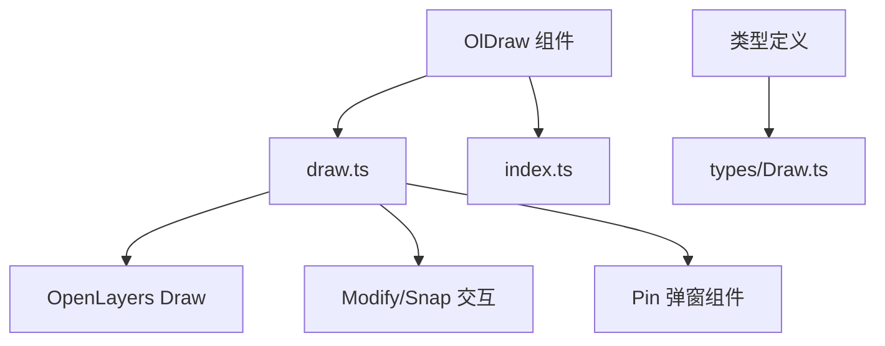
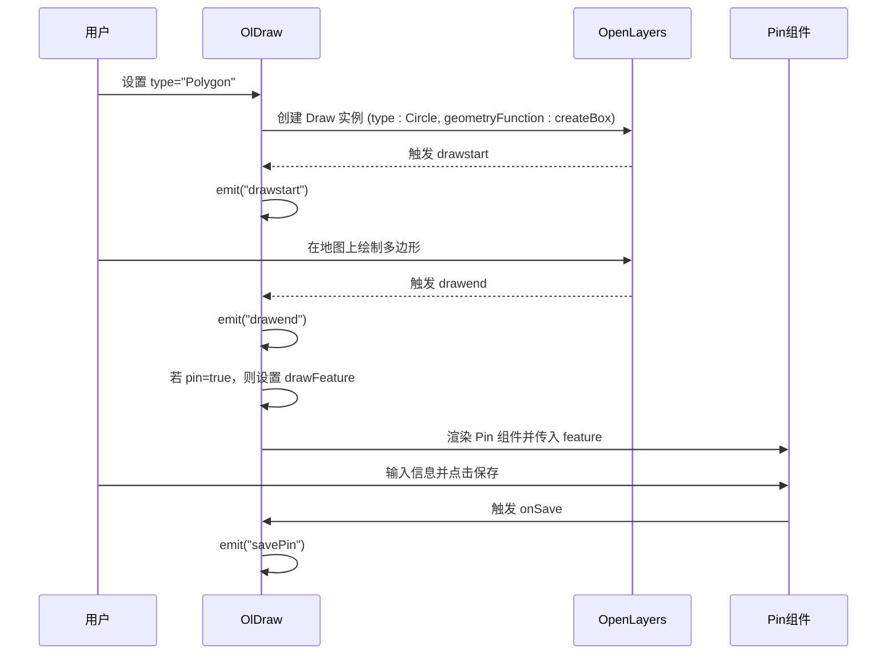
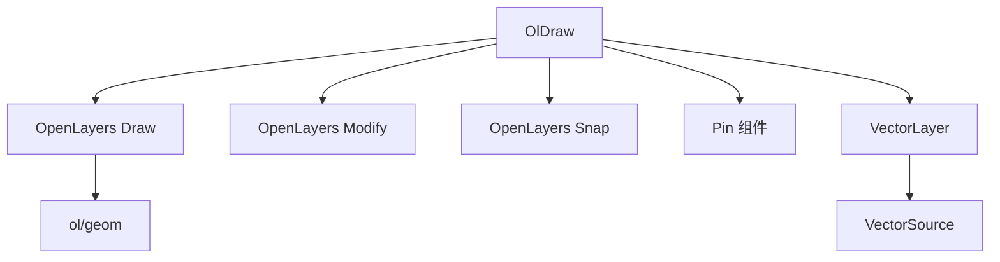

# OlDraw 绘制组件 API

<cite>
**本文档引用的文件**   
- [draw.ts](file://src/packages/interaction/draw/draw.ts#L0-L235)
- [index.ts](file://src/packages/interaction/draw/index.ts#L0-L6)
- [Draw.ts](file://src/packages/types/Draw.ts#L0-L17)
- [index.vue](file://src/examples/draw/index.vue#L0-L95)
</cite>

## 目录
1. [简介](#简介)
2. [项目结构](#项目结构)
3. [核心组件](#核心组件)
4. [架构概述](#架构概述)
5. [详细组件分析](#详细组件分析)
6. [依赖分析](#依赖分析)
7. [性能考虑](#性能考虑)
8. [故障排除指南](#故障排除指南)
9. [结论](#结论)

## 简介
OlDraw 是一个基于 Vue 和 OpenLayers 的地图绘制组件，用于在地图上实现点、线、面、圆形、矩形等多种几何图形的交互式绘制。该组件封装了 OpenLayers 的 `ol/interaction/Draw` 类，并扩展支持矩形（Rectangle）和正方形（Square）等自定义类型。它提供了灵活的 props 配置、事件监听机制以及通过 ref 访问底层交互实例的能力，适用于需要地图标注、区域选择等功能的应用场景。

## 项目结构
OlDraw 组件位于项目的 `/src/packages/interaction/draw/` 路径下，主要由以下文件构成：
- `draw.ts`：核心 Vue 组件实现，封装 OpenLayers 的 Draw 交互逻辑。
- `index.ts`：组件注册入口，用于全局安装。
- `types/Draw.ts`：类型定义文件，声明组件相关 TypeScript 类型。

该组件作为 `v3-ol-map` 地图库的一部分，遵循模块化设计原则，可与其他图层（如 VectorLayer）配合使用。



**图示来源**
- [draw.ts](file://src/packages/interaction/draw/draw.ts#L0-L235)
- [index.ts](file://src/packages/interaction/draw/index.ts#L0-L6)
- [Draw.ts](file://src/packages/types/Draw.ts#L0-L17)

## 核心组件
OlDraw 的核心功能集中在 `draw.ts` 文件中，其主要职责包括：
- 封装 OpenLayers 的 `Draw` 交互类，提供 Vue 友好的接口。
- 支持多种绘制类型（包括扩展的 Rectangle 和 Square）。
- 管理临时几何图形的创建与样式渲染。
- 提供 `snap`（吸附）、`modify`（编辑）、`pin`（标注弹窗）等高级功能。
- 通过 `expose` 暴露 `clear` 和 `setActive` 方法供外部调用。

**组件来源**
- [draw.ts](file://src/packages/interaction/draw/draw.ts#L0-L235)

## 架构概述
OlDraw 组件采用 Vue 3 的 Composition API 构建，利用 `defineComponent` 定义组件结构，通过 `setup` 函数管理状态和逻辑。其核心流程如下：
1. 在 `onMounted` 阶段初始化绘制交互。
2. 根据 `props.type` 动态创建对应的 `Draw` 实例。
3. 注册 `drawstart` 和 `drawend` 事件并触发对应的 `emit`。
4. 支持 `snap` 和 `modify` 交互的集成。
5. 当 `pin` 属性启用时，渲染 `Pin` 组件以收集用户输入。



**图示来源**
- [draw.ts](file://src/packages/interaction/draw/draw.ts#L0-L235)
- [index.vue](file://src/examples/draw/index.vue#L0-L95)

## 详细组件分析

### OlDraw 组件实现分析
OlDraw 组件基于 OpenLayers 的 `Draw` 类进行封装，支持标准类型（Point、LineString、Polygon、Circle）及扩展类型（Rectangle、Square）。

#### 支持的绘制类型
通过 `type` prop 控制绘制类型，其类型定义如下：

**: DrawType**
- `"Point"`：绘制点
- `"LineString"`：绘制线
- `"Polygon"`：绘制多边形
- `"Circle"`：绘制圆
- `"Rectangle"`：绘制矩形（使用 `createBox()` 几何函数）
- `"Square"`：绘制正方形（使用 `createRegularPolygon(4)`）
- `"" | undefined | null`：不绘制

**来源**
- [Draw.ts](file://src/packages/types/Draw.ts#L4-L6)

#### Props 配置项
组件支持以下配置属性：

**: Props**
- `type`: 绘制几何类型（必选）
- `snap`: 是否启用吸附功能（默认 `false`）
- `modify`: 是否启用绘制后编辑功能（默认 `false`）
- `pin`: 是否在绘制完成后显示标注弹窗（默认 `false`）
- `pinClass`, `pinTitleClass`, `pinBodyClass`, `pinFooterClass`: 自定义弹窗样式类
- `once`: 是否单次绘制（绘制一次后自动清除，下次绘制前清空图层）
- `options`: 传递给 OpenLayers Draw 的额外选项（如 `maxPoints`, `minPoints`, `freehand` 等）

**来源**
- [draw.ts](file://src/packages/interaction/draw/draw.ts#L10-L50)

#### emitted 事件
组件触发以下事件：

**: emitted 事件**
- `drawstart(payload: DrawEvent)`：绘制开始时触发
- `drawend(payload: DrawEvent)`：绘制结束时触发，携带完成的 `Feature`
- `modifystart(payload: ModifyEvent)`：编辑开始时触发
- `modifyend(payload: ModifyEvent)`：编辑结束时触发
- `savePin(payload: any)`：当 `pin` 启用且用户保存时触发

**来源**
- [draw.ts](file://src/packages/interaction/draw/draw.ts#L60-L75)

#### 封装 Draw 交互的核心逻辑
在 `setup` 中，`init()` 函数负责创建和注册 `Draw` 交互：

```ts
const init = () => {
  clearInteractions(); // 清除已有交互
  if (props.type) {
    let drawOptions: Options;
    const source = layer.value.getSource() as VectorSource;
    let drawType: Options["type"];
    if (props.type === "Rectangle") {
      drawType = "Circle";
      drawOptions = { ...props.options, source, type: drawType, geometryFunction: createBox() };
    } else if (props.type === "Square") {
      drawType = "Circle";
      drawOptions = { ...props.options, source, type: drawType, geometryFunction: createRegularPolygon(4) };
    } else {
      drawType = props.type;
      drawOptions = { ...props.options, source, type: drawType };
    }
    draw.value = new Draw(drawOptions);
    map.addInteraction(draw.value);
    drawEventsHandler(draw.value); // 绑定事件
    // 添加 snap 和 modify 交互（如果启用）
  }
};
```

此逻辑确保每次 `type` 变化时重新初始化交互，避免状态残留。

**来源**
- [draw.ts](file://src/packages/interaction/draw/draw.ts#L120-L160)

#### 自定义样式与限制点数示例
可通过 `options` 传入 `maxPoints` 或 `freehand` 等参数：

```vue
<ol-draw
  :type="drawType"
  :options="{ maxPoints: 5, freehand: true }"
  @drawend="handleDrawend"
/>
```

上述代码限制最多绘制 5 个点，并启用自由绘制模式。

**来源**
- [index.vue](file://src/examples/draw/index.vue#L38-L42)

#### 通过 ref 访问底层实例
组件通过 `expose` 暴露方法，允许外部控制：

**: 暴露的 API (ExposeDraw)**
- `clear()`: 清除当前绘制的图形和图层数据
- `setActive(active: boolean)`: 启用或禁用绘制交互

使用示例：

```ts
const olDrawRef = ref<OlDrawInstance>();
const clear = () => olDrawRef.value?.clear();
const setActive = (active: boolean) => olDrawRef.value?.setActive(active);
```

这使得开发者可以动态控制绘制状态，例如通过按钮切换激活状态。

**来源**
- [draw.ts](file://src/packages/interaction/draw/draw.ts#L186-L190)
- [Draw.ts](file://src/packages/types/Draw.ts#L8-L12)
- [index.vue](file://src/examples/draw/index.vue#L7-L10)

### 内存泄漏防护与销毁清理
虽然当前代码未显式实现 `onBeforeUnmount`，但最佳实践应在组件销毁前移除所有交互：

```ts
onBeforeUnmount(() => {
  clearInteractions();
});
```

`clearInteractions()` 函数已定义，用于从地图中移除 `draw`、`snap`、`modify` 交互，防止内存泄漏。

**来源**
- [draw.ts](file://src/packages/interaction/draw/draw.ts#L110-L115)

### 与其他地图交互的冲突处理
OlDraw 通过 OpenLayers 的交互管理机制自动处理冲突。当 `Draw` 交互激活时，其他交互（如拖拽、缩放）会被自动暂停。绘制完成后，原交互恢复。若需手动控制，可通过 `setActive(false)` 临时禁用绘制。

## 依赖分析
OlDraw 组件依赖以下模块：



**图示来源**
- [draw.ts](file://src/packages/interaction/draw/draw.ts#L2-L10)

## 性能考虑
- 每次 `type` 变化都会重建 `Draw` 实例，避免状态污染。
- 使用 `shallowRef` 管理 `draw` 和 `drawFeature`，优化响应式开销。
- `watch` 监听 `type` 和 `once`，确保配置变更及时生效。

## 故障排除指南
- **绘制无反应**：检查 `type` 是否正确设置，且父级 `VectorLayer` 已正确注入。
- **样式不生效**：确保 `VectorLayer` 的 `layerStyle` 正确配置。
- **事件未触发**：确认 `@drawend` 等事件监听器已正确绑定。
- **内存泄漏**：建议在组件卸载时手动调用 `clear()` 或补充 `onBeforeUnmount` 清理逻辑。

**来源**
- [draw.ts](file://src/packages/interaction/draw/draw.ts#L110-L115)
- [index.vue](file://src/examples/draw/index.vue#L25-L30)

## 结论
OlDraw 是一个功能完整、易于集成的地图绘制组件。它封装了 OpenLayers 的复杂交互逻辑，提供了简洁的 Vue API，支持扩展类型、吸附、编辑、标注等高级功能。通过 `ref` 暴露的控制方法，开发者可灵活管理绘制状态。建议在实际使用中补充组件销毁时的清理逻辑，以确保应用稳定性。