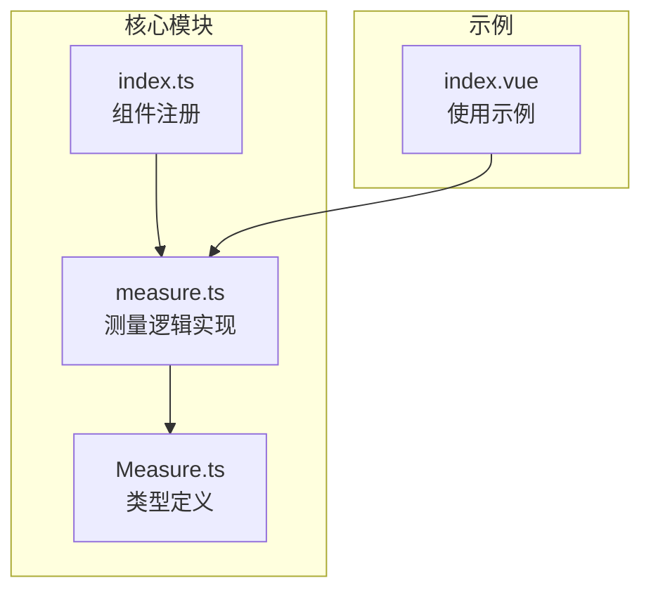
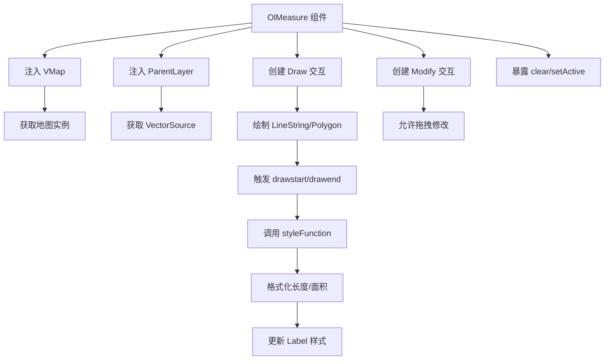
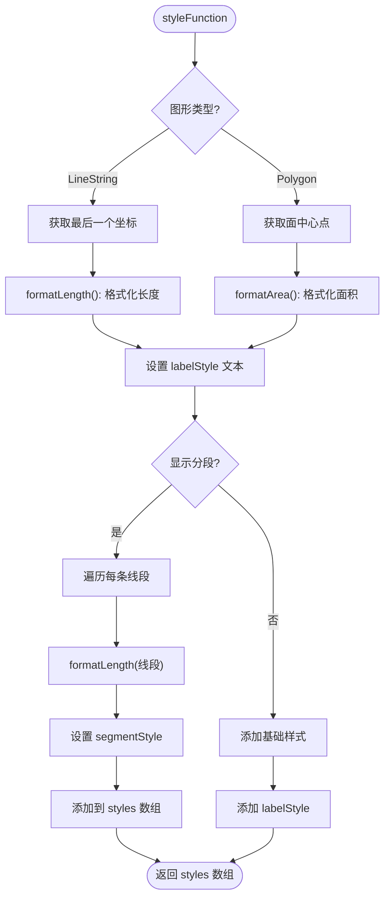
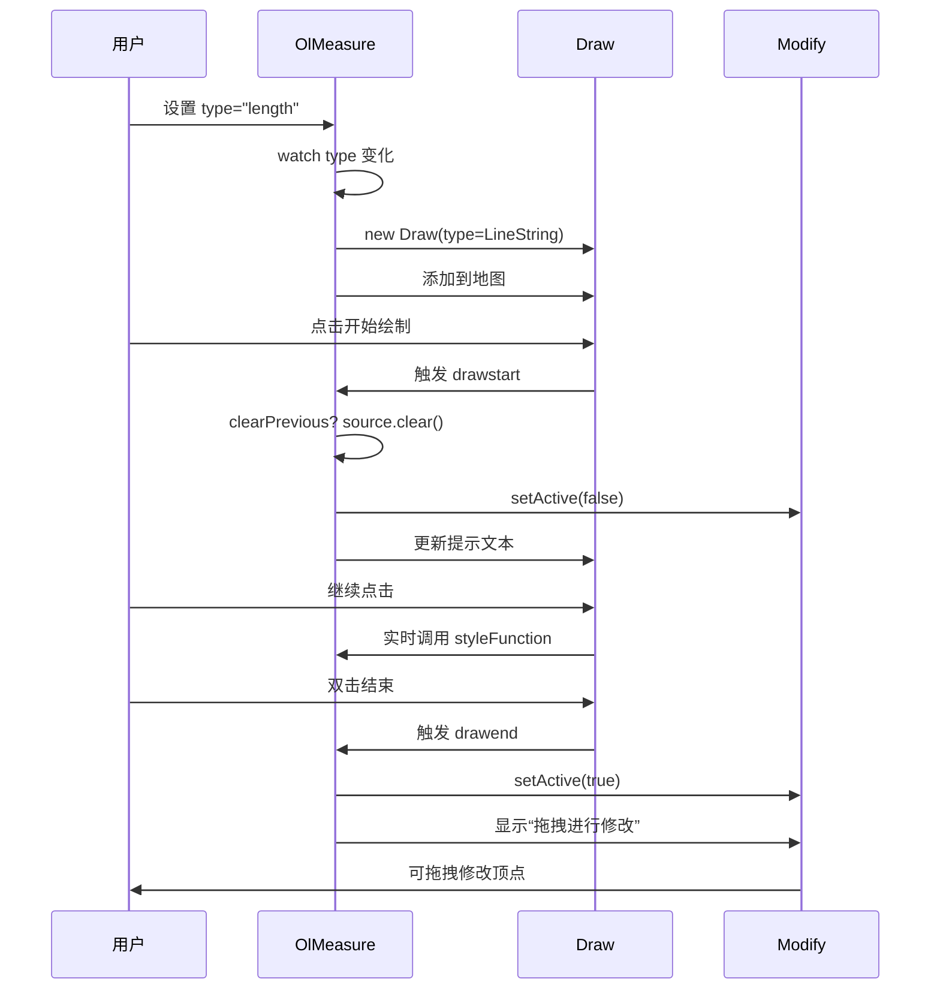
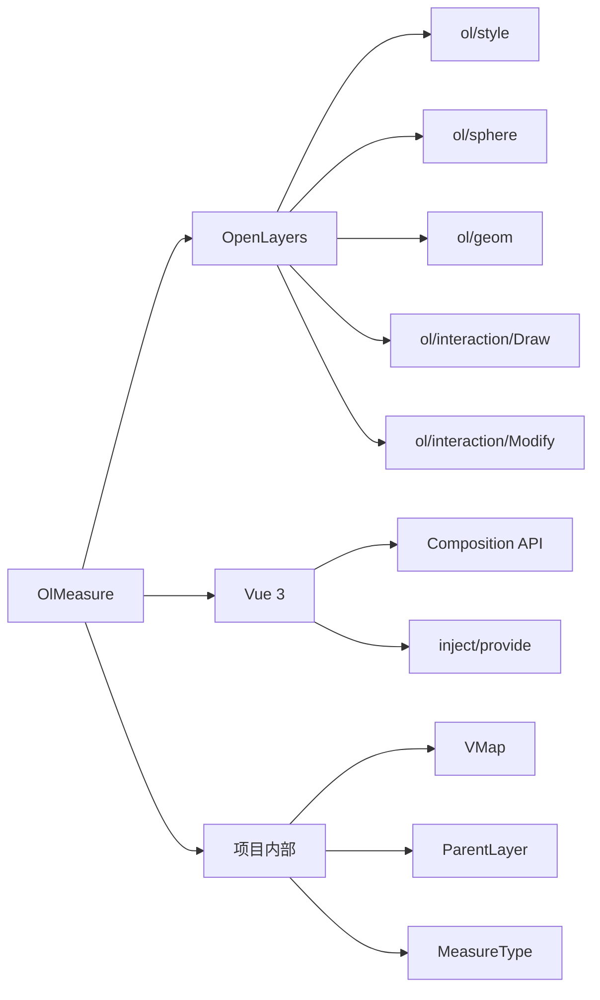

# OlMeasure 测量组件 API

<cite>
**本文档引用文件**   
- [measure.ts](file://src/packages/interaction/measure/measure.ts)
- [index.ts](file://src/packages/interaction/measure/index.ts)
- [Measure.ts](file://src/packages/types/Measure.ts)
- [index.vue](file://src/examples/measure/index.vue)
</cite>

## 目录
1. [简介](#简介)
2. [项目结构](#项目结构)
3. [核心组件](#核心组件)
4. [架构概览](#架构概览)
5. [详细组件分析](#详细组件分析)
6. [依赖分析](#依赖分析)
7. [性能考虑](#性能考虑)
8. [故障排除指南](#故障排除指南)
9. [结论](#结论)

## 简介
OlMeasure 是一个基于 Vue 和 OpenLayers 的地图测量组件，用于在地图上进行距离和面积的实时测量。该组件支持动态绘制线段或区域，并实时显示测量结果，包括长度、面积以及各线段的分段长度。通过灵活的 props 配置，用户可自定义测量类型、样式、单位显示方式等。此外，组件暴露了底层交互实例的控制方法，支持清除测量结果、激活/停用测量功能等操作。

## 项目结构
项目采用模块化设计，核心功能按功能划分在 `src/packages` 目录下。`interaction/measure` 模块负责测量功能的实现，包含 `measure.ts`（主逻辑）和 `index.ts`（安装入口）。`types/Measure.ts` 定义了相关类型接口。示例文件 `examples/measure/index.vue` 提供了组件的典型用法。

**图示来源**
- [measure.ts](file://src/packages/interaction/measure/measure.ts)
- [index.ts](file://src/packages/interaction/measure/index.ts)
- [Measure.ts](file://src/packages/types/Measure.ts)
- [index.vue](file://src/examples/measure/index.vue)

## 核心组件
OlMeasure 组件基于 Vue 3 的 Composition API 实现，利用 OpenLayers 的 `Draw` 和 `Modify` 交互类完成图形绘制与编辑。组件通过 `props` 接收配置，使用 `setup` 函数初始化交互逻辑，并通过 `expose` 暴露外部可调用方法。

**组件特性：**
- 支持距离（length）和面积（area）测量
- 可显示每条线段的长度（showSegments）
- 支持清除上一次测量结果（clearPrevious）
- 自动格式化单位（米/千米，平方米/平方千米）
- 支持通过 ref 调用 `clear()` 和 `setActive()` 方法

**Section sources**
- [measure.ts](file://src/packages/interaction/measure/measure.ts#L13-L66)
- [Measure.ts](file://src/packages/types/Measure.ts#L3-L10)

## 架构概览
OlMeasure 组件依赖于 OpenLayers 的矢量图层（VectorLayer）和矢量源（VectorSource）来存储和渲染测量图形。通过注入 `VMap` 和 `ParentLayer`，组件获取地图实例和父图层引用。测量交互由 `Draw` 实例驱动，样式由自定义 `styleFunction` 动态生成，`Modify` 实例允许用户拖拽修改已绘制图形。

**图示来源**
- [measure.ts](file://src/packages/interaction/measure/measure.ts#L1-L300)

## 详细组件分析

### 属性（Props）分析
OlMeasure 组件提供以下可配置属性：

**:type**
- **类型**: `MeasureType` (`"length" | "area" | ""`)
- **默认值**: `""`
- **说明**: 指定测量类型。`"length"` 为距离测量，`"area"` 为面积测量。空值表示不激活测量。

**:showSegments**
- **类型**: `boolean`
- **默认值**: `false`
- **说明**: 是否显示每条线段的长度。开启后，每条线段中点将标注其长度。

**:clearPrevious**
- **类型**: `boolean`
- **默认值**: `false`
- **说明**: 是否在开始新测量时清除之前的测量结果。

**Section sources**
- [measure.ts](file://src/packages/interaction/measure/measure.ts#L13-L30)

### 样式与标注实现
组件定义了多个 `Style` 实例用于不同元素的渲染：

- `style`: 测量线/面的基础样式（虚线边框、半透明填充）
- `labelStyle`: 总长度/面积的文本标注样式（带背景的文本，位于终点或中心点）
- `tipStyle`: 提示文本样式（如“点击开始测量”）
- `modifyStyle`: 修改提示样式（“拖拽进行修改”）
- `segmentStyle`: 分段长度标注样式

`styleFunction` 是核心样式生成函数，根据图形类型（LineString 或 Polygon）动态设置标注内容和位置，并支持分段标注。

**图示来源**
- [measure.ts](file://src/packages/interaction/measure/measure.ts#L100-L150)

### 测量逻辑与事件流
测量功能通过 `addInteraction` 方法初始化 `Draw` 实例。当 `props.type` 变化时，旧的 `Draw` 实例被移除并创建新的实例。

**:drawstart 事件**
- 清除上一次测量（若 `clearPrevious` 为 true）
- 禁用 `Modify` 交互
- 更新提示文本为“继续点击绘制...”

**:drawend 事件**
- 启用 `Modify` 交互
- 显示“拖拽进行修改”提示
- 重置提示文本为“点击开始测量”

**图示来源**
- [measure.ts](file://src/packages/interaction/measure/measure.ts#L152-L200)

### 单位格式化逻辑
`formatLength` 和 `formatArea` 函数负责将计算出的米和平方米转换为更易读的单位。

**:formatLength**
- 输入：`LineString` 几何对象
- 计算：`getLength(geometry, { projection })`
- 输出：
  - > 100米 → 千米（保留两位小数）
  - ≤ 100米 → 米（保留两位小数）

**:formatArea**
- 输入：`Polygon` 几何对象
- 计算：`getArea(geometry, { projection })`
- 输出：
  - > 10,000平方米 → 平方千米（保留两位小数）
  - ≤ 10,000平方米 → 平方米（保留两位小数）

**Section sources**
- [measure.ts](file://src/packages/interaction/measure/measure.ts#L70-L98)

### 暴露的 API 方法
通过 `expose`，组件向父组件暴露两个方法：

**:clear()**
- **功能**: 清除当前图层中所有测量图形
- **实现**: 调用 `source.clear()`

**:setActive(active: boolean)**
- **功能**: 激活或停用 `Draw` 交互
- **实现**: 调用 `draw.setActive(active)`

在 `index.vue` 示例中，通过 `ref` 获取组件实例并绑定到按钮事件。

**Section sources**
- [measure.ts](file://src/packages/interaction/measure/measure.ts#L270-L280)
- [index.vue](file://src/examples/measure/index.vue#L10-L15)

## 依赖分析
OlMeasure 组件依赖以下核心模块：

**图示来源**
- [measure.ts](file://src/packages/interaction/measure/measure.ts#L1-L10)

## 性能考虑
- **实时计算**: `styleFunction` 在每次渲染时调用，但 `getLength` 和 `getArea` 计算量小，性能影响可忽略。
- **样式缓存**: `segmentStyles` 数组缓存了分段样式实例，避免重复创建。
- **事件监听**: 使用 `watch` 监听 `props.type`，及时清理旧交互，避免内存泄漏。
- **建议**: 在大量测量场景下，建议关闭 `showSegments` 以减少标注数量。

## 故障排除指南
- **问题**: 测量不显示或无反应
  - **检查**: 确保父容器为 `ol-vector`，且已正确注入 `ParentLayer`
- **问题**: 单位显示不正确
  - **检查**: 确认地图视图的投影（projection）设置正确，OpenLayers 的 `getLength`/`getArea` 依赖投影进行球面计算
- **问题**: 分段标注重叠
  - **建议**: 在密集区域手动关闭 `showSegments`
- **问题**: 清除无效
  - **检查**: 确认调用的是 `olMeasureRef.value?.clear()` 而非 `source.clear()`

**Section sources**
- [measure.ts](file://src/packages/interaction/measure/measure.ts#L270-L280)
- [index.vue](file://src/examples/measure/index.vue#L10-L15)

## 结论
OlMeasure 组件提供了一个功能完整、易于集成的地图测量解决方案。通过清晰的 API 设计和灵活的配置选项，开发者可以快速实现距离和面积测量功能。结合 OpenLayers 的强大几何计算能力，确保了测量结果的准确性。建议在实际项目中结合 UI 控件（如示例中的下拉框和按钮）提供更好的用户体验。