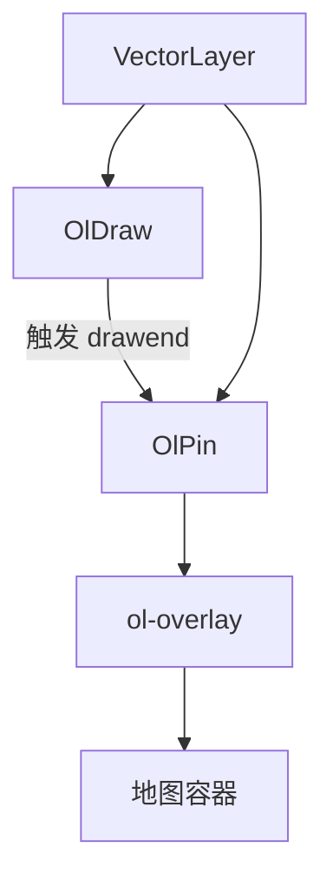
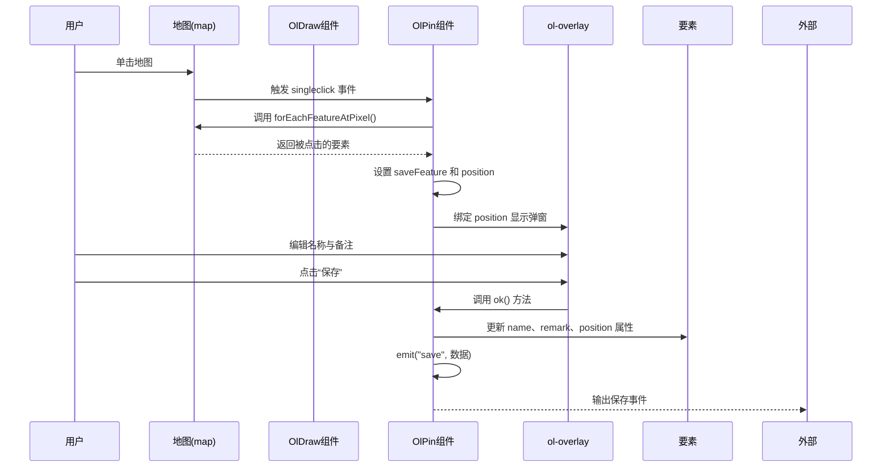
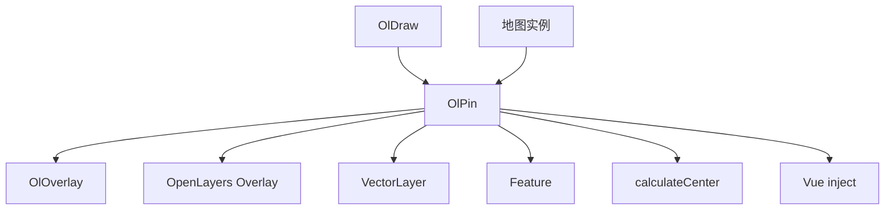

# OlPin 标记点组件 API

<cite>
**本文档引用的文件**  
- [index.vue](file://src/packages/interaction/pin/index.vue)
- [index.vue](file://src/examples/pin/index.vue)
- [index.vue](file://src/packages/overlay/index.vue)
- [draw.ts](file://src/packages/interaction/draw/draw.ts)
- [Overlay.ts](file://src/packages/types/Overlay.ts)
</cite>

## 目录
1. [简介](#简介)
2. [项目结构](#项目结构)
3. [核心组件](#核心组件)
4. [架构概览](#架构概览)
5. [详细组件分析](#详细组件分析)
6. [依赖分析](#依赖分析)
7. [性能考虑](#性能考虑)
8. [故障排除指南](#故障排除指南)
9. [结论](#结论)

## 简介
OlPin 是一个基于 Vue 3 和 OpenLayers 的地图标记点交互组件，用于在地图上创建可交互的兴趣点或区域标记。该组件通过 `ol-overlay` 实现弹窗式信息面板，支持自定义样式、动态绑定数据，并与 `ol-draw` 组件集成，实现绘制后自动弹出编辑表单的功能。用户可通过点击已绘制的要素触发属性编辑与保存操作。

## 项目结构
项目采用模块化设计，`OlPin` 功能主要位于 `/src/packages/interaction/pin/` 目录下，依赖于 OpenLayers 的 Overlay 机制和 Vue 的响应式系统。其核心功能通过 `ol-overlay` 组件实现可视化层叠加，结合 `ol-draw` 提供的事件驱动机制完成交互逻辑。



**图示来源**  
- [index.vue](file://src/packages/interaction/pin/index.vue)
- [draw.ts](file://src/packages/interaction/draw/draw.ts)

**本节来源**  
- [index.vue](file://src/packages/interaction/pin/index.vue)

## 核心组件
OlPin 组件的核心功能包括：
- 响应式地显示标记点属性编辑面板
- 支持点（Point）和面（Polygon）两种类型要素的标注
- 通过 `position` 属性控制弹窗位置
- 提供 `pinClass`、`titleClass` 等 prop 实现样式定制
- 通过 `@save` 事件向外发射保存后的数据

关键数据结构定义如下：

```ts
type PinOptions = {
  type: "Point" | "Polygon";
  feature: Feature | undefined;
  pinClass?: string;
  titleClass?: string[] | string;
  bodyClass?: string[] | string;
  footerClass?: string[] | string;
};
```

**本节来源**  
- [index.vue](file://src/packages/interaction/pin/index.vue#L15-L25)

## 架构概览
OlPin 组件的架构依赖于 Vue 的依赖注入（`inject`）机制获取地图实例和图层引用，并通过 OpenLayers 的 `forEachFeatureAtPixel` 方法实现点击拾取功能。整体流程如下：



**图示来源**  
- [index.vue](file://src/packages/interaction/pin/index.vue#L100-L138)
- [index.vue](file://src/packages/overlay/index.vue)

**本节来源**  
- [index.vue](file://src/packages/interaction/pin/index.vue)

## 详细组件分析

### OlPin 组件实现机制

#### 响应式状态管理
组件使用 `shallowRef` 管理 `pinName`、`pinRemark`、`saveFeature` 等状态，确保在不深度监听的情况下高效更新 UI。

```ts
let pinName = shallowRef("");
let pinRemark = shallowRef("");
let saveFeature = shallowRef<Feature<Geometry> | undefined>(undefined);
```

当 `props.feature` 变化时，通过 `watch` 监听并同步更新表单字段和弹窗位置。

**本节来源**  
- [index.vue](file://src/packages/interaction/pin/index.vue#L50-L62)

#### 地图坐标与弹窗定位
组件通过 `getFeaturePosition` 方法获取要素的显示坐标：
- 对于点要素，直接获取其几何坐标的 `getCoordinates()`
- 对于面要素，调用 `calculateCenter` 工具函数获取顶部中心点作为弹窗锚点

```ts
const getFeaturePosition = (feature: Feature | undefined) => {
  if (feature) {
    if (feature.get("type") === "Point") {
      return (feature.getGeometry() as Point)?.getCoordinates();
    } else {
      const { topCenter } = calculateCenter(feature.getGeometry());
      return topCenter;
    }
  }
};
```

此坐标被绑定到 `ol-overlay` 的 `position` 属性，实现精准定位。

**本节来源**  
- [index.vue](file://src/packages/interaction/pin/index.vue#L40-L48)

#### 样式与事件处理
保存按钮点击后，`ok()` 方法执行以下操作：
1. 更新要素的 `name`、`remark`、`type` 和 `position` 属性
2. 构建或更新 OpenLayers 样式对象（Style），包含图标（Icon）和文本（Text）
3. 将新样式应用到要素
4. 触发 `save` 事件，向外传递数据

```ts
emit("save", { name: pinName.value, remark: pinRemark.value, type: savePinType.value, feature });
```

**本节来源**  
- [index.vue](file://src/packages/interaction/pin/index.vue#L86-L100)

### OlOverlay 组件分析
`ol-overlay` 是 OpenLayers 中用于在地图上叠加 HTML 元素的核心组件。OlPin 通过封装 `OlOverlay` 实现弹窗功能。

关键属性包括：
- `position`: 定义弹窗在地图上的地理坐标位置
- `offset`: 偏移量，用于调整弹窗相对于锚点的位置（如 `[0, -30]` 表示向上偏移30像素）
- `positioning`: 定位策略，如 `"bottom-center"` 表示以底部居中对齐

```ts
<ol-overlay :class-name="props.pinClass" :position="position" :offset="[0, -30]" positioning="bottom-center">
```

**本节来源**  
- [index.vue](file://src/packages/overlay/index.vue#L140-L142)

## 依赖分析
OlPin 组件依赖多个内部和外部模块：



**图示来源**  
- [index.vue](file://src/packages/interaction/pin/index.vue)
- [index.vue](file://src/packages/overlay/index.vue)

**本节来源**  
- [index.vue](file://src/packages/interaction/pin/index.vue)
- [draw.ts](file://src/packages/interaction/draw/draw.ts)

## 性能考虑
在大量标记点场景下，直接使用 OlPin 可能导致性能下降，原因包括：
- 每个弹窗对应一个 DOM 节点，大量叠加层会增加浏览器渲染负担
- `forEachFeatureAtPixel` 在密集要素区域响应变慢

**优化建议：**
1. **使用要素集群（Cluster）**：通过 `OlCluster` 组件对密集点进行聚合显示，减少同时渲染的要素数量。
2. **WebGL 渲染**：对于大规模矢量数据，使用 `OlWebglVector` 替代普通 `OlVector`，利用 GPU 加速渲染。
3. **懒加载弹窗**：仅在用户点击时动态创建 `ol-overlay`，避免提前渲染所有弹窗。
4. **限制同时显示数量**：通过逻辑控制，确保同一时间最多只显示一个或少数几个弹窗。

**本节来源**  
- [index.vue](file://src/packages/interaction/pin/index.vue)
- [index.vue](file://src/packages/layers/cluster/index.vue)
- [index.vue](file://src/packages/layers/webglvector/index.vue)

## 故障排除指南
常见问题及解决方案：

| 问题现象 | 可能原因 | 解决方案 |
|--------|--------|--------|
| 弹窗无法显示 | `position` 未正确设置 | 确保 `feature` 存在且 `getFeaturePosition` 返回有效坐标 |
| 样式未生效 | `pinClass` 类名未在 CSS 中定义 | 检查传入的类名是否与全局样式匹配 |
| 保存事件未触发 | `@save` 事件监听缺失 | 确认父组件正确绑定 `@save="handleSave"` |
| 多个弹窗同时出现 | 未清空 `saveFeature` | 在 `ok()` 方法末尾重置 `saveFeature.value = undefined` |
| 点击无反应 | `layer` 引用为空 | 确保 `OlPin` 被正确注入到 `VectorLayer` 内部 |

**本节来源**  
- [index.vue](file://src/packages/interaction/pin/index.vue#L100-L138)

## 结论
OlPin 是一个功能完整、结构清晰的地图标记交互组件，充分利用了 Vue 的响应式系统和 OpenLayers 的叠加层机制。通过合理的 props 设计和事件机制，实现了灵活的自定义能力和良好的可扩展性。在实际应用中，建议结合集群和 WebGL 渲染技术，以应对大规模数据场景下的性能挑战。