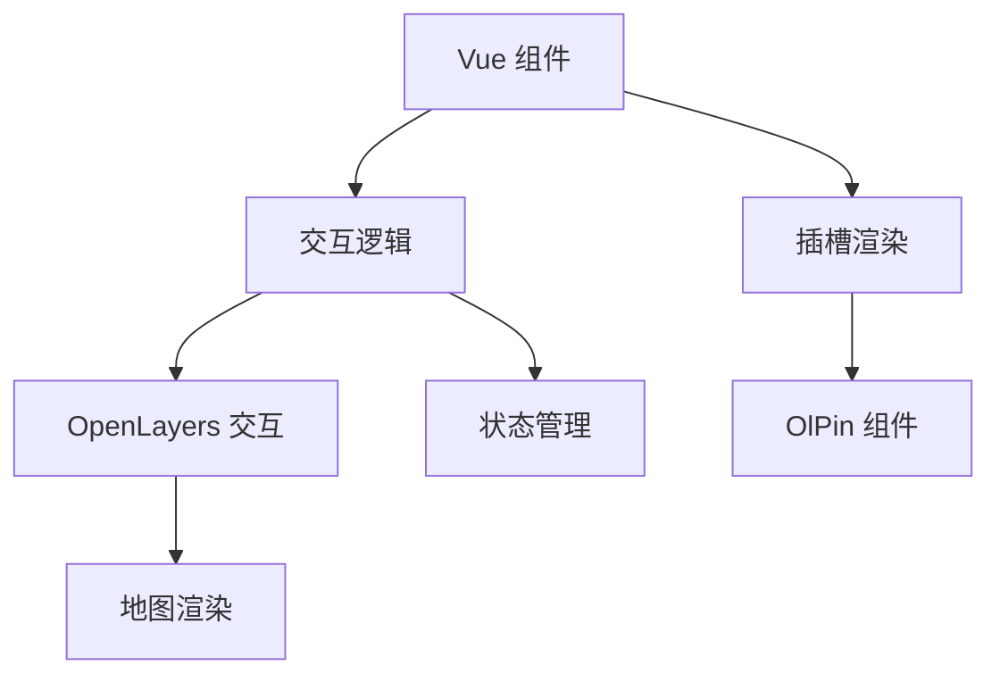
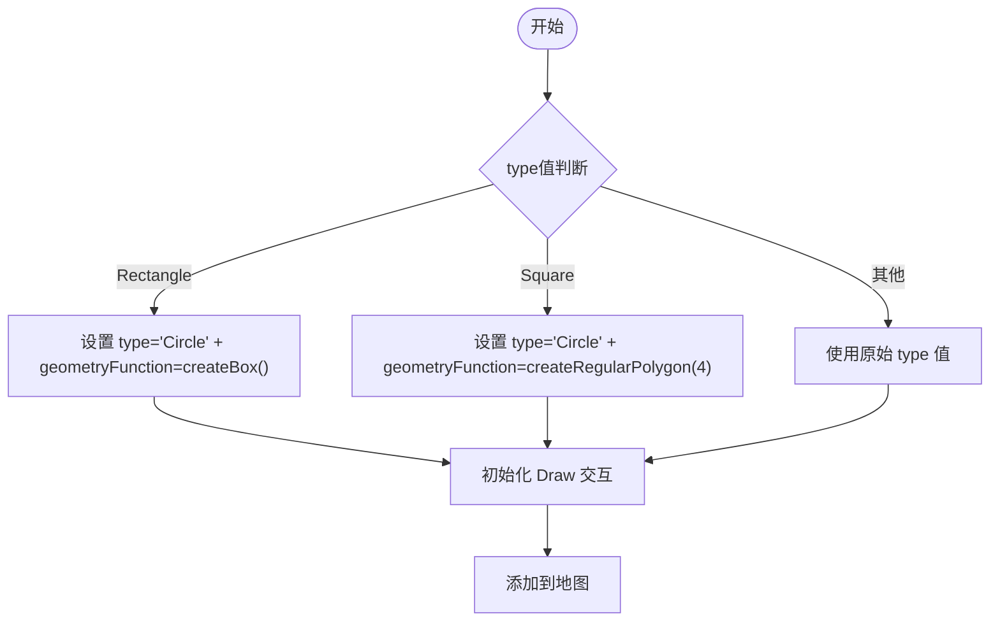
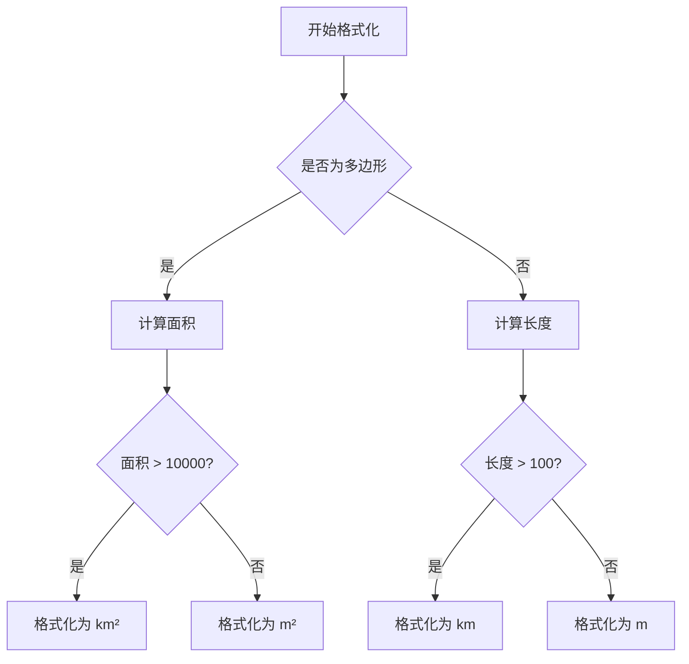
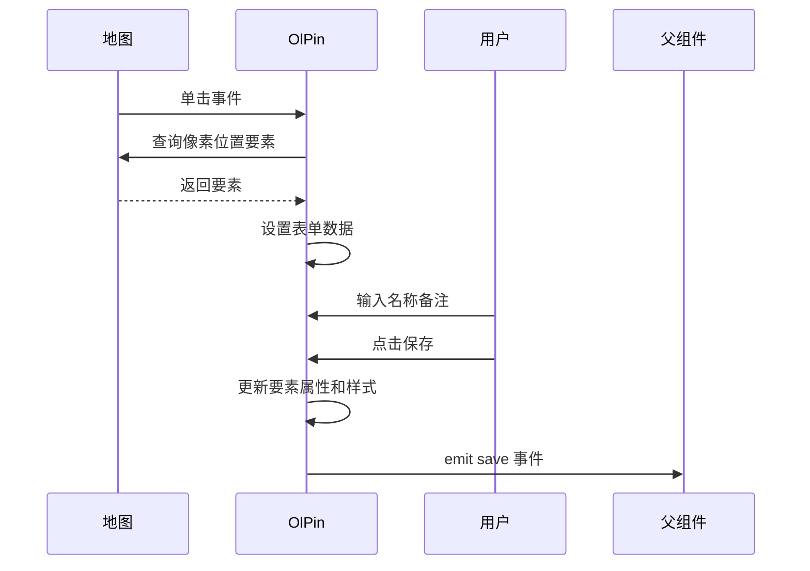

# 交互功能组件 API

<cite>
**本文档引用的文件**   
- [draw.ts](file://src/packages/interaction/draw/draw.ts#L0-L235)
- [index.ts](file://src/packages/interaction/draw/index.ts#L0-L6)
- [measure.ts](file://src/packages/interaction/measure/measure.ts#L0-L300)
- [index.ts](file://src/packages/interaction/measure/index.ts#L0-L6)
- [index.vue](file://src/packages/interaction/DragRotateAndZoom/index.vue#L0-L32)
- [index.ts](file://src/packages/interaction/DragRotateAndZoom/index.ts#L0-L6)
- [index.vue](file://src/packages/interaction/pin/index.vue#L0-L159)
- [Draw.ts](file://src/packages/types/Draw.ts#L0-L17)
</cite>

## 目录
1. [简介](#简介)
2. [项目结构](#项目结构)
3. [核心组件](#核心组件)
4. [架构概览](#架构概览)
5. [详细组件分析](#详细组件分析)
6. [依赖分析](#依赖分析)
7. [性能考虑](#性能考虑)
8. [故障排除指南](#故障排除指南)
9. [结论](#结论)

## 简介
本文档详细介绍了基于 OpenLayers 的交互功能组件 API，涵盖 `OlDraw`、`OlMeasure`、`OlDragRotateAndZoom` 和 `OlPin` 四个核心组件。文档深入解析了各组件的 props 配置、emitted events 的数据结构与触发条件，并说明如何通过 ref 访问底层 OpenLayers 交互对象进行精细控制。同时，文档还提供了自定义样式、动态单位切换、限制旋转缩放等高级配置示例，并强调交互状态管理的最佳实践。

## 项目结构
项目采用模块化设计，核心交互组件位于 `src/packages/interaction` 目录下，每个组件独立封装，支持按需引入。组件通过 Vue 3 的 Composition API 实现，依赖 OpenLayers 提供的地图交互能力。

```mermaid
graph TB
subgraph "交互组件"
OlDraw[OlDraw]
OlMeasure[OlMeasure]
OlDragRotateAndZoom[OlDragRotateAndZoom]
OlPin[OlPin]
end
subgraph "OpenLayers 核心"
OLDraw[ol/interaction/Draw]
OLModify[ol/interaction/Modify]
OLSnap[ol/interaction/Snap]
OLStyle[ol/style]
OLGeom[ol/geom]
end
OlDraw --> OLDraw
OlDraw --> OLModify
OlDraw --> OLSnap
OlMeasure --> OLDraw
OlMeasure --> OLModify
OlMeasure --> OLStyle
OlDragRotateAndZoom --> "ol/interaction/DragRotateAndZoom"
OlPin --> OLStyle
OlPin --> OLGeom
```

**图示来源**
- [draw.ts](file://src/packages/interaction/draw/draw.ts#L0-L235)
- [measure.ts](file://src/packages/interaction/measure/measure.ts#L0-L300)
- [index.vue](file://src/packages/interaction/DragRotateAndZoom/index.vue#L0-L32)
- [index.vue](file://src/packages/interaction/pin/index.vue#L0-L159)

## 核心组件
核心交互组件包括绘制、测量、旋转缩放和兴趣点标注四大功能模块，均基于 OpenLayers 的交互类进行封装，提供声明式 Vue 组件接口。

**组件来源**
- [draw.ts](file://src/packages/interaction/draw/draw.ts#L0-L235)
- [measure.ts](file://src/packages/interaction/measure/measure.ts#L0-L300)

## 架构概览
系统采用分层架构，上层为 Vue 组件封装，中层为交互逻辑控制，底层依赖 OpenLayers 提供的地图操作能力。各组件通过 inject 获取地图实例，通过 props 接收配置，通过 emit 抛出事件。



**图示来源**
- [draw.ts](file://src/packages/interaction/draw/draw.ts#L0-L235)
- [measure.ts](file://src/packages/interaction/measure/measure.ts#L0-L300)
- [index.vue](file://src/packages/interaction/pin/index.vue#L0-L159)

## 详细组件分析

### OlDraw 组件分析
`OlDraw` 组件提供地图绘制功能，支持点、线、面及扩展类型（矩形、正方形）的绘制。

#### 配置属性 (props)
: type: 绘制几何类型，可选值包括 "Point"、"LineString"、"Polygon"、"Circle"、"Rectangle"、"Square"
: snap: 是否启用吸附功能
: modify: 是否启用修改交互
: pin: 是否启用绘制完成后弹出标注窗口
: pinClass: 标注窗口根类名
: once: 是否每次绘制前清除已有图形
: options: 传递给 OpenLayers Draw 的额外选项

#### 抛出事件 (emits)
: drawstart: 绘制开始时触发，携带 DrawEvent
: drawend: 绘制结束时触发，携带 DrawEvent
: modifystart: 修改开始时触发，携带 ModifyEvent
: modifyend: 修改结束时触发，携带 ModifyEvent
: savePin: 用户保存标注信息时触发，携带标注数据

#### 暴露方法 (expose)
: clear: 清除当前图层所有图形
: setActive: 激活或禁用绘制交互

#### 绘制类型扩展逻辑


**图示来源**
- [draw.ts](file://src/packages/interaction/draw/draw.ts#L80-L150)

**组件来源**
- [draw.ts](file://src/packages/interaction/draw/draw.ts#L0-L235)

### OlMeasure 组件分析
`OlMeasure` 组件提供地图测量功能，支持长度和面积测量。

#### 配置属性 (props)
: type: 测量类型，"length" 或 "area"
: showSegments: 是否显示线段长度标注
: clearPrevious: 是否在开始新测量时清除之前的测量结果

#### 样式管理
组件内置多种样式：
- 基础样式 (style): 测量图形的填充、描边和节点样式
- 标注样式 (labelStyle): 总长度或面积的文本标注
- 提示样式 (tipStyle): 鼠标提示文本
- 修改样式 (modifyStyle): 修改交互时的提示
- 线段样式 (segmentStyle): 各线段长度标注

#### 单位自动转换


**图示来源**
- [measure.ts](file://src/packages/interaction/measure/measure.ts#L100-L130)

**组件来源**
- [measure.ts](file://src/packages/interaction/measure/measure.ts#L0-L300)

### OlDragRotateAndZoom 组件分析
`OlDragRotateAndZoom` 组件提供拖拽旋转和缩放的交互功能。

#### 实现原理
组件直接封装 OpenLayers 的 `DragRotateAndZoom` 交互类，通过 props 传递配置选项。

#### 状态管理
使用 `watchEffect` 监听 props 变化，自动销毁并重新创建交互实例，确保配置实时生效。

**组件来源**
- [index.vue](file://src/packages/interaction/DragRotateAndZoom/index.vue#L0-L32)

### OlPin 组件分析
`OlPin` 组件提供兴趣点/区域的标注功能。

#### 功能特点
- 点击已有要素自动填充表单
- 支持名称和备注输入
- 自动计算多边形中心位置作为标注点
- 可自定义样式类名

#### 交互流程


**图示来源**
- [index.vue](file://src/packages/interaction/pin/index.vue#L0-L159)

**组件来源**
- [index.vue](file://src/packages/interaction/pin/index.vue#L0-L159)

## 依赖分析
各组件依赖关系清晰，无循环依赖。

```mermaid
graph TD
OlDraw --> OlPin
OlDraw --> "ol/interaction/Draw"
OlDraw --> "ol/interaction/Modify"
OlDraw --> "ol/interaction/Snap"
OlMeasure --> "ol/interaction/Draw"
OlMeasure --> "ol/interaction/Modify"
OlDragRotateAndZoom --> "ol/interaction/DragRotateAndZoom"
OlPin --> "ol/style"
OlPin --> "ol/geom"
```

**图示来源**
- [draw.ts](file://src/packages/interaction/draw/draw.ts#L0-L235)
- [measure.ts](file://src/packages/interaction/measure/measure.ts#L0-L300)
- [index.vue](file://src/packages/interaction/DragRotateAndZoom/index.vue#L0-L32)
- [index.vue](file://src/packages/interaction/pin/index.vue#L0-L159)

## 性能考虑
- 使用 `shallowRef` 管理交互实例，避免不必要的响应式开销
- 绘制结束时及时移除临时交互（如 Snap）
- 样式对象复用，避免重复创建
- 通过 `once` 属性控制是否自动清除，避免内存泄漏

## 故障排除指南
- **绘制无反应**：检查父组件是否提供了 `ParentLayer` 注入
- **测量单位不正确**：确保地图视图投影设置正确
- **标注不显示**：检查 `pin` 属性是否为 true，且绘制类型为 Point 或 Polygon
- **交互冲突**：确保同一时间只有一个交互处于激活状态

**组件来源**
- [draw.ts](file://src/packages/interaction/draw/draw.ts#L0-L235)
- [measure.ts](file://src/packages/interaction/measure/measure.ts#L0-L300)

## 结论
本文档详细解析了交互功能组件的实现原理和使用方法。各组件设计合理，功能完整，通过合理的状态管理和事件机制，提供了灵活的地图交互能力。建议在实际使用中注意交互状态的管理，避免内存泄漏，并根据需要进行样式定制。