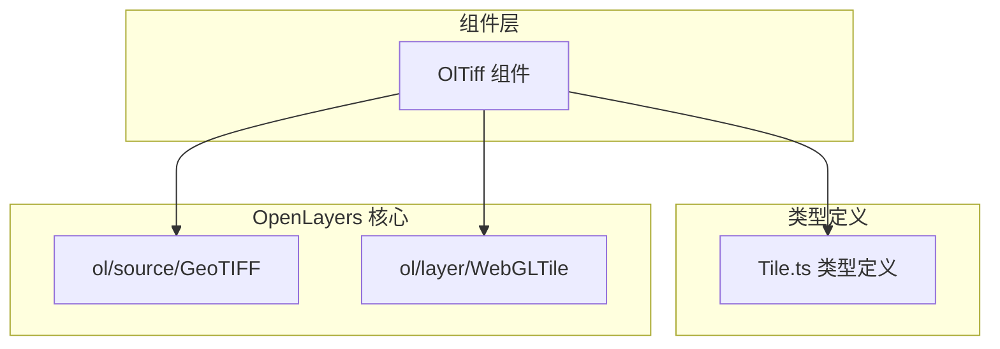
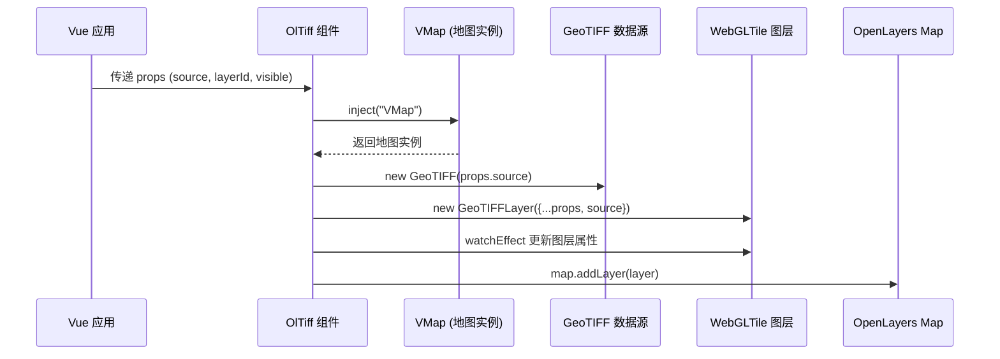
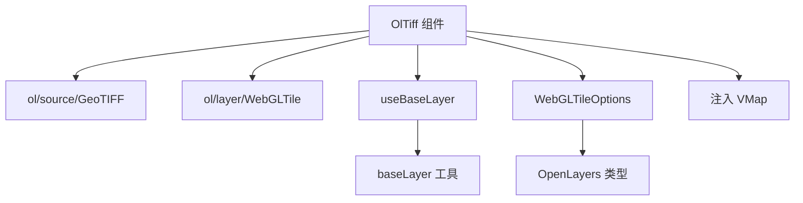

# TIFF 图层 API

<cite>
**本文档引用文件**  
- [index.vue](file://src/packages/layers/tiff/index.vue#L1-L42)
- [index.ts](file://src/packages/layers/tiff/index.ts#L1-L7)
- [Tile.ts](file://src/packages/types/Tile.ts#L1-L67)
- [tileRender.ts](file://src/packages/layers/tile/tileRender.ts#L1-L95)
- [index.vue](file://src/examples/tiff/index.vue#L1-L28)
</cite>

## 目录
1. [简介](#简介)
2. [项目结构](#项目结构)
3. [核心组件](#核心组件)
4. [架构概览](#架构概览)
5. [详细组件分析](#详细组件分析)
6. [依赖关系分析](#依赖关系分析)
7. [性能考虑](#性能考虑)
8. [故障排除指南](#故障排除指南)
9. [结论](#结论)

## 简介
本文档旨在为 `OlTiff` 组件提供完整的 API 文档，详细说明如何通过 Vue 组件加载 GeoTIFF 格式的遥感影像数据，并实现坐标投影转换、多波段处理、图像可视化调节等功能。文档涵盖 `url`、`sourceOptions`、`renderer`、`projection` 等关键 `props` 的配置方式，适用于遥感、高程、气象等专业地理空间数据的可视化场景。

## 项目结构
`OlTiff` 组件位于 `/src/packages/layers/tiff/` 目录下，是 OpenLayers 地图库在 Vue 框架中的封装组件之一。其结构简洁，主要由 `index.vue`（组件实现）和 `index.ts`（安装逻辑）构成。该组件依赖于 OpenLayers 的 `ol/source/GeoTIFF` 和 `ol/layer/WebGLTile` 类，通过 `WebGL` 实现高性能渲染。



**图示来源**
- [index.vue](file://src/packages/layers/tiff/index.vue#L1-L42)
- [Tile.ts](file://src/packages/types/Tile.ts#L1-L67)

**本节来源**
- [index.vue](file://src/packages/layers/tiff/index.vue#L1-L42)
- [Tile.ts](file://src/packages/types/Tile.ts#L1-L67)

## 核心组件
`OlTiff` 的核心功能是将 GeoTIFF 文件作为图层加载到 OpenLayers 地图中。其核心逻辑在 `index.vue` 中实现，通过 `props` 接收配置，创建 `GeoTIFF` 数据源和 `WebGLTile` 图层，并将其添加到地图实例。

**本节来源**
- [index.vue](file://src/packages/layers/tiff/index.vue#L1-L42)

## 架构概览
`OlTiff` 组件的架构遵循 Vue 3 的组合式 API 模式，利用依赖注入（`inject`）获取地图实例 `VMap`，并在组件挂载后将生成的图层添加到地图中。其数据流清晰：`props` → `source` → `layer` → `map`。



**图示来源**
- [index.vue](file://src/packages/layers/tiff/index.vue#L1-L42)
- [index.ts](file://src/packages/layers/tiff/index.ts#L1-L7)

**本节来源**
- [index.vue](file://src/packages/layers/tiff/index.vue#L1-L42)

## 详细组件分析

### OlTiff 组件分析
`OlTiff` 是一个 Vue 3 的 `<script setup>` 组件，其主要职责是封装 OpenLayers 的 GeoTIFF 图层创建逻辑。

#### 属性 (Props) 分析
组件通过 `defineProps<WebGLTileOptions>()` 定义其可接收的属性，其类型定义在 `Tile.ts` 中：

```typescript
export interface WebGLTileOptions extends WebGLTileLayer {
  source: GeoTIFFOptions;
  layerStyle?: Options["style"];
}
```

关键属性包括：
- **source**: GeoTIFF 数据源配置对象，类型为 `GeoTIFFOptions`，来自 OpenLayers。这是最核心的属性。
- **layerId**: 图层的唯一标识符，默认使用 `nanoid` 生成。
- **visible**: 图层初始可见性，默认为 `true`。
- **layerStyle**: 可选的 WebGL 渲染样式，用于控制图像的显示效果（如色彩映射）。

**本节来源**
- [index.vue](file://src/packages/layers/tiff/index.vue#L1-L42)
- [Tile.ts](file://src/packages/types/Tile.ts#L38-L65)

#### GeoTIFF 数据源配置
`source` 属性是 `GeoTIFFOptions` 类型，其具体配置在使用时传入。根据示例文件 `src/examples/tiff/index.vue`，一个典型的配置如下：

```javascript
const GeoTIFF: WebGLTileOptions["source"] = {
  projection: "EPSG:4548",
  sources: [
    {
      url: "http://172.16.34.132:5000/ljd/result.tif",
      overviews: ["http://172.16.34.132:5000/ljd/result.tif.ovr"],
    },
  ],
};
```

- **projection**: 指定 GeoTIFF 文件的坐标参考系统（CRS），如 `"EPSG:4548"`。OpenLayers 会自动将其转换为地图视图的投影。
- **sources**: 一个包含 GeoTIFF 文件信息的对象数组。
  - **url**: 必填，指向 `.tif` 文件的网络路径。
  - **overviews**: 可选，指向金字塔概览文件（`.ovr`）的路径数组，用于加速大文件的渲染。
  - **nodata**: 可选，指定数据中的无效值（如 0），在渲染时可将其视为透明。

#### 多波段数据处理与 NDVI 计算
OpenLayers 的 `GeoTIFF` 源支持读取多波段数据。通过 `layerStyle` 属性，可以使用 WebGL 着色器语言（GLSL）编写自定义渲染逻辑，实现如 NDVI（归一化植被指数）计算等复杂操作。

例如，一个简单的 NDVI 计算着色器可能如下：
```glsl
void main() {
  float nir = getBand(1); // 近红外波段
  float red = getBand(0); // 红光波段
  float ndvi = (nir - red) / (nir + red);
  gl_FragColor = colorize(ndvi, palette);
}
```
这需要在 `layerStyle` 中进行配置，以实现动态植被指数可视化。

#### 图像可视化参数调整
通过 `layerStyle`，可以精细控制图像的显示效果：
- **min/max**: 在着色器中定义数据值的显示范围，超出范围的值会被截断。
- **clamp**: 通过逻辑实现，将数据值限制在指定区间内，常用于突出显示特定地物。

#### 跨域与大文件流式解析
- **跨域加载**: 只要 GeoTIFF 服务器配置了正确的 CORS 头（如 `Access-Control-Allow-Origin: *`），即可实现跨域加载。在 `sourceOptions` 中设置 `crossOrigin: "anonymous"` 可确保请求包含跨域凭据。
- **大文件流式解析**: OpenLayers 的 `GeoTIFF` 源基于 `geotiff.js` 库，该库支持流式解析（streaming），可以分块加载大型 TIFF 文件，避免一次性加载导致的内存溢出。

#### 与 OpenLayers RasterSource 的集成
`OlTiff` 组件直接使用了 OpenLayers 的 `GeoTIFF` 类，该类是 `RasterSource` 的一种具体实现。`RasterSource` 提供了对栅格数据进行处理的通用接口，`GeoTIFF` 则专注于解析带有地理信息的 TIFF 文件。`OlTiff` 组件通过 `WebGLTileLayer` 将 `RasterSource` 的输出渲染到地图上。

**本节来源**
- [index.vue](file://src/packages/layers/tiff/index.vue#L1-L42)
- [Tile.ts](file://src/packages/types/Tile.ts#L1-L67)
- [index.vue](file://src/examples/tiff/index.vue#L1-L28)

## 依赖关系分析
`OlTiff` 组件的依赖关系清晰，主要依赖于 OpenLayers 的核心类和项目内部的类型定义。



**图示来源**
- [index.vue](file://src/packages/layers/tiff/index.vue#L1-L42)
- [tileRender.ts](file://src/packages/layers/tile/tileRender.ts#L1-L95)

**本节来源**
- [index.vue](file://src/packages/layers/tiff/index.vue#L1-L42)
- [tileRender.ts](file://src/packages/layers/tile/tileRender.ts#L1-L95)

## 性能考虑
1. **使用 WebGL 渲染**: `WebGLTileLayer` 利用 GPU 进行渲染，相比 CPU 渲染的 `ImageLayer`，性能大幅提升，尤其适合大尺寸和多波段影像。
2. **金字塔概览 (Overviews)**: 为大 TIFF 文件生成 `.ovr` 或 `.tfw` 金字塔文件，可显著提高缩放时的加载速度。
3. **内存优化**: `geotiff.js` 的流式解析机制减少了内存占用。避免一次性加载超大文件，应优先使用切片或金字塔格式。
4. **渐进式渲染**: 利用 `overviews`，地图会先加载低分辨率的概览图，再逐步加载高分辨率细节，提供更好的用户体验。
5. **按需加载**: 结合地图视图范围，只加载当前视口内的瓦片，减少不必要的网络请求。

**本节来源**
- [index.vue](file://src/packages/layers/tiff/index.vue#L1-L42)
- [tileRender.ts](file://src/packages/layers/tile/tileRender.ts#L1-L95)

## 故障排除指南
- **问题**: 图层不显示。
  - **检查**: 确认 `url` 路径正确且服务器可访问。
  - **检查**: 确认服务器已启用 CORS。
  - **检查**: 查看浏览器开发者工具的网络面板，确认 `.tif` 文件请求成功。
- **问题**: 坐标错位。
  - **检查**: 确认 `source.projection` 设置正确，与 GeoTIFF 文件的 CRS 一致。
  - **检查**: 确认地图视图的投影与数据投影兼容。
- **问题**: 加载缓慢。
  - **建议**: 为 GeoTIFF 文件生成金字塔概览（`overviews`）。
  - **建议**: 检查网络状况，确保服务器带宽充足。
- **问题**: 内存占用过高。
  - **建议**: 使用流式解析，并确保文件大小在合理范围内。
  - **建议**: 在不需要时调用 `layer.dispose()` 释放资源。

**本节来源**
- [index.vue](file://src/packages/layers/tiff/index.vue#L1-L42)
- [tileRender.ts](file://src/packages/layers/tile/tileRender.ts#L1-L95)

## 结论
`OlTiff` 组件为在 Vue 应用中集成 GeoTIFF 格式的地理空间影像提供了一个简洁高效的解决方案。它通过封装 OpenLayers 的强大功能，使开发者能够轻松实现遥感影像、高程模型等专业数据的加载、投影转换和可视化。通过合理配置 `source` 和 `layerStyle`，并遵循性能优化建议，可以构建出高性能、交互性强的地理信息应用。