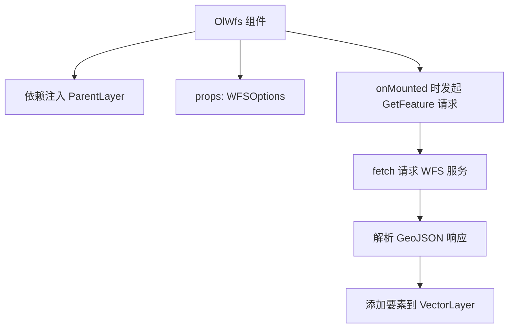
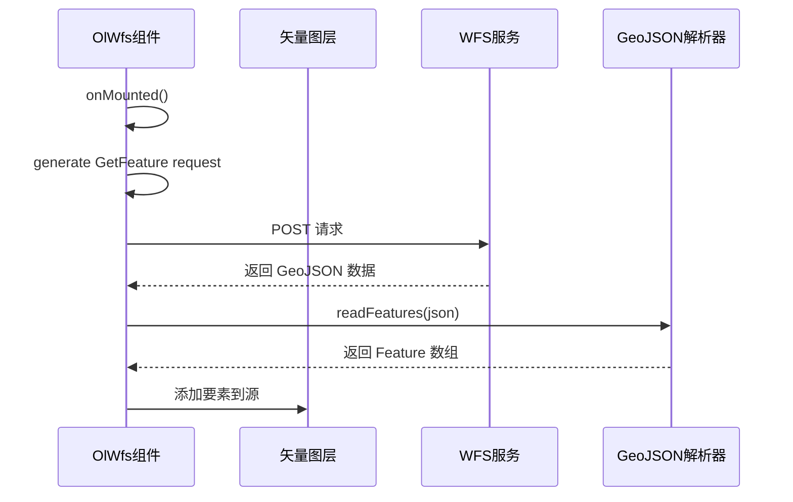
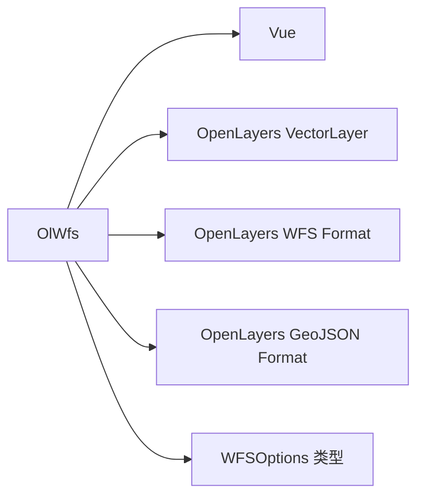

# WFS 图层 API

<cite>
**本文档引用文件**  
- [index.vue](file://src/packages/layers/wfs/index.vue#L0-L57)
- [WFS.ts](file://src/packages/types/WFS.ts#L0-L7)
- [index.ts](file://src/packages/layers/wfs/index.ts#L0-L6)
- [index.vue](file://src/examples/wfs/index.vue#L0-L65)
- [index.vue](file://src/examples/test/index.vue#L90-L128)
</cite>

## 目录
1. [简介](#简介)
2. [项目结构](#项目结构)
3. [核心组件](#核心组件)
4. [架构概述](#架构概述)
5. [详细组件分析](#详细组件分析)
6. [依赖分析](#依赖分析)
7. [性能考虑](#性能考虑)
8. [故障排除指南](#故障排除指南)
9. [结论](#结论)

## 简介
本文档详细介绍了 `OlWfs` 组件的 API 设计与使用方式，重点说明如何通过配置 `url`、`featurePrefix`、`featureTypes`、`outputFormat` 等属性构建 WFS GetFeature 请求。同时涵盖数据解析机制（支持 GML 格式）、要素加载状态管理、错误处理、矢量图层样式集成、属性与空间查询功能实现，并提供大数据量下的分页加载与增量更新优化策略，最后对比 WFS 与矢量切片的适用场景。

## 项目结构
`OlWfs` 组件位于 `/src/packages/layers/wfs/` 目录下，采用 Vue 3 的 `<script setup>` 语法编写，依赖 OpenLayers 的 `WFS` 和 `GeoJSON` 格式解析器。该组件作为 `ol-vector` 的子组件使用，通过依赖注入获取父图层实例。



**图示来源**  
- [index.vue](file://src/packages/layers/wfs/index.vue#L0-L57)

## 核心组件
`OlWfs` 是一个 Vue 组件，用于从 WFS 服务加载矢量要素并添加到 OpenLayers 的矢量图层中。其核心逻辑在组件挂载后自动执行，通过 `writeGetFeature` 方法生成 WFS GetFeature 请求体，并使用 `fetch` 发送 POST 请求。

**组件来源**  
- [index.vue](file://src/packages/layers/wfs/index.vue#L0-L57)

## 架构概述
`OlWfs` 组件通过 Vue 的依赖注入机制获取父级 `VectorLayer` 实例，并在其 `onMounted` 钩子中发起 WFS 请求。请求成功后，将返回的 GeoJSON 数据解析为 OpenLayers 的 `Feature` 对象，并添加至图层源中。



**图示来源**  
- [index.vue](file://src/packages/layers/wfs/index.vue#L0-L57)
- [WFS.ts](file://src/packages/types/WFS.ts#L0-L7)

## 详细组件分析

### OlWfs 组件分析
`OlWfs` 组件通过 `defineProps<WFSOptions>` 接收配置项，其中 `WFSOptions` 接口定义于 `types/WFS.ts`，其核心是 OpenLayers 的 `WriteGetFeatureOptions` 类型。

#### 属性配置说明
```ts
const props = withDefaults(defineProps<WFSOptions>(), {
  options: () => {
    return {
      featureNS: "",           // WFS 服务地址（必填）
      featurePrefix: "",       // 要素命名空间前缀
      featureTypes: [],        // 要素类型数组，如 ["workspace:layer"]
      outputFormat: "application/json", // 输出格式，默认为 JSON
      maxFeatures: Infinity,   // 最大返回要素数
    };
  },
});
```

- **featureNS**: WFS 服务的 OWS 接口地址，例如 `http://server/geoserver/ows`
- **featurePrefix**: 要素类型的命名空间前缀，如 `xiaqu`
- **featureTypes**: 指定要请求的要素类型，格式为 `前缀:图层名`
- **outputFormat**: 响应格式，支持 `application/json` 或 `text/xml; subtype=gml/3.2`
- **srsName**: 坐标参考系统，如 `EPSG:4326`

#### WFS GetFeature 请求构建
组件使用 `ol/format/WFS` 的 `writeGetFeature` 方法生成符合 WFS 规范的 XML 请求体：

```ts
const featureRequest = new WFS().writeGetFeature({
  ...props.options,
  outputFormat: "application/json",
});
```

该请求通过 `fetch` 以 POST 方式发送至 `featureNS` 地址。

#### 数据解析与加载
响应数据为 GeoJSON 格式时，使用 `ol/format/GeoJSON` 的 `readFeatures` 方法解析为 OpenLayers 的 `Feature` 对象，并添加至父图层的源中：

```ts
const features = new GeoJSON().readFeatures(json);
const source = unref(layer)?.getSource();
source?.addFeatures(features);
```

#### GML 格式支持
若 `outputFormat` 设置为 GML（如 `text/xml; subtype=gml/3.2`），OpenLayers 会自动使用 `GML` 解析器处理响应。当前代码默认使用 JSON 格式，但可通过修改 `outputFormat` 支持 GML。

#### 要素加载状态与错误处理
当前实现中未显式管理加载状态或错误处理。建议扩展如下：

```ts
const loading = ref(false);
const error = ref<string | null>(null);

const addFeatures = async () => {
  loading.value = true;
  error.value = null;
  try {
    const response = await fetch(props.options.featureNS, {
      method: "POST",
      body: new XMLSerializer().serializeToString(featureRequest),
    });
    if (!response.ok) throw new Error(`HTTP ${response.status}`);
    const json = await response.json();
    const features = new GeoJSON().readFeatures(json);
    const source = unref(layer)?.getSource();
    source?.addFeatures(features);
  } catch (e) {
    error.value = e instanceof Error ? e.message : "未知错误";
  } finally {
    loading.value = false;
  }
};
```

#### 与矢量图层样式的集成
`OlWfs` 本身不处理样式，样式由其父组件 `ol-vector` 的 `feature-style` 属性控制。例如：

```vue
<ol-vector :feature-style="geoJsonStyle">
  <ol-wfs :options="wfsOptions"></ol-wfs>
</ol-vector>
```

样式可通过 `styleFunction` 动态设置文本标签：

```ts
styleFunction: function (feature, resolution, map, style) {
  const labelKey = "NAME";
  const text_ = feature.get(labelKey);
  style.getText().setText(text_);
  return style;
}
```

#### 属性查询与空间查询实现
- **属性查询**：可在 `WFSOptions` 中添加 `filter` 参数，使用 OGC Filter 构造查询条件。
- **空间查询**：通过 `bbox` 或 `geometryName` 参数实现空间过滤，例如：

```ts
options: {
  featureNS: "http://server/geoserver/ows",
  featureTypes: ["workspace:layer"],
  srsName: "EPSG:4326",
  outputFormat: "application/json",
  featurePrefix: "workspace",
  bbox: [xmin, ymin, xmax, ymax, "EPSG:4326"] // 空间范围查询
}
```

#### 大数据量分页加载与增量更新
为避免一次性加载过多数据，可结合 `maxFeatures` 与 `startIndex` 实现分页：

```ts
let startIndex = 0;
const pageSize = 1000;

const loadPage = () => {
  const request = new WFS().writeGetFeature({
    ...props.options,
    maxFeatures: pageSize,
    startIndex: startIndex
  });
  // 发送请求并累加 startIndex
};
```

增量更新可通过定期轮询或监听地图范围变化重新请求。

#### WFS 与矢量切片对比
| 特性 | WFS | 矢量切片 |
|------|-----|----------|
| 数据格式 | 完整要素（GML/JSON） | 预切片的矢量瓦片（PBF） |
| 传输效率 | 低（尤其大数据量） | 高（按需加载） |
| 渲染性能 | 依赖客户端解析 | 优化渲染，支持 LOD |
| 查询灵活性 | 高（支持复杂过滤） | 有限（依赖切片预生成） |
| 适用场景 | 小数据量、频繁属性/空间查询 | 大数据量、高性能渲染 |

**组件来源**  
- [index.vue](file://src/packages/layers/wfs/index.vue#L0-L57)
- [WFS.ts](file://src/packages/types/WFS.ts#L0-L7)
- [index.vue](file://src/examples/wfs/index.vue#L0-L65)

## 依赖分析
`OlWfs` 组件依赖以下模块：
- `vue`: 使用 `inject`、`onMounted` 等 Composition API
- `ol/layer/Vector`: 父图层类型
- `ol/format/WFS` 和 `ol/format/GeoJSON`: WFS 请求生成与 GeoJSON 解析
- `@/packages/types/WFS`: 类型定义



**图示来源**  
- [index.vue](file://src/packages/layers/wfs/index.vue#L0-L57)
- [WFS.ts](file://src/packages/types/WFS.ts#L0-L7)

## 性能考虑
- **大数据量**：避免一次性请求过多要素，建议使用分页（`startIndex` + `maxFeatures`）
- **频繁请求**：可加入防抖或节流机制，避免地图移动时频繁请求
- **解析开销**：GeoJSON 解析在主线程进行，大数据量可能导致卡顿，可考虑 Web Worker
- **缓存机制**：对静态数据可加入浏览器缓存或内存缓存，减少重复请求

## 故障排除指南
- **请求失败**：检查 `featureNS` 地址是否正确，确保服务支持 POST 请求
- **无数据返回**：确认 `featureTypes` 名称正确，检查 `featurePrefix` 是否匹配
- **坐标偏移**：确保 `srsName` 与地图视图一致
- **样式不生效**：确认 `feature-style` 正确传递至 `ol-vector`，检查 `styleFunction` 是否正确设置属性

**组件来源**  
- [index.vue](file://src/packages/layers/wfs/index.vue#L0-L57)
- [index.vue](file://src/examples/test/index.vue#L90-L128)

## 结论
`OlWfs` 组件提供了一种简洁的方式从 WFS 服务加载矢量数据。通过合理配置 `WFSOptions`，可实现灵活的属性与空间查询。对于大数据量场景，建议结合分页与缓存策略优化性能。未来可扩展加载状态、错误处理、GML 支持等功能，提升组件健壮性。