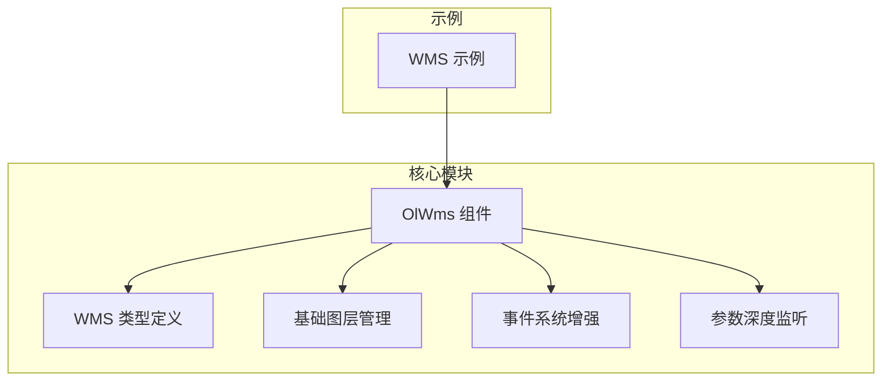
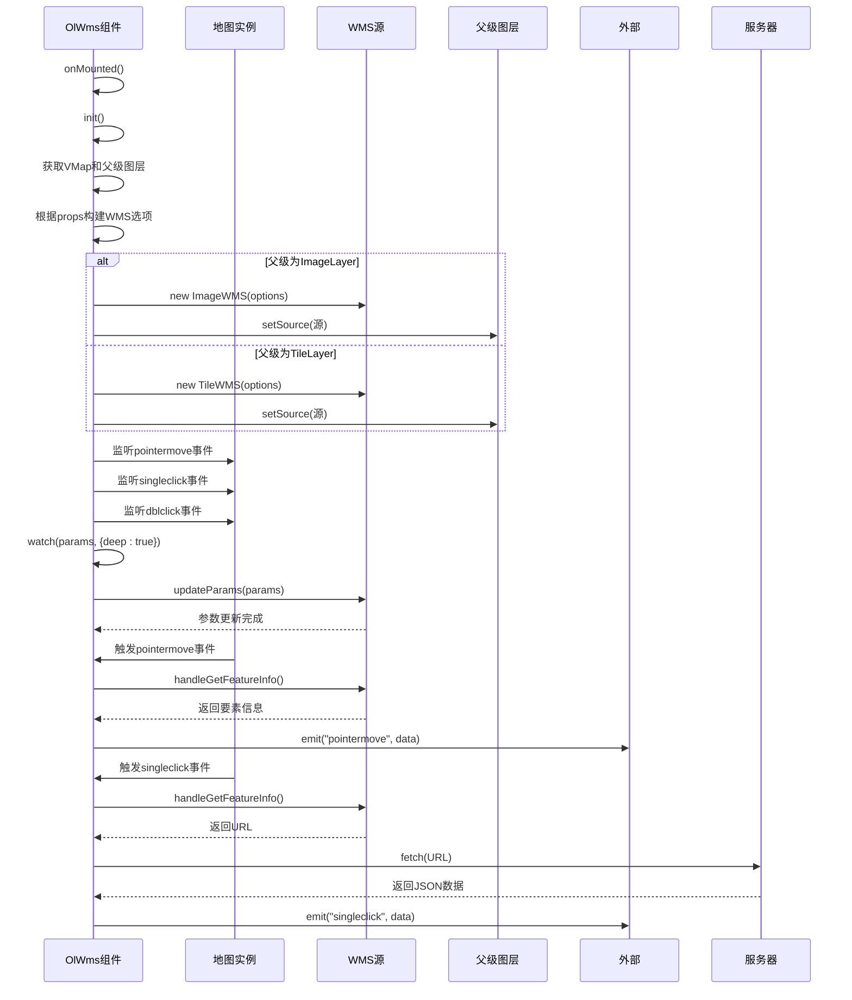
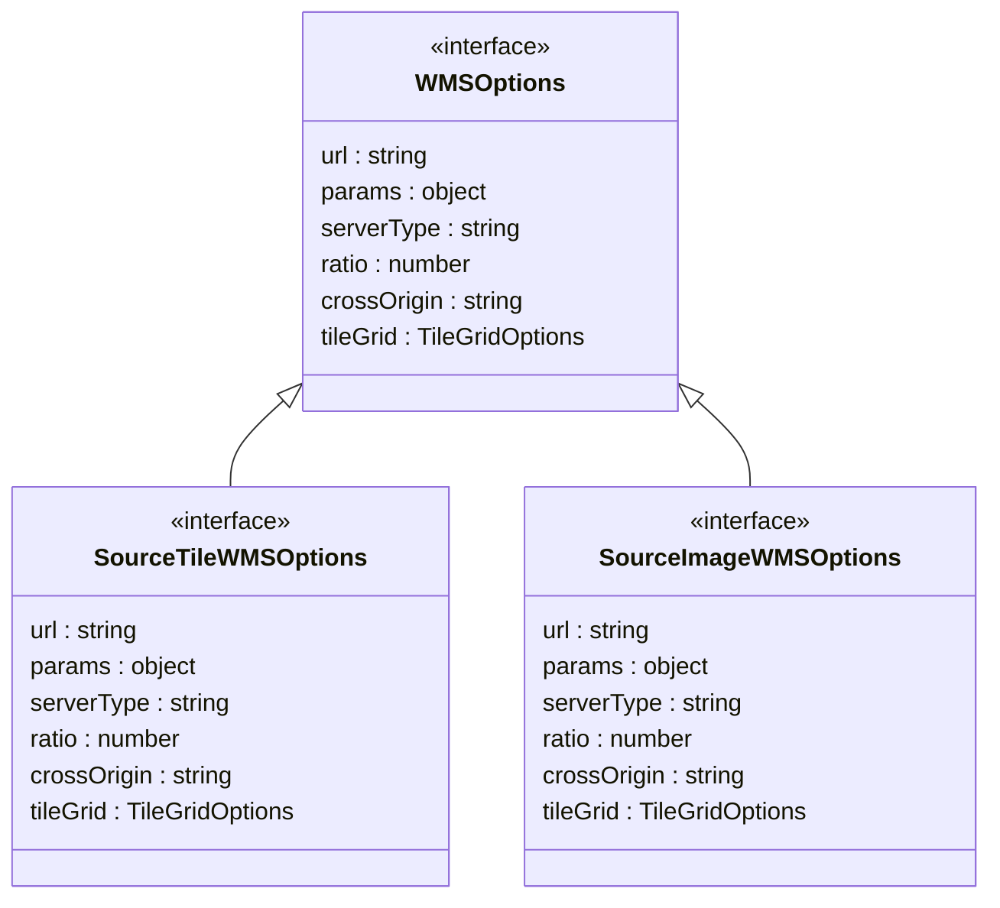
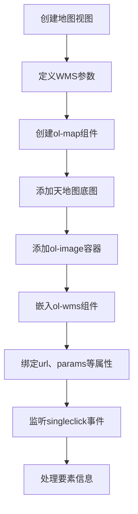
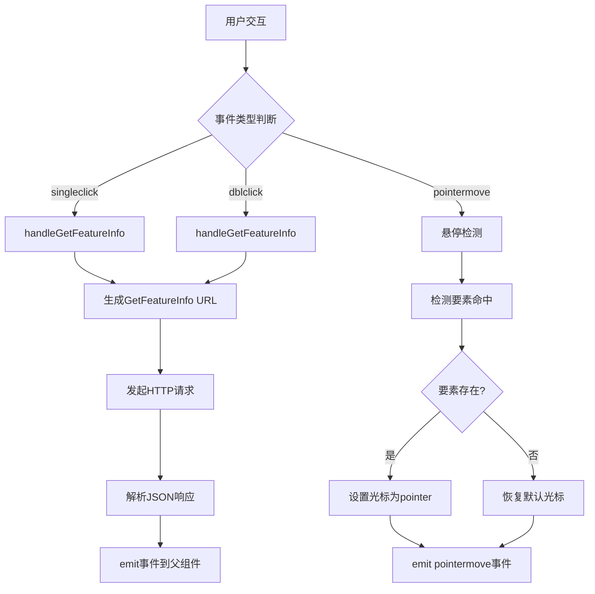
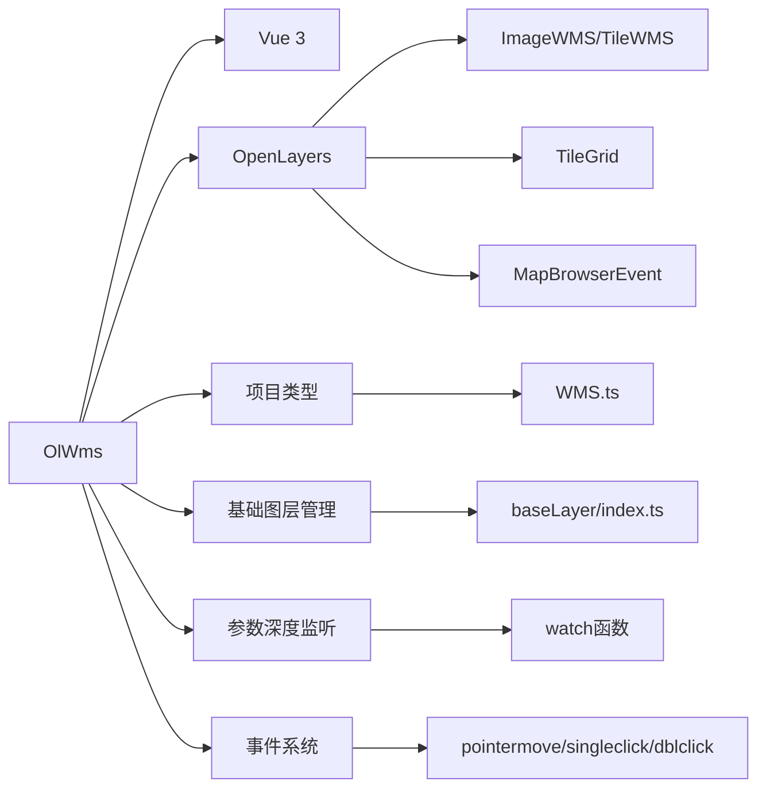

# WMS 图层 API

<cite>
**本文档引用文件**  
- [index.vue](file://src/packages/layers/wms/index.vue#L1-L110)
- [WMS.ts](file://src/packages/types/WMS.ts#L1-L17)
- [index.vue](file://src/examples/wms/index.vue#L1-L51)
- [baseLayer/index.ts](file://src/packages/layers/baseLayer/index.ts#L1-L127)
- [map/index.vue](file://src/packages/map/index.vue#L116-L165)
</cite>

## 更新摘要
**变更内容**  
- 新增WMS组件事件系统增强章节，支持更多交互事件类型
- 更新事件处理机制说明，包括pointermove、singleclick、dblclick事件
- 增强要素信息查询功能，支持异步获取和处理
- 完善事件系统的实时响应能力和性能优化建议

## 目录
1. [简介](#简介)
2. [项目结构](#项目结构)
3. [核心组件](#核心组件)
4. [架构概览](#架构概览)
5. [详细组件分析](#详细组件分析)
6. [事件系统增强](#事件系统增强)
7. [参数深度监听与动态更新](#参数深度监听与动态更新)
8. [依赖关系分析](#依赖关系分析)
9. [性能考虑](#性能考虑)
10. [故障排除指南](#故障排除指南)
11. [结论](#结论)

## 简介
本文档旨在为 `OlWms` 组件提供完整的 API 文档，详细说明其在 OpenLayers 地图框架中的作用。该组件用于加载和渲染 Web 地图服务（WMS）图层，支持与 GeoServer、MapServer 等后端服务集成。文档将深入解析 `url`、`layers`、`params`、`serverType` 等关键属性的用途与合法取值，解释如何通过 `params` 传递 `TIME`、`ELEVATION` 等扩展参数，并阐述 WMS 图层的动态更新机制（如时间序列动画）。同时，文档还将涵盖 `transparent`、`format` 等参数对渲染结果的影响，提供跨域请求与代理配置方案，并对比 WMS 与 WMTS 的适用场景，给出性能优化与缓存策略建议。

**重要更新**：WMS组件现已支持增强的事件系统，能够实时响应多种交互事件，包括鼠标悬停检测、单击事件和双击事件，提供更丰富的用户交互体验。

## 项目结构
项目采用模块化设计，主要功能集中在 `src/packages` 目录下。`layers` 模块负责管理各类地图图层，其中 `wms` 子模块专门处理 WMS 图层的逻辑。`types` 模块定义了各组件的类型接口，确保类型安全。`examples` 目录提供了实际使用示例，便于开发者快速上手。



**图示来源**
- [index.vue](file://src/packages/layers/wms/index.vue#L1-L110)
- [WMS.ts](file://src/packages/types/WMS.ts#L1-L17)
- [index.vue](file://src/examples/wms/index.vue#L1-L51)

## 核心组件
`OlWms` 是一个基于 Vue 3 的组合式 API 组件，封装了 OpenLayers 的 `ImageWMS` 和 `TileWMS` 源。它通过 `props` 接收配置，并根据父级图层类型（`ImageLayer` 或 `TileLayer`）动态创建相应的 WMS 源。组件还集成了增强的事件系统，支持多种交互事件的实时响应和处理。

**组件来源**
- [index.vue](file://src/packages/layers/wms/index.vue#L1-L110)

## 架构概览
`OlWms` 组件的架构遵循依赖注入模式。它从上下文中注入 `VMap` 实例和父级图层引用，确保与地图实例的正确关联。初始化时，组件根据 `props` 配置创建 `TileGrid`（可选），并根据父级图层类型实例化 `ImageWMS` 或 `TileWMS` 源。事件监听器被添加到地图实例上，用于处理多种交互事件。



**图示来源**
- [index.vue](file://src/packages/layers/wms/index.vue#L23-L62)

## 详细组件分析

### OlWms 组件分析
`OlWms` 组件的核心功能是将 Vue 的 `props` 映射到 OpenLayers 的 WMS 源配置。

#### 属性（Props）详解
`WMSOptions` 类型定义了组件可接受的所有属性，它结合了 `TileWMSOptions` 和 `ImageWMSOptions` 的特性。



**图示来源**
- [WMS.ts](file://src/packages/types/WMS.ts#L1-L17)

- **url**: WMS 服务的基地址。例如：`http://172.16.34.132:8222/geoserver/test/wms`。
- **params**: WMS 请求的关键参数对象。必须包含 `LAYERS`（图层名称）、`FORMAT`（图像格式，如 `image/png`）、`VERSION`（WMS 版本，如 `1.3.0`）。`STYLES` 可留空以使用默认样式。
- **serverType**: 指定 WMS 服务提供商，如 `geoserver`、`mapserver`。此参数用于 OpenLayers 内部优化 URL 构造。
- **ratio**: 图像缩放比例因子。`1` 表示原始分辨率。
- **crossOrigin**: 跨域资源共享（CORS）策略，`anonymous` 表示不发送用户凭据。
- **tileGrid**: （可选）自定义瓦片网格配置，用于控制瓦片的切分方案。

#### 动态参数传递
`params` 对象是动态的，可以包含任何 WMS 服务支持的扩展参数。例如，要实现时间序列动画，可以动态更新 `params` 中的 `TIME` 参数：
```ts
wms.params.TIME = "2023-10-01T00:00:00Z";
// 组件会自动触发图层重绘
```
同理，`ELEVATION` 参数可用于请求特定高程层的数据。

**重要更新**：组件现在支持深度监听 `params` 变化，无需重新创建组件即可实现实时更新。

#### 透明与格式参数
- **transparent**: 包含在 `params` 中，设为 `true` 时，背景将透明（通常与 `FORMAT=image/png` 配合使用）。
- **format**: 包含在 `params` 中，决定返回图像的 MIME 类型。常用值有 `image/png`（支持透明）、`image/jpeg`（文件小，不透明）、`image/gif`。

#### 增强事件处理机制
组件通过 `emit` 暴露多种交互事件，包括 `singleclick`、`dblclick` 和 `pointermove` 事件。当用户与地图交互时，组件会：
1. 调用 `source.getFeatureInfoUrl()` 生成 GetFeatureInfo 请求的 URL。
2. 使用 `fetch` 发起网络请求。
3. 将返回的 JSON 数据通过相应事件传递给父组件。

```vue
<ol-wms @singleclick="handleClick" @dblclick="handleDoubleClick" @pointermove="handlePointerMove"></ol-wms>
```

**组件来源**
- [index.vue](file://src/packages/layers/wms/index.vue#L21-L60)
- [WMS.ts](file://src/packages/types/WMS.ts#L1-L17)

### 集成示例分析
`src/examples/wms/index.vue` 提供了一个完整的使用示例。



**图示来源**
- [index.vue](file://src/examples/wms/index.vue#L1-L51)

该示例展示了如何：
1. 使用 `ol-map` 创建地图。
2. 添加 `ol-tile` 作为底图。
3. 使用 `ol-image` 容器承载 WMS 图层（因为示例使用了 `ImageWMS` 源）。
4. 在 `ol-image` 内部使用 `ol-wms` 并传入配置。
5. 处理点击事件以获取要素属性。

## 事件系统增强

### 支持的事件类型
WMS组件现在支持多种交互事件，每种事件都有其特定的用途和处理方式：

- **singleclick**: 单击事件，用于获取被点击位置的要素信息
- **dblclick**: 双击事件，用于处理双击交互
- **pointermove**: 鼠标悬停事件，用于实时检测要素并改变光标样式

### 事件处理流程
组件通过增强的事件系统实现了更丰富的交互体验：



**图示来源**
- [index.vue](file://src/packages/layers/wms/index.vue#L43-L60)

### 要素信息查询机制
组件实现了异步的要素信息查询功能：

1. **悬停检测**：当鼠标移动时，组件会检查当前像素位置是否有要素
2. **要素命中测试**：通过 `layer.getData(evt.pixel)` 获取像素数据
3. **光标样式切换**：根据要素命中结果动态改变鼠标样式
4. **异步查询**：使用 `handleGetFeatureInfo` 方法获取要素详细信息
5. **事件发射**：将查询结果通过相应事件传递给父组件

### 实时响应能力
增强的事件系统提供了更好的实时响应能力：

- **拖拽检测**：在 `pointermove` 事件中检测拖拽状态，避免不必要的计算
- **像素坐标转换**：准确获取事件坐标并进行要素命中测试
- **异步处理**：使用 `async/await` 处理异步的要素信息查询
- **错误处理**：完善的错误捕获和处理机制

**Section sources**  
- [index.vue](file://src/packages/layers/wms/index.vue#L43-L60)
- [index.vue](file://src/packages/layers/wms/index.vue#L64-L82)

## 参数深度监听与动态更新

### 深度监听机制
WMS组件现在集成了参数深度监听功能，通过Vue的`watch`函数监听`props.params`的变化。当`params`对象中的任何属性发生变化时，组件会自动调用`updateParams`方法更新WMS源的参数。

```mermaid
flowchart TD
A[params对象变化] --> B{深度监听触发?}
B --> |是| C[调用updateParams方法]
B --> |否| D[保持不变]
C --> E[获取当前图层源]
E --> F[调用source.updateParams(params)]
F --> G[重新渲染图层]
D --> H[组件继续运行]
G --> I[新参数生效]
```

**图示来源**
- [index.vue](file://src/packages/layers/wms/index.vue#L84-L98)

### 动态更新流程
当运行时修改`params`对象时，组件的响应流程如下：

1. **监听触发**：Vue检测到`params`对象的深层变化
2. **参数更新**：调用`updateParams`方法
3. **源更新**：通过`source.updateParams(params)`更新OpenLayers源
4. **图层重绘**：OpenLayers自动重新请求并渲染新的图层
5. **状态同步**：组件状态与新参数保持同步

### 实际应用场景
这种动态更新机制特别适用于以下场景：

- **时间序列动画**：通过定时器循环更新`TIME`参数实现动画效果
- **交互式过滤**：用户选择不同参数时实时更新图层显示
- **多参数联动**：多个参数同时变化时的协调更新
- **实时数据展示**：动态更新最新数据的时间戳

### 使用示例
```typescript
// 时间序列动画示例
let currentTime = new Date('2023-01-01');
const timer = setInterval(() => {
  currentTime = new Date(currentTime.getTime() + 24 * 60 * 60 * 1000);
  wms.params.TIME = currentTime.toISOString();
}, 1000);

// 参数联动示例
const handleFilterChange = (filterValue: string) => {
  wms.params.FILTER = filterValue;
  wms.params.ELEVATION = getElevationByFilter(filterValue);
};
```

**Section sources**  
- [index.vue](file://src/packages/layers/wms/index.vue#L84-L98)

## 依赖关系分析
`OlWms` 组件依赖于多个 OpenLayers 核心类和项目内部模块。



**图示来源**
- [index.vue](file://src/packages/layers/wms/index.vue#L1-L110)
- [WMS.ts](file://src/packages/types/WMS.ts#L1-L17)
- [baseLayer/index.ts](file://src/packages/layers/baseLayer/index.ts#L1-L127)

## 性能考虑
- **ImageWMS vs TileWMS**: `ImageWMS` 每次视图变化都请求一张完整图片，适合小范围或静态图层。`TileWMS` 将地图切分为瓦片，仅加载可见区域，适合大范围、频繁交互的场景，性能更优。
- **缓存策略**: WMS 服务端通常会缓存生成的图片。合理设置 `params` 中的 `CACHE` 相关参数（如果服务支持）可以提升性能。
- **参数优化**: 避免在 `params` 中传递不必要的参数，减少请求大小。
- **跨域代理**: 如果 WMS 服务不支持 CORS，需配置前端代理（如 Nginx 或 Vite 代理）来避免跨域问题。
- **深度监听开销**: 参数深度监听会带来一定的性能开销，建议合理控制参数对象的复杂度和更新频率。
- **事件处理优化**: 增强的事件系统可能增加计算开销，建议在大量要素的情况下考虑性能优化策略。

## 故障排除指南
- **图层不显示**: 检查 `url` 是否正确，`params.LAYERS` 名称是否准确，网络请求是否返回 200 状态码。
- **点击无反应**: 确认 `singleclick` 事件监听器已正确绑定，检查浏览器控制台是否有 CORS 错误。
- **图像不透明**: 确保 `params.FORMAT` 为 `image/png` 且 `params.transparent` 为 `true`。
- **时间序列不更新**: 确保 `params.TIME` 被正确修改，并且组件响应了 `props` 的变化（Vue 的响应式系统会自动处理）。
- **参数更新无效**: 检查参数对象是否为响应式对象，确认深度监听是否正常工作。
- **性能问题**: 如果参数更新过于频繁，考虑使用防抖或节流机制来优化性能。对于大量要素的悬停检测，考虑优化要素命中测试算法。
- **事件处理异常**: 检查事件监听器是否正确绑定，确认 `handleGetFeatureInfo` 函数的异步处理逻辑。

## 结论
`OlWms` 组件为在 Vue 3 项目中集成 WMS 服务提供了一个简洁、类型安全的接口。通过深入理解其 `props`、增强的事件机制和底层 OpenLayers 源的交互，开发者可以高效地实现复杂的地图可视化功能，包括动态参数更新、丰富的交互事件处理和要素信息查询。

**重要更新**：新增的增强事件系统使得WMS组件能够实时响应多种交互事件，包括鼠标悬停检测、单击事件和双击事件，提供更丰富的用户交互体验。结合参数深度监听功能和合理的性能优化策略，可以构建出流畅、响应迅速且功能丰富的地理信息应用。