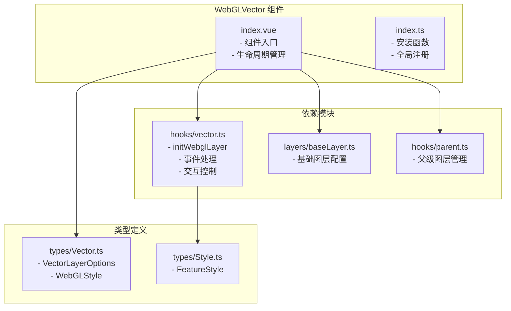
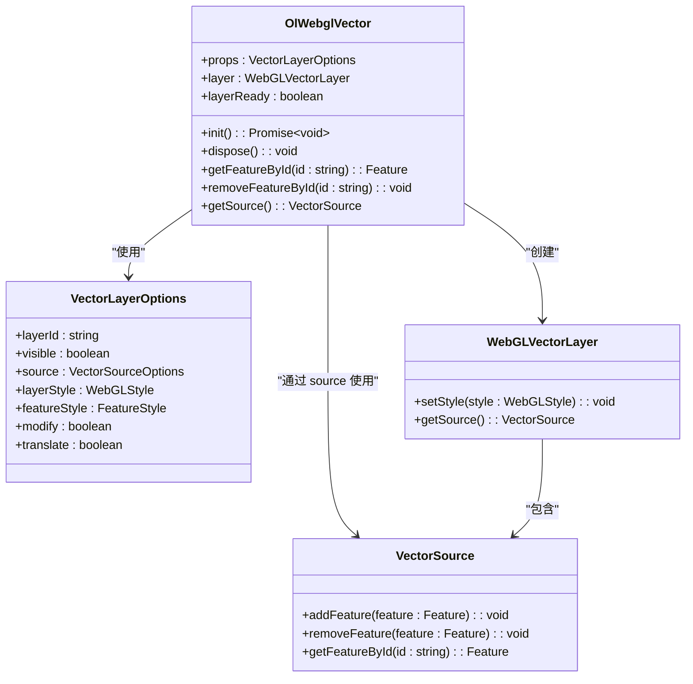
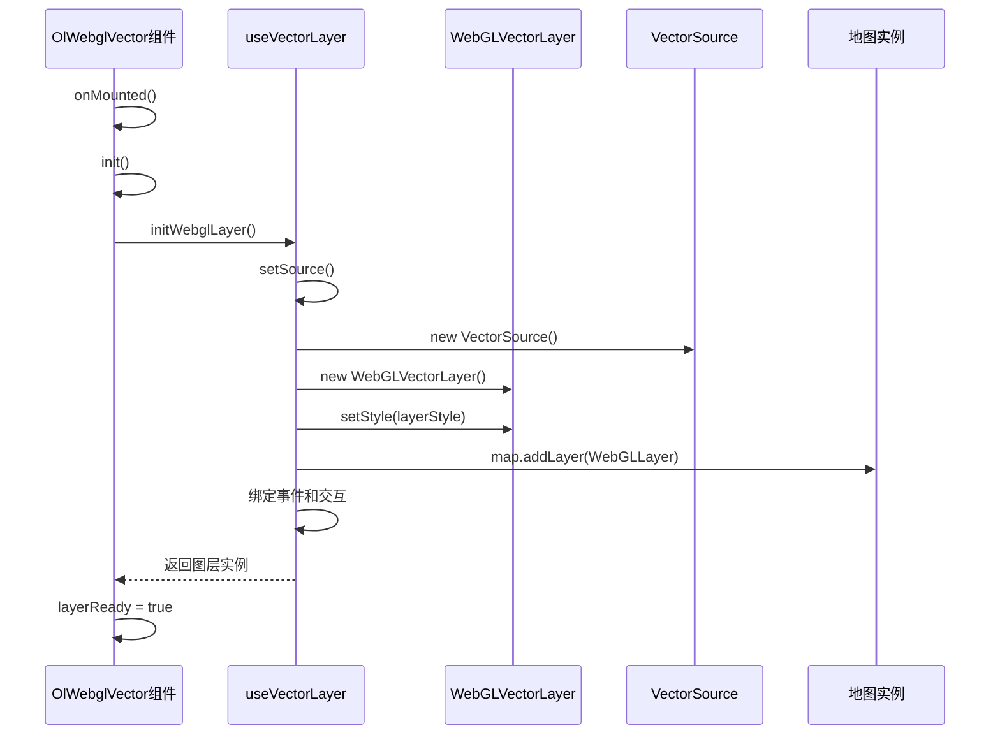
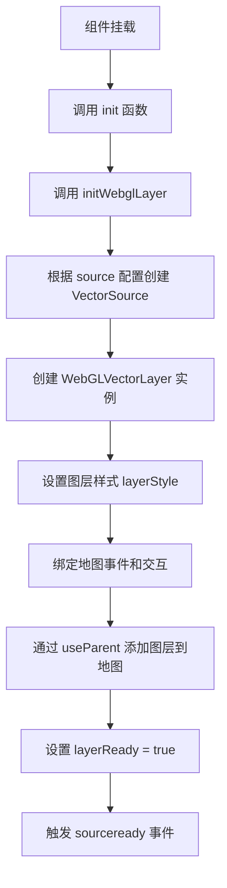
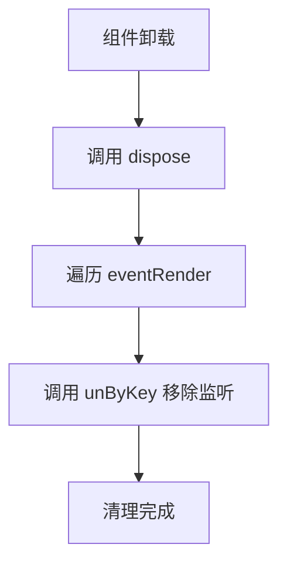

# WebGL 矢量图层 API

<cite>
**本文档引用的文件**  
- [index.vue](file://src/packages/layers/WebGLVector/index.vue#L1-L105)
- [index.ts](file://src/packages/layers/WebGLVector/index.ts#L1-L7)
- [vector.ts](file://src/packages/hooks/vector.ts#L1-L303)
- [Vector.ts](file://src/packages/types/Vector.ts#L1-L49)
</cite>

## 目录
1. [简介](#简介)
2. [项目结构](#项目结构)
3. [核心组件](#核心组件)
4. [架构概览](#架构概览)
5. [详细组件分析](#详细组件分析)
6. [依赖分析](#依赖分析)
7. [性能考量](#性能考量)
8. [故障排除指南](#故障排除指南)
9. [结论](#结论)

## 简介
本文档旨在为 `OlWebglVector` 组件提供完整的 API 文档，涵盖其功能特性、样式配置、属性绑定机制以及 WebGL 渲染在大数据量下的性能优势。文档将详细说明如何通过 `features`、`style` 和 `attributes` 等 `props` 配置矢量图层，并解释 WebGL 着色器变量与渲染样式的定义方式。同时，提供点、线、面要素的渲染示例，阐述颜色映射、大小变换等可视化技术，并给出 GPU 内存优化与帧率提升的实践建议，最后对比 Canvas 与 WebGL 模式的适用场景。

## 项目结构
`OlWebglVector` 组件位于 `/src/packages/layers/WebGLVector/` 目录下，是 OpenLayers 地图库中用于高性能矢量渲染的核心组件之一。该组件采用 Vue 3 的组合式 API（`<script setup>`）编写，通过 `useVectorLayer` 和 `useBaseLayer` 等自定义 Hook 实现功能解耦。主要文件包括：
- `index.vue`：组件主文件，定义了组件的逻辑与生命周期。
- `index.ts`：组件的安装模块，用于在 Vue 应用中全局注册。
- `vector.ts`：位于 `hooks` 目录下的核心逻辑 Hook，封装了图层初始化、事件监听、交互控制等通用功能。
- `Vector.ts`：位于 `types` 目录下的类型定义文件，明确了 `VectorLayerOptions`、`WebGLStyle` 等关键接口。



**图源**
- [index.vue](file://src/packages/layers/WebGLVector/index.vue#L1-L105)
- [vector.ts](file://src/packages/hooks/vector.ts#L1-L303)
- [Vector.ts](file://src/packages/types/Vector.ts#L1-L49)

**本节来源**
- [index.vue](file://src/packages/layers/WebGLVector/index.vue#L1-L105)
- [vector.ts](file://src/packages/hooks/vector.ts#L1-L303)

## 核心组件
`OlWebglVector` 是一个基于 OpenLayers 的 `WebGLVectorLayer` 封装的 Vue 组件，专为处理大规模矢量数据而设计。其核心功能包括：
- **高性能渲染**：利用 WebGL 在 GPU 上直接渲染矢量要素，显著提升大数据量下的帧率。
- **灵活的样式配置**：支持通过 `layerStyle` 和 `featureStyle` 属性定义全局或单个要素的渲染样式。
- **动态属性绑定**：通过 `attributes` 机制实现要素属性与着色器变量的动态绑定，支持数据驱动的可视化。
- **交互支持**：集成 `modify` 和 `translate` 交互，允许用户编辑要素几何。

组件通过 `props` 接收配置，关键 `props` 包括：
- `layerId`：图层唯一标识。
- `visible`：图层可见性。
- `source`：矢量数据源配置，支持 GeoJSON、EsriJSON 等格式。
- `layerStyle`：图层的 WebGL 样式对象，定义着色器变量和渲染规则。
- `featureStyle`：用于传统 Canvas 渲染的要素样式函数（当不使用 WebGL 时）。
- `modify` 和 `translate`：布尔值，控制是否启用修改和移动交互。



**图源**
- [index.vue](file://src/packages/layers/WebGLVector/index.vue#L1-L105)
- [Vector.ts](file://src/packages/types/Vector.ts#L1-L49)

**本节来源**
- [index.vue](file://src/packages/layers/WebGLVector/index.vue#L1-L105)
- [Vector.ts](file://src/packages/types/Vector.ts#L1-L49)

## 架构概览
`OlWebglVector` 组件的架构遵循分层设计原则，将 UI、逻辑和数据分离。其工作流程如下：
1. **组件初始化**：在 `onMounted` 钩子中调用 `init` 函数。
2. **图层创建**：`init` 函数调用 `useVectorLayer` 中的 `initWebglLayer` 方法。
3. **数据源构建**：根据 `props.source` 配置创建 `VectorSource` 实例。
4. **WebGL 图层实例化**：使用 `VectorSource` 和 `props.layerStyle` 创建 `WebGLVectorLayer`。
5. **事件与交互绑定**：注册地图事件（如点击、悬停）和交互功能（如修改、移动）。
6. **图层添加**：通过 `useParent` 将创建的图层添加到地图中。



**图源**
- [index.vue](file://src/packages/layers/WebGLVector/index.vue#L1-L105)
- [vector.ts](file://src/packages/hooks/vector.ts#L1-L303)

**本节来源**
- [index.vue](file://src/packages/layers/WebGLVector/index.vue#L1-L105)
- [vector.ts](file://src/packages/hooks/vector.ts#L1-L303)

## 详细组件分析

### 组件初始化与生命周期
`OlWebglVector` 组件的生命周期由 `onMounted` 和 `onBeforeUnmount` 钩子管理。组件挂载时调用 `init` 函数进行初始化，卸载前调用 `dispose` 函数清理资源。

#### 初始化流程


**图源**
- [index.vue](file://src/packages/layers/WebGLVector/index.vue#L1-L105)
- [vector.ts](file://src/packages/hooks/vector.ts#L1-L303)

#### 资源清理
`dispose` 函数负责移除所有事件监听器，防止内存泄漏。



**图源**
- [vector.ts](file://src/packages/hooks/vector.ts#L1-L303)

**本节来源**
- [index.vue](file://src/packages/layers/WebGLVector/index.vue#L1-L105)
- [vector.ts](file://src/packages/hooks/vector.ts#L1-L303)

### 样式与属性配置

#### WebGL 样式 (layerStyle)
`layerStyle` 是一个 `WebGLStyle` 类型的对象，它定义了 WebGL 渲染的着色器变量和渲染规则。其结构遵循 OpenLayers 的 `flat style` 规范，可以包含 `variables`（变量映射）和 `circle`, `stroke`, `fill` 等绘制指令。

**示例：基于属性的点大小和颜色映射**
```ts
const webglStyle = {
  variables: {
    "size": ["get", "magnitude"], // 从要素属性获取 magnitude 值
    "color": ["get", "category"]    // 从要素属性获取 category 值
  },
  "circle-radius": ["*", ["var", "size"], 2], // 半径 = magnitude * 2
  "circle-fill-color": [
    "case",
    ["==", ["var", "color"], 1], "red",
    ["==", ["var", "color"], 2], "blue",
    "green" // 默认颜色
  ]
};
```

#### 动态属性绑定 (attributes)
`attributes` 机制通过 `variables` 实现。在 `layerStyle` 中定义的 `variables` 会自动从要素的属性（`feature.getProperties()`）中查找对应值。这些值在渲染时被传递给 WebGL 着色器，实现数据驱动的动态可视化。

**优势**：避免了为每个要素创建独立的样式对象，极大减少了 CPU 开销，是 WebGL 高性能的关键。

**本节来源**
- [vector.ts](file://src/packages/hooks/vector.ts#L1-L303)
- [Vector.ts](file://src/packages/types/Vector.ts#L1-L49)

### 点、线、面要素渲染示例

#### 点要素 (圆形)
```ts
{
  "circle-radius": 8,
  "circle-fill-color": "rgba(255, 0, 0, 0.7)",
  "circle-stroke-color": "#fff",
  "circle-stroke-width": 2
}
```

#### 线要素
```ts
{
  "stroke-color": "#3399CC",
  "stroke-width": 3,
  "stroke-line-cap": "round",
  "stroke-line-join": "round"
}
```

#### 面要素 (多边形)
```ts
{
  "fill-color": "rgba(255, 255, 0, 0.3)",
  "stroke-color": "#3399CC",
  "stroke-width": 2
}
```

**本节来源**
- [vector.ts](file://src/packages/hooks/vector.ts#L1-L303)

## 依赖分析
`OlWebglVector` 组件依赖于多个内部和外部模块，形成了清晰的依赖链。

```mermaid
graph TD
OlWebglVector --> useVectorLayer
OlWebglVector --> useBaseLayer
OlWebglVector --> useParent
useVectorLayer --> VectorSource
useVectorLayer --> WebGLVectorLayer
useVectorLayer --> Modify
useVectorLayer --> Select
useVectorLayer --> Translate
useVectorLayer --> setFeatureStyle
useVectorLayer --> OlMap
useBaseLayer --> VectorLayer
useParent --> OlMap
OlWebglVector -.-> Vector_ts : "类型定义"
useVectorLayer -.-> Style_ts : "类型定义"
```

**图源**
- [index.vue](file://src/packages/layers/WebGLVector/index.vue#L1-L105)
- [vector.ts](file://src/packages/hooks/vector.ts#L1-L303)
- [baseLayer.ts](file://src/packages/layers/baseLayer.ts)
- [parent.ts](file://src/packages/hooks/parent.ts)

**本节来源**
- [index.vue](file://src/packages/layers/WebGLVector/index.vue#L1-L105)
- [vector.ts](file://src/packages/hooks/vector.ts#L1-L303)

## 性能考量
### WebGL 的性能优势
在大数据量（如数万甚至数十万要素）下，WebGL 模式相比 Canvas 模式具有显著优势：
- **GPU 加速**：渲染计算由 GPU 执行，释放 CPU 资源。
- **批处理渲染**：WebGL 可以一次性提交大量几何数据进行渲染，减少绘制调用（draw calls）。
- **高效更新**：通过 `attributes` 机制，仅需更新变化的属性值，无需重绘整个图层。

### 实践建议
1. **避免 GPU 内存溢出**：
   - 分页加载数据，避免一次性加载过多要素。
   - 及时清理不再使用的图层和数据源（调用 `dispose`）。
   - 监控浏览器内存使用情况。
2. **优化帧率**：
   - 使用 `variables` 和 `attributes` 进行数据驱动渲染，避免复杂的 JavaScript 样式函数。
   - 简化着色器逻辑，避免过于复杂的条件判断。
   - 在低缩放级别使用聚合（cluster）或简化几何。

### Canvas 与 WebGL 的适用边界
- **Canvas 模式**：适用于要素数量较少（< 10,000）、样式复杂多变、需要精细控制每个要素渲染逻辑的场景。兼容性好。
- **WebGL 模式**：适用于要素数量巨大、需要流畅交互（如平移、缩放）、追求高帧率的场景。是大数据量矢量可视化的首选。

**本节来源**
- [vector.ts](file://src/packages/hooks/vector.ts#L1-L303)

## 故障排除指南
- **要素不显示**：检查 `layerStyle` 是否正确配置，确保 `layerStyle` 对象不为空。控制台会输出警告 `图层-${props.layerId}没有设置样式参数【layer-style】...`。
- **交互不生效**：确保 `props.modify` 或 `props.translate` 为 `true`，并且图层已正确添加到地图。
- **数据加载失败**：检查 `source.url` 是否正确，网络请求是否成功，`featureFormat` 是否与数据格式匹配。
- **内存泄漏**：确保组件卸载时 `dispose` 函数被调用，以移除事件监听器。

**本节来源**
- [index.vue](file://src/packages/layers/WebGLVector/index.vue#L1-L105)
- [vector.ts](file://src/packages/hooks/vector.ts#L1-L303)

## 结论
`OlWebglVector` 组件通过封装 OpenLayers 的 `WebGLVectorLayer`，为 Vue 应用提供了高性能的矢量数据渲染能力。其核心优势在于利用 WebGL 实现 GPU 加速，并通过 `attributes` 机制实现高效的动态属性绑定。通过合理配置 `layerStyle`，可以实现丰富的数据可视化效果。在处理大规模地理数据时，`OlWebglVector` 是提升用户体验和应用性能的关键组件。开发者应根据数据量和性能需求，选择合适的渲染模式（Canvas 或 WebGL），并遵循最佳实践以优化性能。