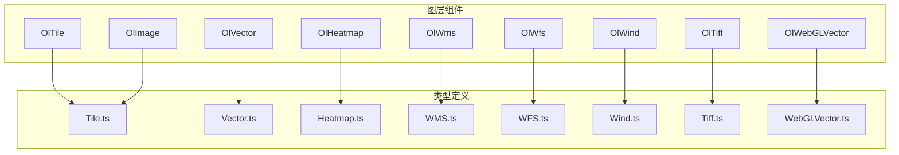
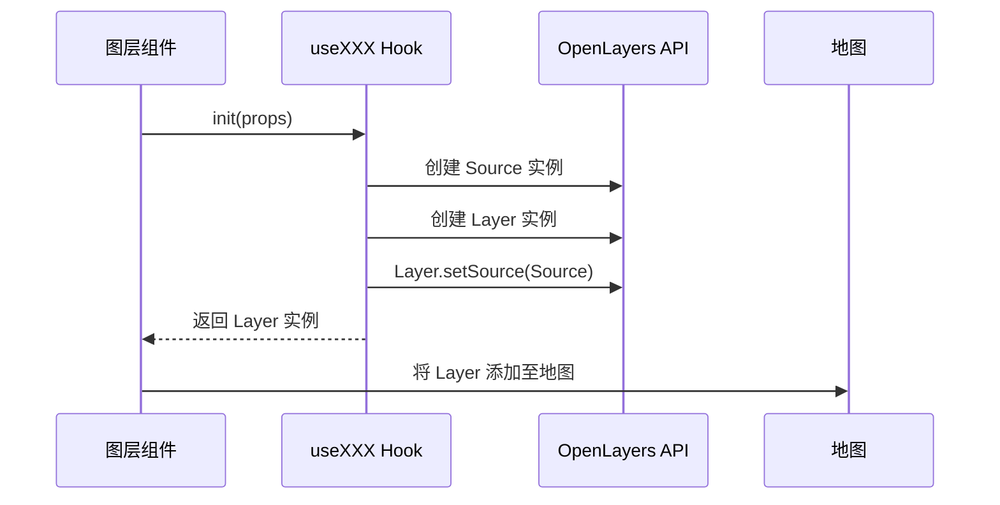
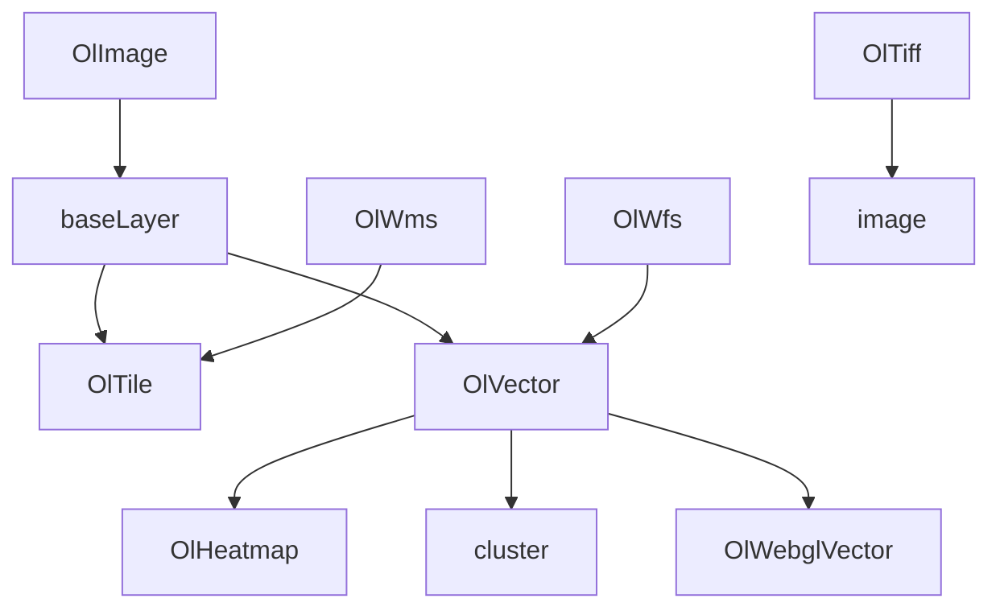

# 图层组件 API

<cite>
**本文档引用文件**  
- [OlTile.vue](file://src/packages/layers/tile/index.vue)
- [OlVector.vue](file://src/packages/layers/vector/index.vue)
- [OlHeatmap.vue](file://src/packages/layers/heatmap/index.vue)
- [OlWms.vue](file://src/packages/layers/wms/index.vue)
- [OlWfs.vue](file://src/packages/layers/wfs/index.vue)
- [OlWind.vue](file://src/packages/layers/wind/index.vue)
- [OlTiff.vue](file://src/packages/layers/tiff/index.vue)
- [OlWebGLVector.vue](file://src/packages/layers/WebGLVector/index.vue)
- [OlImage.vue](file://src/packages/layers/image/index.vue)
- [useTile.ts](file://src/packages/layers/tile/useTile.ts)
- [Tile.ts](file://src/packages/types/Tile.ts)
- [Vector.ts](file://src/packages/types/Vector.ts)
- [Heatmap.ts](file://src/packages/types/Heatmap.ts)
- [WMS.ts](file://src/packages/types/WMS.ts)
- [WFS.ts](file://src/packages/types/WFS.ts)
- [Wind.ts](file://src/packages/types/Wind.ts)
- [Tiff.ts](file://src/packages/types/Tiff.ts)
- [WebGLVector.ts](file://src/packages/types/WebGLVector.ts)
- [baseLayer/index.ts](file://src/packages/layers/baseLayer/index.ts)
- [hooks/parent.ts](file://src/packages/hooks/parent.ts)
</cite>

## 更新摘要
**所做更改**  
- 更新了图层组件的 layerId 默认值说明，从自动生成的 nanoid 改为用户可控的空字符串
- 新增了层 ID 管理和自定义 ID 支持的相关说明
- 补充了层 ID 在图层生命周期中的设置时机和使用场景

## 目录
1. [简介](#简介)
2. [项目结构](#项目结构)
3. [核心图层组件概览](#核心图层组件概览)
4. [图层架构与集成机制](#图层架构与集成机制)
5. [详细组件分析](#详细组件分析)
6. [依赖关系分析](#依赖关系分析)
7. [性能特征与适用场景对比](#性能特征与适用场景对比)
8. [高级配置示例](#高级配置示例)
9. [错误处理与异步加载](#错误处理与异步加载)
10. [层 ID 管理与自定义控制](#层-id-管理与自定义控制)
11. [总结](#总结)

## 简介
本文档旨在为 `v3-ol-map` 项目中的图层组件提供全面的 API 文档。涵盖 `OlTile`、`OlVector`、`OlHeatmap`、`OlWms`、`OlWfs`、`OlWind`、`OlTiff`、`OlWebglVector` 和 `OlImage` 等核心图层组件，详细说明其属性（props）、事件（emits）、插槽（slots）的使用方式，并深入解析其与 OpenLayers 源对象的集成机制、异步加载流程及错误处理策略。通过本指南，开发者可深入了解各图层的技术实现，优化性能表现，并根据实际需求选择合适的图层类型。

## 项目结构
项目采用模块化设计，图层相关组件集中存放于 `src/packages/layers` 目录下，每个图层类型拥有独立的子目录，包含 `.vue` 组件文件和 `.ts` 类型定义或逻辑封装文件。整体结构清晰，便于维护和扩展。



**图源**
- [index.vue](file://src/packages/layers/tile/index.vue)
- [Vector.ts](file://src/packages/types/Vector.ts)

**本节来源**
- [src/packages/layers](file://src/packages/layers)

## 核心图层组件概览
本项目提供多种图层组件以满足不同地理数据可视化需求，包括瓦片图层、矢量图层、热力图、WMS/WFS 服务图层、风场图层、TIFF 栅格图层、高性能 WebGL 矢量图层以及图像图层。

**本节来源**
- [components.ts](file://src/packages/components.ts#L67)

## 图层架构与集成机制
所有图层组件均继承自一个基础图层结构（`baseLayer`），通过组合 `useXXX` 系列组合式函数（如 `useTile`、`useVector`）来实现与 OpenLayers 底层对象的集成。组件通过 `props` 接收配置，初始化时调用对应 Hook 创建 OpenLayers 的 `Layer` 和 `Source` 实例，并将其添加到地图容器中。



**图源**
- [index.vue](file://src/packages/layers/tile/index.vue#L15-L25)
- [useTile.ts](file://src/packages/layers/tile/useTile.ts)

## 详细组件分析

### OlTile 组件分析
`OlTile` 组件用于加载和显示瓦片地图服务，支持天地图（TDT）等常用服务。

#### Props 配置项
- **url**: `string` - 瓦片服务的请求地址模板。
- **layer**: `string` - 图层标识，用于区分不同瓦片图层。
- **sourceOptions**: `Object` - 传递给 OpenLayers `TileSource` 构造函数的额外选项。
- **visible**: `boolean` - 图层是否可见，默认为 `true`。
- **tileType**: `string` - 瓦片服务类型（如 "TDT"），决定使用何种预设配置。
- **layerId**: `string` - 图层唯一标识符，默认为空字符串，支持用户自定义。

#### Emits 事件
- **rendercomplete**: 当图层完成渲染时触发。
- **error**: 当图层加载过程中发生错误时触发。

#### Slots 机制
- **默认插槽**: 在图层成功初始化并渲染后激活，可用于嵌套其他依赖此图层的组件。

#### 实现逻辑
组件通过 `useTileLayer` Hook 初始化瓦片图层。`onMounted` 钩子中调用 `init()` 方法创建图层，`watch` 监听 `tileType` 和 `source` 的变化以动态重置图层。

**本节来源**
- [index.vue](file://src/packages/layers/tile/index.vue)
- [useTile.ts](file://src/packages/layers/tile/useTile.ts)
- [Tile.ts](file://src/packages/types/Tile.ts)

### OlVector 组件分析
`OlVector` 组件用于加载和显示矢量数据（点、线、面）。

#### Props 配置项
- **url**: `string` - GeoJSON、TopoJSON 等矢量数据的 URL。
- **features**: `Feature[]` - 直接传入的矢量要素数组。
- **sourceOptions**: `VectorSourceOptions` - 向量源配置选项。
- **style**: `Style | StyleFunction` - 定义矢量要素的样式。
- **cluster**: `boolean` - 是否启用聚类。
- **layerId**: `string` - 图层唯一标识符，默认为空字符串，支持用户自定义。

#### Emits 事件
- **rendercomplete**: 矢量数据加载并渲染完成后触发。
- **error**: 数据加载失败时触发。

#### Slots 机制
- **feature**: 作用域插槽，为每个矢量要素提供自定义内容渲染能力。插槽参数包含当前要素 `feature`。

#### 实现逻辑
组件内部创建 `VectorSource` 和 `VectorLayer`，支持从 URL 异步加载数据或直接使用传入的 `features`。通过 `style` prop 实现样式动态绑定。

**本节来源**
- [index.vue](file://src/packages/layers/vector/index.vue)
- [Vector.ts](file://src/packages/types/Vector.ts)

### OlHeatmap 组件分析
`OlHeatmap` 组件基于矢量数据生成热力图效果。

#### Props 配置项
- **weight**: `string` - 指定要素属性中用于表示权重的字段名。
- **radius**: `number` - 热点半径（像素）。
- **blur**: `number` - 模糊程度。
- **gradient**: `string[]` - 渐变色数组。
- **features**: `Feature[]` - 用于生成热力图的点要素数组。
- **layerId**: `string` - 图层唯一标识符，默认为空字符串，支持用户自定义。

#### 实现逻辑
继承自 `OlVector`，使用 `HeatmapLayer` 替代普通 `VectorLayer`，并配置相应的热力图参数。

**本节来源**
- [index.vue](file://src/packages/layers/heatmap/index.vue)
- [Heatmap.ts](file://src/packages/types/Heatmap.ts)

### OlWms 组件分析
`OlWms` 组件用于加载 WMS（Web Map Service）地图服务。

#### Props 配置项
- **url**: `string` - WMS 服务地址。
- **layers**: `string` - 要请求的图层名称，多个用逗号分隔。
- **params**: `Object` - WMS 请求的额外参数（如 `TRANSPARENT`, `FORMAT`）。
- **serverType**: `string` - WMS 服务器类型（如 'geoserver'），影响请求构造。

#### 实现逻辑
使用 `TileWMS` 作为数据源，`ImageWMS` 可用于单张图片请求。`sourceOptions` 可覆盖默认行为。

**本节来源**
- [index.vue](file://src/packages/layers/wms/index.vue)
- [WMS.ts](file://src/packages/types/WMS.ts)

### OlWfs 组件分析
`OlWfs` 组件用于加载 WFS（Web Feature Service）矢量数据。

#### Props 配置项
- **url**: `string` - WFS 服务地址。
- **typeName**: `string` - 要请求的要素类型名称。
- **outputFormat**: `string` - 响应格式（如 'application/json'）。
- **maxFeatures**: `number` - 最大返回要素数量。

#### 实现逻辑
使用 `VectorSource` 配合 `WFS` `format` 从 WFS 服务获取 GeoJSON 格式的矢量数据，并显示在 `VectorLayer` 上。

**本节来源**
- [index.vue](file://src/packages/layers/wfs/index.vue)
- [WFS.ts](file://src/packages/types/WFS.ts)

### OlWind 组件分析
`OlWind` 组件用于可视化风场数据。

#### Props 配置项
- **data**: `Object` - 风场数据，通常为包含 `u`、`v` 分量的网格数据。
- **velocityScale**: `number` - 风速缩放因子。
- **colorScale**: `string` - 风速颜色映射。

#### 实现逻辑
解析风场数据，计算风向和风速，并使用特定的渲染算法（如粒子追踪）在 Canvas 或 WebGL 上绘制动态风场效果。

**本节来源**
- [index.vue](file://src/packages/layers/wind/index.vue)
- [Wind.ts](file://src/packages/types/Wind.ts)

### OlTiff 组件分析
`OlTiff` 组件用于加载和渲染 GeoTIFF 栅格数据。

#### Props 配置项
- **sources**: `GeoTiffSourceOptions[]` - TIFF 数据源配置数组，支持多波段。
- **projection**: `string` - TIFF 数据的坐标系。
- **clampValues**: `boolean` - 是否限制像素值范围。
- **layerId**: `string` - 图层唯一标识符，默认为空字符串，支持用户自定义。

#### 实现逻辑
利用 `geotiff.js` 库解析 TIFF 文件，提取像素数据和地理信息，通过 `DataTile` 源或 WebGL 渲染到 `RasterLayer` 上。

**本节来源**
- [index.vue](file://src/packages/layers/tiff/index.vue)
- [Tiff.ts](file://src/packages/types/Tiff.ts)

### OlWebglVector 组件分析
`OlWebglVector` 组件利用 WebGL 实现海量矢量数据的高性能渲染。

#### Props 配置项
- **features**: `Feature[]` - 矢量要素数据。
- **style**: `WebGLStyle` - WebGL 专用的样式定义，性能远高于普通 `Style`。
- **dynamic**: `boolean` - 是否启用动态更新。
- **layerId**: `string` - 图层唯一标识符，默认为空字符串，支持用户自定义。

#### 实现逻辑
绕过 OpenLayers 的 2D Canvas 渲染管线，直接将矢量数据转换为 WebGL 可处理的顶点和索引缓冲区，在 GPU 上进行渲染，极大提升渲染效率。

**本节来源**
- [index.vue](file://src/packages/layers/WebGLVector/index.vue)
- [WebGLVector.ts](file://src/packages/types/WebGLVector.ts)

### OlImage 组件分析
`OlImage` 组件用于加载和显示单张图像数据。

#### Props 配置项
- **source**: `ImageLayerOptions` - 图像图层配置，包括 `url`、`crossOrigin`、`projection` 等。
- **visible**: `boolean` - 图层是否可见，默认为 `true`。
- **layerId**: `string` - 图层唯一标识符，默认为空字符串，支持用户自定义。

#### Emits 事件
- **rendercomplete**: 图像加载并渲染完成后触发。
- **error**: 图像加载失败时触发。

#### 实现逻辑
使用 `ImageLayer` 显示静态图像，支持跨域加载和投影变换。

**本节来源**
- [index.vue](file://src/packages/layers/image/index.vue)
- [Tile.ts](file://src/packages/types/Tile.ts)

## 依赖关系分析
图层组件之间通过 `group` 组件实现逻辑分组，`cluster` 组件依赖于 `OlVector`。各组件高度依赖 `OpenLayers` 核心库，并通过 `types` 目录下的类型定义文件与之解耦，确保类型安全。



**图源**
- [baseLayer/index.ts](file://src/packages/layers/baseLayer/index.ts)
- [group/index.vue](file://src/packages/layers/group/index.vue)

**本节来源**
- [src/packages/layers](file://src/packages/layers)

## 性能特征与适用场景对比
| 图层类型 | 渲染性能 | 数据量承载 | 适用场景 | 备注 |
| :--- | :--- | :--- | :--- | :--- |
| **OlTile** | 高 | 高 | 在线底图、影像图 | 预生成瓦片，加载快 |
| **OlVector** | 中 | 低-中 | 少量矢量数据、交互式编辑 | DOM 操作多，性能随数据量下降 |
| **OlHeatmap** | 中 | 中 | 点数据密度可视化 | 基于 Canvas 渲染 |
| **OlWms** | 高 | 高 | 动态地图服务 | 服务端渲染，客户端仅显示图片 |
| **OlWfs** | 低 | 低 | 获取矢量要素数据 | 数据量大时易阻塞 |
| **OlWind** | 中 | 中 | 动态风场模拟 | 动画渲染消耗资源 |
| **OlTiff** | 中-高 | 高 | 科学栅格数据（高程、温度） | 依赖浏览器解析能力 |
| **OlWebglVector** | 极高 | 极高 | 海量矢量数据（>10万点） | 利用 GPU，性能最佳 |
| **OlImage** | 高 | 低 | 单张图像叠加 | 静态图像，加载快 |

## 高级配置示例

### 跨域 TIFF 加载
```vue
<OlTiff :sources="[
  { 
    url: 'https://cors-enabled-server.com/data/elevation.tif',
    layerId: 'custom-tiff-layer-001',
    // 启用跨域请求
    crossOrigin: 'anonymous',
    // 指定数据范围
    clampValues: true,
    min: 0,
    max: 5000 
  }
]" />
```

### WebGL 渲染优化
```vue
<OlWebglVector 
  :features="massiveFeatures" 
  :style="{
    'circle-radius': 3,
    'circle-fill-color': ['interpolate', ['linear'], ['get', 'value'], 0, 'blue', 100, 'red']
  }"
  layerId="optimized-webgl-layer"
  :dynamic="true" />
<!-- 使用插值函数实现动态颜色映射，避免为每个要素创建独立样式 -->
```

### 风场数据格式要求
风场数据需为规则网格（如 NetCDF 解析后的 JSON），包含 `u` (东向风速) 和 `v` (北向风速) 分量：
```json
{
  "u": [[1.2, 1.5, ...], [...]], // 二维数组
  "v": [[-0.8, -1.0, ...], [...]],
  "width": 360,
  "height": 180,
  "extent": [xmin, ymin, xmax, ymax]
}
```

**本节来源**
- [OlTiff.vue](file://src/packages/layers/tiff/index.vue)
- [WebGLVector.vue](file://src/packages/layers/WebGLVector/index.vue)
- [Wind.vue](file://src/packages/layers/wind/index.vue)

## 错误处理与异步加载
所有图层组件均通过 `onMounted` 钩子异步初始化。数据加载（如 `url` 请求）在 `useXXX` 函数中进行，通常返回 `Promise`。组件内部通过 `try-catch` 捕获错误，并通过 `emits` 触发 `error` 事件，通知上层应用进行处理。例如，`OlVector` 在 `fetch` GeoJSON 失败时会发出 `error` 事件。

**本节来源**
- [useTile.ts](file://src/packages/layers/tile/useTile.ts)
- [OlVector.vue](file://src/packages/layers/vector/index.vue)

## 层 ID 管理与自定义控制

### layerId 默认值变更
**重要更新**：所有图层组件的 `layerId` 默认值已从自动生成的 `nanoid` 改为用户可控的空字符串 `""`。

#### 变更详情
- **OlTile**: `layerId: ""`（原自动生成）
- **OlVector**: `layerId: ""`（原自动生成）
- **OlHeatmap**: `layerId: ""`（原自动生成）
- **OlTiff**: `layerId: ""`（原自动生成）
- **OlWebGLVector**: `layerId: ""`（原自动生成）
- **OlImage**: `layerId: ""`（原自动生成）

#### 设置时机
各组件在初始化时会根据以下逻辑设置层 ID：
```typescript
const layerId = props.layerId || `${layerType}-layer-${nanoid()}`
```

当用户未提供 `layerId` 时，系统会自动生成唯一的 ID；当用户提供自定义 ID 时，将使用用户指定的值。

#### 自定义 ID 使用场景
1. **图层识别与管理**：通过自定义 ID 方便在地图中定位和操作特定图层
2. **状态持久化**：保存用户偏好设置时使用稳定的图层标识
3. **调试与日志**：便于开发和运维过程中的问题排查
4. **动态图层控制**：根据 ID 进行图层的显示/隐藏、删除等操作

#### 实际应用示例
```vue
<!-- 自定义层 ID 示例 -->
<OlVector 
  :features="points" 
  layerId="custom-vector-layer-001"
  :visible="true" />

<OlTiff 
  :sources="tiffSources" 
  layerId="elevation-data-layer"
  :opacity="0.8" />

<OlWebGLVector 
  :features="hugeDataset" 
  layerId="performance-critical-layer"
  :dynamic="true" />
```

#### 与父组件通信
图层组件通过 `useParent` hook 将图层添加到地图或图层组中时，会使用设置的 ID 进行标识和管理。

**本节来源**
- [OlImage.vue](file://src/packages/layers/image/index.vue#L14-L40)
- [OlTiff.vue](file://src/packages/layers/tiff/index.vue#L16-L35)
- [OlVector.vue](file://src/packages/layers/vector/index.vue#L16-L76)
- [OlHeatmap.vue](file://src/packages/layers/heatmap/index.vue#L19-L96)
- [OlWebGLVector.vue](file://src/packages/layers/WebGLVector/index.vue#L16-L75)
- [OlTile.vue](file://src/packages/layers/tile/index.vue#L10-L14)
- [hooks/parent.ts](file://src/packages/hooks/parent.ts#L24-L47)

## 总结
本文档系统地介绍了 `v3-ol-map` 项目中的各类图层组件。开发者应根据数据类型、数据量大小、性能要求和交互需求选择合适的图层。对于静态底图，优先使用 `OlTile` 或 `OlWms`；对于少量交互式矢量数据，使用 `OlVector`；对于海量数据或复杂可视化（如热力图、风场、TIFF），应考虑 `OlWebglVector`、`OlHeatmap`、`OlWind` 或 `OlTiff` 等专用组件以获得最佳性能和用户体验。

**重要提示**：新版本中所有图层的 `layerId` 默认值已改为用户可控的空字符串，建议开发者为重要的业务图层设置明确的自定义 ID，以便更好地进行图层管理和维护。