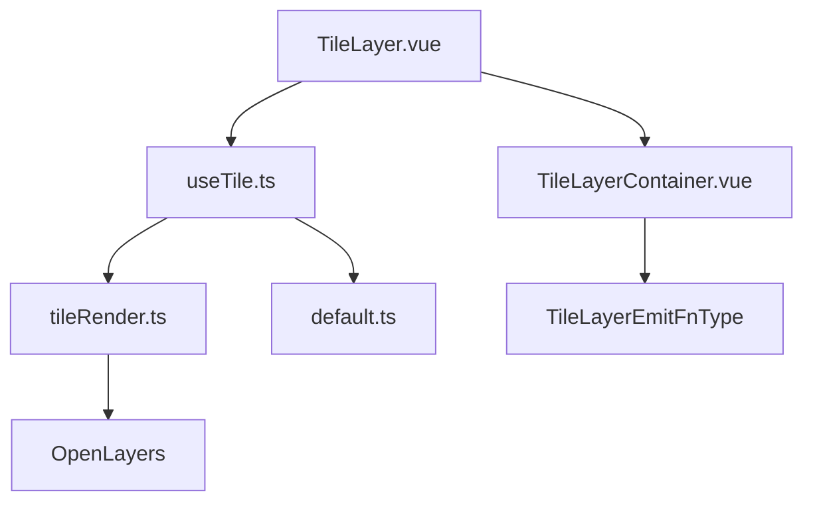
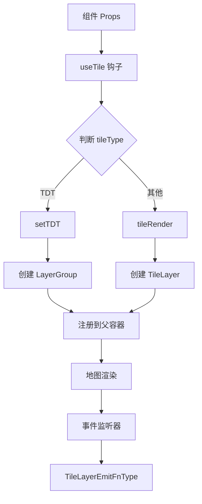
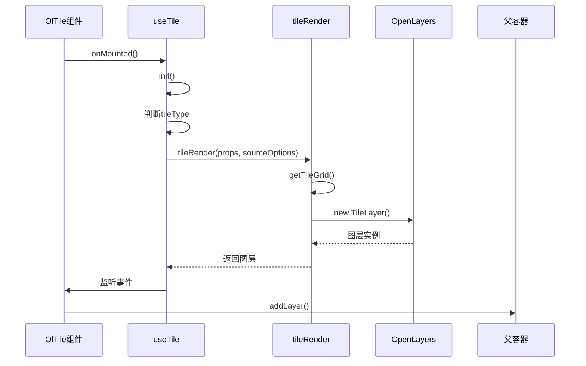
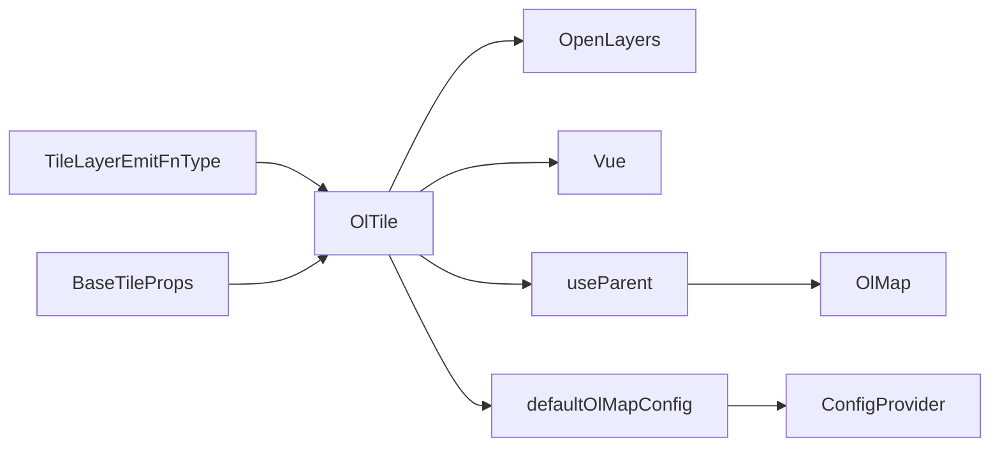

# 瓦片图层 API

<cite>
**本文档引用文件**  
- [TileLayer.vue](file://src/packages/layers/tile/TileLayer.vue#L1-L22)
- [TileLayerContainer.vue](file://src/packages/layers/tile/index.vue#L1-L64)
- [TDTLayer.vue](file://src/packages/layers/tile/TDTLayer.vue#L1-L13)
- [tileRender.ts](file://src/packages/layers/tile/tileRender.ts#L1-L97)
- [useTile.ts](file://src/packages/hooks/tile.ts#L1-L337)
- [Tile.ts](file://src/packages/types/Tile.ts#L1-L74)
- [default.ts](file://src/packages/default.ts#L1-L164)
- [index.ts](file://src/packages/layers/tile/index.ts#L1-L7)
</cite>

## 更新摘要
**变更内容**  
- 新增 `TileLayerEmitFnType` 接口定义，提供严格的事件类型安全
- 更新事件机制章节，详细说明 `sourceready` 和 `change:visible` 事件
- 完善事件监听器的类型定义和使用方式
- 增强组件事件系统的类型安全性

## 目录
1. [简介](#简介)
2. [项目结构](#项目结构)
3. [核心组件](#核心组件)
4. [架构概览](#架构概览)
5. [详细组件分析](#详细组件分析)
6. [依赖分析](#依赖分析)
7. [性能考虑](#性能考虑)
8. [故障排除指南](#故障排除指南)
9. [结论](#结论)

## 简介
本文档详细说明 `OlTile` 组件的 API 设计与实现机制，涵盖其属性配置、事件机制、插槽使用、异步加载流程及多源地图服务接入方式。重点解析基于 OpenLayers 的瓦片图层封装逻辑，包括天地图、百度地图、高德地图等主流地图服务的支持方案。

**更新** 新增 `TileLayerEmitFnType` 接口，提供严格的事件类型安全保证，确保开发者能够获得准确的事件参数类型提示。

## 项目结构
`OlTile` 组件位于 `/src/packages/layers/tile/` 目录下，主要由以下文件构成：
- `TileLayer.vue`：核心瓦片图层组件，负责图层创建与注册
- `TileLayerContainer.vue`：瓦片图层容器，包含事件处理逻辑
- `TDTLayer.vue`：天地图专用图层容器，组合多个子图层
- `tileRender.ts`：图层渲染工厂函数，支持多种图层类型
- `useTile.ts`：组合式 API 钩子，处理图层初始化逻辑
- `index.ts`：模块导出入口
- `index.vue`：图层容器模板

该结构采用分层设计，将图层逻辑与渲染逻辑分离，提升可维护性。



**图源**  
- [TileLayer.vue](file://src/packages/layers/tile/TileLayer.vue#L1-L22)
- [useTile.ts](file://src/packages/hooks/tile.ts#L1-L337)
- [tileRender.ts](file://src/packages/layers/tile/tileRender.ts#L1-L97)
- [Tile.ts](file://src/packages/types/Tile.ts#L63-L66)

**本节来源**  
- [TileLayer.vue](file://src/packages/layers/tile/TileLayer.vue#L1-L22)
- [TileLayerContainer.vue](file://src/packages/layers/tile/index.vue#L1-L64)
- [TDTLayer.vue](file://src/packages/layers/tile/TDTLayer.vue#L1-L13)

## 核心组件
`OlTile` 的核心功能由 `useTile` 钩子驱动，通过 `tileRender` 工厂函数生成具体图层实例。组件支持通过 `sourceOptions` 自定义 OpenLayers 的 `TileSource` 配置，并可通过 `tileGrid` 和 `tileUrlFunction` 实现投影与 URL 模板的灵活控制。

关键类型定义位于 `Tile.ts`，包括 `BaseTileProps`、`SourceOptions`、`TileLayerEmitFnType` 等接口，确保类型安全。

**更新** 新增 `TileLayerEmitFnType` 接口，提供严格的事件类型定义，确保事件监听器的类型安全。

**本节来源**  
- [useTile.ts](file://src/packages/hooks/tile.ts#L1-L337)
- [Tile.ts](file://src/packages/types/Tile.ts#L1-L74)

## 架构概览
`OlTile` 组件采用组合式 API 架构，通过 Vue 的 `inject/provide` 机制获取全局地图配置，利用 `shallowRef` 管理图层状态，并通过 `watchEffect` 响应属性变化。



**图源**  
- [useTile.ts](file://src/packages/hooks/tile.ts#L1-L337)
- [tileRender.ts](file://src/packages/layers/tile/tileRender.ts#L1-L97)
- [Tile.ts](file://src/packages/types/Tile.ts#L63-L66)

## 详细组件分析

### OlTile 组件分析

#### 属性配置（Props）
`OlTile` 组件通过 `BaseTileProps` 接口定义属性，关键字段如下：

**: 属性列表**
- **url**: 图层 URL 模板，支持 `{x}`, `{y}`, `{z}` 占位符
- **layerId**: 图层唯一标识
- **visible**: 图层可见性，默认为 `true`
- **tileType**: 图层类型枚举，如 `天地图`, `百度-矢量` 等
- **source**: 源配置对象，继承自 OpenLayers 的 `TileSource` 选项
- **sourceOptions**: 源配置对象，继承自 OpenLayers 的 `TileSource` 选项
- **tileGrid**: 自定义瓦片网格配置
- **tileUrlFunction**: 自定义瓦片 URL 生成函数

**: 类型定义**
```ts
interface BaseTileProps extends TileLayerOptions {
  tileType?: TileType;
  layerId?: string;
  source?: SourceOptions | undefined;
}
```

#### 事件机制（Emitted Events）
组件通过 `TileLayerEmitFnType` 接口提供严格的事件类型定义，确保事件监听器的类型安全：

**: 支持的事件**
- **sourceready**: 图层源准备就绪时触发，事件参数类型为 `BaseEvent[]`
- **change:visible**: 图层可见性改变时触发，事件参数类型为 `ObjectEvent[]`

**: 事件监听器类型定义**
```ts
export type TileLayerEmitFnType = {
  (event: "sourceready", ...args: BaseEvent[]): void;
  (event: "change:visible", ...args: ObjectEvent[]): void;
};
```

**: 使用示例**
```vue
<ol-tile 
  :tile-type="tileType" 
  @sourceready="handleSourceReady"
  @change:visible="handleChangeVisible"
/>
```

**: 事件处理函数类型**
```ts
const handleSourceReady = (event: BaseEvent) => {
  console.log('图层源已准备就绪');
};

const handleChangeVisible = (event: ObjectEvent) => {
  console.log('图层可见性已改变');
};
```

#### 插槽（Slots）机制
`OlTile` 支持默认插槽，用于嵌套子组件（如 `OlVector`），实现图层叠加。

**: 使用示例**
```vue
<ol-tile :url="url">
  <ol-vector :features="features" />
</ol-tile>
```

**本节来源**  
- [TileLayer.vue](file://src/packages/layers/tile/TileLayer.vue#L1-L22)
- [TileLayerContainer.vue](file://src/packages/layers/tile/index.vue#L1-L64)
- [Tile.ts](file://src/packages/types/Tile.ts#L1-L74)

### useTile 与 tileRender 实现逻辑

#### 异步加载流程
1. 组件挂载时调用 `init()`
2. 根据 `tileType` 分支处理
3. 调用 `tileRender` 或专用渲染函数（如 `baiduRender`）
4. 创建图层实例并赋值给 `shallowRef`
5. 通过 `useParent` 注册到父容器
6. 监听图层事件并转发给父组件

#### 缓存机制
OpenLayers 内部自动缓存已加载的瓦片，`tileGrid` 配置可优化缓存策略。

#### 错误处理
- 天地图未配置 `ak` 时抛出错误并打印日志
- URL 模板错误导致瓦片加载失败，触发 `error` 事件
- 百度地图个性化地图需要配置 `ak` 参数



**图源**  
- [useTile.ts](file://src/packages/hooks/tile.ts#L1-L337)
- [tileRender.ts](file://src/packages/layers/tile/tileRender.ts#L1-L97)

**本节来源**  
- [useTile.ts](file://src/packages/hooks/tile.ts#L1-L337)
- [tileRender.ts](file://src/packages/layers/tile/tileRender.ts#L1-L97)

### 多源瓦片服务接入示例

#### 天地图
通过 `TDTLayer.vue` 组件自动组合影像与标注图层，需在 `default.ts` 中配置 `ak`。

**: 配置示例**
```ts
const config = {
  tdt: {
    ak: "your-access-key",
  },
};
```

#### 百度地图
使用 `baiduRender` 函数，自定义 `tileUrlFunction` 处理百度特有的 Y 轴翻转。

**: 投影转换**
- 使用 `BD:09` 坐标系
- 原点设置为 `[0, 0]`
- 分辨率数组手动定义

#### 高德地图
直接使用 `tileRender` 工厂函数，传入高德 URL 模板。

**: 跨域配置**
所有外部图层均设置 `crossOrigin: "anonymous"`。

**本节来源**  
- [useTile.ts](file://src/packages/hooks/tile.ts#L1-L337)
- [tileRender.ts](file://src/packages/layers/tile/tileRender.ts#L1-L97)
- [default.ts](file://src/packages/default.ts#L1-L164)

### 瓦片格式支持对比

**: 支持格式对比**
| 格式 | 支持情况 | 说明 |
|------|----------|------|
| XYZ | ✅ | 通用支持，通过 `tileRender` |
| TMS | ⚠️ | 需自定义 `tileGrid` 和 `tileUrlFunction` |
| WMTS | ❌ | 当前未实现 |
| GeoTIFF | ✅ | 通过 `geotiffRender` 支持 |

**: 性能优化建议**
1. 合理配置 `tileGrid` 以减少重复请求
2. 使用 `LayerGroup` 合并相关图层
3. 控制 `z` 层级范围避免过度加载
4. 启用浏览器缓存策略

**本节来源**  
- [tileRender.ts](file://src/packages/layers/tile/tileRender.ts#L1-L97)
- [default.ts](file://src/packages/default.ts#L1-L164)

## 依赖分析
`OlTile` 依赖以下模块：
- OpenLayers 核心类：`TileLayer`, `XYZ`, `TileGrid`
- Vue 组合式 API：`shallowRef`, `watchEffect`, `onMounted`
- 项目内部模块：`useParent`, `defaultOlMapConfig`
- 类型定义：`TileLayerEmitFnType`, `BaseTileProps`



**图源**  
- [useTile.ts](file://src/packages/hooks/tile.ts#L1-L337)
- [tileRender.ts](file://src/packages/layers/tile/tileRender.ts#L1-L97)
- [Tile.ts](file://src/packages/types/Tile.ts#L63-L66)

**本节来源**  
- [useTile.ts](file://src/packages/hooks/tile.ts#L1-L337)
- [tileRender.ts](file://src/packages/layers/tile/tileRender.ts#L1-L97)
- [Tile.ts](file://src/packages/types/Tile.ts#L1-L74)

## 性能考虑
- 使用 `shallowRef` 优化图层对象响应式开销
- `watchEffect` 仅监听必要属性变化
- 图层创建延迟至 `onMounted`，避免重复初始化
- 支持按需加载，通过 `visible` 控制图层显隐
- 事件监听器使用类型安全的 `TileLayerEmitFnType`

## 故障排除指南
- **天地图不显示**：检查 `ak` 是否配置
- **百度地图偏移**：确认 `tileUrlFunction` 中 Y 值已翻转
- **跨域错误**：确保 `crossOrigin` 设置为 `anonymous`
- **投影错误**：检查 `projection` 配置是否匹配数据源
- **事件监听器类型错误**：确保使用 `TileLayerEmitFnType` 接口定义事件处理器

**本节来源**  
- [useTile.ts](file://src/packages/hooks/tile.ts#L1-L337)
- [tileRender.ts](file://src/packages/layers/tile/tileRender.ts#L1-L97)
- [Tile.ts](file://src/packages/types/Tile.ts#L63-L66)

## 结论
`OlTile` 组件通过封装 OpenLayers 的瓦片图层能力，提供了灵活、类型安全的地图服务接入方案。支持主流地图服务商，并具备良好的扩展性与性能表现。新增的 `TileLayerEmitFnType` 接口进一步增强了事件系统的类型安全性，确保开发者能够获得准确的事件参数类型提示。建议在使用时结合 `ConfigProvider` 统一管理地图配置，提升开发效率。