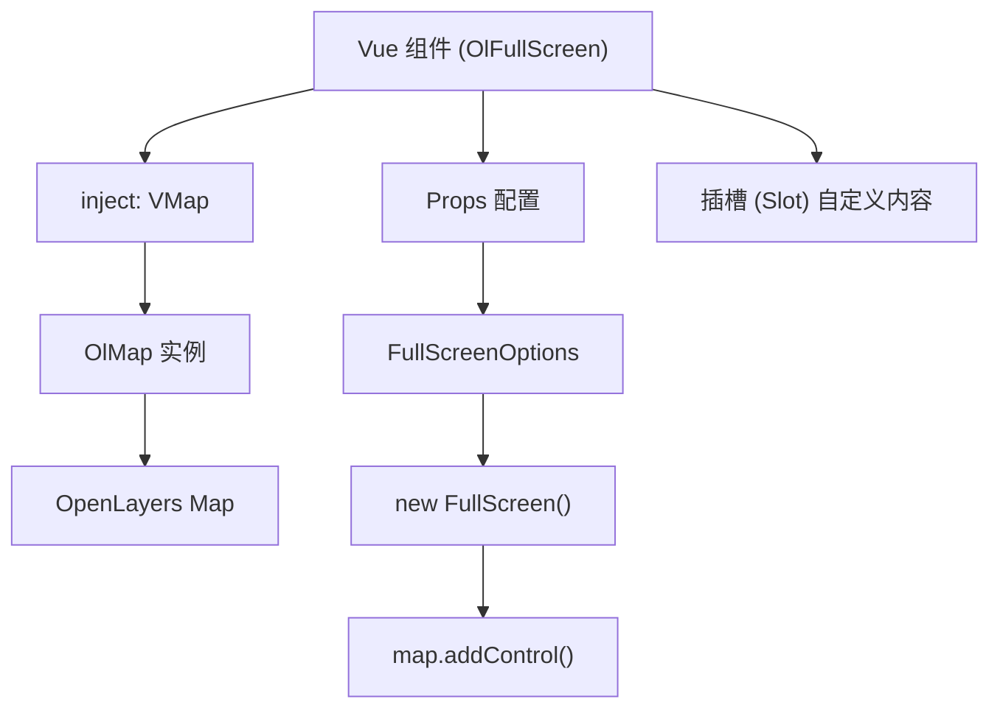
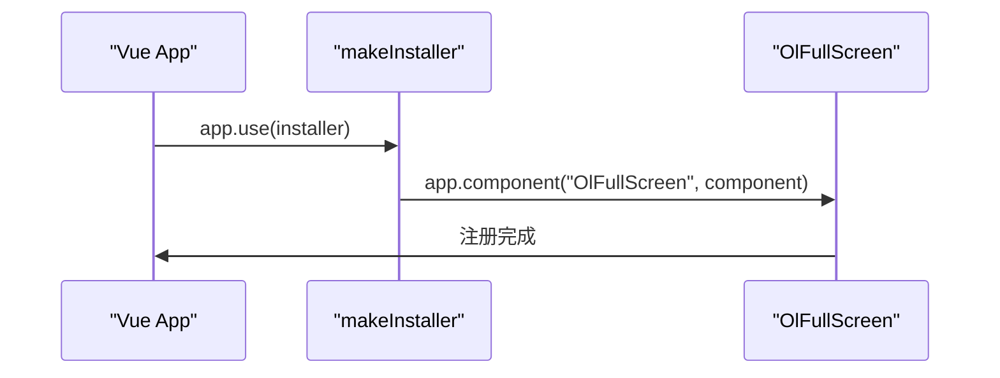
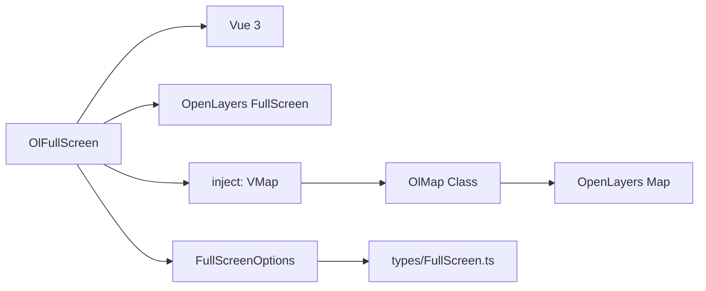

# OlFullScreen 全屏控制

<cite>
**本文档中引用的文件**  
- [index.vue](file://src/packages/controls/FullScreen/index.vue#L1-L34)
- [index.ts](file://src/packages/controls/FullScreen/index.ts#L1-L7)
- [FullScreen.ts](file://src/packages/types/FullScreen.ts#L1-L7)
- [lib/index.ts](file://src/packages/lib/index.ts#L1-L45)
- [default.ts](file://src/packages/default.ts#L1-L164)
</cite>

## 目录
1. [简介](#简介)
2. [项目结构](#项目结构)
3. [核心组件](#核心组件)
4. [架构概览](#架构概览)
5. [详细组件分析](#详细组件分析)
6. [依赖关系分析](#依赖关系分析)
7. [性能考量](#性能考量)
8. [故障排除指南](#故障排除指南)
9. [结论](#结论)

## 简介
`OlFullScreen` 是一个基于 Vue 3 和 OpenLayers 封装的地图全屏控制组件，用于在网页中实现地图的全屏显示与退出功能。该组件通过封装 OpenLayers 的 `FullScreenControl`，提供了简洁的 API 接口，支持自定义按钮文本、提示信息、目标元素等配置项，并可通过插槽（slot）自定义图标。组件利用 `provide/inject` 机制获取地图实例，自动绑定到地图控件系统中，适用于各类地理信息应用。

## 项目结构
`OlFullScreen` 组件位于项目的 `/src/packages/controls/FullScreen/` 目录下，包含两个核心文件：
- `index.vue`：组件的模板与逻辑实现
- `index.ts`：组件的安装导出逻辑

该组件属于 `v3-ol-map` 项目中封装的一系列地图控件之一，遵循统一的插件注册机制，通过 `default.ts` 中的 `makeInstaller` 函数全局注册。

```mermaid
graph TB
subgraph "Controls"
FullScreen[OlFullScreen]
end
subgraph "Core"
OlMap[OlMap Class]
VMap["VMap (地图实例)"]
end
FullScreen --> OlMap : "通过 inject 获取"
OlMap --> VMap : "实例化生成"
```

**图示来源**  
- [index.vue](file://src/packages/controls/FullScreen/index.vue#L1-L34)
- [lib/index.ts](file://src/packages/lib/index.ts#L1-L45)

**本节来源**  
- [index.vue](file://src/packages/controls/FullScreen/index.vue#L1-L34)
- [lib/index.ts](file://src/packages/lib/index.ts#L1-L45)

## 核心组件
`OlFullScreen` 的核心功能是封装 OpenLayers 的全屏控件，并提供 Vue 友好的接口。其主要职责包括：
- 接收配置参数（props）
- 创建 OpenLayers 的 `FullScreen` 控件实例
- 将控件添加至地图实例
- 响应配置变化并重新初始化控件

组件通过 `withDefaults(defineProps<FullScreenOptions>())` 定义并设置默认属性，确保灵活性与易用性。

**本节来源**  
- [index.vue](file://src/packages/controls/FullScreen/index.vue#L1-L34)
- [FullScreen.ts](file://src/packages/types/FullScreen.ts#L1-L7)

## 架构概览
`OlFullScreen` 组件采用典型的 Vue 3 Composition API 结构，结合 OpenLayers 的控件系统，实现地图功能扩展。整体架构如下：



**图示来源**  
- [index.vue](file://src/packages/controls/FullScreen/index.vue#L1-L34)
- [lib/index.ts](file://src/packages/lib/index.ts#L1-L45)

## 详细组件分析

### OlFullScreen 组件实现分析
`OlFullScreen` 组件通过 `<script setup>` 语法实现响应式逻辑，关键流程如下：

1. **注入地图实例**：通过 `inject("VMap")` 获取由父级提供的 `OlMap` 实例。
2. **提取地图对象**：使用 `unref(VMap).map` 获取底层 OpenLayers 的 `Map` 对象。
3. **定义 Props**：继承自 OpenLayers 的 `FullScreenOptions` 类型，支持以下配置项：

#### Props 配置说明
:target: 指定触发全屏操作的 DOM 元素（可选）  
:label: 全屏按钮的文本或图标内容，默认为 "⇪"  
:tipLabel: 鼠标悬停时的提示文本，默认为 "全屏"  
:className: 自定义 CSS 类名，用于样式定制  
:labelActive: 退出全屏状态下的按钮文本，默认为 "⇲"  
:tipLabelActive: 退出全屏时的提示文本，默认为 "退出全屏"  
:keys: 是否允许键盘 ESC 键退出全屏，默认为 `false`

这些 props 均来自 OpenLayers 的 `FullScreen` 控件选项，并通过 `withDefaults` 设置默认值。

#### 控件生命周期管理
组件使用 `shallowRef` 存储 `FullScreen` 实例，并在 `init()` 函数中创建新控件并添加至地图。通过 `watchEffect` 监听 props 变化，若已有控件则先移除再重新初始化，确保配置实时生效。

```vue
<template>
  <slot></slot>
</template>
```
模板部分仅包含一个插槽，允许用户自定义按钮内容（如 SVG 图标），提升 UI 灵活性。

**本节来源**  
- [index.vue](file://src/packages/controls/FullScreen/index.vue#L1-L34)
- [FullScreen.ts](file://src/packages/types/FullScreen.ts#L1-L7)

### 组件注册与全局注入机制
`OlFullScreen` 通过 `default.ts` 中的插件系统注册为全局组件。`default.ts` 文件导出一个 `makeInstaller` 函数，将所有控件（包括 `OlFullScreen`）统一注册到 Vue 应用中。



**图示来源**  
- [default.ts](file://src/packages/default.ts#L1-L164)
- [index.ts](file://src/packages/controls/FullScreen/index.ts#L1-L7)

**本节来源**  
- [default.ts](file://src/packages/default.ts#L1-L164)
- [index.ts](file://src/packages/controls/FullScreen/index.ts#L1-L7)

## 依赖关系分析
`OlFullScreen` 组件依赖多个内部与外部模块：



- **Vue 3**：提供 `setup`、`inject`、`watchEffect` 等响应式能力
- **OpenLayers**：提供底层地图与控件功能
- **OlMap**：封装地图初始化逻辑，通过 `provide/inject` 传递实例
- **类型系统**：通过 `types/FullScreen.ts` 统一类型定义，增强类型安全

**图示来源**  
- [index.vue](file://src/packages/controls/FullScreen/index.vue#L1-L34)
- [lib/index.ts](file://src/packages/lib/index.ts#L1-L45)
- [types/FullScreen.ts](file://src/packages/types/FullScreen.ts#L1-L7)

**本节来源**  
- [index.vue](file://src/packages/controls/FullScreen/index.vue#L1-L34)
- [lib/index.ts](file://src/packages/lib/index.ts#L1-L45)
- [types/FullScreen.ts](file://src/packages/types/FullScreen.ts#L1-L7)

## 性能考量
- **轻量级封装**：组件本身不包含复杂计算，仅做 OpenLayers 控件的代理封装，性能开销极低。
- **响应式优化**：使用 `watchEffect` 自动追踪依赖，避免手动监听多个 props。
- **内存管理**：每次更新时先移除旧控件，防止内存泄漏。
- **按需渲染**：模板仅包含插槽，无额外 DOM 节点，渲染效率高。

## 故障排除指南
### 问题：全屏按钮点击无反应
**可能原因**：
- 浏览器不支持全屏 API（如某些移动浏览器）
- 未在用户手势（如 click）中触发，违反安全策略
- `target` 指定的元素不存在或不可见

**解决方案**：
- 确保在 `click` 事件中触发
- 检查浏览器兼容性
- 不设置 `target` 使用默认按钮

### 问题：全屏后地图显示异常
**可能原因**：
- 地图容器尺寸未正确更新
- CSS 样式未适配全屏状态

**解决方案**：
- 监听 `enterfullscreen` 和 `leavefullscreen` 事件，手动触发地图 `updateSize()`
- 使用 CSS 处理全屏样式

### 问题：类型错误 `FullScreenOptions` 未定义
**可能原因**：
- 类型未正确导入或路径错误

**解决方案**：
- 确认 `types/FullScreen.ts` 正确导出 `FullScreenOptions`

**本节来源**  
- [index.vue](file://src/packages/controls/FullScreen/index.vue#L1-L34)
- [lib/index.ts](file://src/packages/lib/index.ts#L1-L45)

## 结论
`OlFullScreen` 是一个功能完整、结构清晰的地图全屏控制组件，基于 OpenLayers 封装，通过 Vue 3 的响应式系统实现动态配置与高效更新。它利用 `provide/inject` 机制获取地图实例，支持丰富的自定义选项，并可通过插槽灵活定制 UI。组件集成于统一的插件体系中，易于在项目中全局使用。建议在实际开发中结合事件监听与样式适配，确保全屏功能在各类设备与浏览器中稳定运行。