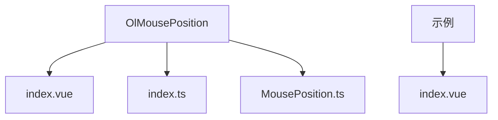

# OlMousePosition 鼠标位置控制

<cite>
**本文档引用文件**  
- [index.vue](file://src/packages/controls/MousePosition/index.vue#L0-L48)
- [index.ts](file://src/packages/controls/MousePosition/index.ts#L0-L5)
- [MousePosition.ts](file://src/packages/types/MousePosition.ts#L0-L9)
- [index.vue](file://src/examples/mousePosition/index.vue#L0-L39)
</cite>

## 目录
1. [简介](#简介)
2. [项目结构](#项目结构)
3. [核心组件分析](#核心组件分析)
4. [坐标转换流程解析](#坐标转换流程解析)
5. [属性配置说明](#属性配置说明)
6. [实际使用示例](#实际使用示例)
7. [精度问题与优化建议](#精度问题与优化建议)
8. [总结](#总结)

## 简介
OlMousePosition 是一个基于 OpenLayers 封装的 Vue 组件，用于在地图界面上实时显示鼠标指针所在位置的地理坐标。该组件支持自定义坐标格式、投影系统以及显示样式，适用于多种地理信息系统（GIS）应用场景。

**Section sources**  
- [index.vue](file://src/packages/controls/MousePosition/index.vue#L0-L48)

## 项目结构
OlMousePosition 组件位于 `src/packages/controls/MousePosition/` 目录下，包含以下两个主要文件：
- `index.vue`：组件的 Vue 模板与逻辑实现
- `index.ts`：组件的安装逻辑，用于全局注册

此外，类型定义位于 `src/packages/types/MousePosition.ts`，示例页面位于 `src/examples/mousePosition/index.vue`。



**Diagram sources**  
- [index.vue](file://src/packages/controls/MousePosition/index.vue#L0-L48)
- [index.ts](file://src/packages/controls/MousePosition/index.ts#L0-L5)
- [MousePosition.ts](file://src/packages/types/MousePosition.ts#L0-L9)

**Section sources**  
- [index.vue](file://src/packages/controls/MousePosition/index.vue#L0-L48)
- [index.ts](file://src/packages/controls/MousePosition/index.ts#L0-L5)
- [MousePosition.ts](file://src/packages/types/MousePosition.ts#L0-L9)

## 核心组件分析
OlMousePosition 组件通过封装 OpenLayers 的 `MousePosition` 控件，实现了在 Vue 环境下的便捷调用。其核心逻辑如下：

1. 通过 `inject("VMap")` 获取地图实例。
2. 使用 `shallowRef` 创建对 `MousePosition` 控件的引用。
3. 在 `onMounted` 阶段初始化控件并添加到地图中。
4. 利用 `watchEffect` 实现属性变化时的自动更新。

关键代码片段来自 `index.vue`：

```ts
const init = () => {
  mousePosition.value = new MousePosition({
    ...props,
    coordinateFormat: createStringXY(Number(props.coordinateFormat)),
  });
  map.addControl(mousePosition.value);
  mousePositionRef.value?.remove();
};

watchEffect(() => {
  if (mousePosition.value) map.removeControl(mousePosition.value);
  init();
});
```

该实现确保了组件在属性变更时能够正确销毁并重建控件，避免状态残留。

**Section sources**  
- [index.vue](file://src/packages/controls/MousePosition/index.vue#L0-L48)

## 坐标转换流程解析
OlMousePosition 的坐标转换流程依赖于 OpenLayers 的 `coordinateFormat` 配置项。其核心是 `createStringXY` 函数，该函数接受一个精度值（number），返回一个格式化函数，用于将坐标数组转换为字符串。

流程如下：
1. 用户设置 `coordinateFormat` 属性（如 `6`）。
2. 组件将其转换为数字并通过 `createStringXY` 生成格式化函数。
3. OpenLayers 在鼠标移动时调用该函数，将当前坐标（如 `[120.123456789, 30.987654321]`）格式化为指定精度的字符串（如 `"120.123457, 30.987654"`）。
4. 格式化后的坐标显示在地图界面上。

若需自定义格式（如 DMS），可传入函数而非数字，例如：
```ts
const formatDMS = (coordinate) => {
  // 自定义度分秒格式化逻辑
};
```

**Section sources**  
- [index.vue](file://src/packages/controls/MousePosition/index.vue#L0-L48)
- [MousePosition.ts](file://src/packages/types/MousePosition.ts#L0-L9)

## 属性配置说明
OlMousePosition 支持以下属性配置：

**:coordinateFormat**  
- 类型：`number | string | Function`
- 说明：坐标格式化方式。若为数字，则表示小数点后保留位数；若为函数，则自定义格式化逻辑。
- 示例：`:coordinate-format="6"` 表示保留6位小数。

**:projection**  
- 类型：`string`
- 说明：目标投影坐标系，如 `"EPSG:4326"`（经纬度）或 `"EPSG:3857"`（Web墨卡托）。
- 示例：`:projection="'EPSG:4326'"`

**:undefinedHTML**  
- 类型：`string`
- 说明：当鼠标未悬停在地图上时显示的内容。
- 默认值：`""`

**:className**  
- 类型：`string`
- 说明：自定义 CSS 类名，用于覆盖默认样式。
- 示例：`:class-name="'custom-mouse-position'"`

这些属性均通过 `defineProps<MousePositionOptions>()` 定义，并使用 `withDefaults` 设置默认值。

**Section sources**  
- [index.vue](file://src/packages/controls/MousePosition/index.vue#L0-L48)
- [MousePosition.ts](file://src/packages/types/MousePosition.ts#L0-L9)

## 实际使用示例
以下是一个完整的使用示例，展示如何在页面中动态切换投影和精度：

```vue
<script setup lang="ts">
import { ref } from "vue";
const projection = ref("EPSG:4326");
const coordinateFormat = ref(6);
</script>

<template>
  <div class="container">
    <ol-map>
      <ol-tile tile-type="BAIDU"></ol-tile>
      <ol-mouse-position 
        :projection="projection" 
        :coordinate-format="coordinateFormat"
      />
    </ol-map>
    <form>
      <label for="projection">投影 </label>
      <select id="projection" v-model="projection">
        <option value="EPSG:4326">EPSG:4326</option>
        <option value="EPSG:3857">EPSG:3857</option>
      </select>
      <label for="precision">精度</label>
      <input id="precision" v-model="coordinateFormat" type="number" min="0" max="12" />
    </form>
  </div>
</template>
```

此示例允许用户通过下拉菜单选择投影系统，并通过输入框调整坐标显示精度。

**Section sources**  
- [index.vue](file://src/examples/mousePosition/index.vue#L0-L39)

## 精度问题与优化建议
在高精度坐标显示场景中，浮点数精度可能导致显示误差。例如，`120.123456789` 在保留6位小数时为 `120.123457`，存在舍入误差。

**优化建议：**
1. **避免过度精度**：一般情况下，6位小数已足够（约10厘米精度），无需设置更高精度。
2. **使用 DMS 格式**：对于需要精确表示的场景，可自定义 `coordinateFormat` 函数输出度分秒格式，提升可读性。
3. **投影选择**：在需要高精度测量时，优先使用局部投影（如 UTM），避免使用全局投影（如 Web 墨卡托）带来的变形。
4. **性能考虑**：频繁更新坐标可能影响性能，建议在必要时才启用该控件。

```ts
// 示例：DMS 格式化函数
const toDMS = (coord) => {
  const d = Math.floor(coord);
  const m = Math.floor((coord - d) * 60);
  const s = ((coord - d) * 60 - m) * 60;
  return `${Math.abs(d)}°${m}′${s.toFixed(2)}″`;
};
```

**Section sources**  
- [index.vue](file://src/packages/controls/MousePosition/index.vue#L0-L48)

## 总结
OlMousePosition 组件通过简洁的 API 封装了 OpenLayers 的鼠标位置功能，支持灵活的坐标格式与投影配置。结合 `proj4` 可实现跨投影坐标转换，适用于各类 GIS 应用。在使用时应注意浮点数精度问题，并根据实际需求选择合适的显示格式与投影系统。