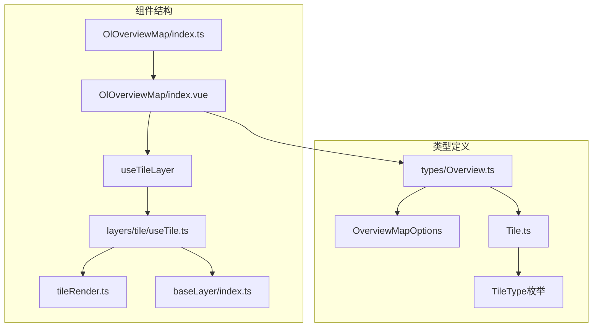
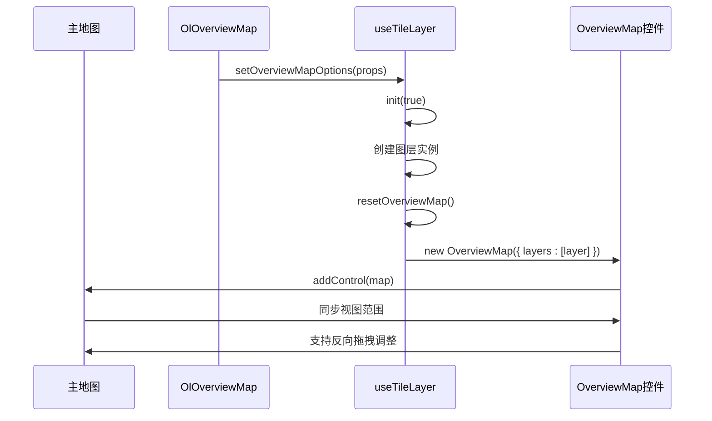
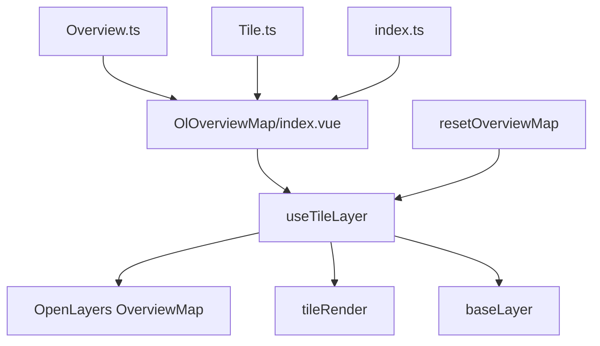

# OlOverviewMap 鹰眼图控制

<cite>
**本文档引用文件**  
- [index.vue](file://src/packages/controls/OverviewMap/index.vue#L1-L42)
- [index.ts](file://src/packages/controls/OverviewMap/index.ts#L1-L7)
- [index.vue](file://src/examples/overview/index.vue#L1-L86)
- [Overview.ts](file://src/packages/types/Overview.ts#L1-L8)
- [useTile.ts](file://src/packages/layers/tile/useTile.ts#L1-L338)
- [Tile.ts](file://src/packages/types/Tile.ts#L1-L73)
</cite>

## 更新摘要
**变更内容**   
- 新增动态瓦片切换能力，支持高德、百度、天地图及其卫星和地形变体
- 新增 resetOverviewMap 方法用于重新初始化鹰眼图
- 改进生命周期管理，优化组件初始化流程
- 扩展 tileType 支持列表，包含更多地图服务选项

## 目录
1. [简介](#简介)
2. [项目结构](#项目结构)
3. [核心组件](#核心组件)
4. [架构概览](#架构概览)
5. [详细组件分析](#详细组件分析)
6. [动态瓦片切换能力](#动态瓦片切换能力)
7. [resetOverviewMap 方法](#resetoverviewmap-方法)
8. [依赖分析](#依赖分析)
9. [性能考虑](#性能考虑)
10. [故障排除指南](#故障排除指南)
11. [结论](#结论)

## 简介
`OlOverviewMap` 是一个基于 OpenLayers 的 Vue 组件，用于在主地图上叠加一个小型的鹰眼图（概览图），帮助用户了解当前视图在整个地图中的位置。该组件通过封装 OpenLayers 的 `OverviewMap` 控件，提供简洁的 API 接口，支持自定义图层、折叠状态、标签文本等配置项。最新版本增强了动态瓦片切换能力，支持高德、百度、天地图及其卫星和地形变体等多种地图服务，并提供了 `resetOverviewMap` 方法用于重新初始化鹰眼图。

## 项目结构
`OlOverviewMap` 组件位于 `/src/packages/controls/OverviewMap/` 目录下，包含两个核心文件：
- `index.vue`：组件的 Vue 模板与逻辑入口
- `index.ts`：组件的安装导出模块

该组件依赖于 `useTileLayer` 工具函数（位于 `layers/tile/useTile.ts`）来初始化和管理地图图层，并通过 `OverviewMapOptions` 类型定义支持的属性。



**图示来源**  
- [index.vue](file://src/packages/controls/OverviewMap/index.vue#L1-L42)
- [useTile.ts](file://src/packages/layers/tile/useTile.ts#L1-L338)
- [Overview.ts](file://src/packages/types/Overview.ts#L1-L8)
- [Tile.ts](file://src/packages/types/Tile.ts#L1-L73)

## 核心组件
`OlOverviewMap` 的核心功能由 `index.vue` 中的 `<script setup>` 实现，主要依赖 `useTileLayer` 提供的 `init`、`setOverviewMapOptions` 和 `resetOverviewMap` 方法完成地图初始化与控制项配置。组件通过 `props` 接收配置参数，并在 `watchEffect` 中响应式更新鹰眼图设置。

关键属性包括：
- **className**：容器类名，用于自定义样式（未在当前代码中直接体现，但可通过父级传递）
- **collapsed**：是否初始折叠鹰眼图
- **collapseLabel**：折叠按钮显示文本
- **tipLabel**：提示文本（OpenLayers 原生支持）
- **layers**：概览图层配置，由 `useTileLayer` 动态生成
- **tileType**：地图服务类型，支持多种瓦片服务

**组件来源**  
- [index.vue](file://src/packages/controls/OverviewMap/index.vue#L1-L42)
- [useTile.ts](file://src/packages/layers/tile/useTile.ts#L1-L338)

## 架构概览
`OlOverviewMap` 利用 OpenLayers 的 `OverviewMap` 控件机制，在主地图之外创建一个独立的地图实例作为小地图。该小地图仅渲染指定的概览图层（如天地图、高德、百度等），并通过 `setMap()` 方法绑定到主地图，实现视图范围的自动同步。

主地图的视图变化会实时反映在鹰眼图中，用户也可通过拖动鹰眼图中的视口框来调整主地图的显示范围。最新的版本通过 `resetOverviewMap` 方法提供了更灵活的初始化控制。



**图示来源**  
- [index.vue](file://src/packages/controls/OverviewMap/index.vue#L1-L42)
- [useTile.ts](file://src/packages/layers/tile/useTile.ts#L1-L338)

## 详细组件分析

### OlOverviewMap 组件分析
`OlOverviewMap` 是一个基于 Vue 3 的组合式 API 组件，使用 `defineProps<OverviewMapOptions>` 定义类型化属性，并通过 `withDefaults` 设置默认值。

#### 属性机制说明
```ts
const props = withDefaults(defineProps<OverviewMapOptions>(), {
  tileType: "TDT",
  layerId: `tile-layer-${nanoid()}`,
  visible: true,
  collapsed: false,
  collapsible: true,
});
```
- **tileType**：指定概览图使用的地图服务类型（如 TDT、AMAP、BAIDU）
- **layerId**：图层唯一标识，防止重复
- **visible**：图层是否可见
- **collapsed**：是否默认折叠
- **collapsible**：是否允许折叠操作

这些属性通过 `watchEffect` 监听，调用 `setOverviewMapOptions` 更新配置并重新初始化。

#### 视图联动原理
`useTileLayer` 中的 `addOverviewMap` 方法是实现联动的关键：
```ts
const addOverviewMap = () => {
  if (!layer.value) return;
  overviewMapTarget.value = new OverviewMap({
    ...OverviewMapOptions.value,
    layers: [layer.value],
  });
  unref(VMap).map.addControl(overviewMapTarget.value);
};
```
此处创建 `OverviewMap` 实例并添加到主地图控件中，OpenLayers 内部自动处理两个地图之间的视图同步。

**组件来源**  
- [index.vue](file://src/packages/controls/OverviewMap/index.vue#L1-L42)
- [useTile.ts](file://src/packages/layers/tile/useTile.ts#L1-L338)

## 动态瓦片切换能力

### 支持的地图服务类型
`OlOverviewMap` 现在支持多种地图服务类型的动态切换，包括：

#### 基础地图服务
- **TDT**：天地图（矢量图）
- **BAIDU**：百度地图（矢量图）
- **AMAP**：高德地图（矢量图）
- **OSM**：OpenStreetMap

#### 卫星影像服务
- **TDT_SATELLITE**：天地图卫星影像
- **BAIDU_SATELLITE**：百度卫星影像
- **AMAP_SATELLITE**：高德卫星影像

#### 地形图服务
- **TDT_TERRAIN**：天地图地形图

#### 特殊服务
- **BAIDU_MIDNIGHT**：百度午夜蓝个性化地图

### 动态切换实现
通过 `tileType` 属性的动态绑定，可以在运行时切换不同的地图服务：

```vue
<script setup>
import { ref } from 'vue';

const tileType = ref('AMAP');

const tileTypeList = [
  { value: 'AMAP', label: '高德地图' },
  { value: 'AMAP_SATELLITE', label: '高德地图-卫星图' },
  { value: 'BAIDU', label: '百度地图' },
  { value: 'BAIDU_SATELLITE', label: '百度地图-卫星图' },
  { value: 'TDT', label: '天地图' },
  { value: 'TDT_SATELLITE', label: '天地图-卫星图' },
  { value: 'TDT_TERRAIN', label: '天地图-地形图' },
];
</script>

<template>
  <select v-model="tileType">
    <option v-for="item in tileTypeList" :key="item.value" :value="item.value">
      {{ item.label }}
    </option>
  </select>
  <ol-overview :tile-type="tileType"></ol-overview>
</template>
```

**章节来源**  
- [index.vue](file://src/examples/overview/index.vue#L1-L86)
- [Tile.ts](file://src/packages/types/Tile.ts#L13-L27)

## resetOverviewMap 方法

### 方法功能
`resetOverviewMap` 是一个新增的方法，用于重新初始化鹰眼图控件。当需要切换地图服务或重新配置鹰眼图时，可以通过调用此方法来重建控件。

### 实现原理
```ts
const resetOverviewMap = () => {
  if (overviewMapTarget.value) {
    unref(VMap).map.removeControl(overviewMapTarget.value);
    init(true);
  }
};
```

该方法的工作流程：
1. 检查是否存在现有的 `OverviewMap` 控件实例
2. 如果存在，从主地图中移除该控件
3. 调用 `init(true)` 重新初始化鹰眼图
4. 创建新的 `OverviewMap` 实例并添加到地图中

### 使用场景
- 切换地图服务类型后重新初始化鹰眼图
- 需要重新配置鹰眼图参数时
- 处理地图服务切换后的控件重建

### 调用方式
```ts
// 在组件中获取方法实例
const { resetOverviewMap } = useTileLayer(props);

// 调用方法重新初始化
resetOverviewMap();
```

**章节来源**  
- [useTile.ts](file://src/packages/layers/tile/useTile.ts#L294-L299)

## 依赖分析
`OlOverviewMap` 的依赖关系清晰，采用分层设计：
- **UI 层**：`index.vue` 负责接收 props 并调用逻辑
- **逻辑层**：`useTileLayer` 封装地图图层与控制项初始化
- **类型层**：`Overview.ts` 和 `Tile.ts` 提供类型定义
- **外部依赖**：OpenLayers 的 `OverviewMap` 控件与 `TileLayer`



**图示来源**  
- [index.vue](file://src/packages/controls/OverviewMap/index.vue#L1-L42)
- [useTile.ts](file://src/packages/layers/tile/useTile.ts#L1-L338)
- [Overview.ts](file://src/packages/types/Overview.ts#L1-L8)
- [Tile.ts](file://src/packages/types/Tile.ts#L1-L73)

## 性能考虑
当在鹰眼图中叠加多个图层（如矢量叠加、热力图等）时，可能引发渲染性能问题，尤其是在低性能设备上。

### 可能的问题
- 多图层叠加导致频繁重绘
- 鹰眼图分辨率较低时仍请求高清瓦片
- 图层透明度混合计算开销大
- 动态切换地图服务时的资源重新加载

### 优化方案
1. **简化图层**：鹰眼图仅使用基础底图（如天地图矢量），避免叠加复杂矢量或热力图。
2. **降低瓦片分辨率**：通过 `source` 配置降低 `tilePixelRatio`。
3. **禁用动画效果**：设置 `transition: 0` 减少过渡动画。
4. **延迟加载**：折叠状态下暂停鹰眼图更新。
5. **智能缓存**：利用 `resetOverviewMap` 方法进行控件复用而非完全重建。

```ts
// 示例：优化瓦片加载
<ol-overview
  :source="{ tilePixelRatio: 1 }"
  :transition="0"
/>

// 示例：使用 resetOverviewMap 进行智能切换
const handleTileTypeChange = (newTileType) => {
  // 更新 tileType 属性
  tileType.value = newTileType;
  // 重新初始化鹰眼图
  resetOverviewMap();
};
```

## 故障排除指南
常见问题及解决方案：

| 问题现象 | 可能原因 | 解决方法 |
|--------|--------|--------|
| 鹰眼图不显示 | `tileType` 配置错误或 AK 未设置 | 检查 `tileType` 是否支持，确认天地图/百度 AK 已配置 |
| 视图不同步 | `setMap()` 未正确调用 | 确保 `useTileLayer` 正确初始化并绑定主地图 |
| 折叠按钮无效 | `collapsible` 为 `false` | 设置 `collapsible="true"` |
| 图层重复加载 | `layerId` 未唯一 | 使用 `nanoid()` 自动生成唯一 ID |
| 动态切换失败 | `resetOverviewMap` 未调用 | 在切换 tileType 后调用 `resetOverviewMap()` |
| 性能问题 | 鹰眼图图层过多 | 简化图层配置，使用基础底图 |

**问题来源**  
- [index.vue](file://src/packages/controls/OverviewMap/index.vue#L1-L42)
- [useTile.ts](file://src/packages/layers/tile/useTile.ts#L1-L338)

## 结论
`OlOverviewMap` 是一个功能完整、结构清晰的地图鹰眼图控制组件，基于 OpenLayers 的 `OverviewMap` 控件封装，提供了灵活的 API 用于自定义图层、折叠行为和样式。最新版本通过新增的动态瓦片切换能力和 `resetOverviewMap` 方法，进一步增强了组件的灵活性和易用性。

通过 `useTileLayer` 工具统一管理图层生命周期，实现了主地图与概览图的高效联动。建议在实际使用中根据性能需求合理配置图层复杂度，并注意 AK 等关键参数的正确设置。动态瓦片切换功能使得组件能够适应更多的应用场景，而 `resetOverviewMap` 方法则为复杂的地图服务切换提供了可靠的解决方案。