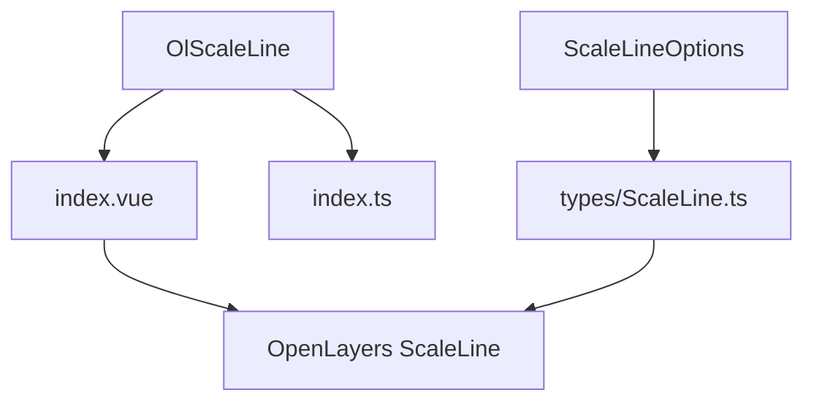
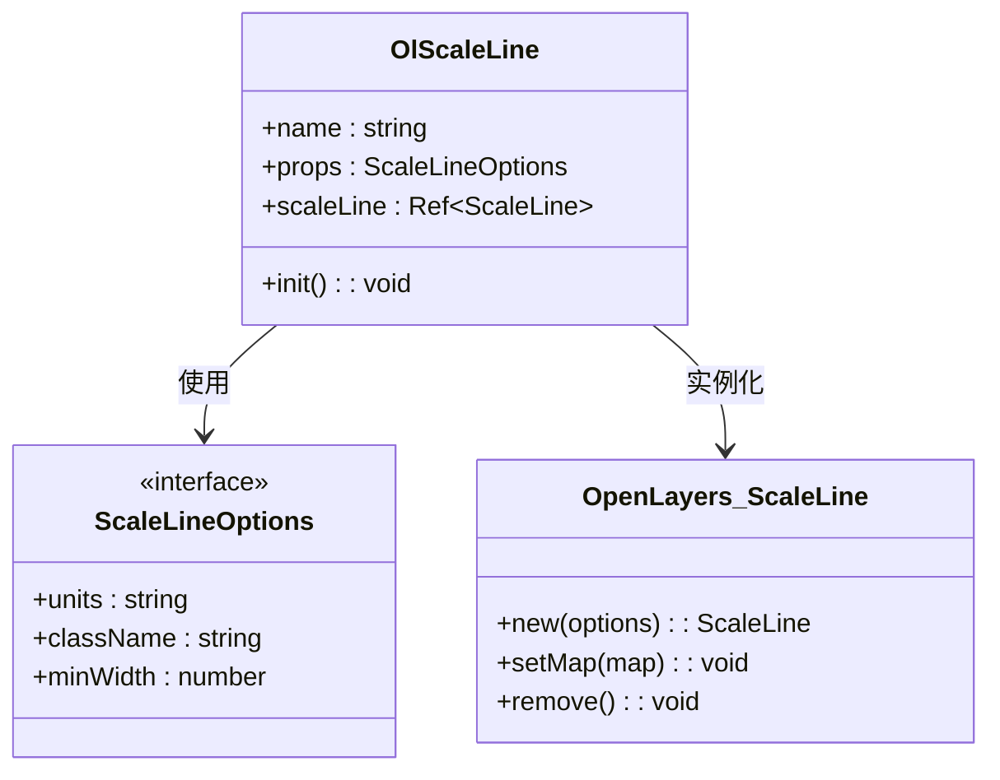
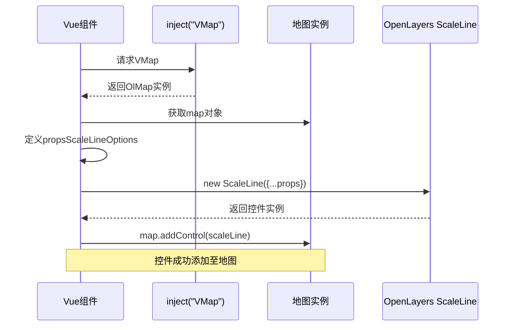
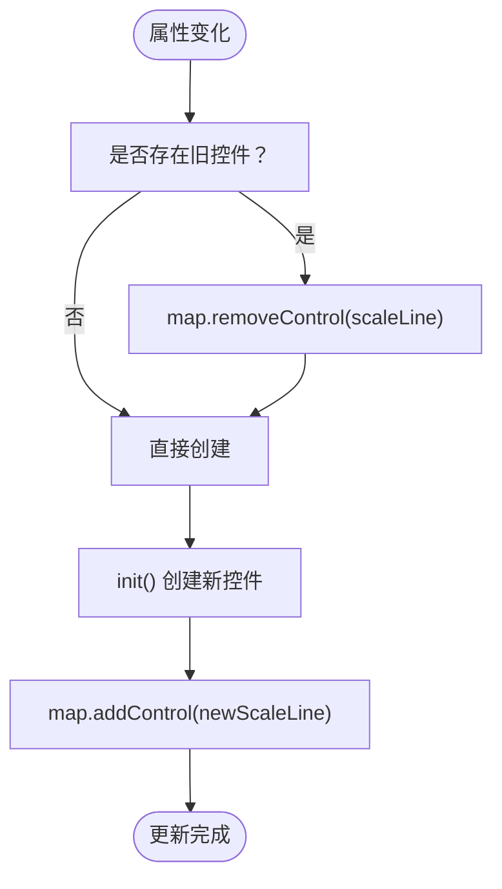
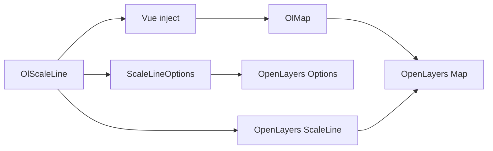

# OlScaleLine 比例尺控制

<cite>
**本文档引用文件**  
- [index.vue](file://src/packages/controls/ScaleLine/index.vue#L1-L31)
- [index.ts](file://src/packages/controls/ScaleLine/index.ts#L1-L6)
- [ScaleLine.ts](file://src/packages/types/ScaleLine.ts#L1-L5)
</cite>

## 目录
1. [简介](#简介)
2. [项目结构](#项目结构)
3. [核心组件分析](#核心组件分析)
4. [架构概览](#架构概览)
5. [详细组件实现](#详细组件实现)
6. [依赖关系分析](#依赖关系分析)
7. [使用示例与最佳实践](#使用示例与最佳实践)
8. [常见问题与解决方案](#常见问题与解决方案)
9. [总结](#总结)

## 简介
`OlScaleLine` 是一个基于 OpenLayers 封装的 Vue 组件，用于在地图上显示动态比例尺。该组件能够根据当前地图视图的分辨率自动更新显示值，并支持多种度量单位（如公制、英制、海里、角度）。通过响应式设计，它能适应不同投影坐标系下的地图展示需求，是地图可视化中不可或缺的 UI 控件之一。

## 项目结构
`OlScaleLine` 组件位于项目的 `/src/packages/controls/ScaleLine/` 目录下，包含两个核心文件：
- `index.vue`：组件主文件，使用 Vue 3 的 `<script setup>` 语法实现逻辑封装。
- `index.ts`：用于注册全局组件的安装模块。
此外，类型定义位于 `/src/packages/types/ScaleLine.ts`，对接 OpenLayers 原生 `ScaleLine` 控件的选项接口。



**图示来源**
- [index.vue](file://src/packages/controls/ScaleLine/index.vue#L1-L31)
- [index.ts](file://src/packages/controls/ScaleLine/index.ts#L1-L6)
- [ScaleLine.ts](file://src/packages/types/ScaleLine.ts#L1-L5)

## 核心组件分析
`OlScaleLine` 的核心功能是将 OpenLayers 的 `ScaleLine` 控件集成到 Vue 框架中，实现响应式更新和灵活配置。其主要依赖 Vue 的 `inject` 机制获取地图实例，并通过 `watchEffect` 实现属性变化时的自动重绘。

**组件通信流程：**
1. 通过 `inject("VMap")` 获取父级注入的地图实例 `OlMap`。
2. 解构出 `map` 对象并监听其状态。
3. 使用 `defineProps<ScaleLineOptions>()` 接收外部传入的配置项。
4. 在 `init()` 函数中创建 OpenLayers 原生 `ScaleLine` 实例并添加至地图。
5. 利用 `watchEffect` 监听 `props` 变化，动态销毁并重建控件以确保配置生效。

**关键特性：**
- 支持响应式更新
- 自动管理生命周期（添加/移除控件）
- 类型安全（通过 TypeScript 接口约束）

**中文标签结构：**
- :组件名称: OlScaleLine
- :注入依赖: VMap
- :地图实例: map
- :属性类型: ScaleLineOptions
- :内部引用: scaleLine

**中文段落来源**
- [index.vue](file://src/packages/controls/ScaleLine/index.vue#L1-L31)
- [ScaleLine.ts](file://src/packages/types/ScaleLine.ts#L1-L5)

## 架构概览
整个组件采用“封装+桥接”模式，将 OpenLayers 的原生 JavaScript 控件桥接到 Vue 的响应式系统中。其架构分为三层：
1. **视图层（index.vue）**：负责模板渲染与事件绑定。
2. **逻辑层（setup script）**：处理数据流、生命周期与控件实例化。
3. **类型层（ScaleLine.ts）**：提供类型声明，确保开发时的类型检查与智能提示。



**图示来源**
- [index.vue](file://src/packages/controls/ScaleLine/index.vue#L1-L31)
- [ScaleLine.ts](file://src/packages/types/ScaleLine.ts#L1-L5)

## 详细组件实现
### 组件初始化流程


**图示来源**
- [index.vue](file://src/packages/controls/ScaleLine/index.vue#L1-L31)

### 属性动态更新机制
当 `props` 发生变化时，`watchEffect` 会触发重新初始化流程：



**图示来源**
- [index.vue](file://src/packages/controls/ScaleLine/index.vue#L1-L31)

#### Props 配置说明
| 属性名 | 类型 | 默认值 | 说明 |
|--------|------|--------|------|
| :units | string | metric | 指定比例尺单位，可选值包括：<br/>- metric（公制，米/千米）<br/>- us（英制，英尺/英里）<br/>- nautical（海里）<br/>- degrees（角度） |
| :className | string | ol-scale-line | 自定义 CSS 类名，用于样式覆盖 |
| :minWidth | number | 64 | 比例尺最小显示宽度（像素），防止过小无法识别 |

这些属性直接继承自 OpenLayers 的 `ScaleLineOptions` 接口，确保与原生 API 一致。

**中文段落来源**
- [index.vue](file://src/packages/controls/ScaleLine/index.vue#L1-L31)
- [ScaleLine.ts](file://src/packages/types/ScaleLine.ts#L1-L5)

## 依赖关系分析
`OlScaleLine` 的依赖链如下：



**关键依赖：**
- `vue`: 提供响应式系统与组件机制
- `ol/control/ScaleLine`: OpenLayers 原生比例尺控件
- `@/packages/lib`: 封装的地图核心类 `OlMap`
- `@/packages`: 类型系统统一入口

**中文段落来源**
- [index.vue](file://src/packages/controls/ScaleLine/index.vue#L1-L31)
- [ScaleLine.ts](file://src/packages/types/ScaleLine.ts#L1-L5)

## 使用示例与最佳实践
### 基础用法
```vue
<template>
  <ol-map>
    <ol-scale-line :units="metric" />
  </ol-map>
</template>
```

### 自定义单位与样式
```vue
<template>
  <ol-map>
    <ol-scale-line 
      :units="us" 
      :minWidth="80"
      className="custom-scale-line"
    />
  </ol-map>
</template>

<style>
.custom-scale-line {
  background: rgba(0, 0, 0, 0.7);
  color: white;
  border-radius: 4px;
}
</style>
```

### 响应式布局适配
结合 `v-if` 或 `v-show` 实现移动端隐藏/显示控制：
```vue
<ol-scale-line v-if="$screen.width > 768" />
```

## 常见问题与解决方案
### 问题：不同投影下比例尺显示偏差
**现象**：在非 Web Mercator 投影（如 EPSG:4326）下，比例尺长度不准确。  
**原因**：OpenLayers 的 `ScaleLine` 默认假设地图使用墨卡托投影进行距离计算。  
**解决方案**：
1. 显式设置投影单位为 `degrees`：
```vue
<ol-scale-line units="degrees" />
```
2. 或在高精度场景下，结合自定义控件计算真实地理距离。

### 问题：样式无法覆盖
**原因**：`<style scoped>` 限制了样式的全局作用域。  
**解决方案**：
- 使用深度选择器：
```css
::v-deep(.ol-scale-line) {
  background: transparent;
}
```
- 或移除 `scoped` 属性，在外层加唯一类名控制。

**中文段落来源**
- [index.vue](file://src/packages/controls/ScaleLine/index.vue#L1-L31)

## 总结
`OlScaleLine` 是一个轻量、高效且高度可配置的地图比例尺组件。它通过 Vue 的响应式系统与 OpenLayers 原生控件无缝集成，支持动态更新与多种单位显示。尽管在非标准投影下可能存在精度问题，但通过合理配置仍能满足绝大多数应用场景的需求。建议开发者根据实际地图投影选择合适的单位，并利用 CSS 类名进行视觉定制，以提升用户体验。