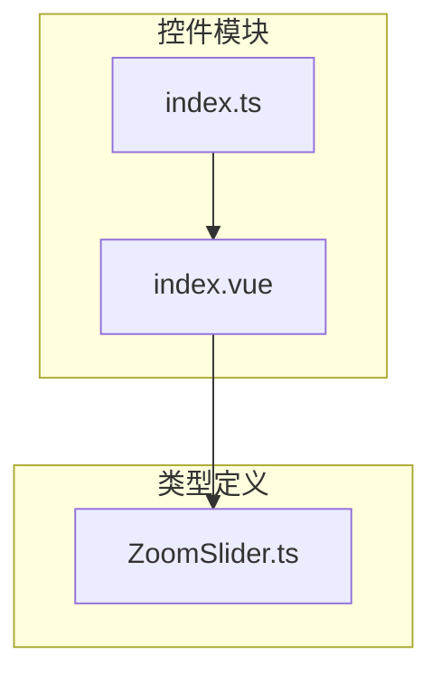
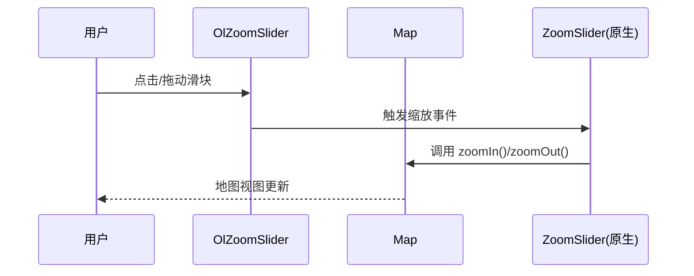

# OlZoomSlider 缩放滑块控制

<cite>
**本文档引用文件**  
- [index.vue](file://src/packages/controls/ZoomSlider/index.vue#L1-L35)
- [index.ts](file://src/packages/controls/ZoomSlider/index.ts#L1-L6)
- [ZoomSlider.ts](file://src/packages/types/ZoomSlider.ts#L1-L6)
- [index.vue](file://src/examples/controls/index.vue#L1-L35)
</cite>

## 目录
1. [简介](#简介)
2. [项目结构](#项目结构)
3. [核心组件分析](#核心组件分析)
4. [架构集成与实现机制](#架构集成与实现机制)
5. [属性（Props）详解](#属性props详解)
6. [事件响应与地图交互](#事件响应与地图交互)
7. [使用示例](#使用示例)
8. [自定义样式与禁用动画](#自定义样式与禁用动画)
9. [与其他控件组合使用](#与其他控件组合使用)
10. [触摸设备交互延迟问题及应对策略](#触摸设备交互延迟问题及应对策略)

## 简介
`OlZoomSlider` 是一个基于 Vue 3 和 OpenLayers 封装的地图控件，提供垂直滑块用于地图的缩放操作。用户可通过点击或拖动滑块来实现地图的放大与缩小。该组件封装了 OpenLayers 原生的 `ZoomSlider` 控件，并通过 Vue 的响应式系统实现动态更新与集成。

**Section sources**  
- [index.vue](file://src/packages/controls/ZoomSlider/index.vue#L1-L35)

## 项目结构
项目采用模块化设计，`OlZoomSlider` 组件位于 `/src/packages/controls/ZoomSlider/` 目录下，包含以下文件：
- `index.vue`：组件主文件，定义了滑块控件的逻辑与生命周期
- `index.ts`：用于注册组件的安装模块
- 类型定义在 `/src/packages/types/ZoomSlider.ts` 中，继承自 OpenLayers 原生类型

该结构符合 Vue 组件封装规范，便于在地图应用中按需引入和使用。



**Diagram sources**  
- [index.vue](file://src/packages/controls/ZoomSlider/index.vue#L1-L35)
- [index.ts](file://src/packages/controls/ZoomSlider/index.ts#L1-L6)
- [ZoomSlider.ts](file://src/packages/types/ZoomSlider.ts#L1-L6)

## 核心组件分析
`OlZoomSlider` 的核心逻辑在 `index.vue` 中实现，使用 `<script setup>` 语法糖进行声明式编程。组件通过 `inject("VMap")` 获取地图实例，并在 `watchEffect` 中监听属性变化，动态创建或销毁 OpenLayers 的 `ZoomSlider` 控件。

关键点包括：
- 使用 `shallowRef` 存储控件实例
- 通过 `map.addControl()` 将控件添加至地图
- 利用 `watchEffect` 实现属性变更时的自动重载

```vue
<script setup lang="ts">
const VMap = inject("VMap") as OlMap;
const map = unref(VMap).map;
const zoomSlider = shallowRef<ZoomSlider>();

const init = () => {
  zoomSlider.value = new ZoomSlider({ ...props });
  map.addControl(zoomSlider.value);
};

watchEffect(() => {
  if (zoomSlider.value) map.removeControl(zoomSlider.value);
  init();
});
</script>
```

**Section sources**  
- [index.vue](file://src/packages/controls/ZoomSlider/index.vue#L1-L35)

## 架构集成与实现机制
`OlZoomSlider` 通过 Vue 的依赖注入机制（`inject`）获取地图实例 `VMap`，并访问其底层 OpenLayers 的 `map` 对象。随后，使用 OpenLayers 提供的 `ol/control/ZoomSlider` 类创建原生控件，并将其挂载到地图上。

组件封装方式遵循 Vue 插件模式，`index.ts` 导出 `install` 函数，允许通过 `app.use()` 全局注册组件。

```ts
import type { App } from "vue";
import component from "./index.vue";

const install = (Vue: App) => Vue.component(component.name || "OlZoomSlider", component);

export default install;
```

**Section sources**  
- [index.ts](file://src/packages/controls/ZoomSlider/index.ts#L1-L6)
- [index.vue](file://src/packages/controls/ZoomSlider/index.vue#L1-L35)

## 属性（Props）详解
组件支持所有 OpenLayers `ZoomSlider` 原生选项，通过类型 `ZoomSliderOptions` 继承：

```ts
export declare type ZoomSliderOptions = Options;
```

常用配置包括：
- **className**：自定义 CSS 类名，用于样式定制
- **duration**：缩放动画持续时间（毫秒），设为 `0` 可禁用动画

这些属性通过 `withDefaults(defineProps<ZoomSliderOptions>(), {})` 接收，并透传给 OpenLayers 控件实例。

**Section sources**  
- [ZoomSlider.ts](file://src/packages/types/ZoomSlider.ts#L1-L6)
- [index.vue](file://src/packages/controls/ZoomSlider/index.vue#L1-L35)

## 事件响应与地图交互
`OlZoomSlider` 本身不直接处理点击或拖动事件，而是由 OpenLayers 内部的 `ZoomSlider` 控件自动响应。当用户操作滑块时，控件会调用地图实例的 `zoomIn()` 和 `zoomOut()` 方法实现缩放。

由于该控件是 OpenLayers 原生控件的封装，所有交互逻辑均由底层库处理，确保行为一致性与性能优化。



**Diagram sources**  
- [index.vue](file://src/packages/controls/ZoomSlider/index.vue#L1-L35)

## 使用示例
在模板中直接使用 `<ol-zoom-slider>` 标签即可添加缩放滑块：

```vue
<template>
  <ol-map>
    <ol-tile tile-type="BAIDU"></ol-tile>
    <ol-zoom-slider :className="'custom-zoom-slider'" :duration="300" />
  </ol-map>
</template>
```

此示例中设置了自定义类名和 300ms 动画时长。

**Section sources**  
- [index.vue](file://src/examples/controls/index.vue#L1-L35)

## 自定义样式与禁用动画
可通过 `className` 属性为滑块添加自定义样式类，结合 CSS 进行外观定制：

```vue
<ol-zoom-slider className="my-custom-slider" :duration="0" />
```

```css
.my-custom-slider .ol-zoom-slider {
  background: rgba(0, 0, 0, 0.5);
  border-radius: 4px;
}
.my-custom-slider .ol-slider {
  background: white;
}
```

设置 `duration="0"` 可关闭缩放动画，实现即时缩放效果。

**Section sources**  
- [index.vue](file://src/packages/controls/ZoomSlider/index.vue#L1-L35)

## 与其他控件组合使用
`OlZoomSlider` 可与其他地图控件并列使用，如全屏、比例尺、鹰眼图等：

```vue
<ol-map>
  <ol-zoom-slider />
  <ol-full-screen />
  <ol-scale-line />
  <ol-overview tile-type="AMAP" collapsed />
</ol-map>
```

所有控件均通过 `map.addControl()` 注册，互不干扰，布局由 CSS 控制。

**Section sources**  
- [index.vue](file://src/examples/controls/index.vue#L1-L35)

## 触摸设备交互延迟问题及应对策略
在触摸设备上，由于浏览器默认的 300ms 点击延迟以及事件冒泡机制，`OlZoomSlider` 可能出现响应迟钝现象。建议采取以下措施：
1. **使用指针事件（Pointer Events）**：确保 OpenLayers 正确处理触摸事件
2. **优化 CSS 样式**：为滑块容器添加 `touch-action: none` 防止默认滚动行为
3. **增加触摸热区**：通过 CSS 扩大滑块可点击区域
4. **启用被动事件监听器**：提升滚动流畅性

示例：
```css
.ol-zoom-slider {
  touch-action: none;
}
.ol-zoom-slider .ol-slider {
  width: 12px;
  margin: 0 -2px; /* 扩大触摸区域 */
}
```

**Section sources**  
- [index.vue](file://src/packages/controls/ZoomSlider/index.vue#L1-L35)