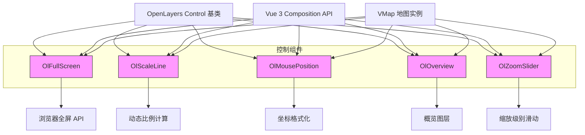

# 地图控制组件 API

<cite>
**本文档中引用的文件**  
- [FullScreen/index.vue](file://src/packages/controls/FullScreen/index.vue)
- [FullScreen/index.ts](file://src/packages/controls/FullScreen/index.ts)
- [MousePosition/index.vue](file://src/packages/controls/MousePosition/index.vue)
- [MousePosition/index.ts](file://src/packages/controls/MousePosition/index.ts)
- [OverviewMap/index.vue](file://src/packages/controls/OverviewMap/index.vue)
- [OverviewMap/index.ts](file://src/packages/controls/OverviewMap/index.ts)
- [ScaleLine/index.vue](file://src/packages/controls/ScaleLine/index.vue)
- [ScaleLine/index.ts](file://src/packages/controls/ScaleLine/index.ts)
- [ZoomSlider/index.vue](file://src/packages/controls/ZoomSlider/index.vue)
- [ZoomSlider/index.ts](file://src/packages/controls/ZoomSlider/index.ts)
- [FullScreen.ts](file://src/packages/types/FullScreen.ts)
- [MousePosition.ts](file://src/packages/types/MousePosition.ts)
- [Overview.ts](file://src/packages/types/Overview.ts)
- [ScaleLine.ts](file://src/packages/types/ScaleLine.ts)
- [ZoomSlider.ts](file://src/packages/types/ZoomSlider.ts)
</cite>

## 目录
1. [简介](#简介)
2. [核心控制组件概览](#核心控制组件概览)
3. [详细组件分析](#详细组件分析)
   - [OlFullScreen 全屏控制](#olfullscreen-全屏控制)
   - [OlMousePosition 鼠标位置控制](#olmouseposition-鼠标位置控制)
   - [OlOverview 概览图控制](#oloverview-概览图控制)
   - [OlScaleLine 比例尺控制](#olscaleline-比例尺控制)
   - [OlZoomSlider 缩放滑块控制](#olzoomslider-缩放滑块控制)
4. [高级用法与最佳实践](#高级用法与最佳实践)
5. [事件系统与行为逻辑](#事件系统与行为逻辑)
6. [样式定制与插槽机制](#样式定制与插槽机制)
7. [兼容性与注意事项](#兼容性与注意事项)

## 简介
本文档提供对 `v3-ol-map` 项目中地图控制组件的全面 API 参考。这些组件封装了 OpenLayers 的原生 Control 功能，通过 Vue 3 的组合式 API 实现响应式集成。每个控制组件均基于 OpenLayers 的 `Control` 基类构建，并通过 `map.addControl()` 方法注入到地图实例中。文档将深入解析 `OlFullScreen`、`OlScaleLine`、`OlMousePosition`、`OlOverview` 和 `OlZoomSlider` 的属性、事件、样式机制及高级用法。

## 核心控制组件概览
所有地图控制组件位于 `src/packages/controls` 目录下，采用统一的设计模式：
- 使用 `<script setup>` 语法糖进行声明
- 通过 `inject("VMap")` 获取地图实例
- 利用 `watchEffect` 实现响应式更新
- 封装 OpenLayers 原生 Control 类
- 支持通过插槽（slot）进行 UI 自定义

这些组件共同遵循 Vue 3 + TypeScript + OpenLayers 的技术栈，确保类型安全与开发效率。



**图示来源**  
- [FullScreen/index.vue](file://src/packages/controls/FullScreen/index.vue)
- [ScaleLine/index.vue](file://src/packages/controls/ScaleLine/index.vue)
- [MousePosition/index.vue](file://src/packages/controls/MousePosition/index.vue)
- [OverviewMap/index.vue](file://src/packages/controls/OverviewMap/index.vue)
- [ZoomSlider/index.vue](file://src/packages/controls/ZoomSlider/index.vue)

## 详细组件分析

### OlFullScreen 全屏控制

#### 功能说明
`OlFullScreen` 组件封装 OpenLayers 的 `FullScreen` 控件，允许用户将地图切换至浏览器全屏模式。

#### Props 说明
- **target**: 指定触发全屏的地图容器元素，默认为地图根容器
- **className**: 自定义 CSS 类名，默认为 `"ol-full-screen"`
- **label**: 全屏按钮的文本标签（可为字符串或 HTML 元素），默认为 `"⇪"`
- **labelActive**: 退出全屏时的按钮标签，默认为 `"×"`
- **tipLabel**: 按钮悬停提示文本，默认为 `"切换全屏"`
- **keys**: 是否监听键盘 ESC 键退出全屏，默认为 `false`
- **source**: 指定全屏显示的 DOM 元素，默认为地图容器

#### 事件行为逻辑
- **enterfullscreen**: 当浏览器进入全屏模式时触发
- **leavefullscreen**: 当退出全屏模式时触发  
  这些事件由 OpenLayers 内部监听 `fullscreenchange` DOM 事件派发，组件本身不直接 emit，但可通过原生事件监听获取。

#### 定位与样式
默认定位由 OpenLayers 自动管理，位于地图右上角。可通过覆盖 `.ol-full-screen` 类来自定义样式。

**组件来源**  
- [FullScreen/index.vue](file://src/packages/controls/FullScreen/index.vue#L1-L34)
- [FullScreen.ts](file://src/packages/types/FullScreen.ts#L1-L7)

### OlMousePosition 鼠标位置控制

#### 功能说明
`OlMousePosition` 显示鼠标指针当前地理坐标，支持多种坐标格式输出。

#### Props 说明
- **coordinateFormat**: 坐标格式化函数或精度值（数字表示小数位数），默认为 `6`
- **projection**: 显示坐标的投影系统，默认为地图视图投影
- **undefinedHTML**: 当坐标无效时显示的 HTML 内容，默认为空字符串
- **target**: 自定义显示容器，若未指定则创建默认元素

#### 样式定制
组件内置默认样式，定位在地图右下角：
```css
.ol-mouse-position {
  position: absolute;
  top: 96%;
  right: 92%;
  font-size: 12px;
  color: #fff;
  background-color: rgba(0, 0, 0, 0.5);
  padding: 5px;
  border-radius: 3px;
}
```
可通过覆盖 `.ol-mouse-position` 类调整外观。

#### 坐标格式化机制
使用 `createStringXY(Number(props.coordinateFormat))` 将数字精度转换为 OpenLayers 格式化函数，实现动态精度控制。

**组件来源**  
- [MousePosition/index.vue](file://src/packages/controls/MousePosition/index.vue#L1-L50)
- [MousePosition.ts](file://src/packages/types/MousePosition.ts#L1-L11)

### OlOverview 概览图控制

#### 功能说明
`OlOverview` 提供一个可折叠的小型概览地图，帮助用户了解当前视图在全局中的位置。

#### Props 说明
- **tileType**: 概览图使用的底图类型，默认为 `"TDT"`（天地图）
- **layerId**: 概览图层唯一标识符，使用 `nanoid()` 自动生成
- **visible**: 图层初始可见性，默认为 `true`
- **collapsed**: 初始是否折叠，默认为 `false`
- **collapsible**: 是否允许折叠，默认为 `true`
- **target**: 自定义容器
- **className**: 自定义 CSS 类
- **layers**: 自定义图层集合
- **collapseLabel**: 折叠按钮标签
- **tipLabel**: 提示文本

#### 实现机制
组件依赖 `useTileLayer` Hook 初始化概览图层，并通过 `setOverviewMapOptions` 动态更新配置。实际 `OverviewMap` 控件由 `useTileLayer` 内部创建并绑定。

#### 插槽支持
支持插槽用于自定义概览图 UI，但默认样式由 OpenLayers 管理。

**组件来源**  
- [OverviewMap/index.vue](file://src/packages/controls/OverviewMap/index.vue#L1-L35)
- [Overview.ts](file://src/packages/types/Overview.ts)

### OlScaleLine 比例尺控制

#### 功能说明
`OlScaleLine` 在地图上显示动态比例尺，随缩放级别变化自动更新。

#### Props 说明
- **units**: 距离单位，可选 `"degrees"`、`"imperial"`、`"nautical"`、`"metric"`、`"us"`，默认为 `"metric"`
- **bar**: 是否显示条形比例尺而非文本，默认为 `false`
- **text**: 是否在比例尺旁显示文本，默认为 `false`
- **minWidth**: 条形最小宽度（像素），默认为 `64`
- **target**: 自定义容器
- **className**: 自定义 CSS 类

#### 定位机制
默认位于地图左下角，可通过 CSS 覆盖 `.ol-scale-line` 类调整位置与样式。

#### 动态更新
OpenLayers 自动监听视图变化，实时重绘比例尺。

**组件来源**  
- [ScaleLine/index.vue](file://src/packages/controls/ScaleLine/index.vue#L1-L33)
- [ScaleLine.ts](file://src/packages/types/ScaleLine.ts)

### OlZoomSlider 缩放滑块控制

#### 功能说明
`OlZoomSlider` 提供垂直滑动条用于调整地图缩放级别。

#### Props 说明
- **duration**: 动画过渡时间（毫秒），默认为 `250`
- **target**: 自定义容器
- **className**: 自定义 CSS 类

#### 交互逻辑
用户拖动滑块时，组件调用 `map.getView().setZoom()` 实现平滑缩放。滑块位置与缩放级别线性映射。

#### 样式结构
生成 `.ol-zoom-slider` 容器及 `.ol-zoom-slider-thumb` 滑块元素，可通过 CSS 自定义外观。

**组件来源**  
- [ZoomSlider/index.vue](file://src/packages/controls/ZoomSlider/index.vue#L1-L36)
- [ZoomSlider.ts](file://src/packages/types/ZoomSlider.ts)

## 高级用法与最佳实践

### 隐藏默认样式
可通过 CSS 隐藏任意控制组件的默认 UI：
```css
/* 隐藏比例尺 */
.ol-scale-line {
  display: none !important;
}

/* 隐藏缩放滑块 */
.ol-zoom-slider {
  display: none !important;
}
```

### 动态启用/禁用控制
利用 `v-if` 实现条件渲染：
```vue
<template>
  <ol-map>
    <ol-zoom-slider v-if="showZoomSlider" />
    <ol-scale-line v-if="metricUnits" units="metric" />
  </ol-map>
</template>
```

### 多地图实例共享控制
由于每个控制组件依赖注入 `VMap`，在同一作用域下只能绑定一个地图。若需共享，应为每个地图单独声明控制组件。

### 性能优化建议
- 避免频繁修改 `props` 触发 `watchEffect` 重初始化
- 对于 `OlMousePosition`，合理设置 `coordinateFormat` 以平衡精度与性能
- 使用 `:key` 强制重建控制组件以应用重大配置变更

## 事件系统与行为逻辑

### 事件监听方式
OpenLayers 控件事件需通过原生 DOM 事件或直接访问底层实例监听。例如监听全屏状态：
```ts
const fullScreenControl = fullScreen.value; // 获取 ref
fullScreenControl.on('enterfullscreen', () => {
  console.log('进入全屏');
});
```

### 事件传播机制
所有控制事件均在组件内部被 OpenLayers 管理，不通过 Vue 的 `$emit` 向上传播。如需外部响应，建议使用 `ref` 获取实例后手动监听。

## 样式定制与插槽机制

### 插槽（Slot）机制
所有控制组件均包含 `<slot></slot>`，允许插入自定义 UI 元素。例如：
```vue
<ol-full-screen>
  <button>自定义全屏按钮</button>
</ol-full-screen>
```
注意：插槽内容不会自动绑定事件，需自行实现交互逻辑。

### CSS 类命名规范
OpenLayers 使用 `.ol-*` 前缀命名控制组件样式类：
- `.ol-full-screen`
- `.ol-mouse-position`
- `.ol-scale-line`
- `.ol-overviewmap`
- `.ol-zoom-slider`

可通过覆盖这些类实现全局样式定制。

## 兼容性与注意事项

### 浏览器全屏 API 兼容性
- **支持**: Chrome, Firefox, Edge, Safari (部分限制)
- **限制**: 移动端 Safari 不支持键盘 ESC 退出
- **安全策略**: 全屏模式需用户手势触发（如点击），不可脚本自动激活

### 响应式设计建议
- 在小屏设备上考虑折叠 `OlOverview` 和隐藏 `OlMousePosition`
- 使用 CSS 媒体查询调整控制组件位置与尺寸

### 类型安全提示
所有 `props` 均通过 TypeScript 接口定义（如 `FullScreenOptions`），确保开发时类型检查与自动补全。

### 错误处理
- 确保 `VMap` 已正确注入，否则 `inject("VMap")` 将返回 `undefined`
- 检查 OpenLayers 版本是否匹配类型定义