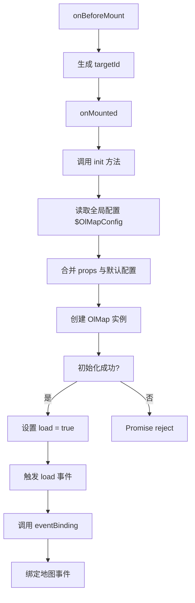

# 地图组件 API

<cite>
**本文档引用的文件**  
- [index.vue](file://src/packages/map/index.vue#L0-L220)
- [Map.ts](file://src/packages/types/Map.ts#L0-L28)
- [default.ts](file://src/packages/default.ts#L0-L169)
- [index.ts](file://src/packages/map/index.ts#L0-L6)
- [lib/index.ts](file://src/packages/lib/index.ts#L0-L45)
</cite>

## 目录
1. [简介](#简介)
2. [核心组件分析](#核心组件分析)
3. [属性详解](#属性详解)
4. [事件系统](#事件系统)
5. [插槽使用](#插槽使用)
6. [方法与暴露接口](#方法与暴露接口)
7. [初始化流程与依赖注入](#初始化流程与依赖注入)
8. [基础用法示例](#基础用法示例)
9. [高级响应式集成](#高级响应式集成)
10. [常见问题与解决方案](#常见问题与解决方案)
11. [性能优化建议](#性能优化建议)

## 简介
`OlMap` 是基于 OpenLayers 封装的 Vue 3 地图核心组件，提供声明式 API 用于构建交互式地图应用。该组件封装了 OpenLayers 的 `Map` 实例，支持通过 `props` 配置视图、控件、交互行为等，并通过 `provide/inject` 机制将地图实例注入子组件，实现图层、控件等子组件的无缝集成。

**Section sources**
- [index.vue](file://src/packages/map/index.vue#L0-L220)

## 核心组件分析

`OlMap` 组件是整个地图系统的入口，其核心职责包括：
- 初始化 OpenLayers 的 `Map` 实例
- 管理地图容器的 DOM 渲染
- 提供事件绑定与生命周期管理
- 通过依赖注入（`provide`）暴露地图实例给子组件

组件采用 `<script setup>` 语法，结合 Vue 的组合式 API 实现响应式逻辑。

```mermaid
classDiagram
class OlMap {
+props : VMap
+emits : MapEmitsType
+map : Ref<OlMap>
+targetId : Ref<string>
+load : Ref<boolean>
+init() : Promise
+eventBinding() : void
+dispose() : void
+getMap() : Map
+getLayerById(id : string) : BaseLayer
+panTo(params : AnimationOptions) : void
+flyTo(params : flyAnimationOptions) : void
}
class OlMapInstance {
+map : Map
+constructor(option : VMap)
}
OlMap --> OlMapInstance : "实例化"
OlMap --> "VMap" : "类型约束"
OlMap --> "MapEmitsType" : "事件类型"
```

**Diagram sources**
- [index.vue](file://src/packages/map/index.vue#L0-L220)
- [lib/index.ts](file://src/packages/lib/index.ts#L0-L45)
- [Map.ts](file://src/packages/types/Map.ts#L0-L28)

**Section sources**
- [index.vue](file://src/packages/map/index.vue#L0-L220)
- [lib/index.ts](file://src/packages/lib/index.ts#L0-L45)

## 属性详解

`OlMap` 组件的属性继承自 OpenLayers 的 `MapOptions`，并通过 `VMap` 类型进行扩展和约束。

### 属性定义
```ts
interface Props extends VMap {
  width?: string | number;
  height?: string | number;
}
```

### 主要属性说明

:属性名: `center`  
:类型: `number[]`  
:默认值: `[108.5525, 34.3227]` (中国中心)  
:说明: 地图视图的中心坐标，格式为 `[经度, 纬度]`。可通过 `view` 属性传递。

:属性名: `zoom`  
:类型: `number`  
:默认值: `5`  
:说明: 地图初始缩放级别。可通过 `view` 属性传递。

:属性名: `rotation`  
:类型: `number`  
:默认值: `0`  
:说明: 地图旋转角度（弧度）。可通过 `view` 属性传递。

:属性名: `projection`  
:类型: `string`  
:默认值: `"EPSG:4326"`  
:说明: 地图投影坐标系。可通过 `view` 属性传递。

:属性名: `width`  
:类型: `string | number`  
:默认值: `"100%"`  
:说明: 地图容器的宽度。支持像素值或百分比。

:属性名: `height`  
:类型: `string | number`  
:默认值: `"100%"`  
:说明: 地图容器的高度。支持像素值或百分比。

:属性名: `target`  
:类型: `string`  
:默认值: `""`  
:说明: 地图容器的 DOM 元素 ID。若未指定，则自动生成。

:属性名: `controls`  
:类型: `DefaultsOptions`  
:默认值: 见 `default.ts`  
:说明: 地图控件配置，如缩放、比例尺等。

:属性名: `interactions`  
:类型: `DefaultsOptions`  
:默认值: 见 `default.ts`  
:说明: 地图交互行为配置，如拖拽、双击缩放等。

**Section sources**
- [index.vue](file://src/packages/map/index.vue#L28-L37)
- [Map.ts](file://src/packages/types/Map.ts#L9-L14)
- [default.ts](file://src/packages/default.ts#L123-L169)

## 事件系统

`OlMap` 组件通过 `defineEmits` 定义了多个地图事件，用于响应用户交互和地图状态变化。**更新** 事件系统已统一使用 `MapBrowserEvent` 类型。

### 事件定义
```ts
export interface MapEmitsType {
  (e: "load"): void;
  (e: "changeZoom", evt: ChangeZoomEvtTyp, map: Map | undefined): void;
  (e: "singleclick", evt: MapBrowserEvent): void;
  (e: "click", evt: MapBrowserEvent): void;
  (e: "dblclick", evt: MapBrowserEvent): void;
  (e: "pointerdrag", evt: MapBrowserEvent): void;
  (e: "contextmenu", evt: MapBrowserEvent): void;
  (e: "precompose", evt: MapBrowserEvent): void;
  (e: "postrender", evt: MapBrowserEvent): void;
  (e: "loadend", evt: MapBrowserEvent): void;
  (e: "loadstart", evt: MapBrowserEvent): void;
  (e: "moveend", evt: MapBrowserEvent): void;
  (e: "movestart", evt: MapBrowserEvent): void;
}
```

### 主要事件说明

:事件名: `load`  
:触发时机: 地图实例初始化成功后  
:携带数据: 无  
:说明: 表示地图已成功加载，可用于执行后续操作。

:事件名: `changeZoom`  
:触发时机: 地图缩放级别发生变化时  
:携带数据: 包含原始事件和当前缩放级别的对象，使用 `MapBrowserEvent` 类型  
:说明: 可用于监听缩放变化并执行相应逻辑。

:事件名: `click`  
:触发时机: 用户单击地图时  
:携带数据: `MapBrowserEvent` 对象，包含坐标、像素位置等信息  
:说明: 常用于地图点击交互。

:事件名: `moveend`  
:触发时机: 地图视图移动结束时  
:携带数据: `MapBrowserEvent` 对象  
:说明: 可用于在地图移动后加载数据或更新状态。

:事件名: `singleclick`  
:触发时机: 用户单击（非双击）地图时  
:携带数据: `MapBrowserEvent` 对象  
:说明: 与 `click` 类似，但可区分单击和双击。

:事件名: `dblclick`  
:触发时机: 用户双击地图时  
:携带数据: `MapBrowserEvent` 对象  
:说明: 可用于双击缩放等操作。

:事件名: `pointerdrag`  
:触发时机: 用户拖拽地图时  
:携带数据: `MapBrowserEvent` 对象  
:说明: 可用于实时响应拖拽行为。

:事件名: `contextmenu`  
:触发时机: 用户右键点击地图时  
:携带数据: `MapBrowserEvent` 对象  
:说明: 可用于打开上下文菜单。

:事件名: `precompose`  
:触发时机: 渲染前事件  
:携带数据: `MapBrowserEvent` 对象  
:说明: 可用于自定义渲染前的处理逻辑。

:事件名: `postrender`  
:触发时机: 渲染后事件  
:携带数据: `MapBrowserEvent` 对象  
:说明: 可用于渲染后的处理逻辑。

:事件名: `loadend`  
:触发时机: 资源加载完成事件  
:携带数据: `MapBrowserEvent` 对象  
:说明: 可用于资源加载完成后的处理。

:事件名: `loadstart`  
:触发时机: 资源开始加载事件  
:携带数据: `MapBrowserEvent` 对象  
:说明: 可用于资源加载开始前的处理。

**Section sources**
- [index.vue](file://src/packages/map/index.vue#L66-L82)

## 插槽使用

`OlMap` 组件支持默认插槽，用于嵌套图层、控件等子组件。

### 插槽说明
- **默认插槽**: 在地图容器内渲染子组件，如 `OlTile`、`OlVector`、`OlOverlay` 等。
- 插槽内容仅在地图加载完成后（`load` 为 `true`）渲染，确保子组件能正确访问地图实例。

### 使用示例
```vue
<ol-map :view="view">
  <ol-tile tile-type="TDT" />
  <ol-vector :source="vectorSource" />
  <ol-overlay :position="overlayPosition">
    <div>这是一个弹窗</div>
  </ol-overlay>
</ol-map>
```

**Section sources**
- [index.vue](file://src/packages/map/index.vue#L213-L217)

## 方法与暴露接口

`OlMap` 组件通过 `defineExpose` 暴露了多个方法和属性，供父组件调用。

### 暴露接口定义
```ts
defineExpose({
  map: getMap,
  getMap,
  getLayerById,
  panTo,
  flyTo,
  readFeatures,
  setCursor,
});
```

### 主要方法说明

:方法名: `getMap`  
:参数: 无  
:返回值: `Map` 实例  
:说明: 获取底层 OpenLayers 地图实例，可用于直接调用 OpenLayers API。

:方法名: `getLayerById`  
:参数: `id: string` (图层 ID)  
:返回值: `BaseLayer | undefined`  
:说明: 根据图层 ID 查找并返回图层对象。

:方法名: `panTo`  
:参数: `params: AnimationOptions` (动画参数)  
:返回值: 无  
:说明: 平滑移动地图到指定位置，支持动画配置。

:方法名: `flyTo`  
:参数: `params: flyAnimationOptions` (飞行动画参数)  
:返回值: 无  
:说明: 以飞行动画效果移动地图到指定位置。

:方法名: `setCursor`  
:参数: `type: string` (光标类型)  
:返回值: 无  
:说明: 强制设置地图容器的鼠标光标样式。

**Section sources**
- [index.vue](file://src/packages/map/index.vue#L187-L209)

## 初始化流程与依赖注入

`OlMap` 组件的初始化流程如下：



**Diagram sources**
- [index.vue](file://src/packages/map/index.vue#L179-L186)

**Section sources**
- [index.vue](file://src/packages/map/index.vue#L179-L186)
- [lib/index.ts](file://src/packages/lib/index.ts#L8-L45)

### 依赖注入机制
组件通过 `provide("VMap", map)` 将地图实例注入上下文，子组件可通过 `inject("VMap")` 获取，实现父子组件间的通信。

```ts
// 子组件中获取地图实例
const VMap = inject("VMap");
```

此机制是 `OlMap` 与 `OlTile`、`OlVector` 等子组件协同工作的基础。

## 基础用法示例

```vue
<script setup lang="ts">
import { OlMap, VMap } from "v-3-ol-map";

// 定义视图配置
const view: VMap["view"] = {
  center: [116.4074, 39.9042], // 北京坐标
  zoom: 10,
  projection: "EPSG:4326"
};
</script>

<template>
  <ol-map :view="view" width="800px" height="600px">
    <!-- 添加天地图瓦片图层 -->
    <ol-tile tile-type="TDT" />
  </ol-map>
</template>
```

## 高级响应式集成

`OlMap` 支持与 Vue 响应式系统深度集成，例如动态更新视图：

```vue
<script setup lang="ts">
import { ref, watch } from "vue";
import { OlMap, VMap } from "v-3-ol-map";

const center = ref([116.4074, 39.9042]);
const zoom = ref(10);

const view = ref<VMap["view"]>({
  center: center.value,
  zoom: zoom.value
});

// 监听中心点变化
watch(center, (newVal) => {
  view.value = { ...view.value, center: newVal };
});

// 监听缩放级别变化
watch(zoom, (newVal) => {
  view.value = { ...view.value, zoom: newVal };
});
</script>

<template>
  <ol-map :view="view" />
</template>
```

## 常见问题与解决方案

### 问题：地图容器未正确渲染
:原因: 父容器未设置宽高，导致地图容器尺寸为 0。
:解决方案: 确保 `OlMap` 的父元素具有明确的宽度和高度，或直接在 `OlMap` 上设置 `width` 和 `height` 属性。

### 问题：子组件无法访问地图实例
:原因: `provide` 的 `map` 实例尚未创建。
:解决方案: 确保子组件在 `OlMap` 的 `load` 事件触发后才被渲染（使用 `v-if="load"`）。

### 问题：地图初始化失败
:原因: `target` 对应的 DOM 元素不存在。
:解决方案: 确保 `target` ID 在页面中唯一且有效，或不设置 `target` 由组件自动生成。

## 性能优化建议

1. **合理设置 `view` 参数**: 避免频繁修改 `center`、`zoom` 等属性，减少 `moveend` 事件的触发频率。
2. **按需加载图层**: 使用 `v-if` 控制图层的显隐，避免不必要的渲染。
3. **优化事件监听**: 及时清理不再需要的事件监听器，防止内存泄漏。
4. **使用 `shallowRef`**: 对于大型对象（如地图实例），使用 `shallowRef` 提升响应式性能。
5. **避免频繁调用 `getMap`**: 缓存地图实例引用，减少 `inject` 查找开销。

**Section sources**
- [index.vue](file://src/packages/map/index.vue#L0-L220)
- [lib/index.ts](file://src/packages/lib/index.ts#L0-L45)