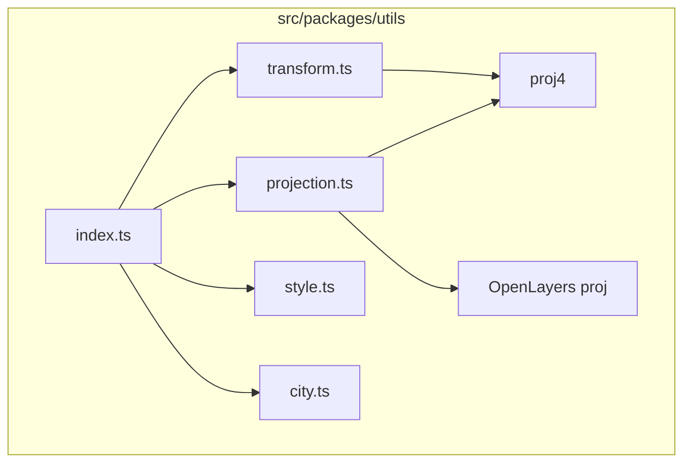
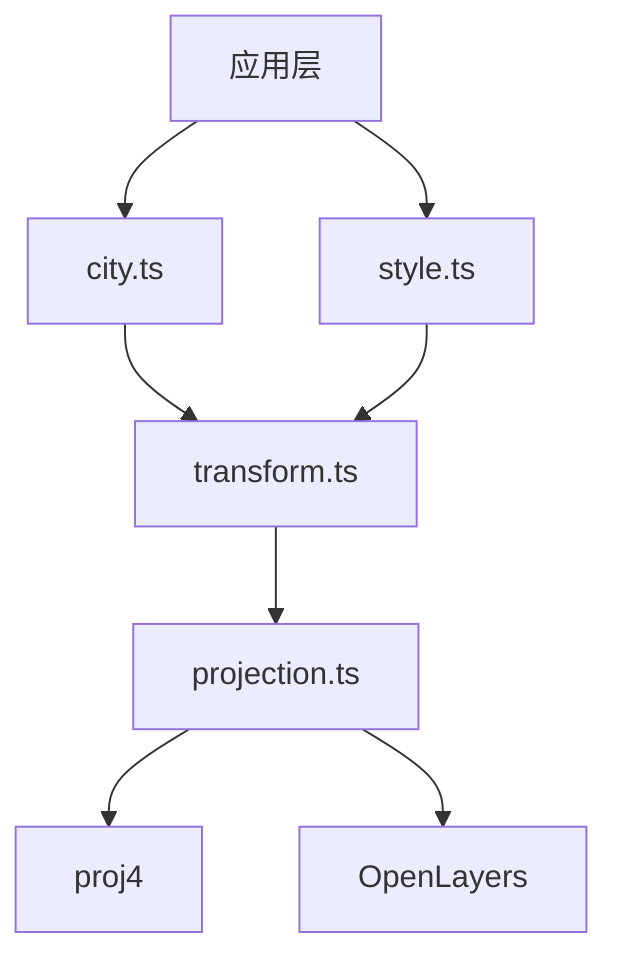
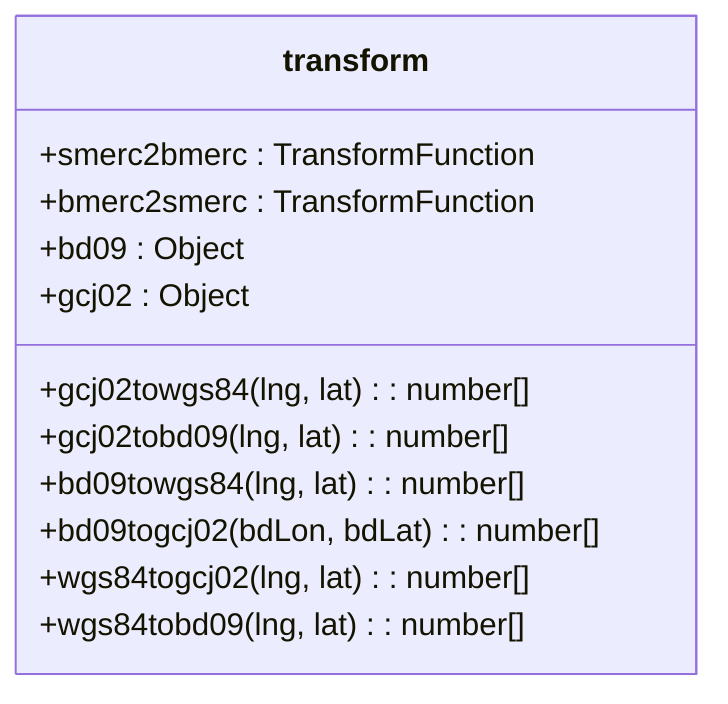
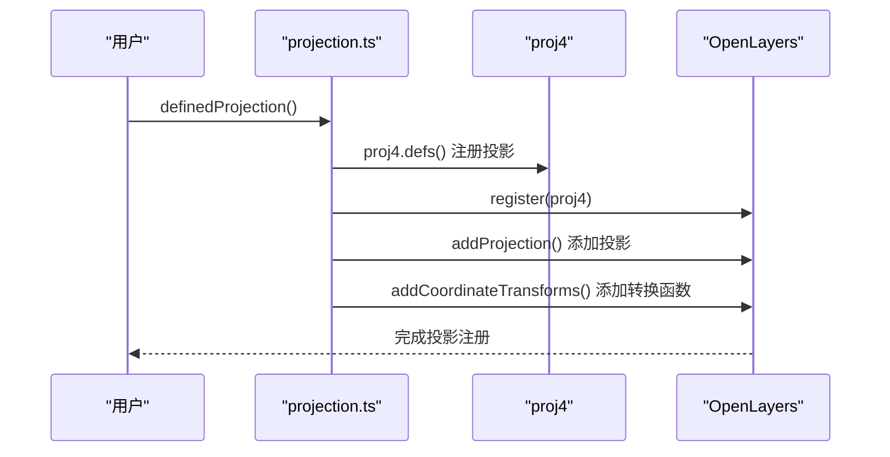
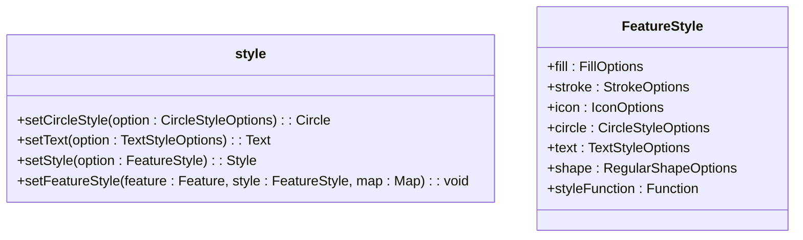
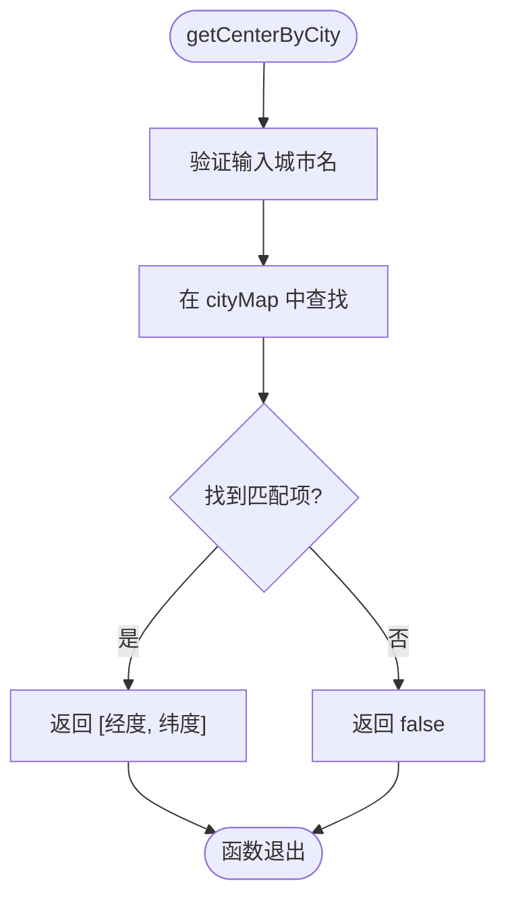
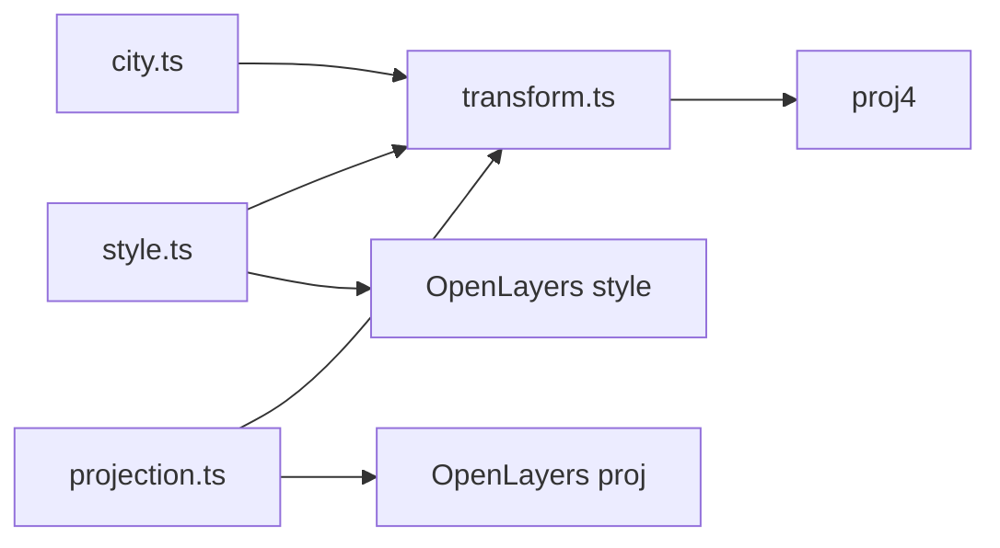

# 工具函数 API

<cite>
**本文档中引用的文件**  
- [index.ts](file://src/packages/utils/index.ts)
- [transform.ts](file://src/packages/utils/transform.ts)
- [projection.ts](file://src/packages/utils/projection.ts)
- [style.ts](file://src/packages/utils/style.ts)
- [city.ts](file://src/packages/utils/city.ts)
</cite>

## 目录
1. [简介](#简介)
2. [项目结构](#项目结构)
3. [核心组件](#核心组件)
4. [架构概览](#架构概览)
5. [详细组件分析](#详细组件分析)
6. [依赖分析](#依赖分析)
7. [性能考虑](#性能考虑)
8. [故障排除指南](#故障排除指南)
9. [结论](#结论)

## 简介
本文档旨在为 `v3-ol-map` 项目中的工具函数模块提供详尽的 API 参考文档。重点涵盖坐标转换、投影管理、样式生成和城市数据查询等实用功能。通过对 `src/packages/utils` 目录下关键文件的深入分析，本文档将精确描述每个函数的参数类型、返回值类型、功能语义及使用边界条件，并提供典型使用场景的代码示例和性能优化建议。

## 项目结构
`src/packages/utils` 目录是项目的核心工具库，包含多个独立的工具模块，每个模块负责特定的功能领域。这些模块通过 `index.ts` 文件统一导出，形成一个完整的工具集。

**图源**
- [index.ts](file://src/packages/utils/index.ts)
- [transform.ts](file://src/packages/utils/transform.ts)
- [projection.ts](file://src/packages/utils/projection.ts)

## 核心组件
本节将深入分析 `src/packages/utils` 目录下的四个核心工具模块：`transform.ts`、`projection.ts`、`style.ts` 和 `city.ts`。这些模块共同构成了地图应用的基础功能支撑。

**节源**
- [transform.ts](file://src/packages/utils/transform.ts)
- [projection.ts](file://src/packages/utils/projection.ts)
- [style.ts](file://src/packages/utils/style.ts)
- [city.ts](file://src/packages/utils/city.ts)

## 架构概览
整个工具函数模块采用分层架构设计。`transform.ts` 和 `projection.ts` 负责底层的地理坐标计算和投影转换，`style.ts` 负责地图要素的视觉表现，而 `city.ts` 则提供上层的业务数据查询。`index.ts` 作为统一的入口，将这些功能模块进行整合和导出。

**图源**
- [index.ts](file://src/packages/utils/index.ts)
- [transform.ts](file://src/packages/utils/transform.ts)
- [projection.ts](file://src/packages/utils/projection.ts)
- [style.ts](file://src/packages/utils/style.ts)
- [city.ts](file://src/packages/utils/city.ts)

## 详细组件分析

### 坐标转换与投影管理分析

#### transform.ts 模块分析
该模块是坐标转换的核心，封装了多种坐标系（WGS84、GCJ-02、BD-09）之间的转换算法。

**图源**
- [transform.ts](file://src/packages/utils/transform.ts#L1-L458)

**节源**
- [transform.ts](file://src/packages/utils/transform.ts#L1-L458)

#### projection.ts 模块分析
该模块负责在 OpenLayers 框架中注册和管理自定义投影，利用 `proj4` 库实现不同投影坐标系之间的转换。

**图源**
- [projection.ts](file://src/packages/utils/projection.ts#L1-L163)

**节源**
- [projection.ts](file://src/packages/utils/projection.ts#L1-L163)

### 样式生成分析

#### style.ts 模块分析
该模块提供了一套完整的 API，用于动态生成 OpenLayers 地图要素的样式。

**图源**
- [style.ts](file://src/packages/utils/style.ts#L1-L135)

**节源**
- [style.ts](file://src/packages/utils/style.ts#L1-L135)

### 城市数据查询分析

#### city.ts 模块分析
该模块提供了一个包含中国主要城市经纬度信息的静态数据表，并提供了根据城市名称查询中心点坐标的便捷方法。

**图源**
- [city.ts](file://src/packages/utils/city.ts#L1-L1882)

**节源**
- [city.ts](file://src/packages/utils/city.ts#L1-L1882)

## 依赖分析
工具函数模块的依赖关系清晰，形成了一个稳定的功能链。

**图源**
- [index.ts](file://src/packages/utils/index.ts)
- [transform.ts](file://src/packages/utils/transform.ts)
- [projection.ts](file://src/packages/utils/projection.ts)
- [style.ts](file://src/packages/utils/style.ts)
- [city.ts](file://src/packages/utils/city.ts)

**节源**
- [index.ts](file://src/packages/utils/index.ts)
- [transform.ts](file://src/packages/utils/transform.ts)
- [projection.ts](file://src/packages/utils/projection.ts)
- [style.ts](file://src/packages/utils/style.ts)
- [city.ts](file://src/packages/utils/city.ts)

## 性能考虑
在使用这些工具函数时，应注意以下性能优化建议：
1. **避免在渲染循环中调用高开销函数**：如 `transformCoordinates` 和 `createStyle` 等函数涉及复杂的数学计算或对象创建，不应在地图的 `render` 事件或 `requestAnimationFrame` 循环中频繁调用。
2. **缓存计算结果**：对于频繁查询的城市中心点，建议在应用启动时将其结果缓存到内存中，避免重复的数组查找操作。
3. **批量操作**：当需要转换大量坐标时，应优先使用 `transform` 模块提供的批量转换函数，而不是对单个坐标进行循环调用。

## 故障排除指南
*   **坐标转换结果不正确**：请检查输入的坐标是否在有效范围内，特别是对于中国地区的坐标，需确认其原始坐标系（WGS84、GCJ-02 或 BD-09）。
*   **自定义投影无法使用**：确保在使用自定义投影前已调用 `definedProjection()` 函数完成注册。
*   **样式未生效**：检查 `FeatureStyle` 对象的属性名是否正确，并确认 `setFeatureStyle` 函数的调用时机是否在要素添加到图层之后。

## 结论
`src/packages/utils` 模块为 `v3-ol-map` 项目提供了强大且灵活的工具集。通过深入理解 `transform.ts`、`projection.ts`、`style.ts` 和 `city.ts` 四个核心模块的实现原理和使用方法，开发者可以高效地构建复杂的地理信息系统应用。遵循本文档提供的最佳实践，将有助于提升应用的性能和稳定性。