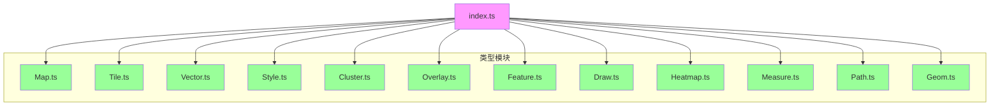

# 类型定义参考

<cite>
**本文档引用的文件**
- [Map.ts:0-41](file://src/packages/types/Map.ts#L0-L41)
- [Tile.ts:0-74](file://src/packages/types/Tile.ts#L0-L74)
- [Vector.ts:0-49](file://src/packages/types/Vector.ts#L0-L49)
- [Style.ts:0-49](file://src/packages/types/Style.ts#L0-L49)
- [Cluster.ts:0-24](file://src/packages/types/Cluster.ts#L0-L24)
- [Overlay.ts:0-7](file://src/packages/types/Overlay.ts#L0-L7)
- [Feature.ts:0-78](file://src/packages/types/Feature.ts#L0-L78)
- [Draw.ts:0-18](file://src/packages/types/Draw.ts#L0-L18)
- [Geom.ts:0-2](file://src/packages/types/Geom.ts#L0-L2)
- [Heatmap.ts:0-8](file://src/packages/types/Heatmap.ts#L0-L8)
- [Measure.ts:0-11](file://src/packages/types/Measure.ts#L0-L11)
- [Path.ts:0-39](file://src/packages/types/Path.ts#L0-L39)
- [index.ts:0-26](file://src/packages/types/index.ts#L0-L26)
- [generateArgTypes.ts:0-99](file://src/stories/utils/generateArgTypes.ts#L0-L99)
</cite>

## 目录
1. [简介](#简介)
2. [项目结构概览](#项目结构概览)
3. [核心类型定义分析](#核心类型定义分析)
4. [MapOptions 类型详解](#mapoptions-类型详解)
5. [TileLayerOptions 类型详解](#tilelayeroptions-类型详解)
6. [VectorLayerOptions 类型详解](#vectorlayeroptions-类型详解)
7. [FeatureStyle 类型详解](#featurestyle-类型详解)
8. [ClusterOptions 类型详解](#clusteroptions-类型详解)
9. [OverlayOptions 类型详解](#overlayoptions-类型详解)
10. [新增类型：Feature、Draw、Heatmap、Measure、Path](#新增类型featuredrawheatmapmeasurepath)
11. [类型安全与扩展机制](#类型安全与扩展机制)
12. [类型导入与 Tree-shaking 兼容性](#类型导入与-tree-shaking-兼容性)
13. [generateArgTypes 工具函数与类型信息提取](#generateargtypes-工具函数与类型信息提取)

## 简介
本文档旨在为 `src/packages/types` 目录下的所有 TypeScript 接口和类型别名提供完整的技术参考。通过系统性地解析 `MapOptions`、`TileLayerOptions`、`VectorLayerOptions`、`FeatureStyle`、`ClusterOptions`、`OverlayOptions` 以及新增的 `Feature`、`Draw`、`Heatmap`、`Measure`、`Path` 等关键类型，帮助开发者理解其字段含义、嵌套结构及默认行为。文档结合代码示例说明如何在组件 props 和函数参数中使用这些类型，并展示如何扩展内置类型以满足自定义需求。

**更新** 新增了基于 `generateArgTypes` 工具函数的类型信息提取能力，显著提升了 API 参考的准确性和文档生成效率。

## 项目结构概览
`src/packages/types` 是项目中集中管理地图相关组件类型定义的核心模块，采用模块化设计，每个功能模块拥有独立的类型文件，并通过 `index.ts` 统一导出。



**图示来源**
- [index.ts:0-26](file://src/packages/types/index.ts#L0-L26)

## 核心类型定义分析
`src/packages/types` 模块通过 TypeScript 的接口（interface）和类型别名（type）为地图组件提供强类型支持，确保开发过程中的类型安全和 IDE 智能提示。

### 类型组织结构
该模块采用"按功能拆分 + 统一聚合"的策略：
- 每个地图组件（如 Tile、Vector、Cluster）拥有独立的 `.ts` 文件
- 所有类型通过 `index.ts` 使用 `export * from "./xxx"` 统一导出
- 类型之间通过交叉类型（&）和 `Omit` 工具类型进行复用和扩展

这种设计提高了可维护性和可扩展性，同时支持按需导入。

**本节来源**
- [index.ts:0-26](file://src/packages/types/index.ts#L0-L26)

## MapOptions 类型详解
`VMap` 接口定义了地图组件的核心配置选项，位于 `Map.ts` 文件中。

```ts
export declare type VMap = defMapOptions & {
  controls?: import("ol/control/defaults").DefaultsOptions;
  interactions?: import("ol/interaction/defaults").DefaultsOptions;
  view?: View;
  target?: string;
};
```

### 关键字段说明
- **controls**: 控件配置，类型为 OpenLayers 的 `DefaultsOptions`，用于控制是否启用默认控件（如缩放按钮）
- **interactions**: 交互行为配置，同样使用 `DefaultsOptions`，控制拖拽、缩放等交互
- **view**: 视图配置，扩展自 `ViewOptions`，支持添加 `city` 字段用于城市定位
- **target**: 渲染目标 DOM 元素的 ID 字符串

### 默认行为
若未提供 `controls` 或 `interactions`，将使用 OpenLayers 的默认配置。`view` 字段允许通过 `city` 属性快速定位到指定城市。

**本节来源**
- [Map.ts:0-41](file://src/packages/types/Map.ts#L0-L41)

## TileLayerOptions 类型详解
`BaseTileProps` 接口定义了瓦片图层的基本配置，位于 `Tile.ts` 文件中。

```ts
export interface BaseTileProps extends TileLayerOptions {
  tileType?: TileType;
  layerId?: string;
  source?: SourceOptions | undefined;
}
```

### 枚举类型 TileType
`enumTile` 枚举定义了支持的瓦片服务类型：

```ts
export enum enumTile {
  TDT = "天地图",
  TDT_SATELLITE = "天地图-卫星影像",
  TDT_TERRAIN = "天地图-地形图",
  MAPBOX = "MAPBOX",
  BAIDU = "百度-矢量",
  BAIDU_SATELLITE = "百度-卫星影像",
  BAIDU_MIDNIGHT = "百度-午夜蓝",
  AMAP = "高德-矢量",
  AMAP_SATELLITE = "高德-卫星影像",
  GEOTIFF = "GEOTIFF",
  CUSTOMER = "CUSTOMER",
  XYZ = "XYZ",
  OSM = "OSM",
}
```

### 嵌套结构分析
- **tileType**: 指定瓦片服务类型，决定默认的 `source` 配置
- **layerId**: 图层唯一标识符，用于后续通过 `getLayerById` 查找
- **source**: 数据源配置，继承自 OpenLayers 的 `Tile` 源选项，并扩展 `tileGrid` 支持

### 特殊类型支持
- `WebGLTileOptions`: 支持 GeoTIFF 数据的 WebGL 渲染
- `ImageLayerOptions`: 支持静态图像图层
- `VectorTileOptions`: 支持矢量瓦片图层

**本节来源**
- [Tile.ts:0-74](file://src/packages/types/Tile.ts#L0-L74)

## VectorLayerOptions 类型详解
`VectorLayerOptions` 接口定义了矢量图层的配置，位于 `Vector.ts` 文件中。

```ts
export interface VectorLayerOptions extends defaultVectorOptions {
  layerId?: string;
  source?: VectorSourceOptions;
  layerStyle?: LayerOptions["style"] | DefaultStyle | WebGLStyle;
  featureStyle?: FeatureStyle;
  modify?: boolean;
  translate?: boolean;
}
```

### 关键字段说明
- **source**: 矢量数据源配置，支持多种格式（GeoJSON、EsriJSON 等）
- **layerStyle**: 图层级样式，兼容 OpenLayers 原生样式和扁平化样式
- **featureStyle**: 要素级样式，引用自 `Style.ts` 中的 `FeatureStyle`
- **modify**: 是否启用要素编辑交互
- **translate**: 是否启用要素平移交互

### 数据格式支持
通过 `VectorSourceOptions` 中的 `featureFormat` 字段，支持动态指定数据解析格式：
- GeoJSON
- EsriJSON
- GML
- KML
- TopoJSON

**本节来源**
- [Vector.ts:0-49](file://src/packages/types/Vector.ts#L0-L49)

## FeatureStyle 类型详解
`FeatureStyle` 接口定义了地理要素的样式规则，位于 `Style.ts` 文件中。

```ts
export interface FeatureStyle extends FeatureStyleOptions {
  styleFunction?: (feature: FeatureLike, resolution: number, map: Map, style: Style) => Style | Array<Style> | void;
}
```

### 样式结构组成
`FeatureStyle` 支持以下样式组件：
- **fill**: 填充样式（颜色、图案）
- **stroke**: 边框样式（颜色、宽度）
- **icon**: 图标样式（图片路径、尺寸）
- **text**: 文本样式（字体、颜色、背景）
- **circle**: 圆形图像样式
- **shape**: 正多边形样式
- **styleFunction**: 动态样式函数，可根据要素属性返回不同样式

### 动态样式示例
```ts
const dynamicStyle: FeatureStyle = {
  styleFunction: (feature, resolution) => {
    const type = feature.get('type');
    return new Style({
      fill: new Fill({ color: type === 'high' ? 'red' : 'blue' })
    });
  }
};
```

**本节来源**
- [Style.ts:0-49](file://src/packages/types/Style.ts#L0-L49)

## ClusterOptions 类型详解
`ClusterLayerOptions` 接口定义了要素聚合图层的配置，位于 `Cluster.ts` 文件中。

```ts
export interface Options extends Omit<import("ol/layer/Vector").Options, "source"> {
  layerId?: string;
  source?: import("ol/source/Vector").Options;
  clusterOptions?: import("ol/source/Cluster").Options<Feature>;
  clusterStyle?: ClusterStyle | ClusterStyle[];
  layerStyle?: import("ol/layer/Vector").Options["style"] | StyleOptions;
  superCluster?: import("supercluster").Options<AnyProps, AnyProps> | undefined;
}
```

### 关键字段说明
- **clusterOptions**: 聚合算法参数，如 `distance`（聚合距离）
- **clusterStyle**: 聚合样式，支持范围样式（`min`/`max`）
- **layerStyle**: 非聚合状态下的图层样式
- **superCluster**: 第三方高性能聚合库 `supercluster` 的配置选项

### 聚合样式示例
```ts
const clusterStyle: ClusterStyle = {
  min: 2,
  max: 10,
  fill: { color: 'rgba(255, 155, 0, 0.5)' },
  stroke: { color: '#ff0', width: 2 }
};
```

**本节来源**
- [Cluster.ts:0-24](file://src/packages/types/Cluster.ts#L0-L24)

## OverlayOptions 类型详解
`OverlayOptions` 接口定义了覆盖物（如弹窗、标注）的配置，位于 `Overlay.ts` 文件中。

```ts
export interface OverlayOptions extends Options {
  overlayId?: string;
  data?: {};
}
```

### 扩展字段说明
- **overlayId**: 覆盖物唯一标识符，便于管理和查找
- **data**: 附加数据对象，可用于存储业务相关数据

该类型继承自 OpenLayers 的 `Overlay.Options`，保持了与原生 API 的兼容性。

**本节来源**
- [Overlay.ts:0-7](file://src/packages/types/Overlay.ts#L0-L7)

## 新增类型：Feature、Draw、Heatmap、Measure、Path
随着项目功能的扩展，新增了多个专门的类型定义模块，为特定功能提供精确的类型支持。

### Feature 类型系统
`Feature.ts` 提供了完整的 GeoJSON 几何类型定义：

```ts
export declare type GeoPoint = {
  coordinates: Position;
};
export declare type GeoPolygon = {
  coordinates: Position[][] | Position;
};
export declare type GeoLineString = {
  coordinates: Position[] | Position;
};
// ... 更多几何类型
```

支持的几何类型包括：点、线、面、多点、多线、多面、圆、几何集合等。

### Draw 交互类型
`Draw.ts` 定义了绘图交互的类型：

```ts
export declare type DrawType = Options["type"] | ExtendType;
export declare type ExposeDraw = {
  render: () => void;
  clear: () => void;
  setActive: (active: boolean) => void;
};
```

### Heatmap 热力图类型
`Heatmap.ts` 提供热力图图层配置：

```ts
export interface HeatmapOptions extends Omit<import("ol/layer/Heatmap").Options, "source"> {
  layerId?: string;
  source?: import("ol/source/Vector").Options;
}
```

### Measure 测量类型
`Measure.ts` 定义了测量交互类型：

```ts
export type MeasureType = "length" | "area" | "" | undefined | null;
export declare type ExposeMeasure = {
  clear: () => void;
  setActive: (active: boolean) => void;
};
```

### Path 路径动画类型
`Path.ts` 提供路径动画配置：

```ts
export interface PathOptions {
  bubble?: boolean;
  showTracePoint?: boolean;
  tracePointsModePlay?: "animation" | "skip";
  path?: PathInfo[];
  options?: Operators;
  autoPlay?: boolean;
  visible?: boolean;
  labelVisible?: boolean;
}
```

**本节来源**
- [Feature.ts:0-78](file://src/packages/types/Feature.ts#L0-L78)
- [Draw.ts:0-18](file://src/packages/types/Draw.ts#L0-L18)
- [Heatmap.ts:0-8](file://src/packages/types/Heatmap.ts#L0-L8)
- [Measure.ts:0-11](file://src/packages/types/Measure.ts#L0-L11)
- [Path.ts:0-39](file://src/packages/types/Path.ts#L0-L39)

## 类型安全与扩展机制
### 类型安全实现
- 使用 `Omit<T, K>` 工具类型排除不适用的原生属性
- 通过接口继承（`extends`）复用 OpenLayers 原生类型
- 使用 `declare type` 定义实例类型（如 `OlMapInstance`），支持 Vue 组件类型推导

### 自定义类型扩展示例
可通过继承 `FeatureStyle` 添加动画属性：

```ts
interface AnimatedFeatureStyle extends FeatureStyle {
  animationDuration?: number;
  fadeIn?: boolean;
}

const animatedStyle: AnimatedFeatureStyle = {
  fill: { color: 'red' },
  animationDuration: 1000,
  fadeIn: true
};
```

此机制允许开发者在不破坏原有类型系统的情况下扩展功能。

**本节来源**
- [Style.ts:0-49](file://src/packages/types/Style.ts#L0-L49)
- [Map.ts:0-41](file://src/packages/types/Map.ts#L0-L41)

## 类型导入与 Tree-shaking 兼容性
### 推荐导入方式
```ts
// 方式1：按需导入（推荐）
import type { VMap, VectorLayerOptions } from "@/packages/types/Map";
import type { FeatureStyle } from "@/packages/types/Style";
import type { GeoPoint, GeoPolygon } from "@/packages/types/Feature";

// 方式2：批量导入
import type * as MapTypes from "@/packages/types/Map";
import type * as FeatureTypes from "@/packages/types/Feature";
```

### Tree-shaking 兼容性
由于所有类型均通过 `export declare type` 或 `export interface` 定义，且 `index.ts` 使用静态 `export * from` 语法，现代打包工具（如 Vite、Webpack）可有效进行摇树优化，确保未使用的类型不会被打包。

### IDE 支持
- VS Code、WebStorm 等主流编辑器可提供完整的类型提示
- 支持跳转到定义、查找引用等高级功能
- 在 `.vue` 组件的 `props` 中使用时，可获得实时类型检查

**本节来源**
- [index.ts:0-26](file://src/packages/types/index.ts#L0-L26)
- [Map.ts:0-41](file://src/packages/types/Map.ts#L0-L41)
- [Style.ts:0-49](file://src/packages/types/Style.ts#L0-L49)

## generateArgTypes 工具函数与类型信息提取
### 工具函数概述
随着 Storybook 文档系统的完善，新增了 `generateArgTypes` 工具函数，专门用于从类型定义自动生成 Storybook 的 argTypes 配置，显著提升了 API 参考的准确性和维护效率。

### 核心功能特性
- **自动类型提取**：基于 TypeScript 类型系统提取属性信息
- **详细类型描述**：生成格式化的类型字符串，包含属性说明
- **文档链接集成**：支持为类型生成指向官方文档的链接
- **统一格式化**：提供一致的表格显示格式

### 主要函数说明

#### generateTypeDetail 函数
```ts
export function generateTypeDetail(properties: Record<string, string>): string {
  const entries = Object.entries(properties);
  if (entries.length === 0) return "{}";
  // ... 实现细节
}
```
用于生成对象类型的详细描述，支持属性对齐显示。

#### generateViewArgType 函数
```ts
export function generateViewArgType(): ArgTypes {
  return {
    view: {
      description: `地图视图配置，继承自 [ol/View.ViewOptions](https://openlayers.org/en/latest/apidoc/module-ol_View-ViewOptions.html)`,
      table: {
        type: {
          summary: "View extends ViewOptions",
          detail: generateTypeDetail(viewProperties),
        },
      },
    },
  };
}
```
专门为 View 类型生成 Storybook argTypes 配置。

#### generateObjectArgType 函数
```ts
export function generateObjectArgType(
  typeName: string,
  extendsFrom: string,
  properties: Record<string, string>,
  docUrl?: string,
): ArgTypes {
  // ... 实现细节
}
```
通用的类型生成器，支持自定义类型名称、继承关系和属性定义。

### 类型属性定义
工具函数内置了多种类型的属性定义：

#### ViewProperties
```ts
export const viewProperties: Record<string, string> = {
  city: "string | undefined - 城市名称（自定义扩展）",
  center: "[number, number] | undefined - 中心点坐标 [经度, 纬度]",
  zoom: "number | undefined - 缩放级别",
  // ... 更多属性
};
```

### 使用场景
这些工具函数主要用于 Storybook 故事文件中，为组件提供：
- 自动生成的属性描述
- 类型信息表格
- 官方文档链接
- 详细的参数说明

**本节来源**
- [generateArgTypes.ts:0-99](file://src/stories/utils/generateArgTypes.ts#L0-L99)