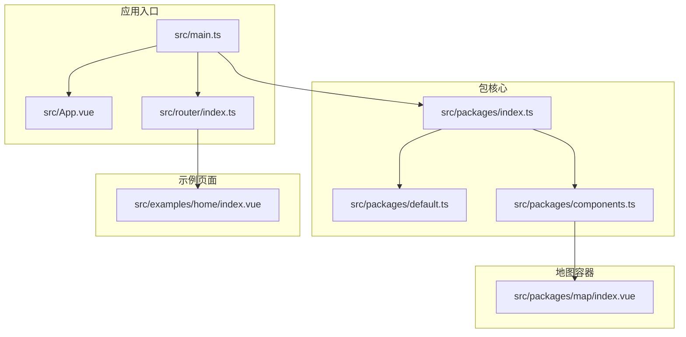
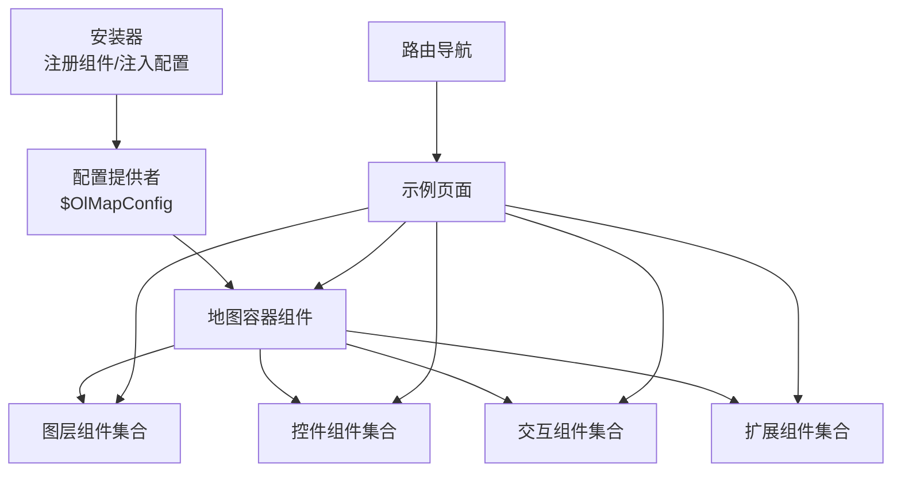
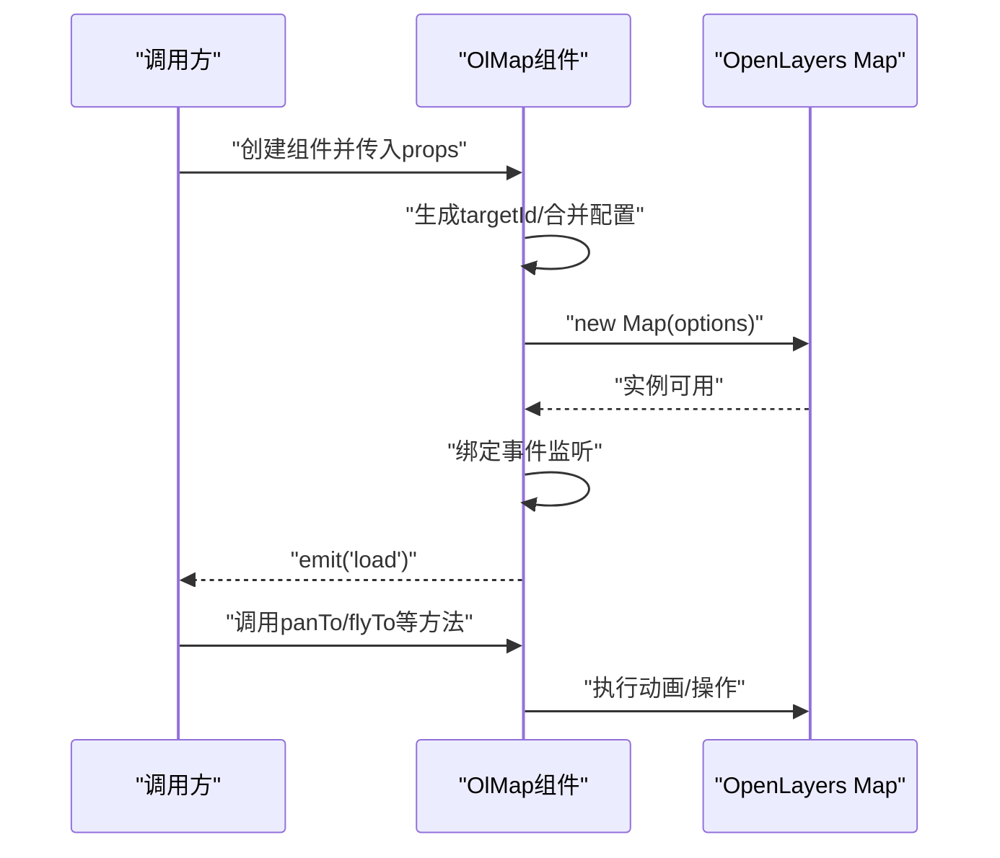
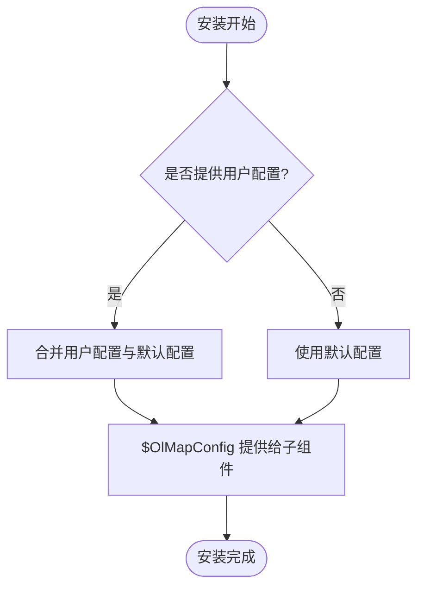
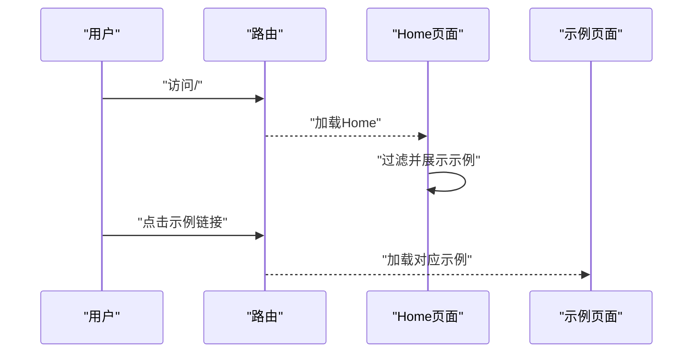
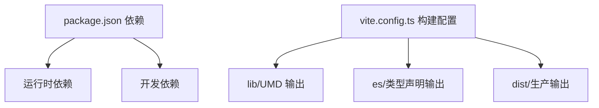

# 版本更新 129

<cite>
**本文档引用的文件**
- [package.json](file://package.json)
- [README.md](file://README.md)
- [src/main.ts](file://src/main.ts)
- [src/App.vue](file://src/App.vue)
- [src/packages/index.ts](file://src/packages/index.ts)
- [src/packages/default.ts](file://src/packages/default.ts)
- [src/packages/components.ts](file://src/packages/components.ts)
- [src/router/index.ts](file://src/router/index.ts)
- [vite.config.ts](file://vite.config.ts)
- [src/packages/map/index.vue](file://src/packages/map/index.vue)
- [src/examples/home/index.vue](file://src/examples/home/index.vue)
- [docs/guide/install.md](file://docs/guide/install.md)
- [docs/guide/start.md](file://docs/guide/start.md)
</cite>

## 目录
1. [简介](#简介)
2. [项目结构](#项目结构)
3. [核心组件](#核心组件)
4. [架构总览](#架构总览)
5. [详细组件分析](#详细组件分析)
6. [依赖关系分析](#依赖关系分析)
7. [性能考虑](#性能考虑)
8. [故障排除指南](#故障排除指南)
9. [结论](#结论)
10. [附录](#附录)

## 简介
本版本更新聚焦于 v3-ol-map 的整体架构与组件体系，围绕 Vue 3 与 OpenLayers 10 的集成方案，提供地图容器、图层管理、交互控制、扩展能力等模块化组件，并通过插件化安装方式统一注入全局配置。项目同时维护了丰富的示例页面与文档，便于开发者快速上手与深度定制。

版本特性概览：
- 基于 Vue 3 Composition API 重构核心组件，提升开发体验与类型安全
- 以 OpenLayers 原生 API 为基石，通过 props 透传参数，降低学习成本
- 插件式安装与全局配置注入，支持天地图、百度地图、高德地图等底图源
- 提供路由驱动的示例导航，覆盖瓦片、矢量、热力图、风场、WMS/WFS、轨迹回放、路径规划等场景
- 构建产物包含 UMD 库与 TypeScript 类型声明，便于在多种工程环境中使用

**章节来源**
- [README.md](file://README.md#L1-L131)
- [package.json](file://package.json#L1-L82)

## 项目结构
项目采用“包内分层 + 示例驱动”的组织方式，核心代码位于 src/packages 下，按功能划分为 map、layers、controls、interaction、echarts、ext 等子包；示例页面集中在 src/examples，文档位于 docs。

**图表来源**
- [src/main.ts](file://src/main.ts#L1-L34)
- [src/App.vue](file://src/App.vue#L1-L31)
- [src/packages/index.ts](file://src/packages/index.ts#L1-L9)
- [src/packages/default.ts](file://src/packages/default.ts#L1-L169)
- [src/packages/components.ts](file://src/packages/components.ts#L1-L97)
- [src/packages/map/index.vue](file://src/packages/map/index.vue#L1-L220)
- [src/router/index.ts](file://src/router/index.ts#L1-L313)
- [src/examples/home/index.vue](file://src/examples/home/index.vue#L1-L96)

**章节来源**
- [src/main.ts](file://src/main.ts#L1-L34)
- [src/App.vue](file://src/App.vue#L1-L31)
- [src/packages/index.ts](file://src/packages/index.ts#L1-L9)
- [src/packages/default.ts](file://src/packages/default.ts#L1-L169)
- [src/packages/components.ts](file://src/packages/components.ts#L1-L97)
- [src/router/index.ts](file://src/router/index.ts#L1-L313)

## 核心组件
- 插件安装器：负责注册所有组件并注入全局配置（地图默认视图、控件、交互、底图源等）
- 地图容器：封装 ol/Map，提供事件绑定、动画跳转、图层查询等能力
- 组件导出：统一从 packages/index.ts 导出，支持完整引入与按需引入
- 示例导航：通过路由展示各类功能示例，便于验证与演示

关键职责与行为：
- 插件安装器合并用户配置与默认配置，通过 provide/inject 向子组件提供上下文
- 地图容器在挂载时初始化 OpenLayers 实例，绑定常用事件并暴露工具方法
- 组件导出采用命名空间导出，配合 Volar 全局组件声明，提升 TS 支持

**章节来源**
- [src/packages/default.ts](file://src/packages/default.ts#L1-L169)
- [src/packages/map/index.vue](file://src/packages/map/index.vue#L1-L220)
- [src/packages/index.ts](file://src/packages/index.ts#L1-L9)
- [src/packages/components.ts](file://src/packages/components.ts#L1-L97)

## 架构总览
系统采用“插件安装 + 组件分发 + 示例导航”的三层架构：
- 插件层：安装器集中注册组件与配置，提供全局上下文
- 组件层：各功能组件（地图、图层、控件、交互）按需组合使用
- 应用层：示例页面与文档站点展示组件能力与使用方式

**图表来源**
- [src/packages/default.ts](file://src/packages/default.ts#L129-L169)
- [src/packages/map/index.vue](file://src/packages/map/index.vue#L1-L220)
- [src/router/index.ts](file://src/router/index.ts#L1-L313)

**章节来源**
- [src/packages/default.ts](file://src/packages/default.ts#L1-L169)
- [src/router/index.ts](file://src/router/index.ts#L1-L313)

## 详细组件分析

### 地图容器组件（OlMap）
- 功能要点
  - 接收 width/height/target 等属性，生成唯一容器 ID
  - 初始化 OpenLayers Map 实例，合并全局配置与本地 props
  - 绑定常用事件（点击、双击、移动、加载等），并通过 emit 分发
  - 提供平移/飞行动画、图层查询、光标状态管理等工具方法
- 关键流程
  - 生命周期：beforeMount 生成 targetId；mounted 初始化并绑定事件
  - 事件处理：统一收集事件列表，按名称绑定到 map 实例
  - 配置合并：优先使用全局配置中的 map/view/controls/interactions

**图表来源**
- [src/packages/map/index.vue](file://src/packages/map/index.vue#L83-L108)
- [src/packages/map/index.vue](file://src/packages/map/index.vue#L117-L149)
- [src/packages/map/index.vue](file://src/packages/map/index.vue#L173-L178)

**章节来源**
- [src/packages/map/index.vue](file://src/packages/map/index.vue#L1-L220)

### 插件安装器与全局配置
- 功能要点
  - 注册全部组件，支持按需安装
  - 合并用户配置与默认配置（地图默认视图、控件、交互、底图源）
  - 通过 provide/inject 提供 $OlMapConfig 上下文
- 默认配置
  - 包含天地图、百度地图、高德地图的 URL 模板与 AK 参数
  - 提供地图默认视图与瓦片图层默认参数

**图表来源**
- [src/packages/default.ts](file://src/packages/default.ts#L129-L169)
- [src/packages/default.ts](file://src/packages/default.ts#L97-L121)

**章节来源**
- [src/packages/default.ts](file://src/packages/default.ts#L1-L169)

### 示例导航与路由
- 功能要点
  - 基于 Vue Router 的 hash 模式导航
  - home 页面提供示例搜索与网格展示
  - 路由元信息包含标题、描述与隐藏字段
- 示例覆盖
  - 地图基础、瓦片图层、矢量图层、WebGL、热力图、风场、WMS/WFS、轨迹回放、路径规划、遮罩、交通等

**图表来源**
- [src/router/index.ts](file://src/router/index.ts#L11-L313)
- [src/examples/home/index.vue](file://src/examples/home/index.vue#L1-L96)

**章节来源**
- [src/router/index.ts](file://src/router/index.ts#L1-L313)
- [src/examples/home/index.vue](file://src/examples/home/index.vue#L1-L96)

## 依赖关系分析
- 运行时依赖
  - Vue 3、OpenLayers 10、ol-ext、ol-echarts、ol-wind、proj4、supercluster、throttle-debounce 等
- 构建与开发依赖
  - Vite、Storybook、VitePress、TypeScript、ESLint、Prettier 等
- 构建配置
  - 生产构建输出至 dist，库模式输出 UMD 至 lib，类型声明输出至 es
  - 别名映射 @ 与 v3-ol-map，简化导入路径

**图表来源**
- [package.json](file://package.json#L28-L80)
- [vite.config.ts](file://vite.config.ts#L6-L36)

**章节来源**
- [package.json](file://package.json#L1-L82)
- [vite.config.ts](file://vite.config.ts#L1-L99)

## 性能考虑
- 事件绑定策略
  - 仅绑定常用事件，避免过度监听导致的性能损耗
  - 使用 once 绑定 moveend 等事件，减少重复回调
- 动画与交互
  - 平移/飞行动画通过 OpenLayers 原生 API 执行，保持流畅性
  - 鼠标悬停检测使用 hasFeatureAtPixel，建议在大数据量场景下限制检测范围或频率
- 资源加载
  - 瓦片图层与 WMS/WFS 请求建议结合分页/裁剪策略，避免一次性加载过多数据
- 构建优化
  - 生产构建启用 console/debugger 移除，减小包体
  - 外部化 vue 与 vue-router，降低打包体积

[本节为通用指导，无需特定文件分析]

## 故障排除指南
- 在线底图无法加载
  - 检查安装时是否正确传入天地图/百度地图的 AK 与 URL 模板
  - 确认网络环境与跨域设置
- 地图容器不显示
  - 确认容器宽高设置有效，或使用默认百分比
  - 检查 target 是否正确生成且未被其他元素覆盖
- 事件未触发
  - 确认事件名称拼写与绑定顺序
  - 检查是否在 load 事件后才进行相关操作
- 示例页面无法访问
  - 确认路由配置与示例组件存在
  - 检查路由模式与 base 配置

**章节来源**
- [src/packages/default.ts](file://src/packages/default.ts#L97-L121)
- [src/packages/map/index.vue](file://src/packages/map/index.vue#L33-L50)
- [src/packages/map/index.vue](file://src/packages/map/index.vue#L117-L149)
- [src/router/index.ts](file://src/router/index.ts#L306-L313)

## 结论
版本 129 在保持与 OpenLayers 原生 API 高度一致的基础上，进一步完善了组件化与插件化架构，增强了示例导航与文档体系，提升了开发效率与可维护性。通过全局配置与按需引入的灵活组合，能够满足从入门到进阶的多样化需求。

[本节为总结性内容，无需特定文件分析]

## 附录
- 快速开始
  - 全局引入与按需引入示例参见文档指南
  - 安装命令参考文档安装章节
- 版本信息
  - 当前版本号与主入口、类型声明路径可在 package.json 中查看

**章节来源**
- [docs/guide/start.md](file://docs/guide/start.md#L1-L36)
- [docs/guide/install.md](file://docs/guide/install.md#L1-L20)
- [package.json](file://package.json#L1-L82)