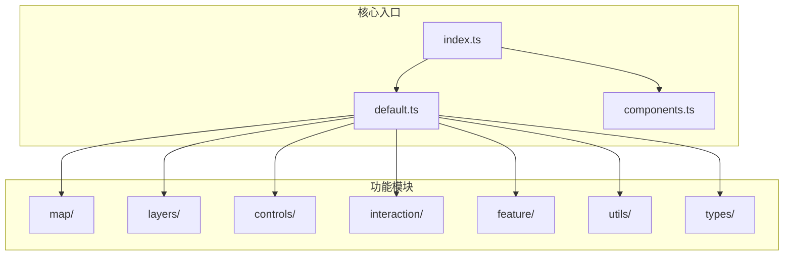
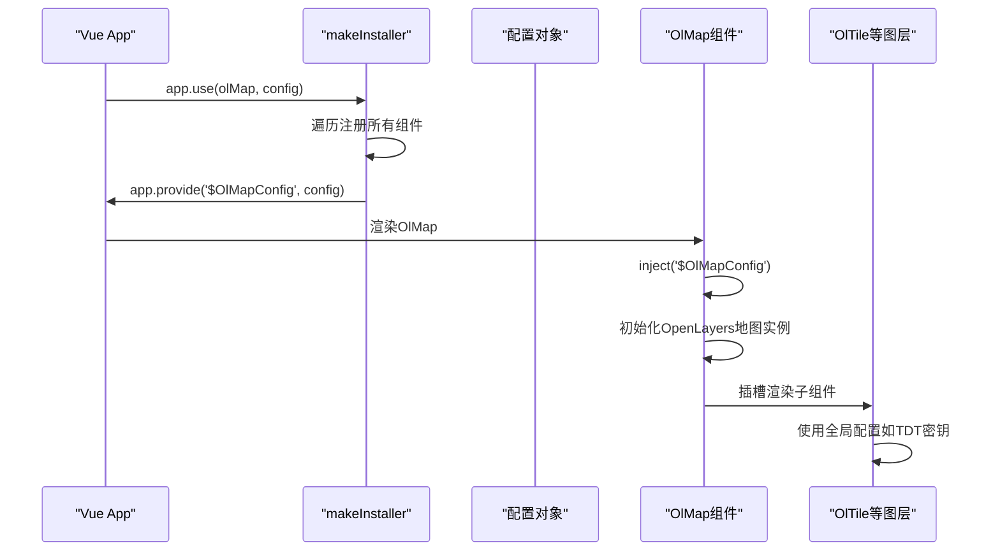
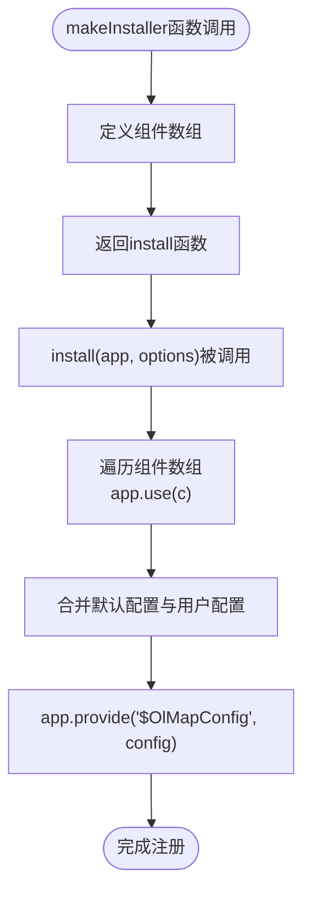
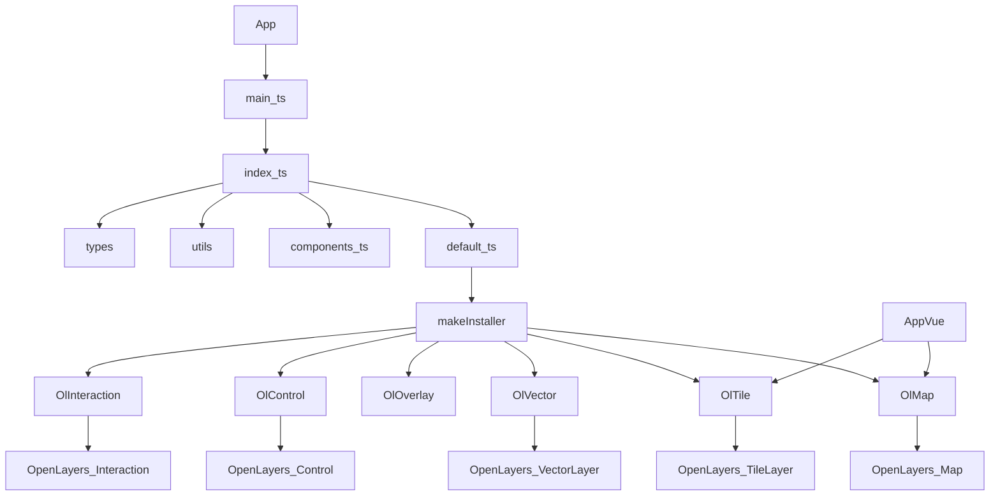

# 快速开始

<cite>
**本文档中引用的文件**  
- [main.ts](file://src/main.ts#L1-L25)
- [index.ts](file://src/packages/index.ts#L1-L9)
- [default.ts](file://src/packages/default.ts#L1-L164)
- [App.vue](file://src/App.vue#L1-L31)
- [index.vue](file://src/packages/map/index.vue#L1-L219)
</cite>

## 目录
1. [简介](#简介)
2. [项目结构概览](#项目结构概览)
3. [核心组件分析](#核心组件分析)
4. [架构总览](#架构总览)
5. [详细组件分析](#详细组件分析)
6. [依赖关系分析](#依赖关系分析)
7. [性能考量](#性能考量)
8. [故障排查指南](#故障排查指南)
9. [结论](#结论)

## 简介
本文档旨在为开发者提供一份详尽的快速入门指南，帮助其在新项目中集成 `v3-ol-map` 组件库。文档涵盖通过包管理器安装依赖、在 `main.ts` 中注册组件库并传入配置选项（如地图服务密钥、投影设置）、最小化 `App.vue` 模板示例、`default.ts` 中 `makeInstaller` 函数的工作原理、开发与构建流程，以及常见问题的排查建议。

## 项目结构概览
`v3-ol-map` 是一个基于 Vue 3 和 OpenLayers 的地图组件库，采用模块化设计，将各类地图功能拆分为独立的子包，便于按需引入和维护。



**图示来源**
- [index.ts](file://src/packages/index.ts#L1-L9)
- [default.ts](file://src/packages/default.ts#L1-L164)

**本节来源**
- [index.ts](file://src/packages/index.ts#L1-L9)
- [default.ts](file://src/packages/default.ts#L1-L164)

## 核心组件分析
`v3-ol-map` 的核心在于其组件注册机制和全局配置注入系统。通过 `default.ts` 中的 `makeInstaller` 函数，实现了所有地图相关组件的批量注册与配置传递。

**本节来源**
- [default.ts](file://src/packages/default.ts#L1-L164)

## 架构总览
该库采用典型的 Vue 插件架构，通过 `app.use()` 方法安装主插件，并支持传入配置对象。配置对象通过 `provide/inject` 机制在组件树中共享，确保所有子组件都能访问到统一的地图服务密钥和默认视图设置。



**图示来源**
- [main.ts](file://src/main.ts#L1-L25)
- [default.ts](file://src/packages/default.ts#L1-L164)
- [index.vue](file://src/packages/map/index.vue#L1-L219)

## 详细组件分析

### 主应用入口分析
`main.ts` 是应用的入口文件，负责创建 Vue 应用实例、安装路由和 `v3-ol-map` 插件。

```typescript
import { createApp } from "vue";
import App from "@/App.vue";
import router from "@/router";
import olMap from "./packages/index.ts";

const app = createApp(App);
app.use(router);
app.use(olMap, {
  tdt: {
    ak: "88e2f1d5ab64a7477a7361edd6b5f68a", // 天地图密钥
  },
  baidu: {
    ak: "5ieMMexWmzB9jivTq6oCRX9j",
  },
  map: {
    view: {
      zoom: 8,
      center: [118.125827, 24.637526],
    },
  },
});
app.mount("#app");
```

此代码展示了如何通过 `app.use()` 注册 `v3-ol-map` 并传入包含天地图（TDT）、百度地图（Baidu）密钥及默认地图视图的配置对象。

**本节来源**
- [main.ts](file://src/main.ts#L1-L25)

### 组件批量注册机制分析
`default.ts` 文件中的 `makeInstaller` 函数是整个组件库的核心注册机制。



**图示来源**
- [default.ts](file://src/packages/default.ts#L1-L164)

`makeInstaller` 函数接收一个组件插件数组，返回一个 `install` 方法。该方法在被调用时：
1. 遍历传入的组件数组，逐个调用 `app.use()` 进行注册。
2. 合并用户传入的配置与库的默认配置（如天地图瓦片URL模板）。
3. 使用 `app.provide` 将最终配置注入到应用上下文中，供所有子组件通过 `inject` 获取。

**本节来源**
- [default.ts](file://src/packages/default.ts#L1-L164)

### 地图容器组件分析
`OlMap` 组件（`src/packages/map/index.vue`）是地图的根容器，负责初始化 OpenLayers 的 `Map` 实例。

关键逻辑包括：
- **配置继承**：优先使用通过 `inject` 获取的全局配置中的 `view`、`controls`、`interactions`，若用户未传入则使用默认值。
- **事件绑定**：监听 `pointermove` 事件以实现鼠标悬停要素时显示手型光标，并将 OpenLayers 原生事件（如 `click`, `moveend`）通过 `emit` 转发给父组件。
- **实例暴露**：通过 `defineExpose` 暴露 `getMap`、`panTo`、`flyTo` 等方法，供父组件直接操作底层地图实例。

**本节来源**
- [index.vue](file://src/packages/map/index.vue#L1-L219)

## 依赖关系分析
`v3-ol-map` 库内部依赖关系清晰，各模块职责分明。



**图示来源**
- [index.ts](file://src/packages/index.ts#L1-L9)
- [default.ts](file://src/packages/default.ts#L1-L164)
- [index.vue](file://src/packages/map/index.vue#L1-L219)

**本节来源**
- [index.ts](file://src/packages/index.ts#L1-L9)
- [default.ts](file://src/packages/default.ts#L1-L164)

## 性能考量
- **按需加载**：虽然 `index.ts` 导出了所有组件，但 `makeInstaller` 允许用户传入自定义组件数组，理论上可实现按需注册，避免引入未使用的功能。
- **配置缓存**：全局配置通过 `provide/inject` 一次性注入，避免了在每个组件中重复解析和合并配置，提升了性能。
- **事件管理**：`OlMap` 组件在 `onBeforeUnmount` 时调用 `dispose` 清理事件监听器，防止内存泄漏。

## 故障排查指南
### 组件未注册或无法使用
- **现象**：使用 `<OlMap>` 或 `<OlTile>` 时提示组件未定义。
- **原因**：未正确调用 `app.use(olMap)`。
- **解决**：确保在 `main.ts` 中正确导入并使用 `olMap` 插件。

### 地图不显示
- **现象**：页面空白，无地图渲染。
- **原因**：
  1. `OlMap` 组件的容器没有设置宽高（默认为 `width: 100%`, `height: 100%`，需确保父容器有尺寸）。
  2. 天地图密钥（`ak`）无效或未配置。
- **解决**：
  1. 检查 `App.vue` 或父组件的样式，确保 `OlMap` 有明确的宽高。
  2. 在 `app.use(olMap, {...})` 中正确配置有效的 `tdt.ak`。

### 坐标系错乱或地图偏移
- **现象**：地图显示位置错误，或添加的矢量数据位置不正确。
- **原因**：未正确配置投影（Projection）。OpenLayers 默认使用 `EPSG:3857`，而某些服务或数据可能使用 `EPSG:4326`。
- **解决**：在 `map.view` 配置中明确指定 `projection`，并在数据读取时进行坐标转换。

### 关键配置文件注意事项
- **vite.config.ts**：确保已正确配置别名（如 `@` 指向 `src`），否则可能导致模块导入失败。
- **tsconfig.json**：确保 `compilerOptions` 中的 `types` 包含必要的类型定义，以支持 OpenLayers 和 Vue 的类型检查。

**本节来源**
- [main.ts](file://src/main.ts#L1-L25)
- [default.ts](file://src/packages/default.ts#L1-L164)
- [index.vue](file://src/packages/map/index.vue#L1-L219)

## 结论
`v3-ol-map` 提供了一套基于 Vue 3 的现代化地图组件解决方案。通过 `makeInstaller` 实现的批量注册和全局配置注入机制，极大地简化了集成流程。开发者只需在 `main.ts` 中几行代码即可完成初始化，并通过简洁的组件化语法构建复杂地图应用。遵循本文档的指导，可以快速上手并有效规避常见问题。