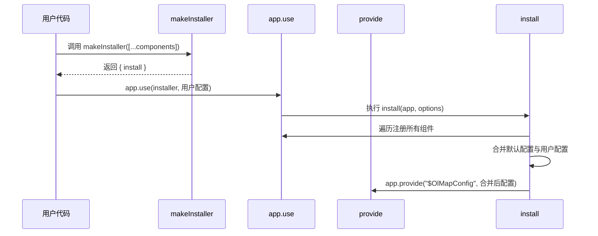
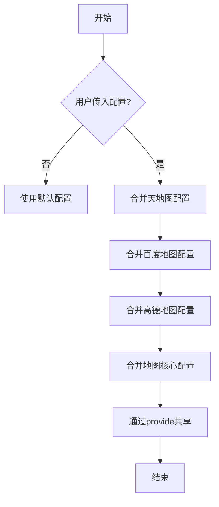
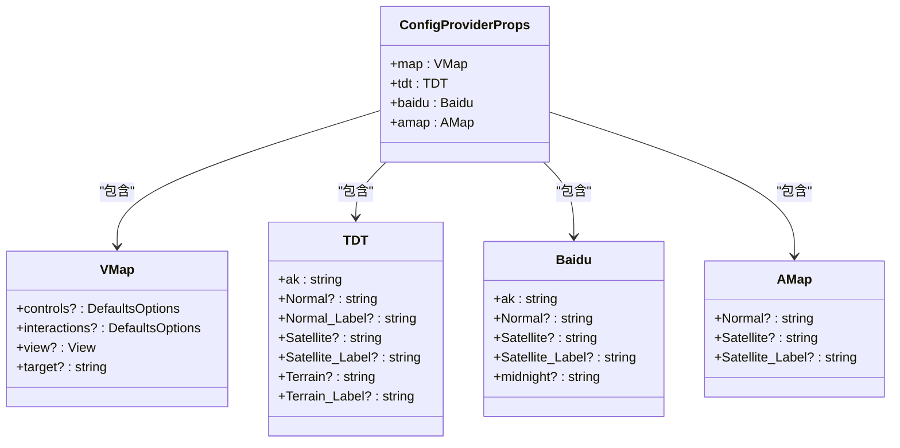

# 全局配置系统

<cite>
**本文档引用文件**  
- [default.ts](file://src/packages/default.ts#L1-L163)
- [main.ts](file://src/main.ts#L1-L25)
- [Map.ts](file://src/packages/types/Map.ts#L1-L28)
- [useTile.ts](file://src/packages/hooks/tile.ts#L1-L96)
- [index.vue](file://src/examples/config/index.vue#L1-L29)
</cite>

## 目录
1. [全局配置系统](#全局配置系统)
2. [核心机制解析](#核心机制解析)
3. [配置对象结构详解](#配置对象结构详解)
4. [配置注入与合并逻辑](#配置注入与合并逻辑)
5. [实际使用示例](#实际使用示例)
6. [类型安全与接口定义](#类型安全与接口定义)
7. [设计优势分析](#设计优势分析)
8. [常见问题与调试方法](#常见问题与调试方法)

## 核心机制解析

`v3-ol-map` 的全局配置系统基于 Vue 3 的依赖注入（`provide/inject`）机制实现，核心逻辑位于 `src/packages/default.ts` 文件中的 `makeInstaller` 函数。该函数通过 `app.use()` 接收用户传入的配置对象，并将其通过 `app.provide()` 全局共享，供所有子组件使用。

`makeInstaller` 是一个高阶函数，接收一个插件数组作为参数，返回一个包含 `install` 方法的对象。`install` 方法在应用初始化时被调用，负责注册所有组件并处理配置注入。



**Diagram sources**
- [default.ts](file://src/packages/default.ts#L119-L162)

**Section sources**
- [default.ts](file://src/packages/default.ts#L119-L162)

## 配置对象结构详解

全局配置对象包含多个服务的配置项，其结构由 `ConfigProviderProps` 类型定义，主要包含以下部分：

- **map**: 地图核心配置，如视图中心、缩放级别等
- **tdt**: 天地图服务配置
- **baidu**: 百度地图服务配置
- **amap**: 高德地图服务配置

### 天地图 (TDT) 配置
```json
{
  "ak": "your_api_key",
  "Normal": "https://t0.tianditu.gov.cn/DataServer?T=vec_w&X={x}&Y={y}&L={z}&tk=",
  "Normal_Label": "https://t0.tianditu.gov.cn/DataServer?T=cva_w&X={x}&Y={y}&L={z}&tk=",
  "Satellite": "https://t0.tianditu.gov.cn/DataServer?T=img_w&X={x}&Y={y}&L={z}&tk=",
  "Satellite_Label": "https://t0.tianditu.gov.cn/DataServer?T=cia_w&X={x}&Y={y}&L={z}&tk=",
  "Terrain": "https://t0.tianditu.gov.cn/DataServer?T=ter_w&X={x}&Y={y}&L={z}&tk=",
  "Terrain_Label": "https://t0.tianditu.gov.cn/DataServer?T=cta_w&X={x}&Y={y}&L={z}&tk="
}
```

### 百度地图 (Baidu) 配置
```json
{
  "ak": "your_api_key",
  "Normal": "https://maponline1.bdimg.com/tile/?qt=vtile&x={x}&y={y}&z={z}&styles=pl&scaler=1&udt=20220113&from=jsapi2_0",
  "Satellite": "https://maponline3.bdimg.com/starpic/?qt=satepc&u=x={x};y={y};z={z};v=009;type=sate&fm=46&udt=20240910",
  "Satellite_Label": "https://maponline0.bdimg.com/tile/?qt=vtile&x={x}&y={y}&z={z}&styles=sl&udt=20240910",
  "midnight": "http://api0.map.bdimg.com/customimage/tile?&x={x}&y={y}&z={z}&udt=20220819&scale=1&customid=midnight&ak="
}
```

### 高德地图 (AMap) 配置
```json
{
  "Normal": "http://webrd01.is.autonavi.com/appmaptile?lang=zh_cn&size=1&scale=1&style=8&x={x}&y={y}&z={z}",
  "Satellite": "http://webst01.is.autonavi.com/appmaptile?style=6&x={x}&y={y}&z={z}",
  "Satellite_Label": "http://webst01.is.autonavi.com/appmaptile?style=8&x={x}&y={y}&z={z}"
}
```

**Section sources**
- [default.ts](file://src/packages/default.ts#L32-L91)

## 配置注入与合并逻辑

配置的合并逻辑在 `makeInstaller` 函数的 `install` 方法中实现。系统首先使用默认配置 `defaultOptions`，然后根据用户传入的 `options` 进行深度合并。



**Diagram sources**
- [default.ts](file://src/packages/default.ts#L119-L162)

**Section sources**
- [default.ts](file://src/packages/default.ts#L119-L162)

## 实际使用示例

在 `main.ts` 中安装组件库时传入自定义配置：

```typescript
import { createApp } from "vue";
import App from "@/App.vue";
import olMap from "./packages/index.ts";

const app = createApp(App);
app.use(olMap, {
  tdt: {
    ak: "88e2f1d5ab64a7477a7361edd6b5f68a", // 天地图ak
  },
  baidu: {
    ak: "5ieMMexWmzB9jivTq6oCRX9j",
  },
  map: {
    view: {
      zoom: 8,
      center: [118.125827, 24.637526],
    },
  },
});
app.mount("#app");
```

组件内部通过 `inject` 获取配置：

```typescript
const $OlMapConfig = inject("$OlMapConfig") as ConfigProviderContext;
const TDT = { ...defaultOlMapConfig.tdt, ...$OlMapConfig?.tdt };
```

**Section sources**
- [main.ts](file://src/main.ts#L1-L25)
- [useTile.ts](file://src/packages/hooks/tile.ts#L1-L96)

## 类型安全与接口定义

系统通过 TypeScript 提供了完整的类型安全保证。核心类型定义位于 `src/packages/types/Map.ts` 文件中。



**Diagram sources**
- [Map.ts](file://src/packages/types/Map.ts#L1-L28)
- [default.ts](file://src/packages/default.ts#L32-L91)

**Section sources**
- [Map.ts](file://src/packages/types/Map.ts#L1-L28)

## 设计优势分析

### 避免重复传递 props
通过全局 `provide/inject`，无需在组件树中逐层传递地图配置，简化了组件间的通信。

### 支持运行时配置变更
虽然当前实现是在应用初始化时注入，但 `provide/inject` 机制本身支持响应式更新，为未来动态配置变更提供了基础。

### 配置优先级清晰
系统实现了默认配置与用户配置的合并，同时在 `OlConfig` 组件中支持局部覆盖，形成了"默认配置 < 全局配置 < 局部配置"的优先级体系。


**Diagram sources**
- [default.ts](file://src/packages/default.ts#L119-L162)
- [index.vue](file://src/examples/config/index.vue#L1-L29)

**Section sources**
- [index.vue](file://src/examples/config/index.vue#L1-L29)

## 常见问题与调试方法

### 配置失效的常见原因

1. **provide/inject 层级错位**：确保 `app.provide()` 在根组件调用，且子组件在正确的层级使用 `inject`
2. **配置结构错误**：检查传入的配置对象是否符合 `ConfigProviderProps` 类型定义
3. **API Key 未配置**：如天地图的 `ak` 字段为空，会导致请求失败

### 调试方法

1. **检查全局属性**：在浏览器控制台检查 `app.config.globalProperties.$OlMapConfig` 是否存在
2. **断点调试**：在 `makeInstaller` 的 `install` 方法中设置断点，观察配置合并过程
3. **网络请求检查**：查看地图瓦片请求的 URL 是否正确包含了 API Key

```typescript
// 调试示例
console.log("全局配置:", app.config.globalProperties.$OlMapConfig);
```

**Section sources**
- [default.ts](file://src/packages/default.ts#L119-L162)
- [useTile.ts](file://src/packages/hooks/tile.ts#L1-L96)