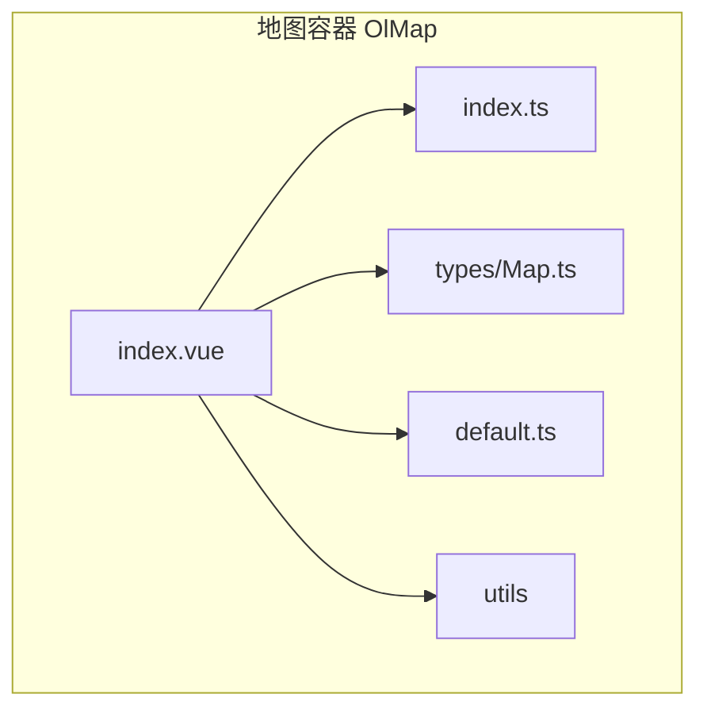
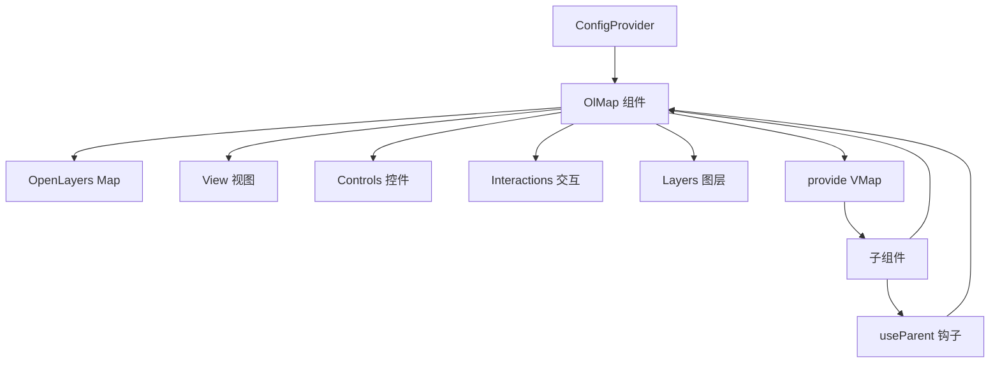
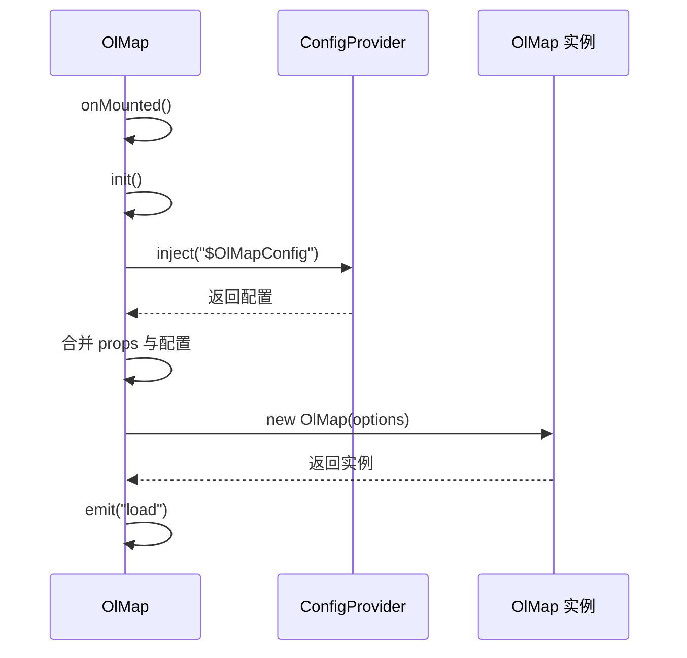
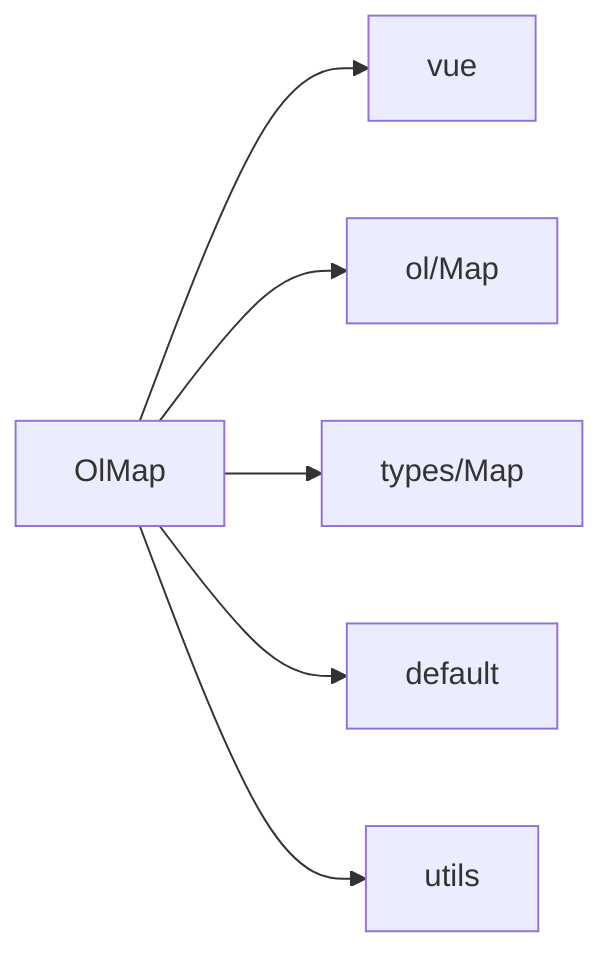

# 地图容器 (OlMap)

<cite>
**本文档引用的文件**  
- [index.vue](file://src/packages/map/index.vue#L0-L218)
- [default.ts](file://src/packages/default.ts#L0-L163)
- [Map.ts](file://src/packages/types/Map.ts#L0-L27)
- [index.ts](file://src/packages/map/index.ts#L0-L5)
- [parent.ts](file://src/packages/hooks/parent.ts#L0-L21)
</cite>

## 目录
1. [简介](#简介)
2. [项目结构](#项目结构)
3. [核心组件](#核心组件)
4. [架构概述](#架构概述)
5. [详细组件分析](#详细组件分析)
6. [依赖分析](#依赖分析)
7. [性能考虑](#性能考虑)
8. [故障排除指南](#故障排除指南)
9. [结论](#结论)

## 简介
`OlMap` 是 `v3-ol-map` 库中的核心地图容器组件，基于 Vue 3 和 OpenLayers 构建。它封装了 OpenLayers 的 `Map` 实例，提供响应式地图状态管理、子组件依赖注入、事件监听与生命周期控制等能力。该组件作为所有地图图层、控件和交互功能的父容器，是整个地图应用的运行基础。

## 项目结构
`OlMap` 组件位于 `src/packages/map/` 目录下，其主要文件包括：
- `index.vue`: 组件主实现文件
- `index.ts`: 组件安装逻辑，用于 Vue 插件注册
该组件通过 `provide/inject` 机制向子组件暴露地图实例，并依赖 `@/packages/types/Map` 定义类型，通过 `@/packages/default` 获取默认配置。



**图源**  
- [index.vue](file://src/packages/map/index.vue#L0-L218)
- [index.ts](file://src/packages/map/index.ts#L0-L5)

## 核心组件
`OlMap` 组件的核心职责包括：
- 初始化 OpenLayers 的 `Map` 实例
- 管理地图视图状态（中心点、缩放、旋转、投影）
- 通过 `provide("VMap", map)` 向所有子组件注入地图实例
- 处理地图事件绑定与销毁
- 支持通过 props 配置地图初始状态

**组件源**  
- [index.vue](file://src/packages/map/index.vue#L0-L218)

## 架构概述
`OlMap` 采用 Vue 3 的组合式 API（`<script setup>`）实现，其架构依赖于 OpenLayers 的核心模块，并通过 Vue 的依赖注入机制实现组件间通信。



**图源**  
- [index.vue](file://src/packages/map/index.vue#L0-L218)
- [parent.ts](file://src/packages/hooks/parent.ts#L0-L21)

## 详细组件分析

### OlMap 组件实现分析

#### 属性与默认值
`OlMap` 继承自 OpenLayers 的 `MapOptions`，并扩展了 `width` 和 `height` 属性用于控制容器尺寸。

```ts
interface Props extends VMap {
  width?: string | number;
  height?: string | number;
}
```

默认值设置如下：
- `width`: `"100%"`
- `height`: `"100%"`
- `target`: `""`（自动生成）

**组件源**  
- [index.vue](file://src/packages/map/index.vue#L20-L34)

#### 地图初始化流程
组件在 `onMounted` 钩子中调用 `init()` 方法初始化地图实例。该方法会：
1. 读取全局或注入的配置（`$OlMapConfig`）
2. 合并配置中的 `view`、`controls`、`interactions`
3. 创建 `OlMap` 实例并绑定到 `map.value`
4. 触发 `load` 事件表示地图加载完成



**图源**  
- [index.vue](file://src/packages/map/index.vue#L65-L113)

#### 依赖注入机制
`OlMap` 使用 `provide("VMap", map)` 将地图实例暴露给所有后代组件。子组件（如 `OlTile`、`OlVector`）通过 `inject("VMap")` 获取地图实例，从而实现图层自动注册。

```ts
provide("VMap", map);
```

**组件源**  
- [index.vue](file://src/packages/map/index.vue#L208)

#### 事件绑定与销毁
组件监听多种地图事件（如 `click`、`moveend` 等），并在 `onMounted` 时绑定，在 `onBeforeUnmount` 时通过 `unByKey` 销毁，防止内存泄漏。

```ts
const events = [
  "singleclick", "click", "dblclick", "pointerdrag",
  "contextmenu", "precompose", "postrender",
  "loadend", "loadstart", "moveend", "movestart"
];
```

**组件源**  
- [index.vue](file://src/packages/map/index.vue#L45-L55)

#### 暴露的 API 方法
通过 `defineExpose`，`OlMap` 向父组件暴露以下方法：
- `getMap()`: 获取底层 OpenLayers Map 实例
- `getLayerById(id)`: 根据 ID 查询图层
- `panTo(params)`: 平滑移动到指定位置
- `flyTo(params)`: 飞行动画到指定位置
- `setCursor(type)`: 强制设置鼠标光标样式

```ts
defineExpose({
  map: getMap,
  getMap,
  getLayerById,
  panTo,
  flyTo,
  readFeatures,
  setCursor,
});
```

**组件源**  
- [index.vue](file://src/packages/map/index.vue#L185-L206)

## 依赖分析
`OlMap` 依赖以下关键模块：
- `vue`: 提供组合式 API 和依赖注入
- `ol/Map`: OpenLayers 地图核心类
- `@/packages/types/Map`: 定义 `VMap`、`View` 等类型
- `@/packages/default`: 提供默认配置和全局配置注入机制
- `@/packages/utils`: 提供 `panTo`、`flyTo` 等工具函数



**图源**  
- [index.vue](file://src/packages/map/index.vue#L0-L218)
- [default.ts](file://src/packages/default.ts#L0-L163)

## 性能考虑
- **延迟渲染**: 通过 `v-if="load"` 确保地图初始化完成后再渲染子组件，避免无效渲染。
- **事件管理**: 在组件销毁前解绑所有事件监听器，防止内存泄漏。
- **合理使用 v-if**: 建议在地图容器外层使用 `v-if` 控制地图是否渲染，避免频繁创建销毁实例。
- **避免重复初始化**: 通过 `targetId` 唯一性确保不会重复绑定同一 DOM 元素。

## 故障排除指南
### 常见问题及解决方案

#### 问题1：地图容器尺寸异常或不显示
**原因**: 父容器未设置宽高，导致地图容器 `width: 100%` 无效。  
**解决方案**: 确保父元素设置了明确的宽度和高度，或直接在 `ol-map` 上设置 `width` 和 `height` 属性。

```vue
<ol-map width="800px" height="600px">
  <ol-tile tile-type="TDT" />
</ol-map>
```

#### 问题2：多次初始化导致冲突
**原因**: 多个 `OlMap` 实例使用相同 `target` ID。  
**解决方案**: 避免手动指定 `target`，让组件自动生成唯一 ID（使用 `nanoid`）。

#### 问题3：子组件无法注册到地图
**原因**: 子组件未正确嵌套在 `OlMap` 内，或 `provide("VMap")` 未生效。  
**解决方案**: 检查组件层级，确保子组件是 `OlMap` 的直接或间接后代，并确认 `useParent` 钩子正常工作。

**组件源**  
- [index.vue](file://src/packages/map/index.vue#L35-L43)
- [parent.ts](file://src/packages/hooks/parent.ts#L0-L21)

## 结论
`OlMap` 作为 `v3-ol-map` 的核心容器，成功封装了 OpenLayers 的复杂性，提供了简洁、响应式且可扩展的地图集成方案。通过 Vue 3 的 `provide/inject` 机制，实现了组件间的低耦合通信，使得图层、控件等子组件能够自动注册到地图实例。其良好的生命周期管理、事件处理和 API 暴露设计，为构建复杂地图应用提供了坚实基础。建议在使用时注意容器尺寸设置和初始化时机，以获得最佳性能和用户体验。