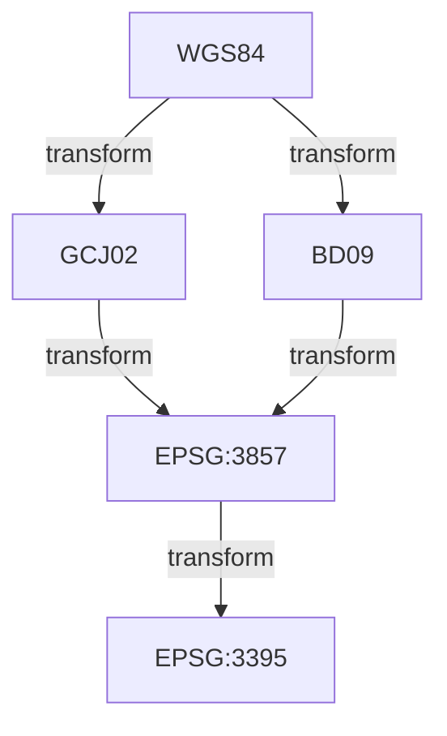
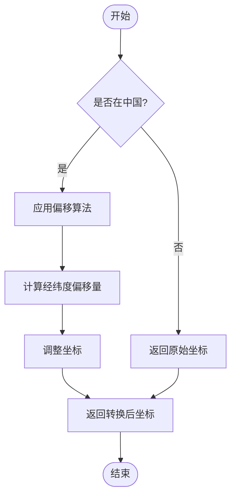
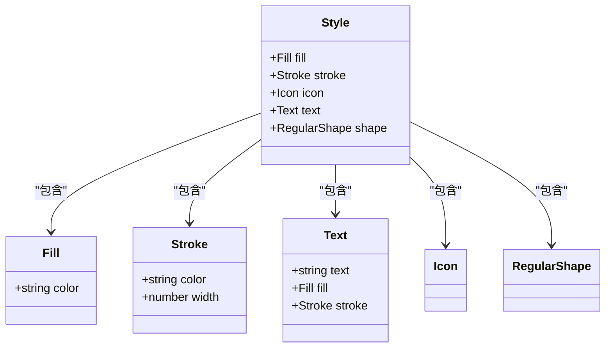

# 工具函数模块

<cite>
**本文档中引用的文件**   
- [projection.ts](file://src/packages/utils/projection.ts)
- [transform.ts](file://src/packages/utils/transform.ts)
- [style.ts](file://src/packages/utils/style.ts)
- [city.ts](file://src/packages/utils/city.ts)
- [index.ts](file://src/packages/utils/index.ts)
</cite>

## 目录
1. [引言](#引言)
2. [核心工具函数概览](#核心工具函数概览)
3. [坐标系转换工具](#坐标系转换工具)
4. [坐标变换辅助方法](#坐标变换辅助方法)
5. [样式生成工具](#样式生成工具)
6. [城市地理数据查询](#城市地理数据查询)
7. [实际应用示例](#实际应用示例)
8. [总结](#总结)

## 引言
本项目 `v3-ol-map` 是一个基于 OpenLayers 的地图工具库，提供了丰富的地理信息处理工具函数。这些工具函数极大地简化了开发者在处理地理坐标、地图样式和空间数据时的工作量。本文档将详细解析 `src/packages/utils` 目录下的核心工具模块，包括坐标系转换、坐标变换、样式生成和城市数据查询等功能，帮助开发者更好地理解和使用这些工具。

## 核心工具函数概览
`v3-ol-map` 的工具函数主要集中在 `src/packages/utils` 目录下，包含以下几个核心文件：
- **projection.ts**：负责注册和管理不同坐标系之间的转换。
- **transform.ts**：提供具体的坐标转换算法实现。
- **style.ts**：用于动态生成 OpenLayers 样式对象。
- **city.ts**：提供中国城市地理中心点的查询功能。
- **index.ts**：整合并导出所有工具函数，方便统一导入。

这些工具函数共同构成了一个完整的地理信息处理工具集，为上层应用提供了坚实的基础支持。

## 坐标系转换工具

### 坐标系转换原理
在地理信息系统中，不同的地图服务提供商使用不同的坐标系。例如，WGS84 是全球通用的标准坐标系，而 GCJ02（火星坐标系）和 BD09（百度坐标系）是中国特有的加密坐标系。为了确保地图数据的准确性和一致性，必须进行坐标系之间的转换。

`projection.ts` 文件通过 `proj4` 库实现了多种坐标系的注册和转换。它定义了 EPSG:3857（Web Mercator）、EPSG:4326（WGS84）、GCJ02 和 BD09 等坐标系，并建立了它们之间的转换关系。



**Diagram sources**
- [projection.ts](file://src/packages/utils/projection.ts#L1-L163)

### transformCoordinate 函数实现
`transformCoordinate` 函数的核心逻辑位于 `transform.ts` 文件中。该文件定义了一系列转换函数，如 `wgs84togcj02`、`gcj02towgs84`、`wgs84tobd09` 等，用于在不同坐标系之间进行精确转换。

例如，`wgs84togcj02` 函数通过以下步骤将 WGS84 坐标转换为 GCJ02 坐标：
1. 判断坐标是否在中国范围内。
2. 如果在中国范围内，则应用偏移算法计算新的经纬度。
3. 返回转换后的坐标。



**Diagram sources**
- [transform.ts](file://src/packages/utils/transform.ts#L300-L350)

**Section sources**
- [transform.ts](file://src/packages/utils/transform.ts#L300-L350)

## 坐标变换辅助方法

### 像素与坐标互转
`transform.ts` 文件还提供了像素与地理坐标之间的转换方法。这些方法基于 Web Mercator 投影，能够将屏幕上的像素位置转换为地理坐标，反之亦然。

主要函数包括：
- `sphericalMercator.forward`：将经纬度转换为 Web Mercator 坐标。
- `sphericalMercator.inverse`：将 Web Mercator 坐标转换为经纬度。

这些函数在绘制地图要素、处理用户交互事件时非常有用。例如，当用户点击地图时，可以通过这些函数将点击位置的像素坐标转换为地理坐标，从而确定用户点击的具体位置。

**Section sources**
- [transform.ts](file://src/packages/utils/transform.ts#L150-L200)

## 样式生成工具

### 动态样式创建
`style.ts` 文件提供了创建 OpenLayers 样式对象的工具函数。开发者可以根据要素的属性值动态生成样式，实现个性化的地图显示效果。

主要函数包括：
- `setCircleStyle`：设置圆形样式。
- `setText`：设置文本样式。
- `setStyle`：综合设置填充、描边、图标、文本等样式。
- `setFeatureStyle`：为要素设置样式，并支持样式函数。

例如，`setStyle` 函数可以根据传入的选项对象创建一个完整的样式对象：
```typescript
const styleOptions = {
  fill: { color: 'rgba(255, 0, 0, 0.5)' },
  stroke: { color: '#ff0000', width: 2 },
  text: { text: '示例', fill: { color: '#000' } }
};
const style = setStyle(styleOptions);
```



**Diagram sources**
- [style.ts](file://src/packages/utils/style.ts#L50-L135)

**Section sources**
- [style.ts](file://src/packages/utils/style.ts#L50-L135)

## 城市地理数据查询

### 中国城市数据
`city.ts` 文件包含了一个中国主要城市的地理中心点数据表。每个城市记录了其名称、经度和纬度。通过 `getCenterByCity` 函数，开发者可以方便地根据城市名称查询其中心点坐标。

该函数支持多种查询方式：
- 精确匹配城市名称。
- 匹配带“市”字的城市名称。
- 使用拼音进行模糊匹配。

例如：
```typescript
const center = getCenterByCity("北京"); // 返回 [116.405285, 39.904989]
const center2 = getCenterByCity("beijing"); // 使用拼音匹配
```

这个功能在初始化地图视图、定位到特定城市时非常实用。

**Section sources**
- [city.ts](file://src/packages/utils/city.ts#L1600-L1882)

## 实际应用示例

### 坐标纠偏使用场景
在实际项目中，经常需要处理来自不同来源的地理数据。这些数据可能使用不同的坐标系，直接叠加到地图上会导致位置偏差。以下是使用这些工具函数进行坐标纠偏的典型流程：

1. **导入工具函数**：
```typescript
import { definedProjection } from '@/packages/utils/projection';
import { wgs84togcj02 } from '@/packages/utils/transform';
```

2. **注册坐标系**：
```typescript
definedProjection(); // 注册所有自定义坐标系
```

3. **转换坐标**：
```typescript
const wgs84Coords = [116.405285, 39.904989];
const gcj02Coords = wgs84togcj02(wgs84Coords[0], wgs84Coords[1]);
```

4. **创建要素并设置样式**：
```typescript
import { setFeatureStyle, setStyle } from '@/packages/utils/style';

const feature = new Feature(new Point(fromLonLat(gcj02Coords)));
const style = setStyle({
  fill: { color: 'blue' },
  stroke: { color: 'white', width: 2 }
});
setFeatureStyle(feature, style, map);
```

通过以上步骤，可以确保所有地理数据在正确的坐标系下显示，避免位置偏差问题。

**Section sources**
- [projection.ts](file://src/packages/utils/projection.ts#L1-L163)
- [transform.ts](file://src/packages/utils/transform.ts#L300-L350)
- [style.ts](file://src/packages/utils/style.ts#L50-L135)

## 总结
`v3-ol-map` 提供的工具函数模块极大地简化了地理信息处理的复杂性。通过 `projection.ts` 和 `transform.ts` 实现的坐标系转换功能，确保了不同来源数据的一致性；`style.ts` 提供的动态样式生成功能，增强了地图的可视化效果；`city.ts` 的城市数据查询功能，则为快速定位和展示提供了便利。这些工具不仅提高了开发效率，还保证了地理数据处理的准确性，是构建高质量地图应用不可或缺的基础组件。