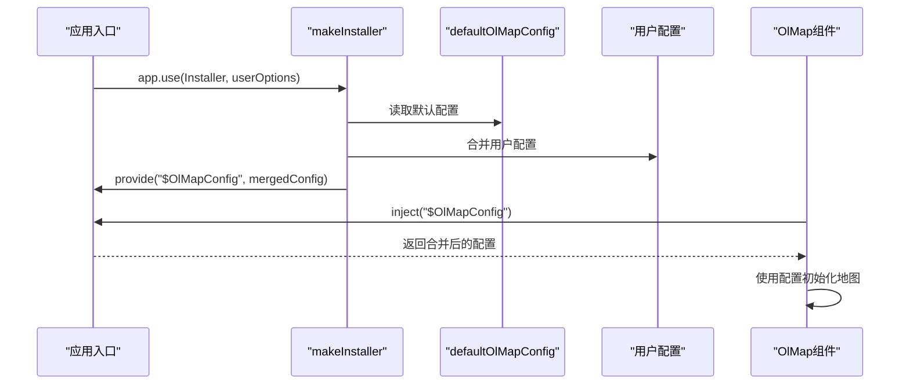
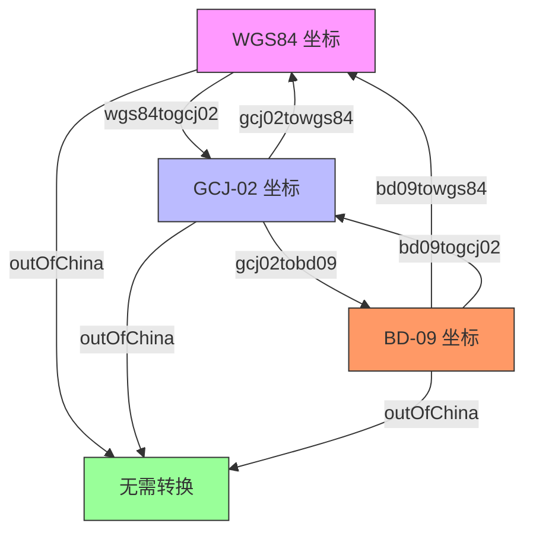

# 核心概念

<cite>
**本文档中引用的文件**   
- [index.vue](file://src/packages/map/index.vue#L0-L218)
- [default.ts](file://src/packages/default.ts#L0-L163)
- [Map.ts](file://src/packages/types/Map.ts#L0-L27)
- [projection.ts](file://src/packages/utils/projection.ts#L0-L163)
- [transform.ts](file://src/packages/utils/transform.ts#L0-L458)
</cite>

## 目录
1. [OlMap组件详解](#olmap组件详解)  
2. [全局配置注入机制](#全局配置注入机制)  
3. [类型定义体系](#类型定义体系)  
4. [坐标投影与转换工具](#坐标投影与转换工具)  
5. [数据流与组件通信](#数据流与组件通信)

## OlMap组件详解

`OlMap` 组件是整个地图应用的核心容器，负责初始化 OpenLayers 的地图实例、管理视图状态，并通过 `provide` 向所有子组件暴露地图实例和配置。

该组件基于 Vue 3 的 `<script setup>` 语法编写，使用 `shallowRef` 管理地图实例引用，确保响应式更新的性能。组件通过 `props` 接收地图的配置参数，包括 `center`（中心点）、`zoom`（缩放级别）、`rotation`（旋转角度）等视图状态，以及 `controls`（控件）、`interactions`（交互行为）等高级配置。

组件在 `onMounted` 钩子中调用 `init()` 方法初始化地图实例。初始化过程中会优先使用通过依赖注入获取的全局配置（来自 `default.ts`），若无则使用默认配置。地图实例创建完成后，会绑定一系列事件监听器，如点击、双击、移动等，并通过 `emit` 向父组件传递交互结果。

此外，组件通过 `defineExpose` 暴露了多个方法供外部调用，如 `getMap()` 获取地图实例、`getLayerById(id)` 根据ID获取图层、`panTo()` 平移地图、`flyTo()` 飞行动画等，实现了丰富的外部控制能力。

```mermaid
classDiagram
class OlMap {
+props : VMap
+map : Ref<OlMap>
+load : Ref<boolean>
+targetId : Ref<string>
+init() : Promise
+eventBinding() : void
+dispose() : void
+getMap() : Map
+getLayerById(id : string) : BaseLayer
+panTo(params : AnimationOptions) : void
+flyTo(params : flyAnimationOptions) : void
}
OlMap --> "uses" Map : "OpenLayers Map Instance"
OlMap --> "uses" View : "View Options"
OlMap --> "provides" VMap : "Map Instance"
OlMap --> "injects" $OlMapConfig : "Global Config"
```

**图示来源**  
- [index.vue](file://src/packages/map/index.vue#L0-L218)

**本节来源**  
- [index.vue](file://src/packages/map/index.vue#L0-L218)

## 全局配置注入机制

`default.ts` 文件定义了全局配置注入机制，是整个库的配置中心。它通过 Vue 的 `provide/inject` 机制，允许用户在应用根部注入一套全局配置，从而影响所有地图实例的行为。

该机制的核心是 `makeInstaller` 函数，它接受一个组件数组和可选的配置对象 `options`。当调用 `app.use()` 安装时，它会遍历组件数组进行注册，并将用户传入的配置与默认配置（`defaultOlMapConfig`）进行合并。

`defaultOlMapConfig` 包含了天地图（TDT）、百度地图（Baidu）、高德地图（AMap）等主流地图服务的瓦片请求URL模板。例如，天地图的 `Normal` 图层URL为 `https://t0.tianditu.gov.cn/DataServer?T=vec_w&X={x}&Y={y}&L={z}&tk=`，其中 `{x}`、`{y}`、`{z}`、`{tk}` 会被实际的瓦片坐标和密钥替换。

用户可以通过在 `main.ts` 中调用 `app.use()` 时传入自定义配置来覆盖默认值，例如设置自己的天地图密钥（`ak`），从而实现服务的无缝切换和个性化定制。



**图示来源**  
- [default.ts](file://src/packages/default.ts#L0-L163)

**本节来源**  
- [default.ts](file://src/packages/default.ts#L0-L163)

## 类型定义体系

`types` 目录下的类型定义文件为整个项目提供了坚实的类型基础，确保了代码的健壮性和可维护性。

其中，`Map.ts` 文件定义了核心接口：
- **`VMap`**: 地图配置的主接口，扩展了 OpenLayers 原生的 `MapOptions`，并定义了 `controls`、`interactions`、`view` 等可选配置项。`view` 接口还额外支持 `city` 字段，用于城市级别的视图配置。
- **`OlMapEvent`**: 地图事件的类型，基于 `MapBrowserEvent<UIEvent>`，统一了所有地图交互事件的参数类型。
- **`ExposeMap`**: 通过 `defineExpose` 暴露给外部的 API 类型，明确定义了 `getMap`、`getLayerById`、`panTo` 等方法的签名。

这些类型不仅用于组件的 `props` 和 `emits` 定义，也贯穿于 `utils` 工具函数和 `layers`、`controls` 等模块，实现了全项目范围内的类型一致性。

**本节来源**  
- [Map.ts](file://src/packages/types/Map.ts#L0-L27)

## 坐标投影与转换工具

`utils` 目录下的 `projection.ts` 和 `transform.ts` 文件共同构成了强大的坐标处理工具集。

`projection.ts` 的核心是 `definedProjection()` 函数，它利用 `proj4` 库注册了多个自定义投影坐标系，包括：
- **EPSG:4490**: 基于 GRS80 椭球的地理坐标系。
- **GCJ:02**: 中国的“火星坐标系”（高德、腾讯地图使用）。
- **BD:09**: 百度地图使用的坐标系。
- **EPSG:3395**: 用于海图的墨卡托投影。

该文件通过 `addProjection`、`addCoordinateTransforms` 等 OpenLayers API 注册投影和转换函数，使得不同坐标系的数据可以在地图上正确叠加。

`transform.ts` 则提供了具体的坐标转换算法。它包含了 `wgs84togcj02`、`gcj02tobd09`、`bd09towgs84` 等函数，实现了 WGS84（GPS）、GCJ-02（高德）、BD-09（百度）三大坐标系之间的相互转换。这些函数基于复杂的数学模型（如偏移量计算、正弦函数拟合）来修正坐标偏差，确保了不同来源数据的空间一致性。



**图示来源**  
- [transform.ts](file://src/packages/utils/transform.ts#L0-L458)
- [projection.ts](file://src/packages/utils/projection.ts#L0-L163)

**本节来源**  
- [projection.ts](file://src/packages/utils/projection.ts#L0-L163)
- [transform.ts](file://src/packages/utils/transform.ts#L0-L458)

## 数据流与组件通信

本库的数据流遵循典型的“上至下注入，下至上反馈”模式。

**上至下注入**：全局配置通过 `app.provide("$OlMapConfig", config)` 在应用根部注入。`OlMap` 组件通过 `inject("$OlMapConfig")` 获取该配置，并在初始化地图时使用。此配置会通过 `provide("VMap", map)` 进一步向下传递地图实例，使得所有子组件（如 `OlTile`、`OlVector`）都能通过 `inject("VMap")` 获取到地图实例，实现图层的自动添加。

**下至上反馈**：用户与地图的交互（如点击、拖拽）会触发 OpenLayers 的原生事件。`OlMap` 组件通过 `map.on()` 监听这些事件，并使用 `emit()` 将其转换为 Vue 的自定义事件（如 `click`, `moveend`）向上传递给父组件。同时，组件暴露的 `getMap()`、`panTo()` 等方法允许父组件主动调用，实现对地图状态的控制。

这种清晰的单向数据流设计，使得组件职责分明，状态管理可预测，极大地提升了应用的可维护性和可测试性。

**本节来源**  
- [index.vue](file://src/packages/map/index.vue#L0-L218)
- [default.ts](file://src/packages/default.ts#L0-L163)