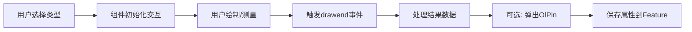

# 交互组件

<cite>
**本文档引用文件**  
- [draw.ts](file://src/packages/interaction/draw/draw.ts)
- [index.ts](file://src/packages/interaction/draw/index.ts)
- [measure.ts](file://src/packages/interaction/measure/measure.ts)
- [index.ts](file://src/packages/interaction/measure/index.ts)
- [index.vue](file://src/packages/interaction/DragRotateAndZoom/index.vue)
- [index.ts](file://src/packages/interaction/DragRotateAndZoom/index.ts)
- [index.vue](file://src/packages/interaction/pin/index.vue)
- [index.vue](file://src/examples/draw/index.vue)
- [index.vue](file://src/examples/measure/index.vue)
- [index.vue](file://src/examples/dragRotateAndZoom/index.vue)
- [index.vue](file://src/examples/pin/index.vue)
</cite>

## 目录
1. [交互组件](#交互组件)
2. [绘制功能 (OlDraw)](#绘制功能-olDraw)
3. [测量功能 (OlMeasure)](#测量功能-olMeasure)
4. [拖拽旋转缩放功能 (OlDragRotateAndZoom)](#拖拽旋转缩放功能-olDragRotateAndZoom)
5. [标记功能 (OlPin)](#标记功能-olPin)
6. [组件协同与状态管理](#组件协同与状态管理)

## 绘制功能 (OlDraw)

`OlDraw` 组件封装了 OpenLayers 的 `Draw` 交互功能，支持多种几何类型的绘制操作，包括点、线、面、圆形、矩形和正方形。该组件通过 Vue 的 `props` 配置绘制类型、是否启用吸附（Snap）、是否允许修改（Modify）以及是否添加标记（Pin）等行为。

### 功能特性

- **支持的几何类型**：`Point`（点）、`LineString`（线）、`Polygon`（多边形）、`Circle`（圆）、`Square`（正方形）、`Rectangle`（矩形）。
- **矩形与正方形的实现**：通过 `createBox()` 和 `createRegularPolygon(4)` 实现，底层仍使用 `Circle` 类型配合自定义 `geometryFunction`。
- **吸附与修改**：可通过 `snap` 和 `modify` 属性启用吸附到已有要素和绘制后编辑功能。
- **单次绘制模式**：当 `once` 属性为 `true` 时，每次开始绘制前会清空图层数据。
- **事件响应**：支持 `drawend`、`drawstart`、`modifyend`、`modifystart` 和 `savePin` 事件。

### 用户操作流程

1. 用户通过界面选择绘制类型（如“Polygon”）。
2. 组件初始化 `Draw` 交互并添加到地图。
3. 用户在地图上点击开始绘制，触发 `drawstart` 事件。
4. 用户连续点击添加顶点，最后双击或右键结束绘制，触发 `drawend` 事件。
5. 若启用 `pin`，则在绘制结束后弹出标记编辑框。

### 结果数据结构

`drawend` 事件返回 `DrawEvent` 对象，其 `feature` 属性为 `ol/Feature` 实例，包含：
- `geometry`：几何对象（如 `Polygon`）。
- `properties`：自定义属性（如 `name`、`remark`）。
- `style`：要素样式。

### 代码示例

```vue
<ol-vector :layer-style="drawStyle">
  <ol-draw
    ref="olDrawRef"
    :snap="true"
    :modify="true"
    :type="drawType"
    :once="isOnce"
    @drawend="handleDrawend"
  ></ol-draw>
</ol-vector>
```

```ts
const handleDrawend = (args: DrawEvent) => {
  const feature = args.feature;
  if (feature && drawType.value === "Point") {
    const coordinates = (feature.getGeometry() as Point).getCoordinates();
    console.log("绘制点坐标:", coordinates);
  }
};
```

**Section sources**
- [draw.ts](file://src/packages/interaction/draw/draw.ts#L1-L235)
- [index.vue](file://src/examples/draw/index.vue#L1-L95)

## 测量功能 (OlMeasure)

`OlMeasure` 组件用于在地图上进行距离和面积测量，基于球面几何计算，确保测量结果的准确性。

### 计算原理

- **距离测量**：使用 `ol/sphere.getLength()`，基于 WGS84 椭球模型计算线段长度。
- **面积测量**：使用 `ol/sphere.getArea()`，计算多边形在地球表面的实际面积。

### 单位转换

- 距离：小于 100 米显示为“m”，否则显示为“km”。
- 面积：小于 10000 平方米显示为“m²”，否则显示为“km²”。

### 可视化特性

- **动态标签**：测量过程中实时显示长度或面积。
- **分段显示**：当 `showSegments` 为 `true` 时，显示每一段的长度。
- **提示文本**：绘制开始时显示“继续点击绘制线段”，结束时显示总长度。

### 用户操作流程

1. 用户选择测量类型（`length` 或 `area`）。
2. 组件创建 `Draw` 交互，类型为 `LineString`（距离）或 `Polygon`（面积）。
3. 用户点击开始测量，触发 `drawstart`。
4. 每次点击添加一个点，实时更新测量值。
5. 双击结束，触发 `drawend`，并激活 `Modify` 交互以便调整顶点。

### 代码示例

```vue
<ol-measure 
  ref="olMeasureRef" 
  :type="measureType" 
  :clear-previous="true" 
  :show-segments="true"
></ol-measure>
```

```ts
const measureType = ref<MeasureType>("area");
const clear = () => olMeasureRef.value?.clear();
```

**Section sources**
- [measure.ts](file://src/packages/interaction/measure/measure.ts#L1-L300)
- [index.vue](file://src/examples/measure/index.vue#L1-L58)

## 拖拽旋转缩放功能 (OlDragRotateAndZoom)

`OlDragRotateAndZoom` 组件增强了地图的交互体验，允许用户通过鼠标拖拽同时进行地图的平移、旋转和缩放。

### 功能说明

- 基于 OpenLayers 的 `DragRotateAndZoom` 交互类。
- 用户按住 `Shift` 键并拖拽鼠标，可同时改变地图的旋转角度和缩放级别。
- 与 `rotate` 控件协同工作，提供更灵活的地图导航。

### 使用方法

1. 在 `ol-map` 中启用 `rotate` 控件。
2. 添加 `ol-drag-rotate-and-zoom` 组件。

### 代码示例

```vue
<ol-map :controls="{ zoom: true, rotate: true }">
  <ol-tile tile-type="BAIDU"></ol-tile>
  <ol-drag-rotate-and-zoom></ol-drag-rotate-and-zoom>
</ol-map>
```

**Section sources**
- [index.vue](file://src/packages/interaction/DragRotateAndZoom/index.vue#L1-L32)
- [index.vue](file://src/examples/dragRotateAndZoom/index.vue#L1-L18)

## 标记功能 (OlPin)

`OlPin` 组件用于在绘制的要素上添加可编辑的标记（兴趣点或兴趣区域），支持输入名称和备注。

### 功能特性

- **自动定位**：点要素标记在坐标点，面要素标记在几何中心上方。
- **属性编辑**：用户可输入名称和备注，保存后设置到 `feature` 的属性中。
- **样式自定义**：支持通过 `pinClass`、`titleClass` 等属性自定义弹窗样式。
- **事件响应**：点击保存时触发 `save` 事件，返回标记数据。

### 与 OlDraw 协同

当 `OlDraw` 的 `pin` 属性为 `true` 时，绘制结束后自动渲染 `OlPin` 组件，并将 `drawFeature` 传递给它。

### 代码示例

```vue
<ol-draw :type="drawType" :pin="true" @savePin="onSavePin"></ol-draw>
```

```ts
const onSavePin = (data: any) => {
  console.log("保存标记:", data.name, data.remark);
};
```

**Section sources**
- [index.vue](file://src/packages/interaction/pin/index.vue#L1-L159)
- [index.vue](file://src/examples/pin/index.vue)

## 组件协同与状态管理

各交互组件通过 Vue 的 `inject` 机制获取地图实例（`VMap`）和图层（`ParentLayer`），确保与地图上下文正确关联。

### 交互状态管理

- **激活/停用**：所有组件均提供 `setActive(active: boolean)` 方法，用于控制交互的启用状态。
- **资源清理**：提供 `clear()` 方法清除绘制的要素。
- **避免冲突**：通过 `clearInteractions()` 在切换类型时移除旧的交互实例。

### 数据流



**Diagram sources**
- [draw.ts](file://src/packages/interaction/draw/draw.ts#L100-L150)
- [measure.ts](file://src/packages/interaction/measure/measure.ts#L150-L200)

**Section sources**
- [draw.ts](file://src/packages/interaction/draw/draw.ts)
- [measure.ts](file://src/packages/interaction/measure/measure.ts)
- [index.vue](file://src/packages/interaction/pin/index.vue)