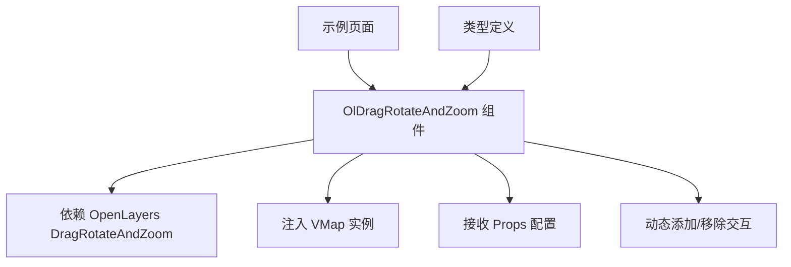

# 拖拽旋转缩放组件 (OlDragRotateAndZoom)

<cite>
**本文档引用文件**  
- [index.vue](file://src/packages/interaction/DragRotateAndZoom/index.vue#L1-L32)
- [index.ts](file://src/packages/interaction/DragRotateAndZoom/index.ts#L1-L6)
- [DragRotateAndZoom.ts](file://src/packages/types/DragRotateAndZoom.ts#L1-L6)
- [index.vue](file://src/examples/dragRotateAndZoom/index.vue#L1-L18)
</cite>

## 目录
1. [简介](#简介)
2. [项目结构](#项目结构)
3. [核心组件分析](#核心组件分析)
4. [类型定义与接口](#类型定义与接口)
5. [使用示例解析](#使用示例解析)
6. [组件集成与生命周期](#组件集成与生命周期)
7. [交互行为与配置灵活性](#交互行为与配置灵活性)
8. [与其他地图控件的协调](#与其他地图控件的协调)
9. [性能影响与优化建议](#性能影响与优化建议)
10. [总结](#总结)

## 简介
`OlDragRotateAndZoom` 是一个基于 OpenLayers 的 Vue 组件，旨在增强地图的交互体验。它扩展了默认的拖拽平移功能，允许用户在按住特定键（如 Shift）的同时拖动鼠标，实现地图的旋转和缩放操作。该组件封装了 OpenLayers 的 `DragRotateAndZoom` 交互类，并通过 Vue 的响应式机制实现动态配置更新。

本说明文档将深入分析其代码结构、工作原理、使用方式以及在复杂场景下的性能表现，帮助开发者全面理解并高效使用该组件。

## 项目结构
该组件位于项目的 `/src/packages/interaction/DragRotateAndZoom/` 目录下，遵循 Vue 3 的组合式 API 和 TypeScript 类型系统。主要包含以下文件：
- `index.vue`: 组件主文件，负责初始化和管理 OpenLayers 交互实例。
- `index.ts`: 组件安装模块，用于在 Vue 应用中全局注册该组件。
- 类型定义文件位于 `/src/packages/types/DragRotateAndZoom.ts`，提供类型支持。

示例文件位于 `/src/examples/dragRotateAndZoom/index.vue`，展示了如何在实际应用中启用此交互。



**图示来源**
- [index.vue](file://src/packages/interaction/DragRotateAndZoom/index.vue#L1-L32)
- [index.ts](file://src/packages/interaction/DragRotateAndZoom/index.ts#L1-L6)
- [DragRotateAndZoom.ts](file://src/packages/types/DragRotateAndZoom.ts#L1-L6)
- [index.vue](file://src/examples/dragRotateAndZoom/index.vue#L1-L18)

**中文段落来源**
- [index.vue](file://src/packages/interaction/DragRotateAndZoom/index.vue#L1-L32)
- [index.ts](file://src/packages/interaction/DragRotateAndZoom/index.ts#L1-L6)

## 核心组件分析
`OlDragRotateAndZoom` 组件的核心逻辑实现在 `index.vue` 文件中。它通过 Vue 的 `inject` 机制获取地图实例 `VMap`，并利用 `shallowRef` 管理 `DragRotateAndZoom` 交互对象。

组件在 `onMounted` 钩子中调用 `init()` 函数，创建新的 `DragRotateAndZoom` 实例并将其添加到地图的交互集合中。同时，使用 `watchEffect` 监听 `props` 的变化，一旦配置发生改变，立即移除旧的交互实例并重新初始化，确保配置的实时生效。

```vue
<script setup lang="ts">
const VMap = inject("VMap") as OlMap;
const map = unref(VMap).map;
const props = withDefaults(defineProps<DragRotateAndZoomOptions>(), {});
const dragRotateAndZoom = shallowRef<DragRotateAndZoom>();

const init = () => {
  dragRotateAndZoom.value = new DragRotateAndZoom(props);
  map.addInteraction(dragRotateAndZoom.value);
};

watchEffect(() => {
  if (dragRotateAndZoom.value) map.removeInteraction(dragRotateAndZoom.value);
  init();
});

onMounted(() => {
  init();
});
</script>
```

**中文段落来源**
- [index.vue](file://src/packages/interaction/DragRotateAndZoom/index.vue#L1-L32)

## 类型定义与接口
组件的类型定义位于 `src/packages/types/DragRotateAndZoom.ts`。它直接从 OpenLayers 导出的 `Options` 类型构建 `DragRotateAndZoomOptions`，确保了与底层库的类型一致性。同时，定义了组件实例类型 `OlDragRotateAndZoomInstance`，便于在 TypeScript 项目中进行类型推断和安全调用。

```ts
import OlDragRotateAndZoom from "../interaction/DragRotateAndZoom/index.vue";
import { Options } from "ol/interaction/DragRotateAndZoom";

export declare type DragRotateAndZoomOptions = Options;
export declare type OlDragRotateAndZoomInstance = InstanceType<typeof OlDragRotateAndZoom>;
```

这表明组件的 `props` 接受所有 OpenLayers `DragRotateAndZoom` 构造函数支持的选项，例如 `condition`、`duration` 等。

**中文段落来源**
- [DragRotateAndZoom.ts](file://src/packages/types/DragRotateAndZoom.ts#L1-L6)

## 使用示例解析
在 `src/examples/dragRotateAndZoom/index.vue` 中，展示了如何在 `OlMap` 中启用 `OlDragRotateAndZoom` 组件。

```vue
<template>
  <ol-map :controls="controls" :view="{ rotation: rotate }">
    <ol-tile tile-type="BAIDU"></ol-tile>
    <ol-drag-rotate-and-zoom></ol-drag-rotate-and-zoom>
  </ol-map>
</template>

<script setup lang="ts">
const controls: VMap["controls"] = {
  zoom: true,
  rotate: true,
};
const rotate = -Math.PI / 8;
</script>
```

此示例中，地图初始化时启用了缩放和旋转控件，并设置了初始旋转角度。通过简单地在模板中添加 `<ol-drag-rotate-and-zoom>` 标签，即可激活拖拽旋转缩放的交互功能。默认情况下，该交互通常在用户按住 Shift 键并拖动时触发。

**中文段落来源**
- [index.vue](file://src/examples/dragRotateAndZoom/index.vue#L1-L18)

## 组件集成与生命周期
组件的集成依赖于 `VMap` 上下文注入。`inject("VMap")` 从父级 `OlMap` 组件获取地图实例，这是实现组件间通信的关键。`onMounted` 确保在 DOM 挂载后才进行交互的初始化，避免了潜在的时序错误。

`watchEffect` 的使用是该组件的亮点。它创建了一个响应式副作用，每当 `props`（即组件的输入属性）发生变化时，都会自动执行清理和重新初始化流程。这种模式保证了组件状态与外部配置的高度同步，是 Vue 响应式系统的典型应用。

**中文段落来源**
- [index.vue](file://src/packages/interaction/DragRotateAndZoom/index.vue#L1-L32)

## 交互行为与配置灵活性
`OlDragRotateAndZoom` 的核心行为由 OpenLayers 的 `DragRotateAndZoom` 类决定。其触发条件（`condition`）可以通过 `props` 进行自定义。例如，可以配置为仅在按下 Alt 键或右键拖动时才激活，以避免与常规的拖拽平移操作冲突。

其他可配置参数包括动画持续时间（`duration`），用于控制旋转和缩放动画的流畅度。通过在父组件中传递不同的 `props`，可以轻松调整交互的灵敏度和用户体验。

**中文段落来源**
- [index.vue](file://src/packages/interaction/DragRotateAndZoom/index.vue#L1-L32)
- [DragRotateAndZoom.ts](file://src/packages/types/DragRotateAndZoom.ts#L1-L6)

## 与其他地图控件的协调
在示例中，`zoom` 和 `rotate` 控件被显式启用。`OlDragRotateAndZoom` 提供了一种更直观的旋转和缩放方式，与传统的按钮控件形成互补。开发者需注意，如果多个交互或控件对同一地图属性（如视图旋转）进行修改，可能会产生冲突或不可预测的行为。

最佳实践是明确各交互的触发条件，确保它们互不干扰。例如，常规拖拽用于平移，Shift+拖拽用于旋转缩放，从而提供清晰、无歧义的用户操作路径。

**中文段落来源**
- [index.vue](file://src/examples/dragRotateAndZoom/index.vue#L1-L18)

## 性能影响与优化建议
在 WebGL 或包含大量复杂图层（如矢量瓦片、热力图）的地图场景下，频繁的旋转和缩放操作可能导致渲染性能下降。`OlDragRotateAndZoom` 在每次拖动时都会触发视图变换，进而导致图层重绘。

**优化策略包括：**
1. **合理设置 `duration`**: 适当的动画时长可以在流畅性和性能间取得平衡。
2. **优化底层图层**: 确保瓦片服务高效，矢量数据经过简化或聚类。
3. **条件性启用**: 在图层复杂度高时，可考虑默认禁用此交互，或提供开关供用户选择。
4. **硬件加速**: 确保浏览器和 GPU 驱动支持 WebGL 加速，以提升渲染效率。

**中文段落来源**
- [index.vue](file://src/packages/interaction/DragRotateAndZoom/index.vue#L1-L32)

## 总结
`OlDragRotateAndZoom` 组件通过简洁的封装，为 OpenLayers 地图提供了强大的增强交互功能。它利用 Vue 3 的响应式系统，实现了配置的动态更新和交互的自动管理。结合示例代码，开发者可以快速将其集成到应用中，并通过自定义 `condition` 等参数来满足特定的交互需求。在追求高性能的复杂地图应用中，应注意其潜在的性能影响，并采取相应的优化措施。