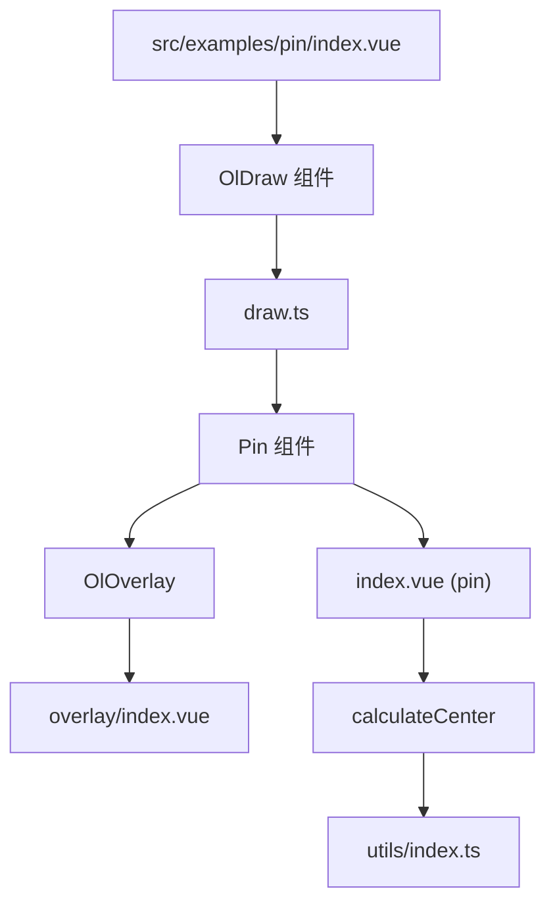
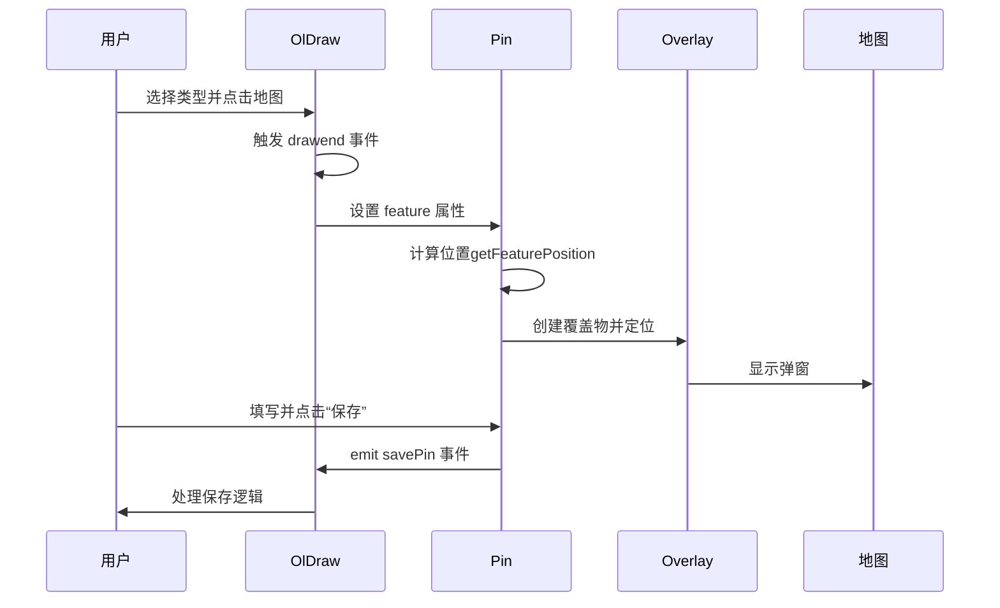
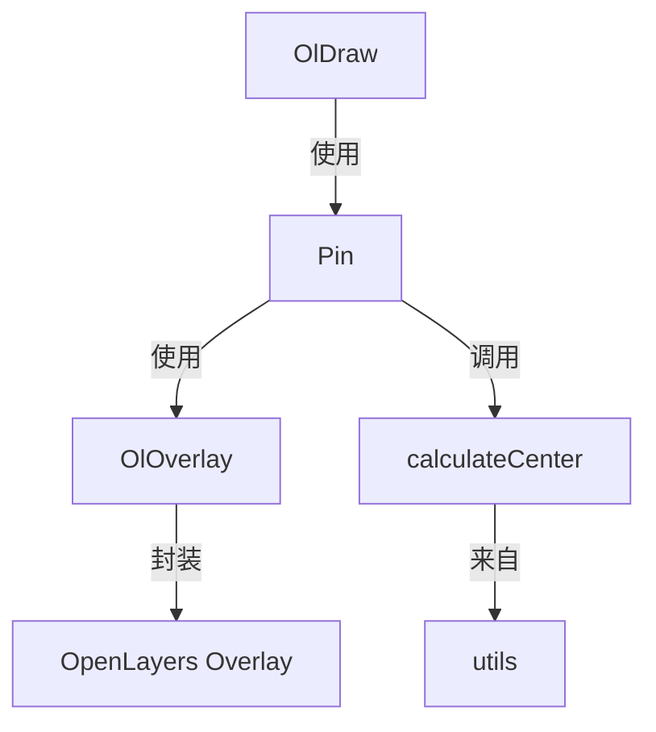

# 标记点组件 (OlPin)

<cite>
**本文档引用的文件**
- [index.vue](file://src/examples/pin/index.vue)
- [draw.ts](file://src/packages/interaction/draw/draw.ts)
- [index.vue](file://src/packages/interaction/pin/index.vue)
- [index.vue](file://src/packages/overlay/index.vue)
- [Overlay.ts](file://src/packages/types/Overlay.ts)
- [index.ts](file://src/packages/overlay/index.ts)
- [utils/index.ts](file://src/packages/utils/index.ts)
</cite>

## 目录
1. [简介](#简介)
2. [项目结构](#项目结构)
3. [核心组件](#核心组件)
4. [架构概述](#架构概述)
5. [详细组件分析](#详细组件分析)
6. [依赖关系分析](#依赖关系分析)
7. [性能考虑](#性能考虑)
8. [故障排除指南](#故障排除指南)
9. [结论](#结论)

## 简介
标记点组件（OlPin）是基于 OpenLayers 的 Vue 组件，用于在地图上创建、编辑和管理标记点（Pin）。该组件通过与 `OlDraw` 交互组件集成，支持用户点击地图添加点或面要素，并弹出可自定义的表单弹窗，用于输入名称、备注等信息。组件支持拖拽编辑、样式自定义、弹窗定位等功能，适用于兴趣点标注、区域标记等场景。

## 项目结构
项目采用模块化设计，核心功能组件位于 `src/packages` 目录下，示例代码位于 `src/examples` 目录。标记点功能主要涉及以下路径：
- `src/examples/pin/index.vue`：功能演示页面
- `src/packages/interaction/draw/draw.ts`：绘图交互主逻辑
- `src/packages/interaction/pin/index.vue`：标记点弹窗组件
- `src/packages/overlay/index.vue`：覆盖物（Overlay）基础组件
- `src/packages/utils/index.ts`：工具函数（如几何中心计算）



**图示来源**
- [index.vue](file://src/examples/pin/index.vue)
- [draw.ts](file://src/packages/interaction/draw/draw.ts)
- [index.vue](file://src/packages/interaction/pin/index.vue)
- [index.vue](file://src/packages/overlay/index.vue)
- [index.ts](file://src/packages/utils/index.ts)

## 核心组件
标记点功能由多个组件协同实现：
- **OlDraw**：主交互组件，控制绘图行为。
- **Pin**：弹窗表单组件，用于输入标记信息。
- **OlOverlay**：OpenLayers 覆盖物封装，实现弹窗定位。
- **calculateCenter**：工具函数，计算多边形顶部中心点用于弹窗定位。

**组件来源**
- [draw.ts](file://src/packages/interaction/draw/draw.ts#L13-L75)
- [index.vue](file://src/packages/interaction/pin/index.vue#L0-L62)
- [index.vue](file://src/packages/overlay/index.vue#L0-L60)

## 架构概述
标记点组件通过 `OlDraw` 的 `pin` 属性触发，当用户完成点或面的绘制后，自动渲染 `Pin` 组件。`Pin` 组件使用 `OlOverlay` 将表单定位在要素上方。数据流如下：
1. 用户选择“兴趣点”或“兴趣面”类型。
2. 点击地图完成绘制。
3. `OlDraw` 捕获 `drawend` 事件，设置 `drawFeature`。
4. `Pin` 组件监听 `feature` 变化，计算位置并显示弹窗。
5. 用户填写信息并点击“保存”，触发 `savePin` 事件。



**图示来源**
- [draw.ts](file://src/packages/interaction/draw/draw.ts#L69-L97)
- [index.vue](file://src/packages/interaction/pin/index.vue#L0-L62)

## 详细组件分析

### OlDraw 组件分析
`OlDraw` 是绘图功能的核心，通过 `pin` 属性启用标记点模式。

#### 属性说明
- **type**: 绘图类型（Point, Polygon 等）
- **pin**: 是否启用标记点模式
- **pinClass**: 弹窗容器类名
- **pinTitleClass**: 标题区域类名
- **pinBodyClass**: 内容区域类名
- **pinFooterClass**: 底部按钮区域类名
- **@savePin**: 保存事件回调

#### 内部实现
当 `pin` 为 `true` 时，`render` 函数返回 `Pin` 组件：
```ts
return h(Pin, {
  type,
  feature: drawFeature.value,
  pinClass: props.pinClass,
  titleClass: props.pinTitleClass,
  bodyClass: props.pinBodyClass,
  footerClass: props.pinFooterClass,
  onSave: (data: any) => {
    emit("savePin", data);
  },
});
```

**组件来源**
- [draw.ts](file://src/packages/interaction/draw/draw.ts#L186-L234)

### Pin 组件分析
`Pin` 组件负责渲染弹窗和处理用户输入。

#### 属性定义
```ts
type PinOptions = {
  type: "Point" | "Polygon";
  feature: Feature | undefined;
  pinClass?: string;
  titleClass?: string[] | string;
  bodyClass?: string[] | string;
  footerClass?: string[] | string;
};
```

#### 位置计算
- **点要素**：直接使用坐标。
- **面要素**：调用 `calculateCenter` 获取顶部中心点。

```ts
const getFeaturePosition = (feature: Feature | undefined) => {
  if (feature) {
    if (feature.get("type") === "Point") {
      return (feature.getGeometry() as Point)?.getCoordinates();
    } else {
      const { topCenter } = calculateCenter(feature.getGeometry());
      return topCenter;
    }
  }
};
```

#### 保存逻辑
点击“保存”后，将名称、备注等信息写入 `feature` 的属性中，并通过 `emit("save")` 通知父组件。

**组件来源**
- [index.vue](file://src/packages/interaction/pin/index.vue#L0-L62)

### OlOverlay 组件分析
`OlOverlay` 是 OpenLayers `Overlay` 类的 Vue 封装，用于在地图上定位 DOM 元素。

#### 关键属性
- **position**: 覆盖物的地理坐标位置
- **offset**: 偏移量（像素）
- **positioning**: 定位锚点（如 "bottom-center"）

#### 初始化流程
1. 组件挂载后，创建 `Overlay` 实例。
2. 将 `props` 中的配置项（如 `position`, `offset`）传入。
3. 添加到地图 `map.addOverlay()`。

**组件来源**
- [index.vue](file://src/packages/overlay/index.vue#L0-L60)

## 依赖关系分析
标记点组件依赖多个内部模块，形成清晰的调用链。



**图示来源**
- [draw.ts](file://src/packages/interaction/draw/draw.ts)
- [index.vue](file://src/packages/interaction/pin/index.vue)
- [index.vue](file://src/packages/overlay/index.vue)
- [index.ts](file://src/packages/utils/index.ts)

## 性能考虑
- **大量标记点**：建议使用 `OlCluster` 组件进行聚合显示，避免性能下降。
- **频繁更新**：避免在 `watch` 中执行复杂计算，`calculateCenter` 已优化为按需计算。
- **事件监听**：`singleclick` 事件在 `onMounted` 中绑定，确保组件销毁时自动解绑（由 OpenLayers 管理）。

## 故障排除指南
- **弹窗不显示**：检查 `pin` 属性是否为 `true`，且 `type` 不为空。
- **位置偏移**：确认 `OlOverlay` 的 `offset` 和 `positioning` 设置正确。
- **样式不生效**：使用 `:deep()` 穿透样式作用域，如 `:deep(.pin-light-container)`。
- **保存事件未触发**：确保父组件正确监听 `@savePin` 事件。

**组件来源**
- [index.vue](file://src/examples/pin/index.vue#L0-L51)
- [index.vue](file://src/packages/interaction/pin/index.vue#L0-L62)

## 结论
标记点组件（OlPin）通过 `OlDraw` 与 `Pin` 的协同，实现了地图上标记点的便捷创建与管理。组件设计模块化，易于扩展和定制。通过 `OlOverlay` 实现精准定位，结合 `calculateCenter` 提升用户体验。在实际应用中，可结合 `OlCluster` 处理大数据量场景，确保性能稳定。