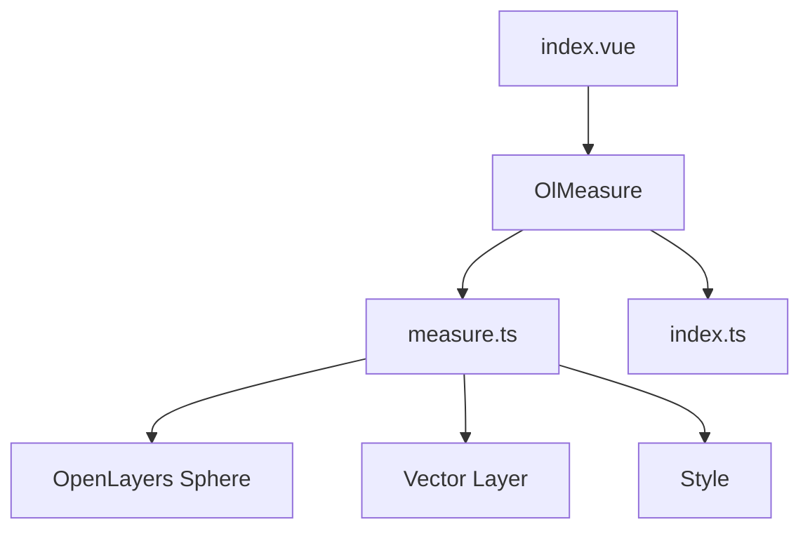
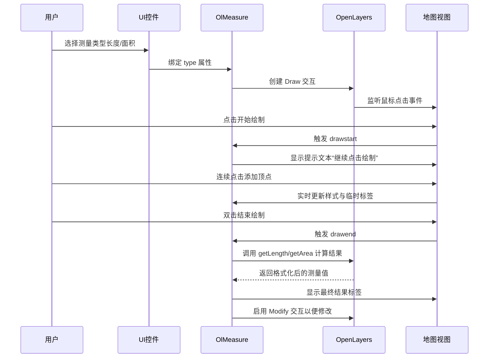
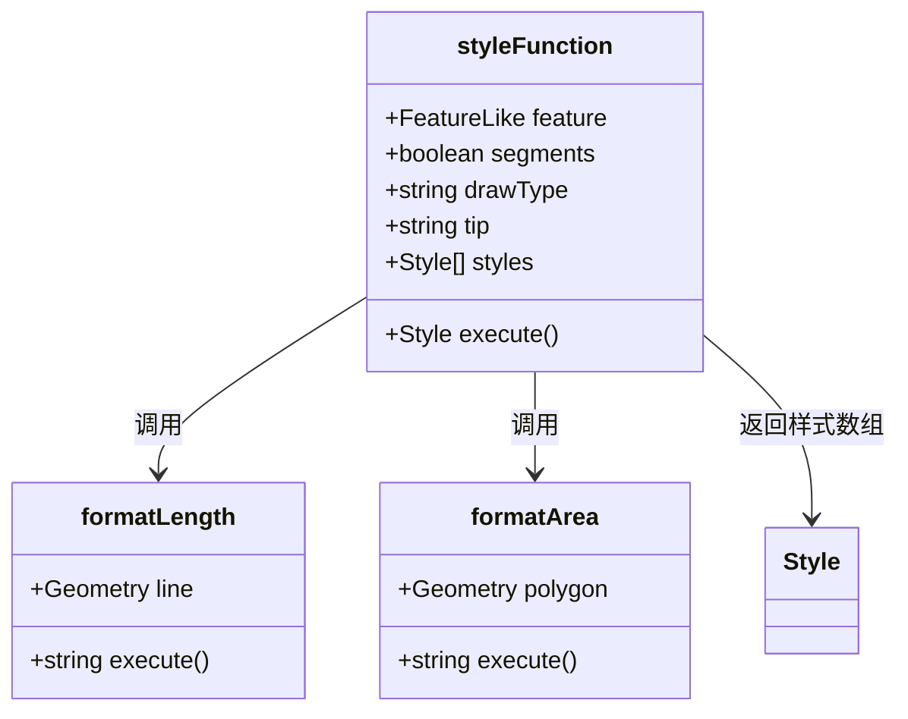
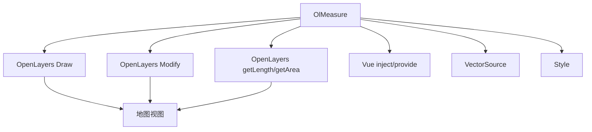

# 测量组件 (OlMeasure)

<cite>
**本文档引用文件**   
- [measure.ts](file://src/packages/interaction/measure/measure.ts#L1-L301)
- [index.ts](file://src/packages/interaction/measure/index.ts#L1-L7)
- [index.vue](file://src/examples/measure/index.vue#L1-L59)
- [Measure.ts](file://src/packages/types/Measure.ts#L1-L11)
</cite>

## 目录
1. [简介](#简介)
2. [项目结构](#项目结构)
3. [核心组件](#核心组件)
4. [架构概述](#架构概述)
5. [详细组件分析](#详细组件分析)
6. [依赖分析](#依赖分析)
7. [性能考量](#性能考量)
8. [故障排除指南](#故障排除指南)
9. [结论](#结论)

## 简介
`OlMeasure` 是一个基于 OpenLayers 的 Vue 组件，用于在地图上执行距离和面积测量。该组件利用 OpenLayers 提供的球面几何计算方法（如 `getLength` 和 `getArea`）实现高精度地理测量，并自动处理坐标系投影转换以确保结果准确性。用户可通过选择测量类型（长度或面积）激活工具，动态查看测量提示与结果，并支持清除历史测量数据。本文档将深入解析其内部机制、API 接口及使用方式。

## 项目结构
`OlMeasure` 组件位于项目的 `/src/packages/interaction/measure/` 目录下，主要由两个文件构成：
- `measure.ts`：核心逻辑实现文件，定义了 `OlMeasure` 组件的完整功能。
- `index.ts`：组件注册入口，用于在 Vue 应用中全局注册该组件。

示例页面位于 `/src/examples/measure/index.vue`，展示了如何在实际应用中集成和控制该测量工具。



**图示来源**
- [measure.ts](file://src/packages/interaction/measure/measure.ts#L1-L301)
- [index.vue](file://src/examples/measure/index.vue#L1-L59)

**本节来源**
- [measure.ts](file://src/packages/interaction/measure/measure.ts#L1-L301)
- [index.vue](file://src/examples/measure/index.vue#L1-L59)

## 核心组件
`OlMeasure` 是一个 Vue 3 的函数式组件，基于 `defineComponent` 构建，依赖于 OpenLayers 的 `Draw` 和 `Modify` 交互模块。其核心职责包括：
- 根据测量类型（长度/面积）创建对应的几何图形（LineString/Polygon）
- 实时计算并显示测量结果（米/千米，平方米/平方千米）
- 支持分段长度标注（showSegments）
- 提供清除上一次测量结果的功能（clearPrevious）
- 暴露 `clear` 和 `setActive` 方法供外部调用

组件通过注入 `VMap` 和 `ParentLayer` 来获取地图实例和矢量图层，确保与当前地图上下文正确绑定。

**本节来源**
- [measure.ts](file://src/packages/interaction/measure/measure.ts#L13-L301)

## 架构概述
`OlMeasure` 的工作流程如下图所示：



**图示来源**
- [measure.ts](file://src/packages/interaction/measure/measure.ts#L100-L200)
- [index.vue](file://src/examples/measure/index.vue#L10-L30)

## 详细组件分析

### 测量类型与几何计算
组件通过 `props.type` 判断测量模式：
- `"length"` → 创建 `LineString`
- `"area"` → 创建 `Polygon`

使用 OpenLayers 的 `ol/sphere.getLength` 和 `getArea` 方法进行地球曲率校正的高精度计算，传入当前地图视图的投影坐标系以保证单位正确。

#### 长度格式化逻辑
```ts
const formatLength = function (line: Geometry) {
  const length = getLength(line, {
    projection: unref(map).getView().getProjection(),
  });
  let output;
  if (length > 100) {
    output = Math.round((length / 1000) * 100) / 100 + " km";
  } else {
    output = Math.round(length * 100) / 100 + " m";
  }
  return output;
};
```

#### 面积格式化逻辑
```ts
const formatArea = function (polygon: Geometry) {
  const area = getArea(polygon, {
    projection: unref(map).getView().getProjection(),
  });
  let output;
  if (area > 10000) {
    output = Math.round((area / 1000000) * 100) / 100 + " km²";
  } else {
    output = Math.round(area * 100) / 100 + " m²";
  }
  return output;
};
```

**本节来源**
- [measure.ts](file://src/packages/interaction/measure/measure.ts#L141-L164)

### 样式系统设计
组件内置多种样式对象，用于不同状态下的视觉呈现：
- `style`：测量线/面的基础样式（虚线边框、半透明填充）
- `labelStyle`：最终测量结果的文字标签（带背景、偏移）
- `tipStyle`：绘制过程中的提示文字（如“继续点击绘制”）
- `modifyStyle`：修改模式下的拖拽提示
- `segmentStyle`：分段距离标注样式

这些样式通过 `styleFunction` 动态组合应用到要素上。



**图示来源**
- [measure.ts](file://src/packages/interaction/measure/measure.ts#L100-L140)

**本节来源**
- [measure.ts](file://src/packages/interaction/measure/measure.ts#L67-L140)

### API 暴露与外部控制
组件通过 `expose` 向父组件暴露两个关键方法：
- `clear()`：清空当前图层中的所有测量要素
- `setActive(active: boolean)`：启用或禁用测量交互

在示例中，通过 `ref` 获取组件实例并绑定按钮事件实现控制。

```vue
<ol-measure ref="olMeasureRef" :type="measureType" :clear-previous="true" :show-segments="true"/>
<button @click="clear">清除</button>
<button @click="setActive">{{ active ? "停止测量" : "恢复测量" }}</button>
```

**本节来源**
- [measure.ts](file://src/packages/interaction/measure/measure.ts#L280-L290)
- [index.vue](file://src/examples/measure/index.vue#L10-L25)

## 依赖分析
`OlMeasure` 依赖以下核心模块：
- `OpenLayers`：提供地图、几何计算、交互功能
- `Vue 3`：组件系统、响应式、注入机制
- `VMap`：地图上下文注入
- `VectorLayer`：承载测量要素的图层



**图示来源**
- [measure.ts](file://src/packages/interaction/measure/measure.ts#L1-L301)

**本节来源**
- [measure.ts](file://src/packages/interaction/measure/measure.ts#L1-L301)

## 性能考量
- **实时渲染优化**：仅在 `drawend` 后才进行最终计算，避免频繁调用高成本的球面计算。
- **样式复用**：预定义样式对象并复用，减少运行时创建开销。
- **内存管理**：通过 `source.clear()` 清除旧要素，防止内存泄漏。
- **大规模数据场景**：建议限制单次测量点数，避免过多线段导致样式渲染压力。

## 故障排除指南
| 问题 | 可能原因 | 解决方案 |
|------|--------|---------|
| 测量结果不准确 | 投影未正确设置 | 确保地图视图使用地理坐标系（如 EPSG:4326）或支持球面计算的投影 |
| 提示文字不显示 | 样式被覆盖 | 检查 CSS 是否影响了 OpenLayers 的 overlay 渲染 |
| 无法开始测量 | type 为空或无效 | 确保 `type` 属性为 `"length"` 或 `"area"` |
| 分段标注错位 | 坐标转换异常 | 检查地图投影与几何坐标的匹配性 |

**本节来源**
- [measure.ts](file://src/packages/interaction/measure/measure.ts#L141-L164)
- [index.vue](file://src/examples/measure/index.vue#L1-L59)

## 结论
`OlMeasure` 是一个功能完整、设计良好的地图测量组件，具备高精度计算、动态反馈、灵活控制等优点。通过合理使用其 API 和配置项，开发者可以轻松集成距离和面积测量功能到地理信息系统中。建议在实际项目中结合 UI 控件与事件监听，提升用户体验。