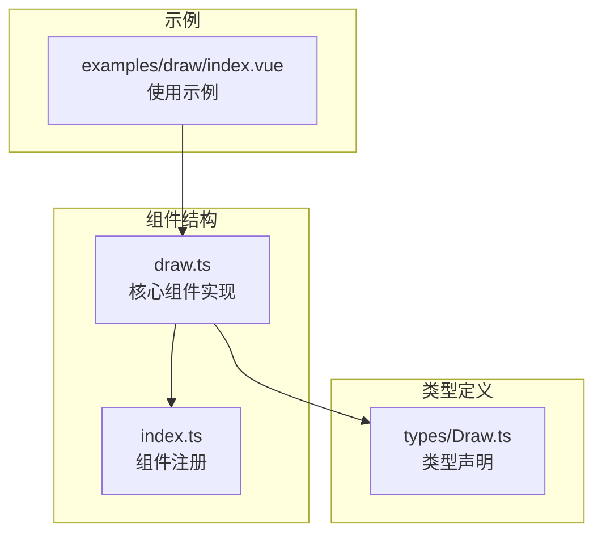
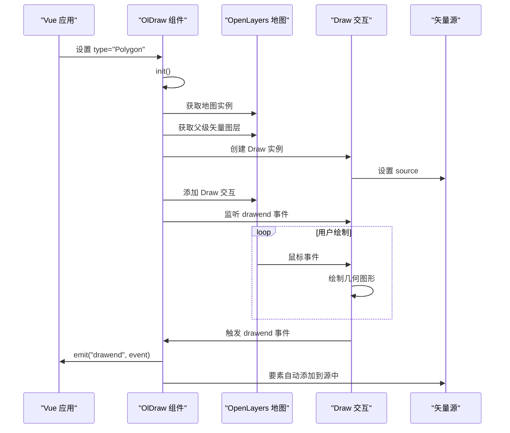
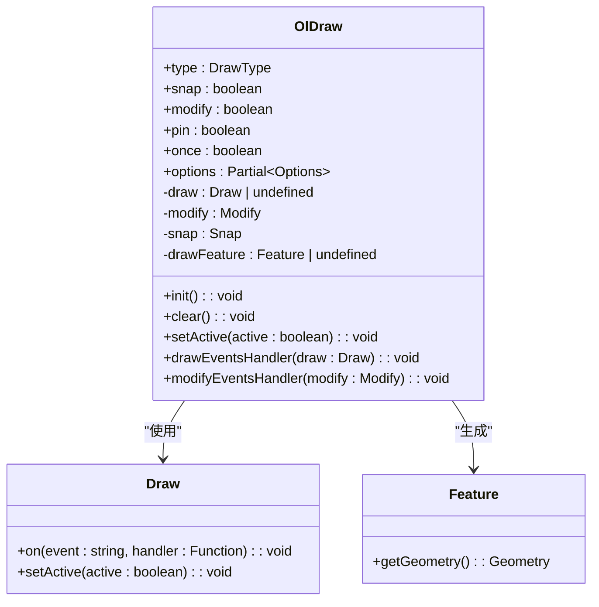
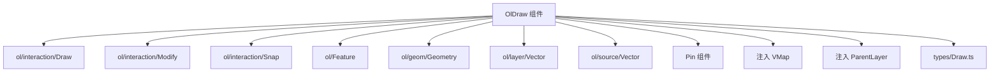

# 绘制组件 (OlDraw)

<cite>
**本文档引用文件**   
- [draw.ts](file://src/packages/interaction/draw/draw.ts#L1-L235)
- [index.ts](file://src/packages/interaction/draw/index.ts#L1-L6)
- [index.vue](file://src/examples/draw/index.vue#L1-L95)
- [Draw.ts](file://src/packages/types/Draw.ts#L1-L17)
</cite>

## 目录
1. [介绍](#介绍)
2. [项目结构](#项目结构)
3. [核心组件](#核心组件)
4. [架构概述](#架构概述)
5. [详细组件分析](#详细组件分析)
6. [依赖分析](#依赖分析)
7. [性能考虑](#性能考虑)
8. [故障排除指南](#故障排除指南)
9. [结论](#结论)

## 介绍
`OlDraw` 是一个基于 OpenLayers 的 Vue 组件，用于在地图上进行点、线、面等几何图形的绘制。该组件封装了 OpenLayers 的 `Draw` 交互类，支持完整的绘制生命周期（开始、进行中、结束），并提供了丰富的配置选项，如几何类型（`Point`, `LineString`, `Polygon`, `Circle` 等）、吸附（Snap）、编辑（Modify）、单次绘制模式、自定义样式等。通过事件机制（如 `drawend`），用户可以获取绘制完成后的要素（Feature）并进行后续处理。

本组件常与 `OlVector` 矢量图层配合使用，将绘制的要素添加至矢量源中，并支持通过 `Pin` 组件为绘制的点或区域添加信息窗口。

## 项目结构
`OlDraw` 组件位于项目的 `src/packages/interaction/draw/` 目录下，主要由两个文件构成：
- `draw.ts`：核心实现文件，定义了 `OlDraw` Vue 组件。
- `index.ts`：组件注册入口，用于在 Vue 应用中全局注册该组件。

示例文件位于 `src/examples/draw/index.vue`，展示了如何在实际应用中使用该组件。

**Diagram sources**
- [draw.ts](file://src/packages/interaction/draw/draw.ts#L1-L235)
- [index.ts](file://src/packages/interaction/draw/index.ts#L1-L6)
- [Draw.ts](file://src/packages/types/Draw.ts#L1-L17)
- [index.vue](file://src/examples/draw/index.vue#L1-L95)

## 核心组件
`OlDraw` 组件的核心功能是封装 OpenLayers 的 `Draw` 交互，并提供 Vue 友好的 API。其主要特性包括：
- **几何类型支持**：支持 `Point`, `LineString`, `Polygon`, `Circle`，并扩展支持 `Rectangle`（矩形）和 `Square`（正方形）。
- **交互功能**：支持 `Snap`（吸附）和 `Modify`（编辑）交互。
- **生命周期事件**：暴露 `drawstart`、`drawend`、`modifystart`、`modifyend` 等事件。
- **控制方法**：通过 `expose` 暴露 `clear` 和 `setActive` 方法，用于清除绘制内容和控制绘制状态。
- **Pin 集成**：支持在绘制完成后弹出 `Pin` 信息窗口，用于数据录入。

**Section sources**
- [draw.ts](file://src/packages/interaction/draw/draw.ts#L1-L235)

## 架构概述
`OlDraw` 组件的架构基于 Vue 的组合式 API 和 OpenLayers 的交互系统。其工作流程如下：
1. 组件通过 `inject` 获取地图实例（`VMap`）和父级矢量图层（`ParentLayer`）。
2. 根据 `props.type` 配置创建 `Draw` 交互实例，并将其添加到地图中。
3. 监听 `Draw` 事件（如 `drawend`），并通过 `emit` 将事件传递给父组件。
4. 支持 `Snap` 和 `Modify` 交互，增强用户体验。
5. 提供 `clear` 和 `setActive` 方法，用于控制绘制行为。

**Diagram sources**
- [draw.ts](file://src/packages/interaction/draw/draw.ts#L1-L235)

## 详细组件分析

### 组件属性 (Props) 分析
`OlDraw` 组件通过 `props` 接收外部配置，主要属性如下：

**:Props 列表**
- **type**: 几何类型，可选值包括 `Point`, `LineString`, `Polygon`, `Circle`, `Rectangle`, `Square`。
- **snap**: 是否启用吸附功能，默认为 `false`。
- **modify**: 是否启用编辑功能，默认为 `false`。
- **pin**: 绘制完成后是否弹出信息窗口，默认为 `false`。
- **once**: 是否为单次绘制模式。若为 `true`，每次绘制前会清空矢量源。
- **options**: 传递给 OpenLayers `Draw` 构造函数的额外选项，如 `maxPoints`（最大点数）。

**Section sources**
- [draw.ts](file://src/packages/interaction/draw/draw.ts#L10-L50)

### 事件 (Emits) 分析
组件通过 `emit` 触发以下事件：

**:Emits 列表**
- **drawend**: 绘制结束时触发，携带 `DrawEvent` 对象。
- **drawstart**: 绘制开始时触发，携带 `DrawEvent` 对象。
- **modifyend**: 编辑结束时触发，携带 `ModifyEvent` 对象。
- **modifystart**: 编辑开始时触发，携带 `ModifyEvent` 对象。
- **savePin**: 当 `Pin` 窗口保存数据时触发。

**Section sources**
- [draw.ts](file://src/packages/interaction/draw/draw.ts#L52-L65)

### 方法 (Expose) 分析
组件通过 `expose` 暴露以下方法供父组件调用：

**:Expose 方法列表**
- **clear**: 清除矢量源中的所有要素，并重置绘制状态。
- **setActive**: 启用或禁用绘制交互。

**Section sources**
- [draw.ts](file://src/packages/interaction/draw/draw.ts#L195-L205)

### 类型定义分析
组件依赖 `types/Draw.ts` 中的类型定义，确保类型安全。

**:Draw.ts 类型定义**
- **DrawType**: 联合类型，包含 OpenLayers 原生类型和扩展类型（`Rectangle`, `Square`）。
- **ExposeDraw**: 暴露方法的接口类型。
- **OlDrawInstance**: 组件实例类型，便于在 `ref` 中使用。

**Diagram sources**
- [draw.ts](file://src/packages/interaction/draw/draw.ts#L1-L235)
- [Draw.ts](file://src/packages/types/Draw.ts#L1-L17)

## 依赖分析
`OlDraw` 组件依赖多个 OpenLayers 模块和项目内部模块。

**Diagram sources**
- [draw.ts](file://src/packages/interaction/draw/draw.ts#L1-L235)

## 性能考虑
- **单次绘制模式**：启用 `once` 模式时，每次绘制前会清空矢量源，避免内存泄漏。
- **交互管理**：组件在 `init` 时会先移除旧的交互，确保不会重复添加。
- **批量绘制**：若需批量绘制大量要素，建议在绘制完成后统一处理，避免频繁触发 `drawend` 事件。

## 故障排除指南
- **绘制无反应**：检查 `type` 是否正确设置，且父级 `OlVector` 组件已正确注入。
- **要素未显示**：确认 `OlVector` 的 `layerStyle` 已正确配置。
- **Snap/Modify 不生效**：确保 `snap` 和 `modify` 属性为 `true`，且矢量源存在可吸附/编辑的要素。
- **Pin 窗口不弹出**：检查 `pin` 属性是否为 `true`，且 `type` 为 `Point` 或 `Polygon` 类型。

**Section sources**
- [draw.ts](file://src/packages/interaction/draw/draw.ts#L1-L235)
- [index.vue](file://src/examples/draw/index.vue#L1-L95)

## 结论
`OlDraw` 组件是一个功能强大且易于使用的地图绘制工具，它将 OpenLayers 的复杂交互封装为简洁的 Vue 组件 API。通过合理的属性配置和事件监听，开发者可以快速实现地图上的点、线、面绘制功能，并结合 `Pin` 组件实现数据采集。其良好的类型定义和模块化设计也保证了代码的可维护性和可扩展性。