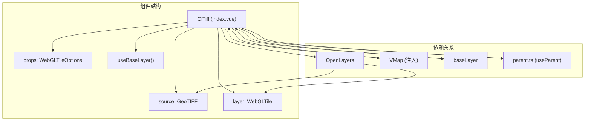
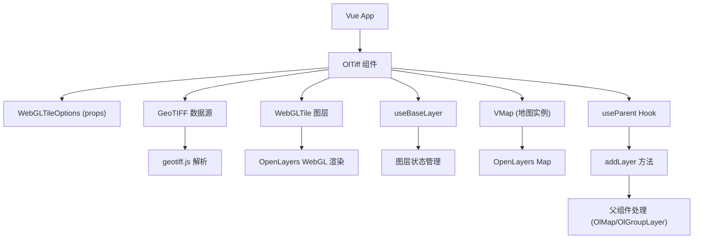
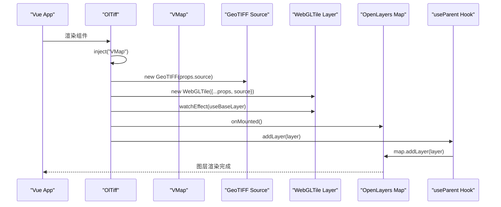
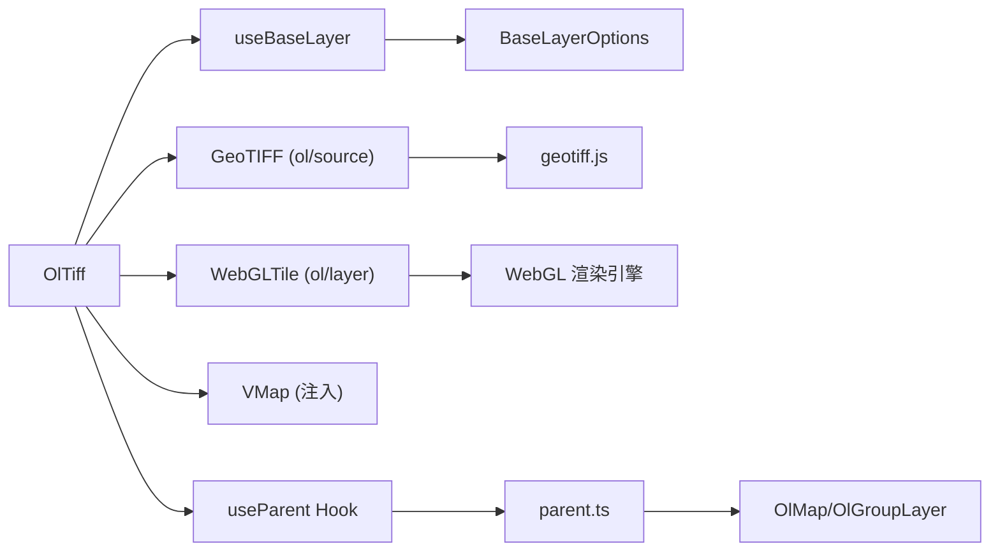

# TIFF图层 (OlTiff)

<cite>
**本文档引用文件**  
- [index.vue](file://src/packages/layers/tiff/index.vue#L0-L47)
- [index.ts](file://src/packages/layers/tiff/index.ts#L0-L7)
- [index.vue](file://src/examples/tiff/index.vue#L0-L30)
- [Tile.ts](file://src/packages/types/Tile.ts#L38-L67)
- [baseLayer/index.ts](file://src/packages/layers/baseLayer/index.ts#L0-L127)
- [parent.ts](file://src/packages/hooks/parent.ts#L0-L56)
</cite>

## 更新摘要
**变更内容**  
- 更新了图层初始化逻辑：TIFF图层的layerId默认值已从动态ID生成改为空字符串
- 新增了用户自定义ID优先级机制和回退功能的详细说明
- 更新了图层ID管理的最佳实践建议

## 目录
1. [简介](#简介)
2. [项目结构](#项目结构)
3. [核心组件](#核心组件)
4. [架构概述](#架构概述)
5. [详细组件分析](#详细组件分析)
6. [依赖分析](#依赖分析)
7. [性能考量](#性能考量)
8. [故障排除指南](#故障排除指南)
9. [结论](#结论)

## 简介
本文档旨在全面介绍 **TIFF图层 (OlTiff)** 的实现机制与使用方法，重点聚焦于地理空间栅格数据（GeoTIFF）的加载、解析与可视化。通过集成 `geotiff.js` 和 OpenLayers 的 `WebGLTile` 图层，该组件支持高效渲染多波段遥感影像，并支持动态波段组合、对比度调节与透明度控制。结合示例代码，本文将详细说明其在环境监测、农业遥感等领域的应用模式，并探讨大文件加载时的优化策略。

## 项目结构
`OlTiff` 组件位于 `src/packages/layers/tiff/` 目录下，遵循 Vue 3 的组合式 API 设计，通过 `index.vue` 实现核心逻辑，`index.ts` 提供组件注册功能。该组件依赖于 OpenLayers 的 `GeoTIFF` 数据源和 `WebGLTile` 图层，结合 `baseLayer` 抽象层实现通用图层管理。



**图示来源**  
- [index.vue](file://src/packages/layers/tiff/index.vue#L0-L47)

## 核心组件
`OlTiff` 的核心功能由 `index.vue` 实现，主要包含以下部分：
- **Props 定义**：继承 `WebGLTileOptions`，支持 `layerId`、`visible`、`source` 等配置。**更新**：`layerId` 默认值现已改为 `""`（空字符串）。
- **图层初始化**：通过 `inject("VMap")` 获取地图实例，创建 `GeoTIFF` 数据源和 `WebGLTile` 图层。
- **生命周期管理**：在 `onMounted` 阶段将图层添加至地图，**更新**：保留了动态ID生成的回退机制。
- **响应式更新**：通过 `watchEffect` 监听属性变化，调用 `useBaseLayer` 同步图层状态。

**组件来源**  
- [index.vue](file://src/packages/layers/tiff/index.vue#L0-L47)

## 架构概述
`OlTiff` 组件采用分层架构，解耦了数据源、图层渲染与地图集成逻辑。其核心依赖 OpenLayers 的 WebGL 渲染能力，实现高性能栅格数据可视化。



**图示来源**  
- [index.vue](file://src/packages/layers/tiff/index.vue#L0-L47)
- [baseLayer/index.ts](file://src/packages/layers/baseLayer/index.ts#L0-L127)
- [parent.ts](file://src/packages/hooks/parent.ts#L0-L56)

## 详细组件分析

### OlTiff 组件分析
`OlTiff` 是一个 Vue 3 函数式组件，通过 `defineProps<WebGLTileOptions>()` 接收配置，利用 `GeoTIFF` 和 `WebGLTile` 实现 GeoTIFF 数据的加载与渲染。

#### 组件初始化流程


**图示来源**  
- [index.vue](file://src/packages/layers/tiff/index.vue#L0-L47)

#### 关键代码解析
```ts
// 定义组件属性 - 更新：layerId默认值为""
const props = withDefaults(defineProps<WebGLTileOptions>(), {
  layerId: "",  // 更新：从动态ID改为空字符串
  visible: true,
});

// 注入地图实例
const VMap = inject("VMap") as OlMap;
const map = unref(VMap).map;

// 创建数据源与图层
const source = new GeoTIFF(props.source);
const layer = new GeoTIFFLayer({
  ...props,
  source,
});

// 监听属性变化并同步图层状态
watchEffect(() => {
  useBaseLayer(layer, props as BaseLayerOptions);
});

// 挂载时添加图层 - 更新：保留动态ID生成回退机制
onMounted(() => {
  const layerId = props.layerId || `tile-layer-${nanoid()}`;
  layer.set("id", layerId);
  addLayer(layer);
});
```

**组件来源**  
- [index.vue](file://src/packages/layers/tiff/index.vue#L0-L47)

### 图层ID管理机制
**更新**：TIFF图层现在采用了更灵活的ID管理策略：

#### 默认行为
- 当用户未提供 `layerId` 时，默认值为 `""`（空字符串）
- 在挂载阶段会自动检测并生成唯一ID作为回退方案

#### 用户自定义优先级
- 如果用户明确设置了 `layerId`，则优先使用用户的自定义ID
- 这种设计确保了用户对图层的完全控制权

#### 回退机制
- 当 `props.layerId` 为空字符串时，系统会自动生成类似 `tile-layer-xxxxx` 的唯一ID
- 使用 `nanoid()` 生成安全的随机ID，避免冲突

**最佳实践建议**：
- 对于单个图层，建议显式设置 `layerId` 以便于管理和引用
- 对于动态创建的图层，可以考虑使用空字符串让系统自动生成唯一ID
- 在复杂应用中，建议使用有意义的ID命名规范

**组件来源**  
- [index.vue](file://src/packages/layers/tiff/index.vue#L34-L39)

### 示例应用分析
`src/examples/tiff/index.vue` 提供了 `OlTiff` 的典型用法，展示如何加载远程 GeoTIFF 文件并叠加在卫星底图上。

#### 示例代码
```vue
<template>
  <ol-map :view="view">
    <ol-tile tile-type="TDT_SATELLITE"></ol-tile>
    <ol-tiff :source="GeoTIFF"></ol-tiff>
  </ol-map>
</template>

<script setup lang="ts">
const GeoTIFF: WebGLTileOptions["source"] = {
  projection: "EPSG:4548",
  sources: [
    {
      url: "http://172.16.34.132:5000/ljd/result.tif",
      overviews: ["http://172.16.34.132:5000/ljd/result.tif.ovr"],
    },
  ],
};
</script>
```

#### 配置说明
- **projection**: 指定 GeoTIFF 的空间参考系统（EPSG:4548）。
- **sources.url**: GeoTIFF 文件的远程 URL。
- **sources.overviews**: 提供金字塔概览文件（.ovr），用于加速多层级渲染。
- **overviews**: 支持分块（chunking）和懒加载，提升大文件加载性能。

**示例来源**  
- [index.vue](file://src/examples/tiff/index.vue#L0-L30)

## 依赖分析
`OlTiff` 组件依赖多个内部与外部模块，形成清晰的依赖链。



**图示来源**  
- [index.vue](file://src/packages/layers/tiff/index.vue#L0-L47)
- [Tile.ts](file://src/packages/types/Tile.ts#L38-L67)
- [baseLayer/index.ts](file://src/packages/layers/baseLayer/index.ts#L0-L127)
- [parent.ts](file://src/packages/hooks/parent.ts#L0-L56)

## 性能考量
为应对大尺寸 GeoTIFF 文件的加载挑战，`OlTiff` 支持以下优化策略：
- **金字塔概览（Overviews）**: 通过 `sources.overviews` 提供多分辨率版本，实现快速缩放。
- **WebGL 渲染**: 利用 GPU 加速像素处理，支持实时波段组合与色彩映射。
- **懒加载**: 结合 `geotiff.js` 的分块读取能力，按需加载数据块。
- **内存管理**: `WebGLTile` 自动管理纹理内存，避免内存溢出。
- **图层复用**: 通过 `layerId` 唯一标识，支持图层的查找、更新和销毁操作。

## 故障排除指南
- **问题：GeoTIFF 无法显示**
  - 检查 `url` 是否可访问，确保服务器支持 CORS。
  - 验证 `projection` 是否与地图视图匹配。
  - 确认 `.ovr` 文件是否存在且路径正确。
- **问题：颜色显示异常**
  - 检查 `source` 配置中是否包含 `normalize: false`，避免自动拉伸。
  - 确认波段顺序（如 NIR, Red 用于 NDVI）是否正确。
- **问题：性能低下**
  - 启用 `overviews` 加速渲染。
  - 限制同时加载的图层数量。
  - 使用 `visible: false` 控制图层显隐。
- **问题：图层ID冲突**
  - **更新**：确保每个图层都有唯一的 `layerId`。
  - 如果使用空字符串，系统会自动生成唯一ID，但不建议在生产环境中依赖此行为。
  - 在批量创建图层时，建议显式设置有意义的ID。

**组件来源**  
- [index.vue](file://src/packages/layers/tiff/index.vue#L0-L47)
- [index.vue](file://src/examples/tiff/index.vue#L0-L30)

## 结论
`OlTiff` 组件为 Vue 3 应用提供了强大的 GeoTIFF 可视化能力，通过集成 OpenLayers 与 WebGL 技术，实现了高效、灵活的遥感影像渲染。其模块化设计便于扩展，支持动态调整波段、增强对比度与透明度控制，适用于环境监测、农业遥感等专业领域。

**更新亮点**：
- **更灵活的ID管理**：`layerId` 默认值从动态ID改为 `""`，用户自定义ID具有最高优先级
- **增强的回退机制**：保留了动态ID生成功能，确保在任何情况下都能获得唯一ID
- **更好的用户体验**：用户可以精确控制图层标识符，同时系统提供智能回退

结合分块加载与金字塔概览策略，可有效应对大文件性能挑战，是地理空间数据可视化的理想选择。建议在实际应用中根据具体需求选择合适的ID管理策略，以获得最佳的开发体验和运行性能。