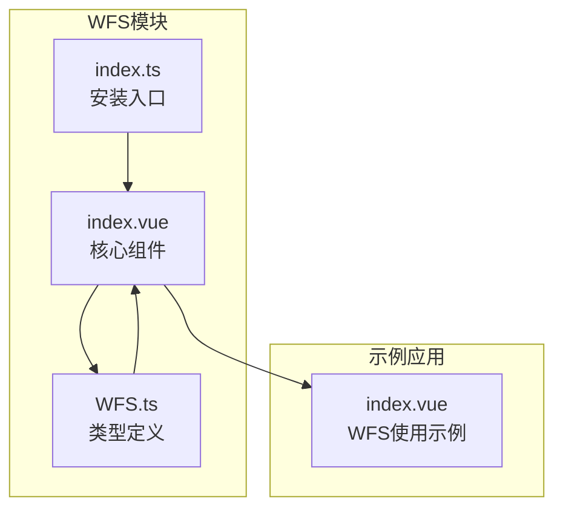
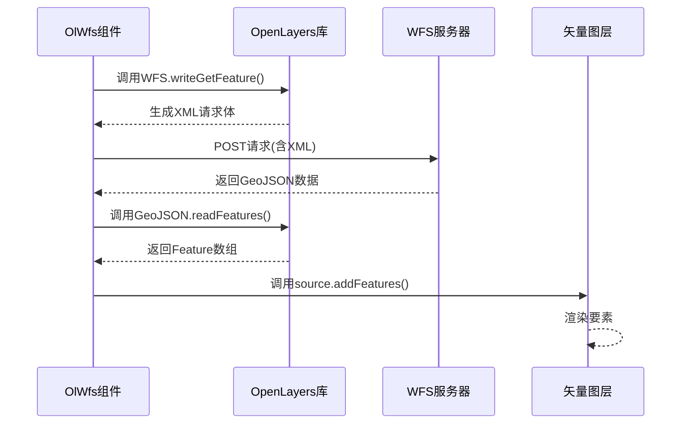
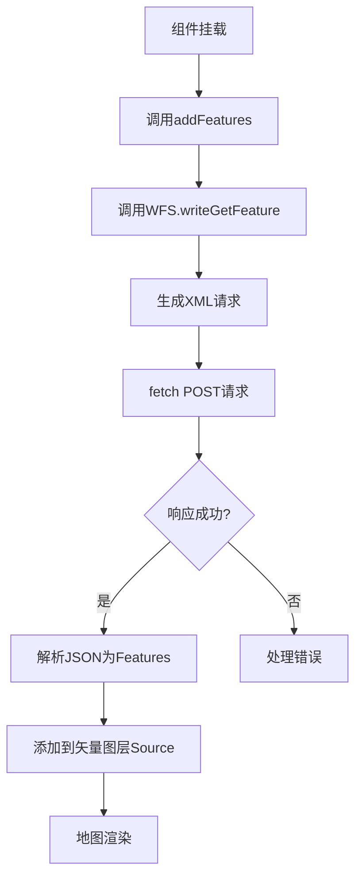
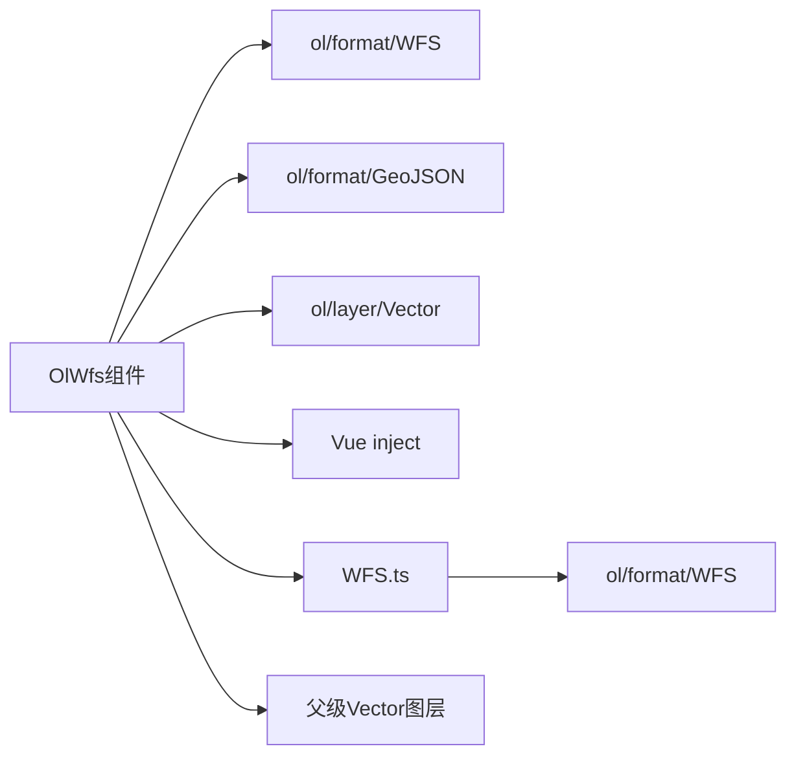

# WFS图层

<cite>
**本文档引用文件**   
- [index.ts](file://src/packages/layers/wfs/index.ts#L0-L6)
- [index.vue](file://src/packages/layers/wfs/index.vue#L0-L57)
- [WFS.ts](file://src/packages/types/WFS.ts#L0-L8)
- [index.vue](file://src/examples/wfs/index.vue#L0-L65)
</cite>

## 目录
1. [简介](#简介)
2. [项目结构](#项目结构)
3. [核心组件](#核心组件)
4. [架构概述](#架构概述)
5. [详细组件分析](#详细组件分析)
6. [依赖分析](#依赖分析)
7. [性能考虑](#性能考虑)
8. [故障排除指南](#故障排除指南)
9. [结论](#结论)

## 简介
本文档详细阐述了基于开放地理空间联盟（OGC）标准的Web要素服务（WFS）在前端地图应用中的集成方案。重点介绍如何通过`GetFeature`请求从远程WFS服务器获取矢量地理数据，并实现数据的解析、渲染与交互功能。文档结合`src/packages/layers/wfs/index.vue`的实现逻辑，解析WFS图层的加载机制，并通过`src/examples/wfs/index.vue`示例展示实际应用。同时，强调WFS在支持空间查询、属性过滤和交互式编辑方面的优势。

## 项目结构
WFS图层功能位于`src/packages/layers/wfs/`目录下，采用Vue 3的组合式API进行封装。该模块由一个主入口文件`index.ts`和一个核心组件`index.vue`构成，同时通过`src/packages/types/WFS.ts`定义类型接口。示例代码位于`src/examples/wfs/index.vue`，用于演示WFS图层的实际用法。



**图源**
- [index.ts](file://src/packages/layers/wfs/index.ts#L0-L6)
- [index.vue](file://src/packages/layers/wfs/index.vue#L0-L57)
- [WFS.ts](file://src/packages/types/WFS.ts#L0-L8)
- [index.vue](file://src/examples/wfs/index.vue#L0-L65)

**本节来源**
- [index.ts](file://src/packages/layers/wfs/index.ts#L0-L6)
- [index.vue](file://src/packages/layers/wfs/index.vue#L0-L57)

## 核心组件
WFS图层的核心在于`OlWfs`组件（`src/packages/layers/wfs/index.vue`），它负责构造WFS `GetFeature`请求，获取GML或GeoJSON格式的地理要素数据，并将其加载到OpenLayers的矢量图层中。组件通过`inject("ParentLayer")`获取父级矢量图层实例，并在其挂载后自动发起数据请求。

**本节来源**
- [index.vue](file://src/packages/layers/wfs/index.vue#L0-L57)

## 架构概述
WFS图层的集成遵循典型的客户端-服务器交互模式。前端通过POST请求向WFS服务端发送`GetFeature`操作，服务端返回符合OGC标准的地理要素数据（通常为GML或GeoJSON），前端再使用OpenLayers的解析器将数据转换为内部Feature对象并渲染。



**图源**
- [index.vue](file://src/packages/layers/wfs/index.vue#L0-L57)

## 详细组件分析

### WFS组件实现分析
`OlWfs`组件是一个Vue 3的无渲染组件（即不直接产生DOM，仅通过`<slot>`传递内容），其主要职责是数据获取与加载。

#### 属性与类型定义
组件通过`defineProps<WFSOptions>()`接收配置选项，其类型`WFSOptions`在`src/packages/types/WFS.ts`中定义：
```typescript
export interface WFSOptions {
  options: WriteGetFeatureOptions;
}
```
其中`WriteGetFeatureOptions`是OpenLayers库中`ol/format/WFS`模块定义的接口，包含了构造`GetFeature`请求所需的所有参数。

**本节来源**
- [WFS.ts](file://src/packages/types/WFS.ts#L0-L8)
- [index.vue](file://src/packages/layers/wfs/index.vue#L0-L57)

#### GetFeature请求构造
组件使用`ol/format/WFS`类的`writeGetFeature`方法生成符合WFS 2.0标准的XML请求。关键参数包括：
- **featureNS**: 要素命名空间URL，也是请求的POST目标地址。
- **featureTypes**: 要请求的要素类型名称数组，如`["xiaqu:PaiChuSouXQ_polygon"]`。
- **outputFormat**: 响应数据格式，示例中使用`"application/json"`（即GeoJSON）。
- **maxFeatures**: 限制返回的最大要素数量，防止大数据量请求。
- **srsName**: 指定返回数据的坐标参考系统，如`"EPSG:4326"`。
- **featurePrefix**: 要素类型的前缀。



**图源**
- [index.vue](file://src/packages/layers/wfs/index.vue#L0-L57)

**本节来源**
- [index.vue](file://src/packages/layers/wfs/index.vue#L0-L57)

### 示例应用分析
`src/examples/wfs/index.vue`展示了如何在地图中使用WFS图层。

#### 配置参数
示例中定义了`jsonFeature.options`对象，其内容直接传递给`<ol-wfs>`组件：
```typescript
options: {
  featureNS: "http://218.5.80.6:6600/geoserver/xiaqu/ows",
  featureTypes: ["xiaqu:PaiChuSouXQ_polygon"],
  srsName: "EPSG:4326",
  featurePrefix: "xiaqu",
}
```
这表示向指定的GeoServer地址请求名为`PaiChuSouXQ_polygon`的图层数据。

#### 样式与交互
示例通过`<ol-vector>`的`feature-style`属性为WFS要素定义样式，包括填充色、边框和文本。`styleFunction`实现了动态文本标注，从每个要素的`NAME`属性中提取名称并显示在地图上。`@singleclick`事件处理器可用于实现要素高亮或弹出信息窗口。

**本节来源**
- [index.vue](file://src/examples/wfs/index.vue#L0-L65)

## 依赖分析
WFS图层模块依赖于多个核心库和项目内部模块。



**图源**
- [index.vue](file://src/packages/layers/wfs/index.vue#L0-L57)
- [WFS.ts](file://src/packages/types/WFS.ts#L0-L8)

**本节来源**
- [index.vue](file://src/packages/layers/wfs/index.vue#L0-L57)
- [WFS.ts](file://src/packages/types/WFS.ts#L0-L8)

## 性能考虑
虽然当前实现未直接展示分页和复杂查询，但WFS协议本身支持这些功能：
- **服务端分页**：可通过设置`maxFeatures`和`startIndex`参数实现分页加载，避免一次性加载海量数据。
- **空间查询**：`WriteGetFeatureOptions`支持`filter`属性，可使用OGC Filter Encoding构造`BBOX`或`DWithin`等空间查询条件，只获取视窗内的要素。
- **属性过滤**：同样通过`filter`属性，可添加属性条件（如`PropertyName = 'value'`）来减少数据传输量。
- **输出格式**：优先使用`application/json`（GeoJSON）而非`text/xml`（GML），因为JSON更轻量且易于JavaScript解析。

## 故障排除指南
- **无数据显示**：检查`featureNS`和`featureTypes`是否正确，确认WFS服务是否可用（可通过浏览器直接访问服务地址测试）。
- **坐标偏移**：确保`view`的投影与WFS返回数据的`srsName`一致，或在`GeoJSON`读取时进行坐标转换。
- **跨域问题**：WFS服务必须开启CORS（跨域资源共享）策略，否则浏览器会阻止请求。
- **样式不生效**：确认`feature-style`是否正确传递给`<ol-vector>`，并检查`styleFunction`的返回值。

## 结论
WFS图层组件成功封装了与OGC WFS服务的交互逻辑，为前端应用提供了直接访问和操作矢量地理数据的能力。通过`GetFeature`请求，开发者可以灵活地获取、过滤和渲染地理要素，适用于需要高精度矢量数据、支持空间分析和交互式编辑的地图应用。未来可通过扩展`options`参数来支持分页、复杂空间查询和属性过滤，进一步提升大数据场景下的性能表现。