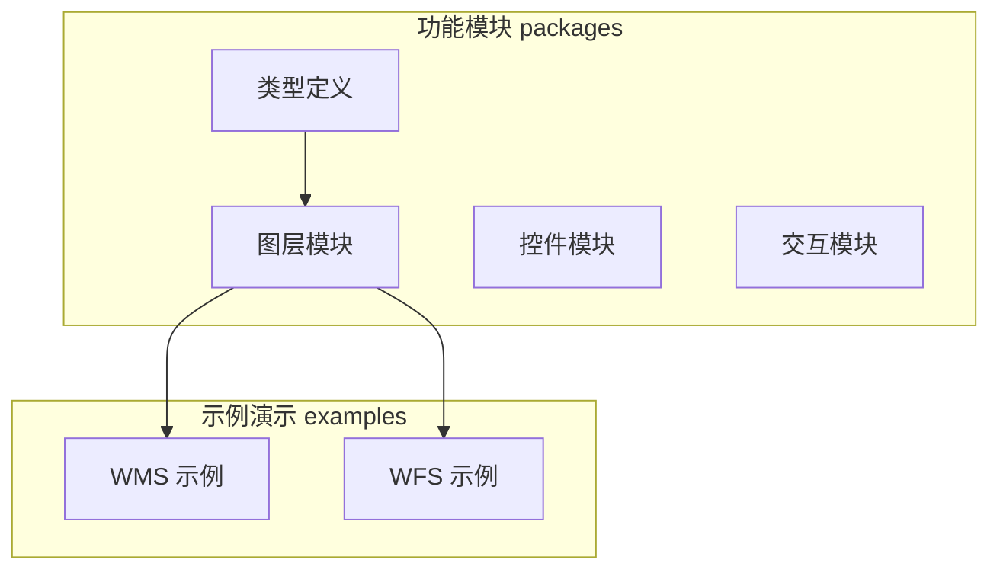
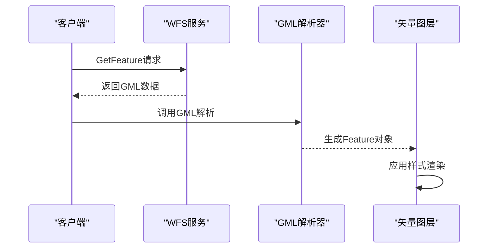
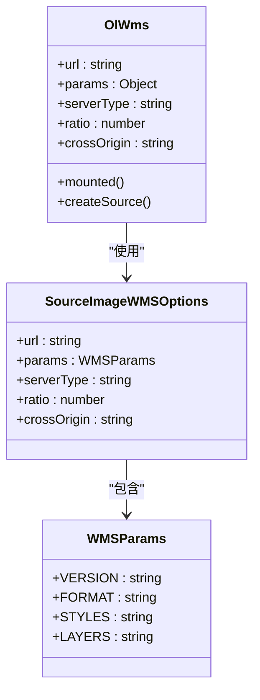
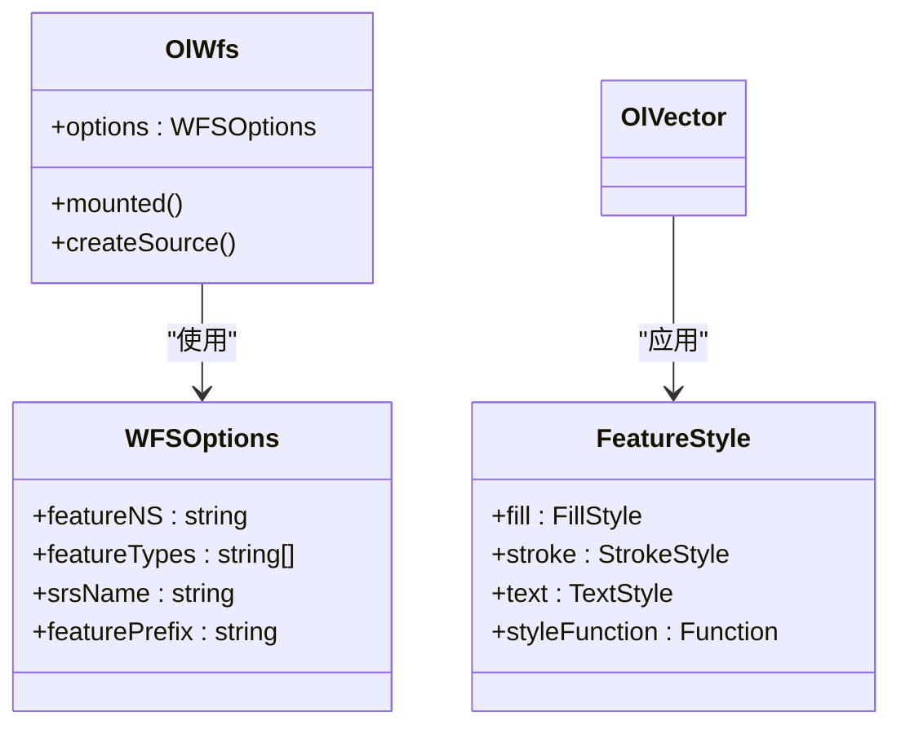
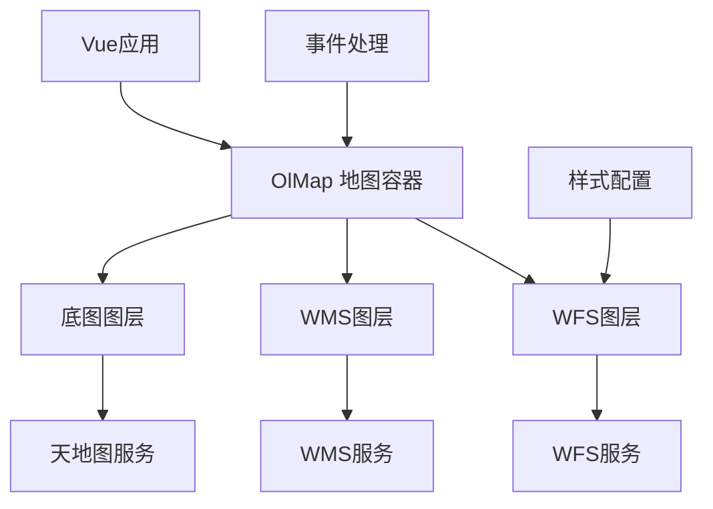
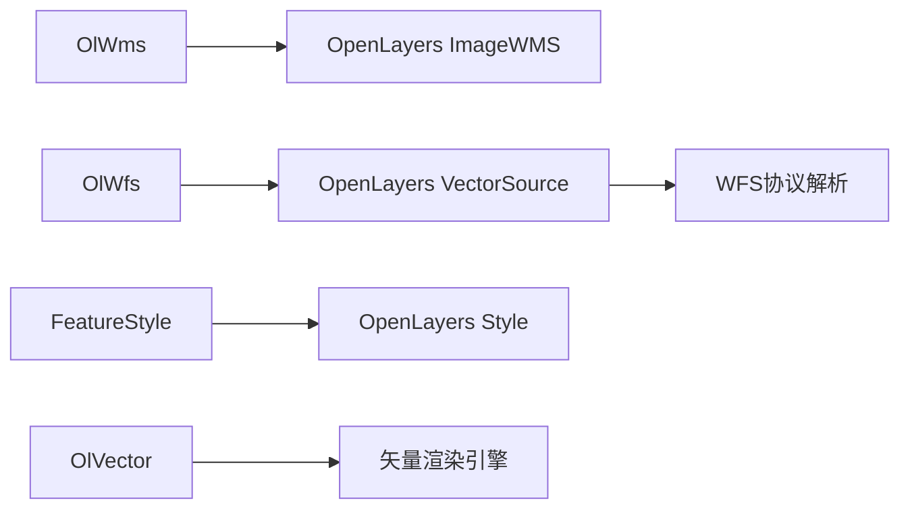

# WMS/WFS服务图层

<cite>
**本文档引用文件**  
- [index.vue](file://src/examples/wms/index.vue#L1-L51)
- [index.vue](file://src/examples/wfs/index.vue#L1-L66)
- [index.ts](file://src/packages/layers/wms/index.ts#L1-L7)
- [index.ts](file://src/packages/layers/wfs/index.ts#L1-L7)
- [WMS.ts](file://src/packages/types/WMS.ts)
- [WFS.ts](file://src/packages/types/WFS.ts)
</cite>

## 目录
1. [简介](#简介)
2. [项目结构分析](#项目结构分析)
3. [WMS服务集成方案](#wms服务集成方案)
4. [WFS服务集成方案](#wfs服务集成方案)
5. [核心组件分析](#核心组件分析)
6. [架构概览](#架构概览)
7. [详细组件分析](#详细组件分析)
8. [依赖关系分析](#依赖关系分析)
9. [性能与优化建议](#性能与优化建议)
10. [高级用法示例](#高级用法示例)
11. [适用场景对比](#适用场景对比)
12. [结论](#结论)

## 简介
本文档全面介绍基于OpenGIS联盟（OGC）标准的WMS（Web Map Service）和WFS（Web Feature Service）在当前地图项目中的集成实现。重点阐述两种服务的配置方式、功能特性、数据交互流程及实际应用场景。通过分析`src/examples/wms`和`wfs`目录下的示例代码，深入解析瓦片地图服务与矢量要素服务的技术细节，帮助开发者理解其差异并合理选择使用。

## 项目结构分析
项目采用模块化设计，主要功能按功能划分在`src/packages`目录下，示例代码集中于`src/examples`目录。WMS与WFS相关实现位于`layers`模块中，分别对应`wms`和`wfs`子模块。



**图示来源**  
- [src/packages/layers/wms/index.ts](file://src/packages/layers/wms/index.ts#L1-L7)
- [src/packages/layers/wfs/index.ts](file://src/packages/layers/wfs/index.ts#L1-L7)
- [src/examples/wms/index.vue](file://src/examples/wms/index.vue#L1-L51)
- [src/examples/wfs/index.vue](file://src/examples/wfs/index.vue#L1-L66)

## WMS服务集成方案
WMS服务用于提供预渲染的地图图像，适用于静态地图展示。通过`ol-wms`组件实现服务接入。

### 请求参数配置
在`src/examples/wms/index.vue`中，WMS服务通过`SourceImageWMSOptions`对象配置：

```ts
const wms: SourceImageWMSOptions = {
  url: "http://172.16.34.132:8222/geoserver/test/wms",
  params: {
    VERSION: "1.3.0",
    FORMAT: "image/png",
    STYLES: "",
    LAYERS: "test:camera_30w",
  },
  serverType: "geoserver",
  ratio: 1,
  crossOrigin: "anonymous",
};
```

**关键参数说明**：
- **LAYERS**：指定要请求的地图图层名称，格式为`工作区:图层名`
- **STYLES**：应用的样式名称，空值表示使用默认样式
- **FORMAT**：图像输出格式，推荐使用`image/png`以支持透明度
- **VERSION**：WMS协议版本，`1.3.0`为最新常用版本
- **serverType**：服务器类型，用于适配不同WMS实现（如GeoServer、MapServer）

### 透明度与图像格式优化
通过设置`FORMAT=image/png`确保地图背景透明，便于叠加在底图之上。`ratio: 1`表示请求标准分辨率图像，若需高清显示可设为2。

### 事件处理
通过`@singleclick`监听地图点击事件，获取图层要素信息：

```ts
const handleClick = (e: OlMapEvent, data: any) => {
  if (data && data.features && data.features.length > 0) {
    const feature = data.features[0];
    console.log(feature.properties);
  }
};
```

此功能依赖WMS的`GetFeatureInfo`请求，需服务端支持。

**本节来源**  
- [src/examples/wms/index.vue](file://src/examples/wms/index.vue#L1-L51)

## WFS服务集成方案
WFS服务提供矢量要素数据访问，支持客户端渲染与交互式编辑。

### GetFeature请求构造
在`src/examples/wfs/index.vue`中，通过`WFSOptions`定义请求参数：

```ts
const jsonFeature: JSONFeature = {
  options: {
    featureNS: "http://218.5.80.6:6600/geoserver/xiaqu/ows",
    featureTypes: ["xiaqu:PaiChuSouXQ_polygon"],
    srsName: "EPSG:4326",
    featurePrefix: "xiaqu",
  },
  geoJsonStyle: { /* 样式定义 */ }
};
```

**请求参数说明**：
- **featureNS**：要素命名空间URI
- **featureTypes**：请求的要素类型数组
- **srsName**：空间参考系统，建议使用`EPSG:4326`
- **featurePrefix**：要素前缀，用于XML命名空间

### GML数据解析流程
WFS返回GML格式数据，由OpenLayers自动解析为`Feature`对象。解析流程如下：



**图示来源**  
- [src/packages/layers/wfs/index.ts](file://src/packages/layers/wfs/index.ts#L1-L7)
- [src/examples/wfs/index.vue](file://src/examples/wfs/index.vue#L1-L66)

### 分页加载策略
虽然示例未直接体现分页，但可通过以下方式实现：
- 使用`maxFeatures`参数限制单次返回数量
- 结合`startIndex`实现分页查询
- 利用`BBOX`空间过滤减少数据量

## 核心组件分析
系统通过Vue组件封装OpenLayers功能，实现声明式地图开发。

### WMS组件结构


**图示来源**  
- [src/packages/layers/wms/index.vue](file://src/packages/layers/wms/index.ts#L1-L7)
- [src/packages/types/WMS.ts](file://src/packages/types/WMS.ts)

### WFS组件结构


**图示来源**  
- [src/packages/layers/wfs/index.ts](file://src/packages/layers/wfs/index.ts#L1-L7)
- [src/packages/types/WFS.ts](file://src/packages/types/WFS.ts)
- [src/examples/wfs/index.vue](file://src/examples/wfs/index.vue#L1-L66)

**本节来源**  
- [src/packages/layers/wms/index.ts](file://src/packages/layers/wms/index.ts#L1-L7)
- [src/packages/layers/wfs/index.ts](file://src/packages/layers/wfs/index.ts#L1-L7)
- [src/packages/types/WMS.ts](file://src/packages/types/WMS.ts)
- [src/packages/types/WFS.ts](file://src/packages/types/WFS.ts)

## 架构概览
系统采用分层架构，分离UI组件、数据源与地图引擎。



**图示来源**  
- [src/examples/wms/index.vue](file://src/examples/wms/index.vue#L1-L51)
- [src/examples/wfs/index.vue](file://src/examples/wfs/index.vue#L1-L66)

## 详细组件分析

### WMS组件实现
`ol-wms`组件封装了`ImageWMS`源，通过props接收配置参数并创建地图源。

```ts
// src/packages/layers/wms/index.ts
import component from "./index.vue";
const install = (Vue: App) => Vue.component(component.name || "OlWms", component);
export default install;
```

组件在`mounted`生命周期中调用`createSource()`方法初始化WMS源。

### WFS组件实现
`ol-wfs`组件配合`ol-vector`使用，将WFS获取的要素渲染为矢量图形。支持动态样式函数：

```ts
styleFunction: function (feature, resolution, map, style) {
  const labelKey = "NAME";
  const text_ = feature.get(labelKey);
  style.getText().setText(text_);
  return style;
}
```

该函数实现动态标注，根据要素属性自动填充文本内容。

**本节来源**  
- [src/packages/layers/wms/index.ts](file://src/packages/layers/wms/index.ts#L1-L7)
- [src/packages/layers/wfs/index.ts](file://src/packages/layers/wfs/index.ts#L1-L7)
- [src/examples/wfs/index.vue](file://src/examples/wfs/index.vue#L1-L66)

## 依赖关系分析
系统各模块间依赖清晰，低耦合高内聚。



**图示来源**  
- [src/packages/layers/wms/index.ts](file://src/packages/layers/wms/index.ts#L1-L7)
- [src/packages/layers/wfs/index.ts](file://src/packages/layers/wfs/index.ts#L1-L7)

## 性能与优化建议
- **WMS优化**：使用`FORMAT=image/webp`减少传输体积；合理设置`ratio`避免过度请求
- **WFS优化**：通过`BBOX`过滤可见范围要素；使用`maxFeatures`限制返回数量
- **通用建议**：启用`crossOrigin="anonymous"`避免跨域问题；合理设置`z-index`控制图层叠加顺序

## 高级用法示例

### 动态过滤
可通过修改`WFSOptions`中的`featureTypes`或添加`CQL_FILTER`参数实现动态查询。

### 属性查询
WMS通过`GetFeatureInfo`返回要素属性，WFS直接获取完整属性集，可用于弹窗展示或数据分析。

## 适用场景对比
| 特性 | WMS | WFS |
|------|-----|-----|
| **数据类型** | 栅格图像 | 矢量要素 |
| **渲染位置** | 服务端 | 客户端 |
| **交互能力** | 有限（需GetFeatureInfo） | 强（支持编辑） |
| **网络开销** | 低（固定分辨率） | 高（原始数据传输） |
| **适用场景** | 静态地图发布、影像展示 | 交互式编辑、空间分析 |

**结论**：WMS适合对性能要求高、交互需求少的场景；WFS适合需要深度交互和数据操作的应用。

## 结论
本文档系统分析了WMS与WFS服务在项目中的集成方案。WMS通过简单配置即可实现地图瓦片加载，适合静态展示；WFS提供完整的要素访问能力，支持复杂交互。开发者应根据具体需求选择合适的服务类型，并充分利用OpenLayers的强大功能实现丰富的地图应用。