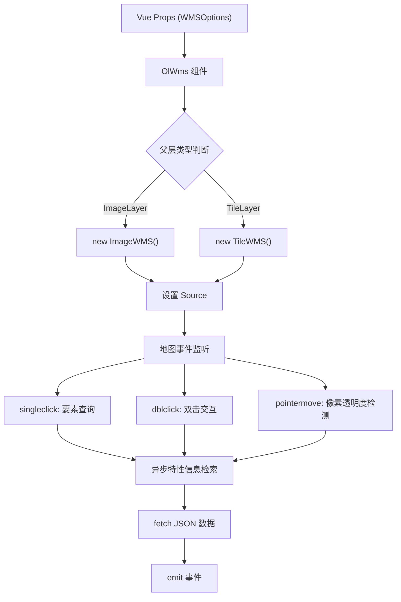
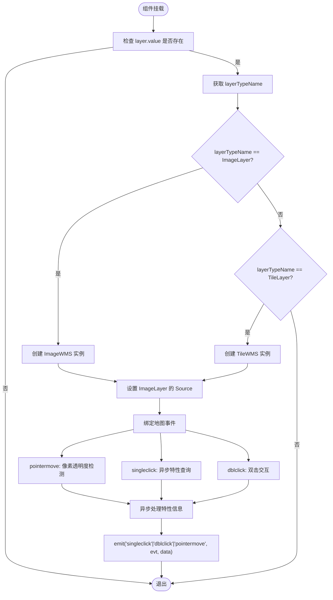
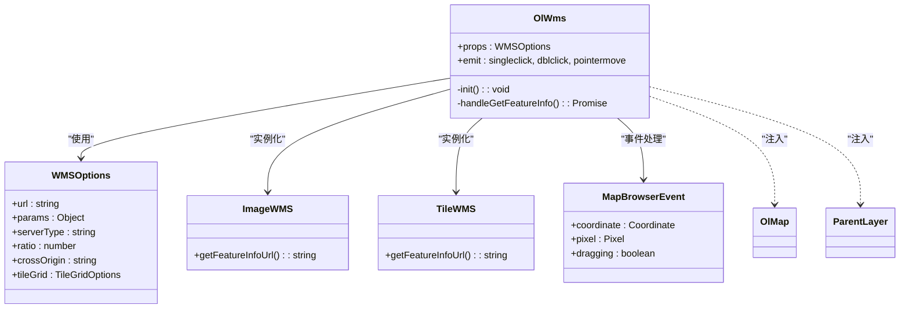

# WMS图层

<cite>
**本文档引用文件**  
- [src/packages/layers/wms/index.vue](file://src/packages/layers/wms/index.vue#L1-L110)
- [src/examples/wms/index.vue](file://src/examples/wms/index.vue#L1-L51)
- [src/packages/types/WMS.ts](file://src/packages/types/WMS.ts#L1-L17)
- [src/packages/layers/wms/index.ts](file://src/packages/layers/wms/index.ts#L1-L7)
</cite>

## 更新摘要
**变更内容**  
- 新增双击事件（dblclick）支持，提供更丰富的用户交互体验
- 增强指针移动事件（pointermove）功能，包含像素透明度检测和光标状态管理
- 实现异步特性信息检索机制，提升用户体验和响应性能
- 统一事件处理流程，所有交互事件均采用异步方式处理

## 目录
1. [简介](#简介)
2. [项目结构](#项目结构)
3. [核心组件](#核心组件)
4. [架构概述](#架构概述)
5. [详细组件分析](#详细组件分析)
6. [事件处理机制](#事件处理机制)
7. [异步特性信息检索](#异步特性信息检索)
8. [依赖分析](#依赖分析)
9. [性能考虑](#性能考虑)
10. [故障排除指南](#故障排除指南)
11. [结论](#结论)

## 简介
本文档详细介绍了基于OpenLayers实现的WMS（Web Map Service）图层组件，重点分析其在Vue框架下的集成方式、核心参数配置、事件处理机制以及高级功能应用。文档结合`src/packages/layers/wms/index.vue`和`src/examples/wms/index.vue`两个关键文件，深入解析WMS图层的初始化流程、动态属性绑定、地图交互响应及服务端信息查询机制。本次更新重点关注新增的双击事件、指针移动事件和异步特性信息检索功能，适用于需要在Web地图应用中集成OGC标准WMS服务的开发人员。

## 项目结构
项目采用模块化分层架构，WMS图层功能位于`src/packages/layers/wms/`目录下，通过Vue 3的组合式API实现。该组件依赖于OpenLayers库提供的`ImageWMS`和`TileWMS`源类型，并通过类型定义文件`WMS.ts`进行接口约束。示例文件位于`src/examples/wms/`，用于展示实际使用场景。

```mermaid
graph TB
subgraph "核心实现"
WMSComponent["src/packages/layers/wms/index.vue"]
WMSTypes["src/packages/types/WMS.ts"]
WMSIndex["src/packages/layers/wms/index.ts"]
end
subgraph "示例应用"
WMSExample["src/examples/wms/index.vue"]
end
WMSComponent --> WMSTypes : "类型依赖"
WMSComponent --> WMSIndex : "组件注册"
WMSExample --> WMSComponent : "组件引用"
WMSExample --> WMSTypes : "接口使用"
```

**图示来源**  
- [src/packages/layers/wms/index.vue](file://src/packages/layers/wms/index.vue#L1-L110)
- [src/packages/types/WMS.ts](file://src/packages/types/WMS.ts#L1-L17)
- [src/packages/layers/wms/index.ts](file://src/packages/layers/wms/index.ts#L1-L7)
- [src/examples/wms/index.vue](file://src/examples/wms/index.vue#L1-L51)

**本节来源**  
- [src/packages/layers/wms/index.vue](file://src/packages/layers/wms/index.vue#L1-L110)
- [src/examples/wms/index.vue](file://src/examples/wms/index.vue#L1-L51)

## 核心组件
WMS图层的核心功能由`OlWms`组件实现，其主要职责包括：
- 接收WMS服务配置参数（如URL、图层名、样式等）
- 根据父级图层类型（ImageLayer或TileLayer）动态创建对应的OpenLayers数据源
- 绑定多种鼠标交互事件，包括单击、双击和指针移动事件
- 支持通过`tileGrid`自定义瓦片网格系统
- 实现异步特性信息检索，提供更好的用户体验

组件通过`inject`机制获取地图实例和父级图层引用，确保与地图上下文的正确集成。

**本节来源**  
- [src/packages/layers/wms/index.vue](file://src/packages/layers/wms/index.vue#L1-L110)

## 架构概述
WMS图层组件遵循Vue组件化设计原则，采用"配置驱动"的方式封装OpenLayers的WMS功能。整体架构分为三层：视图层（Vue模板）、逻辑层（Script）和数据层（OpenLayers Source）。组件通过`props`接收外部配置，内部初始化时根据`layerTypeName`判断渲染模式（图像模式或瓦片模式），并动态设置数据源。



**图示来源**  
- [src/packages/layers/wms/index.vue](file://src/packages/layers/wms/index.vue#L1-L110)

## 详细组件分析

### WMS组件初始化流程
组件在`onMounted`钩子中调用`init`函数完成初始化。流程如下：



**图示来源**  
- [src/packages/layers/wms/index.vue](file://src/packages/layers/wms/index.vue#L1-L110)

**本节来源**  
- [src/packages/layers/wms/index.vue](file://src/packages/layers/wms/index.vue#L1-L110)

### 核心参数配置说明
WMS请求的关键参数通过`props`传入，其结构定义于`WMSOptions`类型中：

**:WMSOptions 参数结构**
- **url**: WMS服务地址（必填）
- **params**: WMS请求参数对象
  - **LAYERS**: 指定要显示的图层名称（如 `test:camera_30w`）
  - **STYLES**: 应用的样式名称（可为空）
  - **FORMAT**: 图像格式（如 `image/png`）
  - **VERSION**: WMS协议版本（如 `1.3.0`）
- **serverType**: 服务器类型（如 `geoserver`，用于生成正确的请求URL）
- **ratio**: 图像分辨率比例（1表示标准分辨率）
- **crossOrigin**: 跨域策略（如 `anonymous`）
- **tileGrid**: 自定义瓦片网格配置（可选）

**:示例配置**
```ts
const wms: SourceImageWMSOptions = {
  url: "http://172.16.34.132:8222/geoserver/test/wms",
  params: {
    VERSION: "1.3.0",
    FORMAT: "image/png",
    STYLES: "",
    LAYERS: "test:camera_30w",
  },
  serverType: "geoserver",
  ratio: 1,
  crossOrigin: "anonymous",
};
```

**本节来源**  
- [src/examples/wms/index.vue](file://src/examples/wms/index.vue#L1-L51)
- [src/packages/types/WMS.ts](file://src/packages/types/WMS.ts#L1-L17)

## 事件处理机制

### 新增事件支持
组件现已支持三种主要事件类型：

**:事件类型**
- **singleclick**: 单击事件，用于获取要素信息
- **dblclick**: 双击事件，提供额外的交互方式
- **pointermove**: 指针移动事件，用于实时特性信息查询和光标状态管理

**:事件发射器配置**
```typescript
const emit = defineEmits(["singleclick", "dblclick", "pointermove"]);
```

**本节来源**  
- [src/packages/layers/wms/index.vue](file://src/packages/layers/wms/index.vue#L21-L60)

### 指针移动事件增强
指针移动事件现在包含像素透明度检测和光标状态管理功能：

**:指针移动事件处理流程**
1. 检测鼠标拖拽状态，避免拖拽时的频繁查询
2. 使用`layer.value.getData(evt.pixel)`获取像素数据
3. 检查像素透明度（`data[3] > 0`），决定光标样式
4. 执行异步特性信息检索
5. 发射`pointermove`事件

**:指针移动处理代码**
```typescript
map.on("pointermove", async function (evt) {
  if (evt.dragging) {
    return;
  }
  const data: any = layer.value.getData(evt.pixel);
  const hit = data && data[3] > 0; // transparent pixels have zero for data[3]
  map.getTargetElement().style.cursor = hit ? "pointer" : "";
  const featureInfo = await handleGetFeatureInfo(evt, source);
  emit("pointermove", evt, featureInfo);
});
```

**本节来源**  
- [src/packages/layers/wms/index.vue](file://src/packages/layers/wms/index.vue#L43-L52)

### 双击事件处理
双击事件与单击事件共享相同的异步特性信息检索逻辑：

**:双击事件处理代码**
```typescript
map.on("dblclick", async (evt: MapBrowserEvent<any>) => {
  const featureInfo = await handleGetFeatureInfo(evt, source);
  emit("dblclick", evt, featureInfo);
});
```

**本节来源**  
- [src/packages/layers/wms/index.vue](file://src/packages/layers/wms/index.vue#L57-L60)

## 异步特性信息检索

### 统一异步处理架构
所有事件处理现在都采用异步方式，通过`handleGetFeatureInfo`函数统一处理特性信息检索：

**:异步特性信息检索流程**
1. 获取当前视图分辨率和投影信息
2. 调用`source?.getFeatureInfoUrl()`生成请求URL
3. 设置`INFO_FORMAT: "application/json"`参数
4. 使用`fetch`异步获取JSON数据
5. 错误处理和数据返回

**:异步处理函数实现**
```typescript
const handleGetFeatureInfo = async (evt: MapBrowserEvent<any>, source: TileWMS | ImageWMS) => {
  const view = map.getView();
  const viewResolution = view.getResolution();
  if (!viewResolution) return;
  const url = source?.getFeatureInfoUrl(evt.coordinate, viewResolution, view.getProjection().getCode(), {
    INFO_FORMAT: "application/json",
  });
  if (url) {
    return fetch(url)
      .then(response => response.json())
      .then(data => {
        return data;
      })
      .catch(error => {
        console.error("Error fetching feature info:", error);
        return null;
      });
  }
};
```

**本节来源**  
- [src/packages/layers/wms/index.vue](file://src/packages/layers/wms/index.vue#L64-L82)

### 性能优化考虑
异步处理的优势包括：
- **非阻塞UI**: 特性信息检索不会阻塞地图交互
- **错误隔离**: 网络错误不会影响其他事件处理
- **用户体验**: 平滑的响应和加载状态管理

## 依赖分析
WMS组件依赖以下关键模块：



**图示来源**  
- [src/packages/layers/wms/index.vue](file://src/packages/layers/wms/index.vue#L1-L110)
- [src/packages/types/WMS.ts](file://src/packages/types/WMS.ts#L1-L17)

**本节来源**  
- [src/packages/layers/wms/index.vue](file://src/packages/layers/wms/index.vue#L1-L110)
- [src/packages/types/WMS.ts](file://src/packages/types/WMS.ts#L1-L17)

## 性能考虑
- **图像模式 vs 瓦片模式**：`ImageWMS`每次缩放平移都会重新请求整幅图像，适合小范围或静态展示；`TileWMS`按需加载瓦片，适合大范围地图浏览。
- **ratio参数**：设置`ratio: 1`可避免高分辨率设备过度请求，提升加载速度。
- **tileGrid优化**：预定义`tileGrid`可减少重复计算，提升渲染一致性。
- **跨域配置**：正确设置`crossOrigin`避免浏览器安全限制导致的图像污染问题。
- **异步处理优势**：避免UI阻塞，提升用户体验
- **事件防抖优化**：指针移动事件中检查拖拽状态，减少不必要的查询

## 故障排除指南
- **图像不显示**：检查`url`和`LAYERS`参数是否正确，确认服务端WMS服务正常运行。
- **点击无响应**：确保`serverType`设置正确（如geoserver），否则`getFeatureInfoUrl`可能生成错误URL。
- **跨域错误**：检查服务端是否启用CORS，前端设置`crossOrigin: "anonymous"`。
- **投影不匹配**：确保地图视图投影与WMS服务支持的投影一致。
- **透明度失效**：确认`FORMAT`为支持透明的格式（如`image/png`），并设置`TRANSPARENT: true`（若服务支持）。
- **异步处理错误**：检查网络连接和WMS服务可用性，查看控制台错误日志。
- **事件响应异常**：确认事件监听器正确绑定，检查`emit`调用是否正常执行。

**本节来源**  
- [src/packages/layers/wms/index.vue](file://src/packages/layers/wms/index.vue#L1-L110)
- [src/examples/wms/index.vue](file://src/examples/wms/index.vue#L1-L51)

## 结论
`OlWms`组件成功封装了OpenLayers的WMS功能，通过本次更新进一步增强了交互能力和用户体验。新版本支持双击事件、指针移动事件和异步特性信息检索，提供了更加丰富和流畅的地图交互体验。通过合理的类型定义和事件机制，实现了WMS图层的灵活配置与交互响应。

异步处理架构的引入避免了UI阻塞，提升了应用性能和响应性。指针移动事件中的像素透明度检测和光标状态管理功能，为用户提供直观的交互反馈。

结合示例代码，开发者可快速集成GeoServer等WMS服务，实现地图要素查询、多图层叠加、双击交互等高级功能。建议在实际项目中根据性能需求选择合适的渲染模式，并充分利用`tileGrid`和`params`进行定制化配置。同时，合理利用新增的事件处理能力，构建更加丰富的地图应用交互体验。