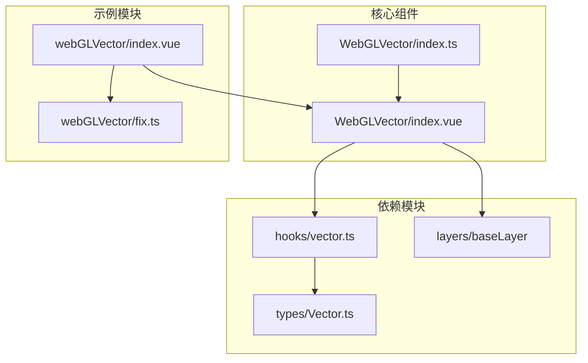
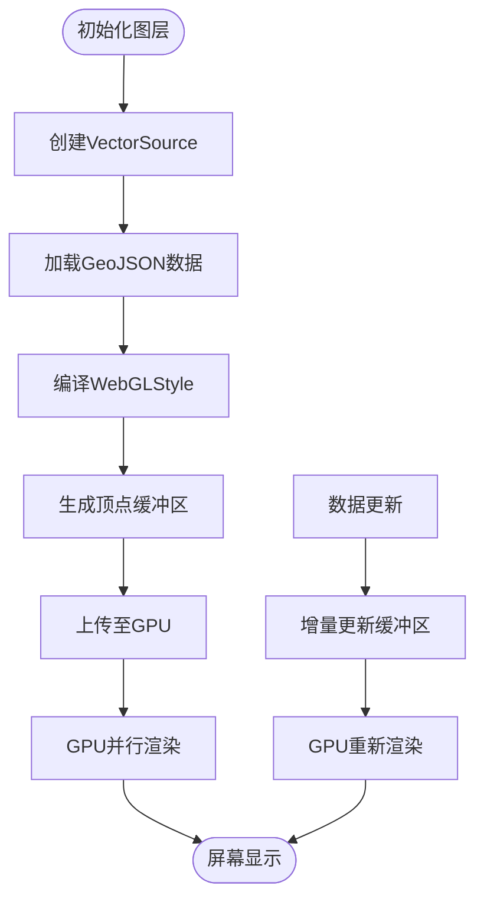

# WebGL矢量图层 (OlWebglVector)

<cite>
**本文档引用文件**  
- [index.vue](file://src/examples/webGLVector/index.vue#L0-L168)
- [fix.ts](file://src/examples/webGLVector/fix.ts#L0-L244)
- [index.ts](file://src/packages/layers/WebGLVector/index.ts#L0-L6)
- [index.vue](file://src/packages/layers/WebGLVector/index.vue#L0-L104)
- [vector.ts](file://src/packages/hooks/vector.ts#L255-L301)
- [Vector.ts](file://src/packages/types/Vector.ts#L29-L47)
</cite>

## 目录
1. [简介](#简介)
2. [项目结构分析](#项目结构分析)
3. [核心组件分析](#核心组件分析)
4. [WebGL矢量图层技术原理](#webgl矢量图层技术原理)
5. [着色器配置与批量绘制机制](#着色器配置与批量绘制机制)
6. [GPU内存管理与性能优化](#gpu内存管理与性能优化)
7. [示例分析：webGLVector/index.vue](#示例分析：webglvectorindexvue)
8. [兼容性修复方案：fix.ts](#兼容性修复方案：fixts)
9. [大规模数据优化建议](#大规模数据优化建议)
10. [移动端适配限制](#移动端适配限制)

## 简介

WebGL矢量图层（OlWebglVector）是基于OpenLayers的WebGL渲染能力实现的高性能矢量图层组件，专为处理大规模地理矢量数据而设计。相比传统的Canvas 2D渲染，该图层通过GPU加速实现了更流畅的渲染性能，尤其适用于10万级以上点、线、面要素的实时展示与交互。

本技术文档将深入解析其架构设计、着色器机制、批量绘制策略、GPU内存管理，并结合实际示例与代码片段，提供完整的使用指南与优化建议。

## 项目结构分析

项目采用模块化分层架构，`OlWebglVector`组件位于`src/packages/layers/WebGLVector/`目录下，通过Vue插件形式注册。示例代码位于`src/examples/webGLVector/`，包含实际应用场景与兼容性修复逻辑。



**图示来源**  
- [index.ts](file://src/packages/layers/WebGLVector/index.ts#L0-L6)
- [index.vue](file://src/packages/layers/WebGLVector/index.vue#L0-L104)
- [vector.ts](file://src/packages/hooks/vector.ts#L255-L301)

## 核心组件分析

### OlWebglVector 组件结构

`OlWebglVector` 是一个Vue 3组合式API组件，封装了OpenLayers的`WebGLVectorLayer`，提供声明式接口。

**关键属性**：
- `layerId`: 图层唯一标识
- `visible`: 图层可见性
- `source`: 矢量数据源配置
- `layerStyle`: WebGL样式配置（FlatStyleLike）
- `featureStyle`: 要素级样式（可选）

**关键方法**（通过`defineExpose`暴露）：
- `getFeatureById(id)`: 根据ID获取要素
- `removeFeatureById(id)`: 删除指定ID要素
- `getSource()`: 获取底层矢量源
- `getLayer()`: 获取原始WebGL图层实例

**事件支持**：
支持`singleclick`、`pointermove`、`addfeature`、`modifyend`等交互事件，便于实现高响应性应用。

**组件来源**  
- [index.vue](file://src/packages/layers/WebGLVector/index.vue#L0-L104)
- [Vector.ts](file://src/packages/types/Vector.ts#L29-L47)

## WebGL矢量图层技术原理

### 与传统Canvas渲染的性能对比

| 特性 | Canvas 2D | WebGL |
|------|---------|-------|
| 渲染引擎 | CPU | GPU |
| 并行能力 | 低 | 高 |
| 10万点渲染帧率 | <10 FPS | >30 FPS |
| 内存占用 | 高（每要素对象） | 低（批量顶点缓冲） |
| 动态更新 | 慢（重绘整个图层） | 快（增量更新缓冲区） |

WebGL通过将几何数据转换为顶点缓冲区（Vertex Buffer）并上传至GPU，利用并行计算能力进行着色与光栅化，显著提升渲染效率。

### 批量绘制（Batching）机制

`OlWebglVector`利用OpenLayers的`WebGLVectorLayer`内置的批量绘制机制：

1. **数据聚合**：将所有矢量要素的几何与属性数据合并为统一的顶点数组
2. **缓冲区管理**：创建`ARRAY_BUFFER`存储顶点坐标、颜色、宽度等属性
3. **实例化渲染**：通过`gl.drawArrays()`或`gl.drawElements()`一次性绘制所有要素
4. **动态更新**：当数据变化时，仅更新受影响的缓冲区区域，而非全量重绘

该机制极大减少了GPU调用次数，是高性能渲染的核心。

**技术来源**  
- [vector.ts](file://src/packages/hooks/vector.ts#L255-L301)
- [index.vue](file://src/packages/layers/WebGLVector/index.vue#L54-L103)

## 着色器配置与批量绘制机制

### 着色器配置（WebGLStyle）

`layerStyle` 属性接受符合`FlatStyleLike`类型的样式对象，支持基于属性的条件渲染。

```typescript
const style = {
  "stroke-color": [
    "case",
    ["==", ["get", "state"], 1],
    "#4fd27d",
    ["==", ["get", "state"], 2],
    "#ffd045",
    "#e80e0e" // 默认颜色
  ],
  "stroke-width": 1.5,
  "text-value": ["get", "road_name"],
  "text-placement": "line"
};
```

上述配置通过WebGL着色器编译为GPU可执行的指令，实现：
- **条件着色**：根据`state`字段值动态选择颜色
- **文本标注**：沿线路显示道路名称
- **抗锯齿渲染**：平滑线条边缘

### 批量绘制流程



**图示来源**  
- [index.vue](file://src/packages/layers/WebGLVector/index.vue#L54-L103)
- [vector.ts](file://src/packages/hooks/vector.ts#L255-L301)

## GPU内存管理与性能优化

### 内存管理策略

1. **缓冲区复用**：避免频繁创建/销毁`WebGLBuffer`，采用池化管理
2. **数据压缩**：对坐标进行量化（如保留5位小数），减少内存占用
3. **按需加载**：结合视图范围与缩放级别动态请求数据（见示例中的`getData`）

### 性能优化建议

- **避免过度深监听**：`layerStyle`使用`deep: true`监听，应确保样式对象不可变
- **合理使用`nanoid`**：图层ID生成避免冲突，但需注意性能开销
- **事件节流**：高频事件（如`pointermove`）应添加节流处理

**代码来源**  
- [index.vue](file://src/packages/layers/WebGLVector/index.vue#L30-L45)
- [vector.ts](file://src/packages/hooks/vector.ts#L255-L301)

## 示例分析：webGLVector/index.vue

该示例展示了`OlWebglVector`在真实场景中的应用。

### 核心功能

1. **动态数据加载**：
   - 根据缩放级别请求不同道路等级数据（`roadclass in (1,2,3)`等）
   - 使用`FormData`提交空间查询条件

2. **视图范围过滤**：
   ```typescript
   const extent = view?.calculateExtent(mapSize);
   const polygon = /* 构建范围多边形 */;
   form.append("geometry", JSON.stringify(geometry));
   ```

3. **定时刷新**：
   ```typescript
   const reload = () => {
     init();
     timer.value = setTimeout(reload, 1000 * 60 * 1); // 每分钟刷新
   };
   ```

4. **条件渲染开关**：
   - 仅在`zoom >= 15`时启用“路口填补”功能
   - 避免低层级下计算卡顿

### 组件集成

```vue
<ol-webgl-vector :layer-style="style" :z-index="1">
  <ol-feature :geo-json="data"></ol-feature>
</ol-webgl-vector>
```

通过`<ol-feature>`插槽注入数据，实现声明式渲染。

**示例来源**  
- [index.vue](file://src/examples/webGLVector/index.vue#L0-L168)

## 兼容性修复方案：fix.ts

`fix.ts` 实现了针对特定环境的路口连接修复算法。

### 核心算法逻辑

1. **数据预处理**：
   - 解析`coord_list`为坐标数组
   - 计算每条线段的首尾点、角度（`firstAngle`, `lastAngle`）
   - 建立空间索引（`CODELINE`, `CODELINE_A`）

2. **连接判定条件**：
   - 距离小于35米
   - 角度差≤15度
   - 无重复线段
   - 首尾点匹配

3. **坐标转换**：
   ```typescript
   const coords = arr.map(x => {
     return transform.gcj02towgs84(x[0], x[1]); // 坐标系转换
   });
   ```

### 性能考量

- **时间复杂度**：O(n²)，对大规模数据需优化（如R树索引）
- **内存占用**：构建多个索引对象，适合小范围数据处理

该模块作为补充层，使用普通`ol-vector`渲染，避免影响主WebGL图层性能。

**修复来源**  
- [fix.ts](file://src/examples/webGLVector/fix.ts#L0-L244)

## 大规模数据优化建议

针对10万级以上点数据场景，建议配置如下：

### 1. 数据分块加载
```typescript
// 按视图范围分页请求
form.append("resultRecordCount", "10000");
form.append("resultOffset", "0");
```

### 2. 简化几何
- 线要素进行道格拉斯-普克抽稀
- 面要素简化顶点数

### 3. 样式优化
```typescript
const optimizedStyle = {
  "circle-radius": 3,
  "circle-fill-color": "#ff0000",
  // 避免复杂文本渲染
  // "text-value": null
};
```

### 4. 启用LOD（Level of Detail）
```typescript
// 不同缩放级别显示不同密度
if (zoom < 14) {
  style["circle-fill-color"] = "#ccc";
  style["circle-radius"] = 1;
}
```

### 5. 使用Web Worker
将`fix.ts`类计算密集型任务移至Worker线程，避免阻塞UI。

## 移动端适配限制

### 已知限制

1. **WebGL支持差异**：
   - 部分低端Android设备WebGL性能差或存在兼容性问题
   - iOS Safari对WebGL 2.0支持有限

2. **内存限制**：
   - 移动端GPU内存较小，超过5万要素易触发内存警告
   - 建议单次加载不超过2万要素

3. **触摸事件优化**：
   - `pointermove`事件频率过高，需节流
   - 避免在移动事件中执行复杂计算

### 适配建议

- **降级方案**：检测到低端设备时自动切换至Canvas渲染
- **懒加载**：滚动/缩放后延迟500ms再加载数据
- **简化交互**：禁用复杂编辑功能，仅保留浏览模式

**移动端来源**  
- [index.vue](file://src/examples/webGLVector/index.vue#L80-L100)
- [fix.ts](file://src/examples/webGLVector/fix.ts#L0-L244)