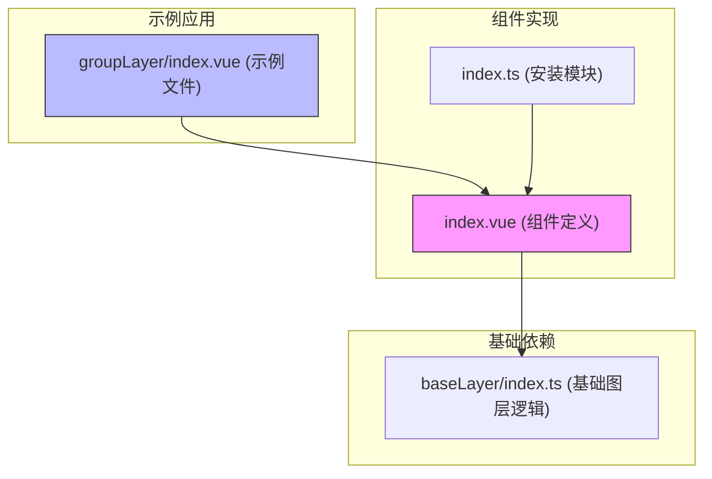
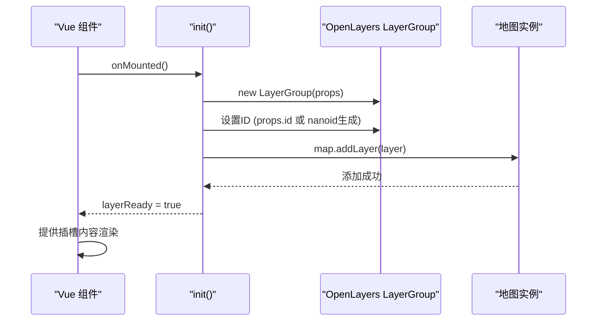
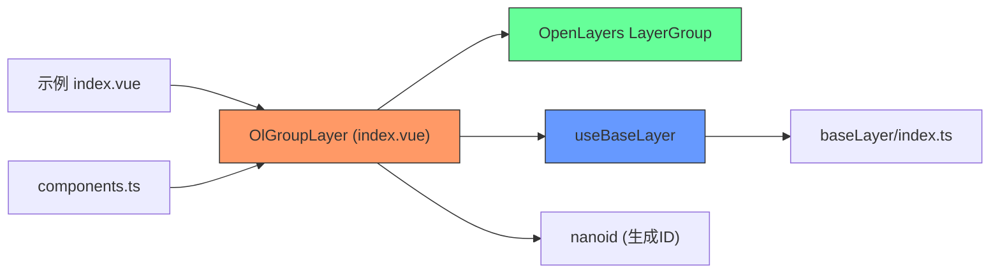

# 图层组 (OlGroup)

<cite>
**本文档引用文件**  
- [index.vue](file://src/examples/groupLayer/index.vue#L0-L276)
- [index.vue](file://src/packages/layers/group/index.vue#L0-L50)
- [index.ts](file://src/packages/layers/group/index.ts#L0-L6)
- [baseLayer/index.ts](file://src/packages/layers/baseLayer/index.ts)
</cite>

## 目录
1. [简介](#简介)
2. [项目结构](#项目结构)
3. [核心组件](#核心组件)
4. [架构概述](#架构概述)
5. [详细组件分析](#详细组件分析)
6. [依赖分析](#依赖分析)
7. [性能考虑](#性能考虑)
8. [故障排除指南](#故障排除指南)
9. [结论](#结论)

## 简介
本文档旨在全面阐述 `OlGroup` 组件的功能与实现机制，该组件作为 OpenLayers 地图库中的图层容器，用于对多个子图层进行统一管理。通过嵌套结构，`OlGroup` 支持复杂图层体系的组织，并实现批量操作，如整体显示/隐藏、透明度调整等。结合示例 `src/examples/groupLayer/index.vue`，本文将展示图层顺序控制、嵌套分组和状态继承的实现方式，并探讨其在专题地图、多时相数据管理等场景下的应用价值。

## 项目结构
项目采用模块化设计，`OlGroup` 相关代码位于 `src/packages/layers/group/` 目录下，包含 Vue 组件实现文件 `index.vue` 和安装模块 `index.ts`。示例文件位于 `src/examples/groupLayer/index.vue`，用于演示图层组的实际应用。



**图源**  
- [index.vue](file://src/packages/layers/group/index.vue#L0-L50)
- [index.ts](file://src/packages/layers/group/index.ts#L0-L6)
- [baseLayer/index.ts](file://src/packages/layers/baseLayer/index.ts)

## 核心组件
`OlGroup` 的核心功能由 `src/packages/layers/group/index.vue` 实现，其本质是对 OpenLayers 的 `LayerGroup` 类的 Vue 封装。该组件通过 `provide` 向子组件注入图层实例，实现父子图层通信。

**组件源**  
- [index.vue](file://src/packages/layers/group/index.vue#L0-L50)

## 架构概述
`OlGroup` 组件采用 Vue 3 的组合式 API，通过 `inject` 获取地图实例，通过 `provide` 向子图层传递图层组实例。其初始化流程如下：



**图源**  
- [index.vue](file://src/packages/layers/group/index.vue#L15-L45)

## 详细组件分析

### OlGroup 组件分析
`OlGroup` 是一个容器型组件，其主要职责是创建并管理一个 `LayerGroup` 实例，并将其添加到地图中。

#### 属性与类型定义
```typescript
type GroupOptions = Partial<Options> & {
  id?: string;
};
```
- `id`: 图层组的唯一标识符，若未提供则使用 `nanoid` 自动生成。
- 其他属性继承自 OpenLayers 的 `LayerGroupOptions`，如 `visible`、`opacity` 等。

#### 初始化流程
1. **创建图层组**: `layer.value = new LayerGroup(props);`
2. **设置ID**: `layer.value.set("id", layerId);`
3. **注入地图**: 通过注入的 `VMap` 实例，将图层组添加到地图的图层集合中。
4. **状态就绪**: 设置 `layerReady = true`，触发插槽内容的渲染。

#### 状态管理与通信
- 使用 `watchEffect` 监听 `layer` 和 `props` 的变化，调用 `useBaseLayer` 同步基础图层属性（如可见性、透明度）。
- 使用 `provide("GroupLayer", layer)` 将图层实例提供给后代组件，实现状态继承。

**组件源**  
- [index.vue](file://src/packages/layers/group/index.vue#L0-L50)

### 示例应用分析
`src/examples/groupLayer/index.vue` 展示了 `OlGroup` 的典型用法。

#### 图层结构
```vue
<ol-group-layer :id="groupOptions.id" ...>
  <ol-vector v-for="layer in vectorLayers" ... />
</ol-group-layer>
<ol-vector :layer-id="layerOptions.id" ... />
```
- 创建一个ID为 `group-layer` 的图层组。
- 组内包含三个矢量图层 (`v_1`, `v_2`, `v_3`)。
- 组外有一个独立的矢量图层 (`v_4`)。

#### 批量操作实现
- **整体控制**: 通过 `groupOptions` 控制整个图层组的可见性和透明度。
- **个体控制**: 通过 `vectorLayers` 数组中的每个元素独立控制组内子图层的透明度。
- **UI 交互**: 页面右侧的 `#layertree` 提供了可视化控件，用户可通过复选框和滑块实时调整图层状态。

#### 数据生成
`getVectorData()` 函数生成模拟的地理数据点，用于填充四个 `geojson` 引用，展示了数据驱动的图层渲染模式。

**组件源**  
- [index.vue](file://src/examples/groupLayer/index.vue#L0-L276)

## 依赖分析
`OlGroup` 组件的依赖关系清晰，体现了良好的模块化设计。



**图源**  
- [index.vue](file://src/packages/layers/group/index.vue#L0-L50)
- [baseLayer/index.ts](file://src/packages/layers/baseLayer/index.ts)

## 性能考虑
- **轻量级封装**: `OlGroup` 本身不进行复杂计算，主要依赖 OpenLayers 的原生性能。
- **响应式优化**: 使用 `shallowRef` 存储 `layer` 实例，避免对大型图层对象进行深度响应式处理。
- **批量操作优势**: 通过图层组统一设置透明度或可见性，比逐个操作子图层更高效，减少了与 DOM 和地图渲染引擎的交互次数。

## 故障排除指南
### 常见错误：循环引用
当在 `OlGroup` 内部错误地再次引用自身或其父级时，可能导致无限递归和栈溢出。

**避免方法**:
1. 确保图层结构为有向无环图（DAG）。
2. 避免在子组件中直接或间接地将 `OlGroup` 作为其子图层添加。
3. 利用 Vue 的组件树检查工具进行审查。

### 问题：图层不显示
**可能原因与解决方案**:
- **地图未注入**: 确保 `OlGroup` 位于 `OlMap` 组件内部，以便 `inject("VMap")` 能成功获取地图实例。
- **数据未就绪**: 检查 `geojson` 数据是否在 `onMounted` 后正确赋值。
- **ID 冲突**: 虽然使用了 `nanoid`，但在手动指定 `id` 时需确保全局唯一。

**组件源**  
- [index.vue](file://src/packages/layers/group/index.vue#L25-L45)
- [index.vue](file://src/examples/groupLayer/index.vue#L150-L170)

## 结论
`OlGroup` 组件是构建复杂地图应用的关键基础设施。它通过提供图层分组、状态继承和批量操作的能力，极大地简化了多图层管理的复杂性。其设计遵循了 Vue 的组合式 API 最佳实践，并与 OpenLayers 的原生功能无缝集成。在专题地图、时间序列数据可视化等需要对图层进行逻辑分组的场景中，`OlGroup` 是不可或缺的工具。开发者应遵循其设计模式，合理组织图层结构，以构建高效、可维护的地图应用。