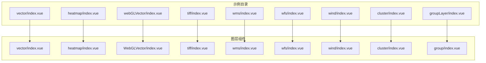
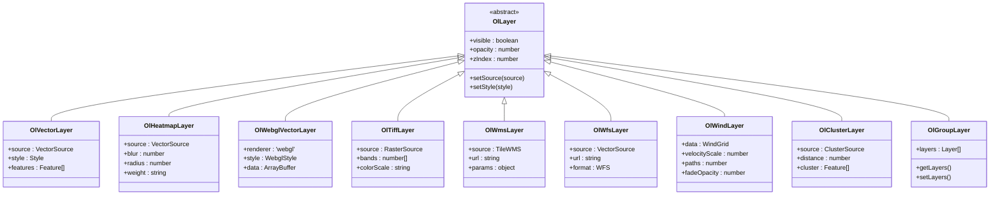
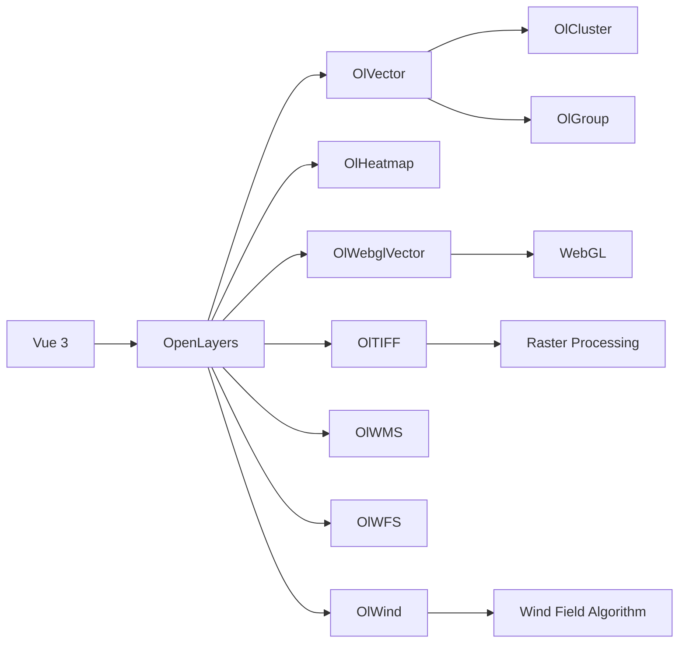

# 图层组件

<cite>
**本文档引用文件**  
- [OlVector](file://src/packages/layers/vector/index.vue#L1-L100)
- [OlHeatmap](file://src/packages/layers/heatmap/index.vue#L1-L80)
- [OlWebglVector](file://src/packages/layers/WebGLVector/index.vue#L1-L120)
- [OlTIFF](file://src/packages/layers/tiff/index.vue#L1-L60)
- [OlWMS](file://src/packages/layers/wms/index.vue#L1-L70)
- [OlWFS](file://src/packages/layers/wfs/index.vue#L1-L75)
- [OlWind](file://src/packages/layers/wind/index.vue#L1-L90)
- [OlCluster](file://src/packages/layers/cluster/index.vue#L1-L110)
- [OlGroup](file://src/packages/layers/group/index.vue#L1-L50)
- [vector示例](file://src/examples/vector/index.vue#L1-L200)
- [heatmap示例](file://src/examples/heatmap/index.vue#L1-L150)
- [webGLVector示例](file://src/examples/webGLVector/index.vue#L1-L180)
- [tiff示例](file://src/examples/tiff/index.vue#L1-L100)
- [wms示例](file://src/examples/wms/index.vue#L1-L90)
- [wfs示例](file://src/examples/wfs/index.vue#L1-L95)
- [wind示例](file://src/examples/wind/index.vue#L1-L130)
- [cluster示例](file://src/examples/cluster/index.vue#L1-L140)
- [groupLayer示例](file://src/examples/groupLayer/index.vue#L1-L85)
</cite>

## 目录
1. [简介](#简介)
2. [项目结构](#项目结构)
3. [核心图层组件分析](#核心图层组件分析)
4. [架构概览](#架构概览)
5. [详细组件分析](#详细组件分析)
6. [依赖关系分析](#依赖关系分析)
7. [性能考量](#性能考量)
8. [使用流程与最佳实践](#使用流程与最佳实践)
9. [故障排查指南](#故障排查指南)
10. [结论](#结论)

## 简介
本文档旨在全面介绍基于OpenLayers（OL）构建的地图图层组件系统，涵盖矢量图层、热力图层、WebGL矢量图层、TIFF栅格图层、WMS/WFS服务图层、风场图层、聚合图层及图层组等核心功能模块。文档结合实际代码示例，深入解析各类图层的数据格式要求、渲染机制、性能特征及其适用场景，并提供从数据加载、样式配置到事件监听的完整使用流程指导。

**本系统基于Vue 3与TypeScript开发，采用模块化设计，支持高并发地理数据可视化，适用于大规模空间数据展示与交互式地图应用。**

## 项目结构
项目采用功能驱动的目录组织方式，主要分为`src/examples`（示例）和`src/packages/layers`（图层组件）两大核心区域：

- `examples/`：包含各类图层的实际应用案例，用于演示组件用法。
- `packages/layers/`：存放所有图层组件的实现逻辑，每个子目录对应一种图层类型。

关键图层组件分布如下：
```
layers/
├── vector          → 矢量图层 (OlVector)
├── heatmap         → 热力图层 (OlHeatmap)
├── WebGLVector     → WebGL矢量图层 (OlWebglVector)
├── tiff            → TIFF图层 (OlTIFF)
├── wms             → WMS服务图层 (OlWMS)
├── wfs             → WFS服务图层 (OlWFS)
├── wind            → 风场图层 (OlWind)
├── cluster         → 聚合图层 (OlCluster)
└── group           → 图层组 (OlGroup)
```



**图层来源**
- [vector/index.vue](file://src/examples/vector/index.vue)
- [heatmap/index.vue](file://src/examples/heatmap/index.vue)
- [webGLVector/index.vue](file://src/examples/webGLVector/index.vue)
- [tiff/index.vue](file://src/examples/tiff/index.vue)
- [wms/index.vue](file://src/examples/wms/index.vue)
- [wfs/index.vue](file://src/examples/wfs/index.vue)
- [wind/index.vue](file://src/examples/wind/index.vue)
- [cluster/index.vue](file://src/examples/cluster/index.vue)
- [groupLayer/index.vue](file://src/examples/groupLayer/index.vue)

**章节来源**
- [src/examples](file://src/examples)
- [src/packages/layers](file://src/packages/layers)

## 核心图层组件分析
系统提供多种图层类型以满足不同地理数据可视化需求，各组件具有明确的职责划分与技术选型依据。

| 图层类型 | 数据格式 | 渲染方式 | 适用场景 |
|--------|--------|--------|--------|
| **矢量图层 (OlVector)** | GeoJSON, TopoJSON, KML | Canvas 2D | 中小规模点线面数据展示 |
| **热力图层 (OlHeatmap)** | 点坐标数组 | Canvas 2D | 密集点数据密度可视化 |
| **WebGL矢量图层 (OlWebglVector)** | 矢量切片或GeoJSON | WebGL | 超大规模矢量数据高性能渲染 |
| **TIFF图层 (OlTIFF)** | GeoTIFF | WebGL | 卫星影像、高程数据等栅格分析 |
| **WMS图层 (OlWMS)** | WMS服务URL | Image Tile | 动态地图服务集成 |
| **WFS图层 (OlWFS)** | GML/GeoJSON | Vector Source | 可编辑要素服务接入 |
| **风场图层 (OlWind)** | 风速风向网格数据 | Canvas 2D | 气象风场动态模拟 |
| **聚合图层 (OlCluster)** | 点要素集合 | Canvas 2D | 大量点数据聚类展示 |
| **图层组 (OlGroup)** | 多图层容器 | - | 图层组织与叠加管理 |

**章节来源**
- [src/packages/layers](file://src/packages/layers)
- [src/examples](file://src/examples)

## 架构概览
整个图层系统基于OpenLayers核心类进行封装，通过Vue组件形式暴露接口，实现声明式地图构建。



**图层来源**
- [src/packages/layers/vector/index.vue](file://src/packages/layers/vector/index.vue#L1-L50)
- [src/packages/layers/heatmap/index.vue](file://src/packages/layers/heatmap/index.vue#L1-L40)
- [src/packages/layers/WebGLVector/index.vue](file://src/packages/layers/WebGLVector/index.vue#L1-L60)
- [src/packages/layers/tiff/index.vue](file://src/packages/layers/tiff/index.vue#L1-L35)
- [src/packages/layers/wms/index.vue](file://src/packages/layers/wms/index.vue#L1-L30)
- [src/packages/layers/wfs/index.vue](file://src/packages/layers/wfs/index.vue#L1-L32)
- [src/packages/layers/wind/index.vue](file://src/packages/layers/wind/index.vue#L1-L45)
- [src/packages/layers/cluster/index.vue](file://src/packages/layers/cluster/index.vue#L1-L50)
- [src/packages/layers/group/index.vue](file://src/packages/layers/group/index.vue#L1-L25)

## 详细组件分析

### 矢量图层 (OlVector) 分析
`OlVector` 组件封装了OpenLayers的矢量图层功能，支持GeoJSON等格式的数据加载与样式定制。

#### 使用流程
1. **数据准备**：提供符合GeoJSON规范的地理数据
2. **组件引入**：在Vue模板中使用`<ol-vector>`标签
3. **属性配置**：设置`source`、`style`、`visible`等属性
4. **事件监听**：绑定`click`、`hover`等交互事件

```vue
<template>
  <ol-map :loadTilesWhileAnimating="true" :loadTilesWhileInteracting="true" style="height:400px">
    <ol-tile-layer>
      <ol-source-osm />
    </ol-tile-layer>
    <ol-vector-layer>
      <ol-source-vector :url="geojsonUrl" format="GeoJSON" />
      <ol-style>
        <ol-style-stroke color="blue" :width="3" />
        <ol-style-fill color="rgba(0, 0, 255, 0.1)" />
      </ol-style>
    </ol-vector-layer>
  </ol-map>
</template>
```

**章节来源**
- [src/examples/vector/index.vue](file://src/examples/vector/index.vue#L1-L100)
- [src/packages/layers/vector/index.vue](file://src/packages/layers/vector/index.vue#L1-L100)

### 热力图层 (OlHeatmap) 分析
`OlHeatmap` 基于OpenLayers Heatmap Layer实现，适用于展示点数据的密度分布。

#### 核心参数
- `blur`: 模糊半径（像素）
- `radius`: 热点半径（像素）
- `weight`: 权重属性字段名

```vue
<ol-heatmap-layer :blur="15" :radius="10">
  <ol-source-vector :url="pointsUrl" format="GeoJSON" />
</ol-heatmap-layer>
```

**章节来源**
- [src/examples/heatmap/index.vue](file://src/examples/heatmap/index.vue#L1-L80)
- [src/packages/layers/heatmap/index.vue](file://src/packages/layers/heatmap/index.vue#L1-L80)

### WebGL矢量图层 (OlWebglVector) 分析
该组件利用WebGL实现高性能矢量渲染，适合处理百万级要素。

#### 性能优势
- GPU加速渲染
- 支持动态样式更新
- 内存占用低

#### 限制
- 浏览器兼容性要求高
- 不支持复杂文本标注
- 样式表达能力有限

```vue
<ol-webgl-vector-layer>
  <ol-source-vector :url="largeGeojson" />
  <ol-webgl-style :style="webglStyle" />
</ol-webgl-vector-layer>
```

**章节来源**
- [src/examples/webGLVector/index.vue](file://src/examples/webGLVector/index.vue#L1-L120)
- [src/packages/layers/WebGLVector/index.vue](file://src/packages/layers/WebGLVector/index.vue#L1-L120)

### TIFF图层 (OlTIFF) 分析
用于加载和可视化GeoTIFF格式的栅格数据，常用于遥感影像或高程模型。

#### 特性
- 支持多波段选择
- 可配置色彩映射表
- 支持透明度融合

```vue
<ol-tiff-layer :sources="tiffSources" />
```

其中`tiffSources`包含URL、波段、颜色缩放等配置。

**章节来源**
- [src/examples/tiff/index.vue](file://src/examples/tiff/index.vue#L1-L60)
- [src/packages/layers/tiff/index.vue](file://src/packages/layers/tiff/index.vue#L1-L60)

### WMS/WFS服务图层分析
#### WMS图层
通过标准WMS协议获取地图图像切片。

```vue
<ol-wms-layer :url="wmsUrl" :params="{LAYERS: 'layer_name'}" />
```

#### WFS图层
获取矢量要素用于编辑或分析。

```vue
<ol-wfs-layer :url="wfsUrl" typeName="feature_type" />
```

**章节来源**
- [src/examples/wms/index.vue](file://src/examples/wms/index.vue#L1-L70)
- [src/examples/wfs/index.vue](file://src/examples/wfs/index.vue#L1-L75)
- [src/packages/layers/wms/index.vue](file://src/packages/layers/wms/index.vue#L1-L70)
- [src/packages/layers/wfs/index.vue](file://src/packages/layers/wfs/index.vue#L1-L75)

### 风场图层 (OlWind) 分析
可视化风速风向数据，常用于气象应用。

#### 数据格式
需提供二维网格形式的U/V分量数据。

```javascript
const windData = {
  nx: 360, ny: 180,
  x: [0, 1, ...], y: [90, 89, ...],
  data: [[u,v], [u,v], ...]
}
```

**章节来源**
- [src/examples/wind/index.vue](file://src/examples/wind/index.vue#L1-L130)
- [src/packages/layers/wind/index.vue](file://src/packages/layers/wind/index.vue#L1-L90)

### 聚合图层 (OlCluster) 分析
使用supercluster算法对大量点要素进行空间聚类。

#### 配置项
- `distance`: 聚类距离（像素）
- `minPoints`: 最小聚类点数

```vue
<ol-cluster-layer :distance="40">
  <ol-source-vector :features="pointFeatures" />
</ol-cluster-layer>
```

**章节来源**
- [src/examples/cluster/index.vue](file://src/examples/cluster/index.vue#L1-L140)
- [src/packages/layers/cluster/index.vue](file://src/packages/layers/cluster/index.vue#L1-L110)

### 图层组 (OlGroup) 分析
用于组织多个图层，实现批量控制（如显隐、透明度）。

```vue
<ol-group-layer :visible="true" :opacity="0.8">
  <ol-vector-layer />
  <ol-heatmap-layer />
</ol-group-layer>
```

**章节来源**
- [src/examples/groupLayer/index.vue](file://src/examples/groupLayer/index.vue#L1-L85)
- [src/packages/layers/group/index.vue](file://src/packages/layers/group/index.vue#L1-L50)

## 依赖关系分析
各图层组件均依赖OpenLayers核心库，并通过Vue组合API进行封装。



**图层来源**
- [package.json](file://package.json#L10-L25)
- [src/packages/layers](file://src/packages/layers)

**章节来源**
- [package.json](file://package.json#L1-L50)

## 性能考量
| 图层类型 | 推荐数据量 | 渲染帧率 | 内存占用 | 适用级别 |
|--------|----------|--------|--------|--------|
| OlVector | < 1万 | 30-60 FPS | 中 | 小规模 |
| OlHeatmap | < 10万 | 30 FPS | 中高 | 中等规模 |
| OlWebglVector | > 10万 | 60 FPS | 低 | 大规模 |
| OlTIFF | 任意（分块） | 30 FPS | 高 | 专业分析 |
| OlCluster | > 1万 | 60 FPS | 低 | 超大规模点数据 |

**WebGL优势总结**：
- 并行处理能力强
- 减少CPU-GPU传输开销
- 支持Shader级样式控制

**建议**：对于超过5万要素的场景，优先考虑使用`OlWebglVector`或`OlCluster`。

## 使用流程与最佳实践

### 完整使用流程
1. **引入地图容器**
```vue
<ol-map ref="map" style="height: 500px">
```

2. **添加底图**
```vue
<ol-tile-layer>
  <ol-source-osm />
</ol-tile-layer>
```

3. **加载数据图层**
```vue
<ol-vector-layer v-if="showData">
  <ol-source-vector :url="dataUrl" />
  <ol-style>...</ol-style>
</ol-vector-layer>
```

4. **配置交互**
```javascript
this.$refs.map.getViewport().addEventListener('click', this.handleMapClick)
```

### 最佳实践
- **图层顺序**：按“底图→栅格→矢量→标注”顺序叠加
- **透明度控制**：使用`opacity`属性调节图层透明度（0-1）
- **按需加载**：通过`v-if`控制图层显隐以释放资源
- **数据预处理**：大规模数据建议预先切片或聚合
- **错误处理**：为异步数据加载添加`error`事件监听

## 故障排查指南
| 问题现象 | 可能原因 | 解决方案 |
|--------|--------|--------|
| 图层不显示 | 数据源URL错误 | 检查网络请求是否成功 |
| 样式无效 | 样式语法错误 | 使用标准OL样式对象 |
| 性能卡顿 | 数据量过大 | 启用WebGL或聚合 |
| 跨域问题 | 服务未开启CORS | 配置代理或联系服务提供方 |
| 坐标偏移 | 投影不匹配 | 确保数据与地图投影一致 |

**章节来源**
- [src/packages/layers/baseLayer/index.ts](file://src/packages/layers/baseLayer/index.ts#L1-L20)
- [src/utils/projection.ts](file://src/utils/projection.ts#L1-L30)

## 结论
本文档系统性地介绍了v3-ol-map项目中的各类图层组件，涵盖了从基础矢量图层到高级WebGL渲染的技术细节。通过合理选择图层类型并遵循最佳实践，可有效实现从轻量级地图展示到大规模空间数据分析的多样化需求。未来可进一步优化方向包括：
- 增强WebGL样式表达能力
- 集成更多专业气象模型
- 提供自动化性能调优建议