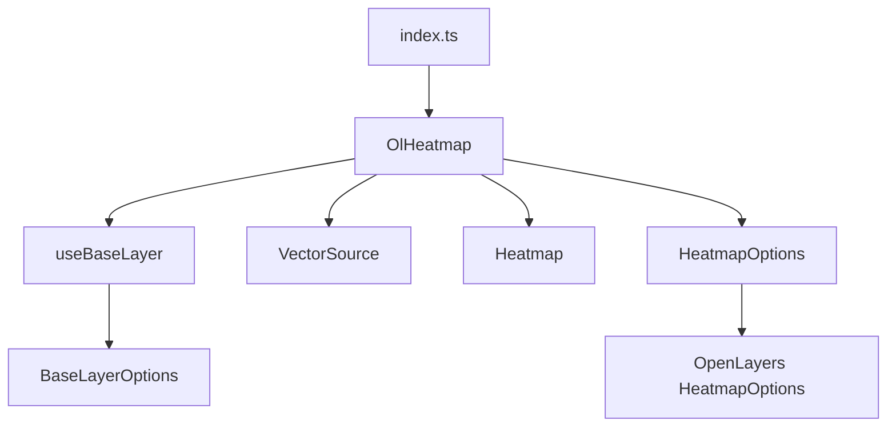
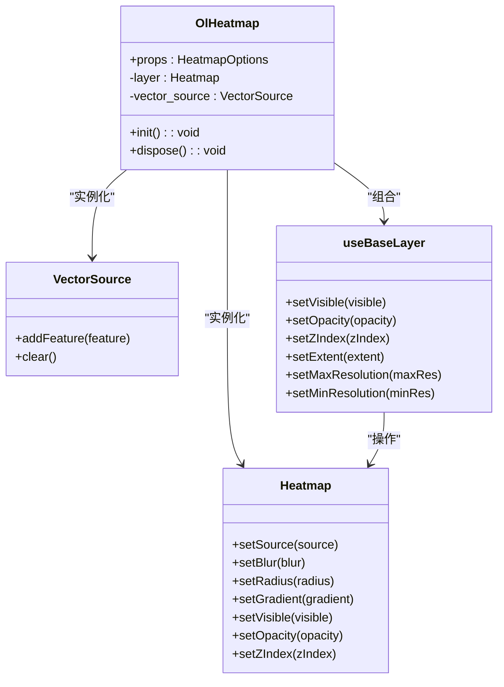
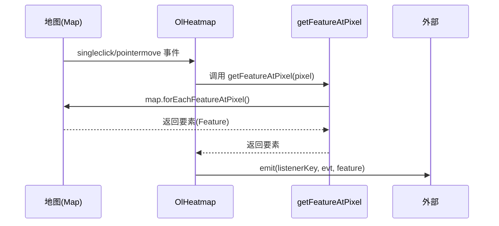
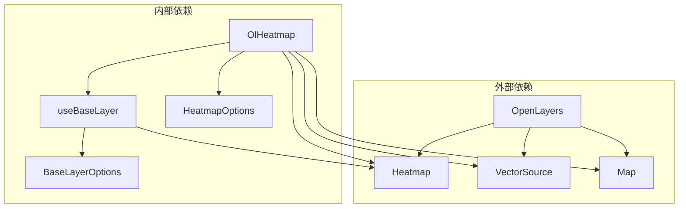

# 热力图层 (OlHeatmap)

<cite>
**本文档引用文件**  
- [index.vue](file://src/packages/layers/heatmap/index.vue#L0-L150)
- [index.ts](file://src/packages/layers/heatmap/index.ts#L0-L6)
- [Heatmap.ts](file://src/packages/types/Heatmap.ts#L0-L7)
- [baseLayer/index.ts](file://src/packages/layers/baseLayer/index.ts#L0-L126)
- [index.vue](file://src/examples/heatmap/index.vue#L0-L98)
</cite>

## 目录
1. [简介](#简介)
2. [项目结构](#项目结构)
3. [核心组件](#核心组件)
4. [架构概览](#架构概览)
5. [详细组件分析](#详细组件分析)
6. [依赖关系分析](#依赖关系分析)
7. [性能优化建议](#性能优化建议)
8. [常见问题排查](#常见问题排查)
9. [最佳实践](#最佳实践)
10. [附录](#附录)

## 简介
本文档深入解析 `OlHeatmap` 组件的实现机制，该组件基于 OpenLayers 的 `HeatmapLayer` 进行封装，用于在地图上可视化点数据的密度分布。通过分析源码，详细说明其核心参数配置、事件处理机制、与基础图层的集成方式，并结合实际示例展示其在人口分布、事件密度等场景下的应用。

## 项目结构
`OlHeatmap` 组件位于项目的 `src/packages/layers/heatmap/` 目录下，遵循 Vue 3 的组合式 API (Composition API) 和 TypeScript 规范。其结构清晰，主要包含：
- `index.vue`: 组件的主实现文件，定义了热力图层的逻辑和生命周期。
- `index.ts`: 组件的安装入口，用于在 Vue 应用中全局注册该组件。
- 类型定义位于 `src/packages/types/Heatmap.ts`，扩展了 OpenLayers 原生的热力图选项。

**组件依赖关系**


**Diagram sources**
- [index.vue](file://src/packages/layers/heatmap/index.vue#L0-L150)
- [index.ts](file://src/packages/layers/heatmap/index.ts#L0-L6)
- [Heatmap.ts](file://src/packages/types/Heatmap.ts#L0-L7)

**Section sources**
- [index.vue](file://src/packages/layers/heatmap/index.vue#L0-L150)
- [index.ts](file://src/packages/layers/heatmap/index.ts#L0-L6)

## 核心组件
`OlHeatmap` 的核心功能是将点数据源（`VectorSource`）转换为热力图层（`Heatmap`），并提供一系列可配置的参数来控制其视觉效果和行为。

**关键属性与功能**
- **数据源 (`source`)**: 接收一个 `VectorSource` 的配置对象，用于加载点数据。
- **权重字段 (`weight`)**: 指定点要素中用于计算热力强度的属性名。
- **半径 (`radius`)**: 定义每个点的影响范围（像素）。
- **模糊度 (`blur`)**: 控制热力图颜色过渡的平滑程度。
- **渐变色谱 (`gradient`)**: 定义从低密度到高密度的颜色映射数组。
- **图层ID (`layerId`)**: 为图层分配唯一标识，便于管理和操作。
- **可见性 (`visible`)**: 控制图层的显示与隐藏。

**Section sources**
- [index.vue](file://src/packages/layers/heatmap/index.vue#L0-L150)
- [Heatmap.ts](file://src/packages/types/Heatmap.ts#L0-L7)

## 架构概览
`OlHeatmap` 的架构设计体现了分层和复用的思想。它利用 OpenLayers 的核心类 `Heatmap` 和 `VectorSource`，并通过自定义的 `useBaseLayer` Hook 来继承基础图层（如可见性、透明度、层级等）的通用属性。



**Diagram sources**
- [index.vue](file://src/packages/layers/heatmap/index.vue#L0-L150)
- [baseLayer/index.ts](file://src/packages/layers/baseLayer/index.ts#L0-L126)

## 详细组件分析

### 组件初始化与销毁
组件的生命周期由 `onMounted` 和 `onBeforeUnmount` 钩子管理。

**初始化流程**
```mermaid
flowchart TD
A[onMounted] --> B[调用 init()]
B --> C[创建 VectorSource]
C --> D[监听 addfeature 事件]
D --> E[创建 Heatmap 实例]
E --> F[设置 layerId]
F --> G[添加到地图]
G --> H[绑定地图事件]
H --> I[触发 sourceready]
I --> J[layerReady = true]
```

**代码分析**
```typescript
const init = () => {
  // 1. 创建向量数据源
  vector_source.value = new VectorSource({ ...props.source });
  // 2. 监听数据加载完成事件
  vector_source.value.once("addfeature", () => {
    emit("addfeature", layer.value, vector_source.value);
  });
  // 3. 创建热力图层
  layer.value = new Heatmap({
    ...props,
    source: vector_source.value,
  });
  // 4. 设置唯一ID
  const layerId = props.layerId || `heatmap-layer-${nanoid()}`;
  layer.value.set("id", layerId);
  // 5. 添加到地图
  map.addLayer(layer.value);
  // 6. 绑定事件
  eventList.forEach(listenerKey => {
    eventRender.value.push(
      map.on(listenerKey, (evt: MapObjectEventTypes<UIEvent>) => {
        eventHandler(listenerKey, evt);
      }),
    );
  });
  // 7. 发出准备就绪事件
  layer.value.on("sourceready", () => {
    layerReady.value = true;
    emit("sourceready", layer.value);
  });
};
```

**Section sources**
- [index.vue](file://src/packages/layers/heatmap/index.vue#L0-L150)

### 属性响应式更新
组件通过 `watch` 监听关键属性的变化，并动态调用 OpenLayers 的相应方法进行更新。

**属性更新机制**
```mermaid
flowchart LR
A[props.blur 变化] --> B[调用 layer.setBlur(nVal)]
C[props.radius 变化] --> D[调用 layer.setRadius(nVal)]
E[props.gradient 变化] --> F[调用 layer.setGradient(nVal)]
G[props.source 变化] --> H[清空旧数据源<br>移除旧图层<br>重新初始化]
```

**代码分析**
```typescript
watch(
  () => props.blur,
  nVal => {
    if (layer.value || nVal === 0) {
      layer.value?.setBlur(nVal);
    }
  },
);
// radius 和 gradient 的监听逻辑类似
watch(
  () => props.source,
  () => {
    console.log("source change");
    // 重新初始化以应对数据源变更
    vector_source.value?.clear();
    if (layer.value) map.removeLayer(layer.value);
    init();
  },
);
```

**Section sources**
- [index.vue](file://src/packages/layers/heatmap/index.vue#L0-L150)

### 事件处理
组件封装了地图的 `singleclick` 和 `pointermove` 事件，并提供了 `getFeatureAtPixel` 方法来获取鼠标位置下的要素。

**事件处理流程**


**代码分析**
```typescript
const eventHandler = (listenerKey: string, evt: MapObjectEventTypes<UIEvent>) => {
  const { pixel } = evt;
  const feature = getFeatureAtPixel(pixel);
  emit(listenerKey, evt, feature);
};

const getFeatureAtPixel = (pixel: Pixel) => {
  return map.forEachFeatureAtPixel(
    pixel,
    feature => {
      return feature;
    },
    {
      layerFilter: (vector_layer: Layer) => {
        return vector_layer.get("id") === layer.value?.get("id");
      },
    },
  );
};
```

**Section sources**
- [index.vue](file://src/packages/layers/heatmap/index.vue#L0-L150)

## 依赖关系分析
`OlHeatmap` 组件依赖于多个内部和外部模块，形成了一个清晰的依赖链。



**Diagram sources**
- [index.vue](file://src/packages/layers/heatmap/index.vue#L0-L150)
- [baseLayer/index.ts](file://src/packages/layers/baseLayer/index.ts#L0-L126)

## 性能优化建议
1. **数据采样**: 对于海量点数据，应在前端或后端进行采样，避免一次性加载过多数据导致浏览器卡顿。
2. **分辨率控制**: 利用 `minResolution` 和 `maxResolution` 属性，在不同缩放级别下控制热力图的显示，避免在低缩放级别下渲染不必要的细节。
3. **动态半径调整**: 如示例所示，可以根据地图缩放级别动态调整 `radius`，以保持视觉效果的一致性。
4. **避免频繁更新**: 频繁修改 `source` 会触发完整的 `init` 流程，开销较大。应尽量通过 `vector_source.value.addFeature()` 或 `vector_source.value.removeFeature()` 来增删点，而非替换整个数据源。

## 常见问题排查
1. **热力分布异常**
   - **检查权重字段**: 确认 `weight` 属性名与数据源中的字段名完全匹配。
   - **检查数据范围**: 确保权重值在一个合理的范围内，过大或过小的值可能导致颜色显示异常。
   - **调整半径和模糊度**: 尝试调整 `radius` 和 `blur` 参数，找到最适合数据密度的组合。

2. **渲染卡顿**
   - **数据量过大**: 首先检查数据量，考虑进行数据采样。
   - **频繁更新**: 避免在短时间内频繁更改 `source` 或大量增删要素。
   - **浏览器性能**: 检查浏览器性能，关闭不必要的扩展程序。

## 最佳实践
1. **人口分布可视化**: 将每个点代表一个区域的人口数量，`weight` 字段设置为人口数，可以直观展示人口密度。
2. **事件密度分析**: 用于展示交通事故、犯罪事件等的发生频率，帮助识别热点区域。
3. **与其他图层叠加**: 通过设置 `z-index` 和 `opacity`，可以将热力图层与其他底图或矢量图层叠加，提供更丰富的信息。
4. **交互式探索**: 结合 `pointermove` 事件，可以在鼠标悬停时显示该位置的详细信息或统计数据。

## 附录

### 示例代码解析
`src/examples/heatmap/index.vue` 展示了如何使用 `OlHeatmap`。

**关键代码**
```vue
<ol-heatmap :z-index="8" class-name="heatmap" :radius="radius" :blur="blur">
  <ol-feature :geo-json="heatmapJson" />
</ol-heatmap>
```
- `:radius="radius"` 和 `:blur="blur"` 绑定了动态变量。
- `<ol-feature>` 组件用于将 `GeoJSON` 数据注入到热力图层中。
- `handleZoom` 函数实现了根据缩放级别动态调整 `radius` 的逻辑。

**Section sources**
- [index.vue](file://src/examples/heatmap/index.vue#L0-L98)