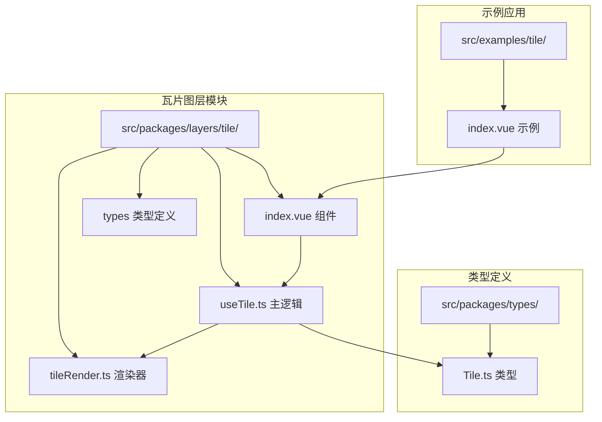
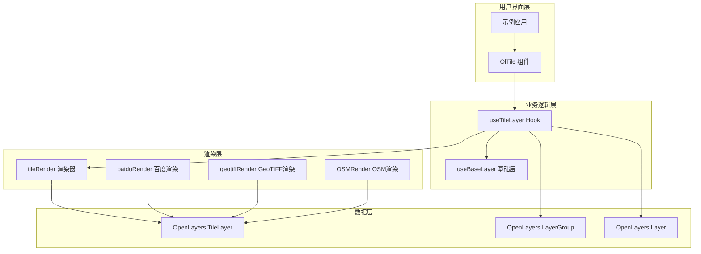
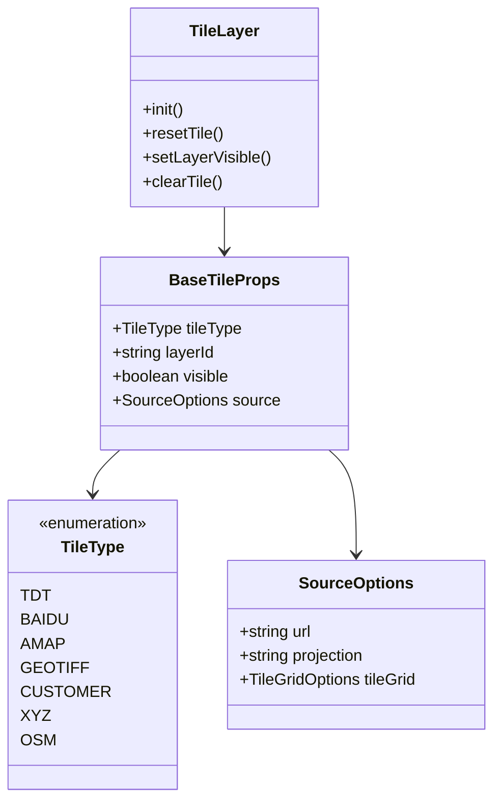
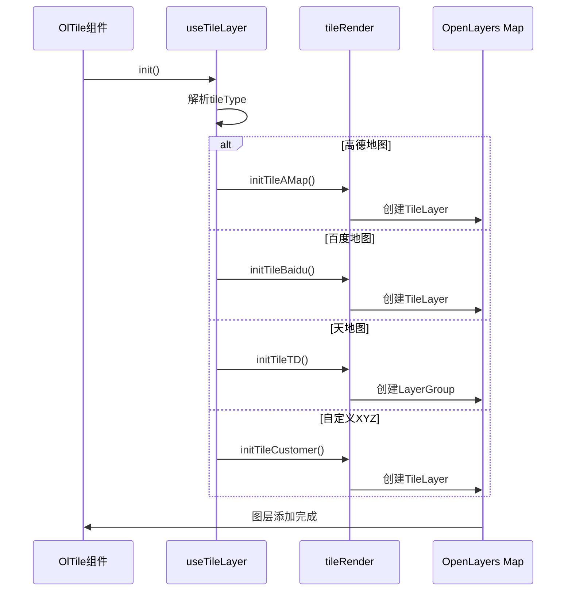
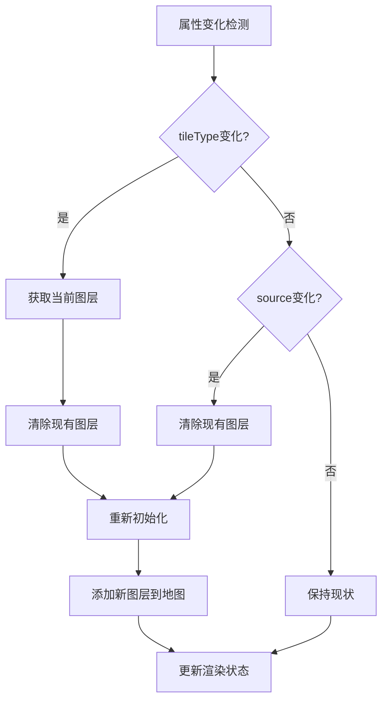
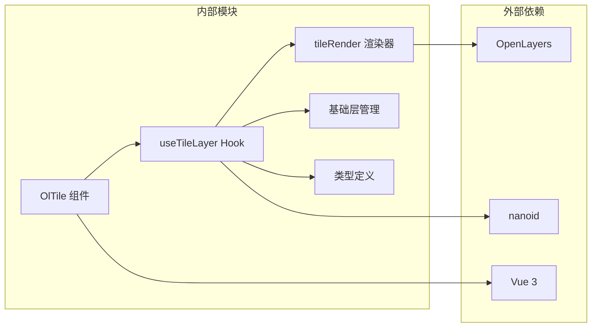

# 瓦片图层

<cite>
**本文档引用的文件**
- [src/packages/layers/tile/index.vue](file://src/packages/layers/tile/index.vue)
- [src/packages/layers/tile/useTile.ts](file://src/packages/layers/tile/useTile.ts)
- [src/packages/layers/tile/tileRender.ts](file://src/packages/layers/tile/tileRender.ts)
- [src/packages/types/Tile.ts](file://src/packages/types/Tile.ts)
- [src/packages/hooks/tile.ts](file://src/packages/hooks/tile.ts)
- [src/examples/tile/index.vue](file://src/examples/tile/index.vue)
</cite>

## 目录
1. [简介](#简介)
2. [项目结构](#项目结构)
3. [核心组件](#核心组件)
4. [架构概览](#架构概览)
5. [详细组件分析](#详细组件分析)
6. [依赖关系分析](#依赖关系分析)
7. [性能考虑](#性能考虑)
8. [故障排除指南](#故障排除指南)
9. [结论](#结论)

## 简介

瓦片图层是地理信息系统中用于显示栅格地图数据的核心组件。本项目提供了一个基于OpenLayers的瓦片图层解决方案，支持多种地图服务提供商，包括高德地图、百度地图、天地图、OSM以及自定义XYZ服务。

该组件通过Vue 3 Composition API实现，提供了灵活的地图底图切换功能，支持卫星图、地形图等多种地图样式，并集成了缩略图控制功能。

## 项目结构

瓦片图层系统采用模块化设计，主要包含以下核心文件：

**图表来源**
- [src/packages/layers/tile/index.vue](file://src/packages/layers/tile/index.vue#L1-L63)
- [src/packages/layers/tile/useTile.ts](file://src/packages/layers/tile/useTile.ts#L1-L331)
- [src/packages/layers/tile/tileRender.ts](file://src/packages/layers/tile/tileRender.ts#L1-L97)

**章节来源**
- [src/packages/layers/tile/index.vue](file://src/packages/layers/tile/index.vue#L1-L63)
- [src/packages/layers/tile/useTile.ts](file://src/packages/layers/tile/useTile.ts#L1-L331)
- [src/packages/layers/tile/tileRender.ts](file://src/packages/layers/tile/tileRender.ts#L1-L97)

## 核心组件

### OlTile 组件

OlTile 是瓦片图层的主要Vue组件，负责管理瓦片图层的生命周期和状态。

**主要特性：**
- 支持多种瓦片图层类型（高德、百度、天地图等）
- 动态图层重置功能
- 响应式属性监听
- Vue 3 Composition API 实现

**组件属性：**
- `tileType`: 瓦片图层类型（可选）
- `layerId`: 图层唯一标识符（可选）
- `visible`: 图层可见性（默认true）
- `source`: 源配置选项（可选）

**章节来源**
- [src/packages/layers/tile/index.vue](file://src/packages/layers/tile/index.vue#L10-L14)

### useTileLayer Hook

useTileLayer 提供了瓦片图层的核心业务逻辑，包括图层初始化、配置管理和生命周期控制。

**核心功能：**
- 多地图服务提供商支持
- 动态图层创建和销毁
- 缩略图控制集成
- 层级管理

**主要方法：**
- `init()`: 初始化瓦片图层
- `resetTile()`: 重置当前图层
- `setOverviewMapOptions()`: 设置缩略图选项
- `setLayerVisible()`: 切换图层可见性
- `clearTile()`: 清理图层资源

**章节来源**
- [src/packages/layers/tile/useTile.ts](file://src/packages/layers/tile/useTile.ts#L17-L328)

## 架构概览

瓦片图层系统采用分层架构设计，确保了良好的可维护性和扩展性：

**图表来源**
- [src/packages/layers/tile/useTile.ts](file://src/packages/layers/tile/useTile.ts#L1-L331)
- [src/packages/layers/tile/tileRender.ts](file://src/packages/layers/tile/tileRender.ts#L1-L97)

## 详细组件分析

### 瓦片图层类型系统

系统支持多种瓦片图层类型，每种类型都有特定的配置和渲染方式：

**图表来源**
- [src/packages/types/Tile.ts](file://src/packages/types/Tile.ts#L11-L43)

### 图层初始化流程

瓦片图层的初始化过程涉及多个步骤和条件判断：

**图表来源**
- [src/packages/layers/tile/useTile.ts](file://src/packages/layers/tile/useTile.ts#L32-L79)
- [src/packages/layers/tile/tileRender.ts](file://src/packages/layers/tile/tileRender.ts#L22-L32)

### 图层重置机制

当瓦片图层类型或配置发生变化时，系统会自动重置图层以应用新的设置：

**图表来源**
- [src/packages/layers/tile/index.vue](file://src/packages/layers/tile/index.vue#L17-L44)

**章节来源**
- [src/packages/types/Tile.ts](file://src/packages/types/Tile.ts#L11-L43)
- [src/packages/layers/tile/index.vue](file://src/packages/layers/tile/index.vue#L17-L44)

## 依赖关系分析

瓦片图层系统具有清晰的依赖层次结构：

**图表来源**
- [src/packages/layers/tile/useTile.ts](file://src/packages/layers/tile/useTile.ts#L1-L15)
- [src/packages/layers/tile/tileRender.ts](file://src/packages/layers/tile/tileRender.ts#L1-L8)

**章节来源**
- [src/packages/layers/tile/useTile.ts](file://src/packages/layers/tile/useTile.ts#L1-L15)
- [src/packages/layers/tile/tileRender.ts](file://src/packages/layers/tile/tileRender.ts#L1-L8)

## 性能考虑

瓦片图层系统在设计时充分考虑了性能优化：

### 内存管理
- 使用 `shallowRef` 减少响应式开销
- 及时清理图层资源防止内存泄漏
- 条件渲染避免不必要的DOM操作

### 渲染优化
- 按需加载不同类型的瓦片图层
- 支持图层组批量管理
- 优化图层可见性切换

### 配置缓存
- 合并配置对象减少重复计算
- 缓存地图服务提供商配置
- 避免重复的图层初始化

## 故障排除指南

### 常见问题及解决方案

**问题1: 天地图AK密钥错误**
- 症状: 控制台出现"请配置天地图ak!"错误
- 解决方案: 在配置中正确设置天地图AK密钥

**问题2: 百度地图个性化地图失败**
- 症状: 个性化地图无法加载
- 解决方案: 确保已配置百度地图AK密钥

**问题3: 图层切换异常**
- 症状: 更换瓦片图层类型后页面不更新
- 解决方案: 检查 `tileType` 属性是否正确传递

**问题4: 性能问题**
- 症状: 地图渲染缓慢
- 解决方案: 考虑使用缩略图控制或优化图层配置

**章节来源**
- [src/packages/layers/tile/useTile.ts](file://src/packages/layers/tile/useTile.ts#L114-L119)
- [src/packages/layers/tile/useTile.ts](file://src/packages/layers/tile/useTile.ts#L196-L202)

## 结论

瓦片图层系统提供了一个功能完整、易于使用的地图底图解决方案。其模块化设计使得系统具有良好的可扩展性和维护性，支持多种地图服务提供商和丰富的配置选项。

通过合理的架构设计和性能优化，该系统能够满足大多数地理信息应用的需求，同时为开发者提供了清晰的扩展接口和良好的开发体验。