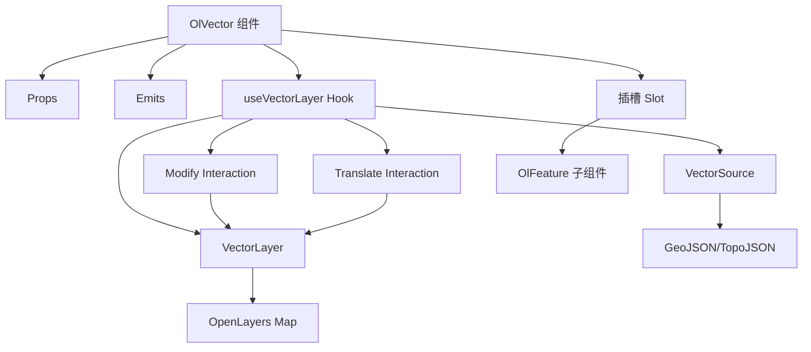
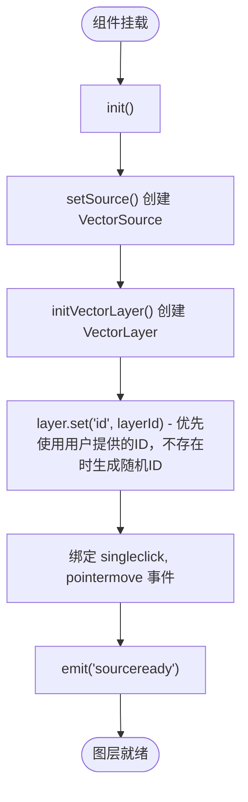
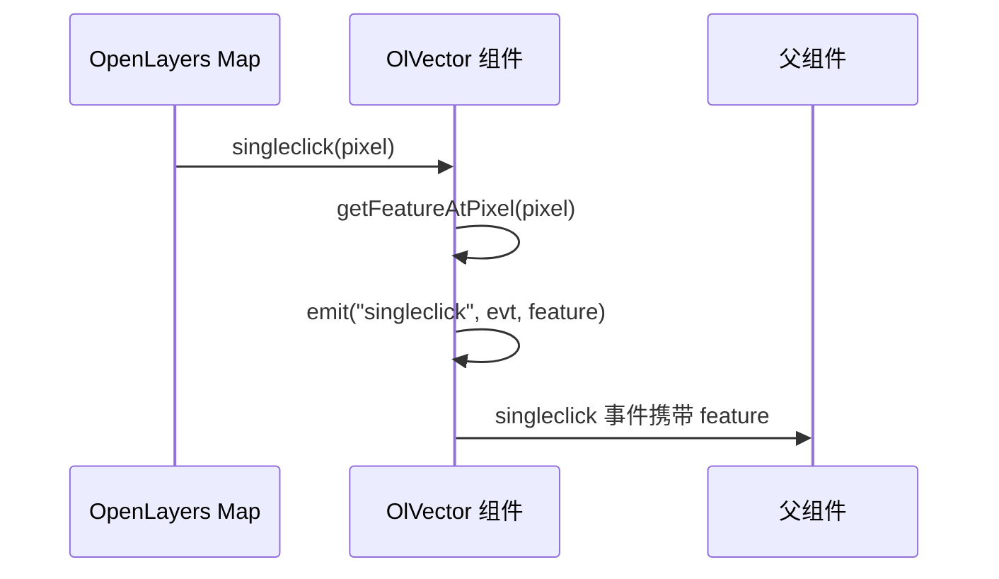
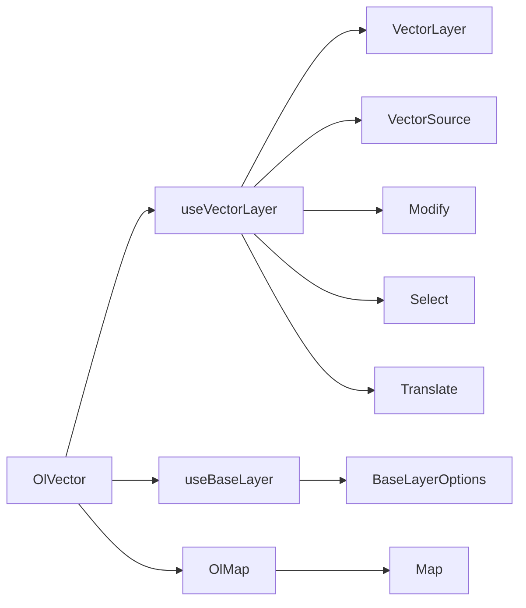

# 矢量图层 (OlVector)

<cite>
**本文档引用文件**  
- [index.vue](file://src/packages/layers/vector/index.vue#L0-L106)
- [vector.ts](file://src/packages/hooks/vector.ts#L0-L302)
- [Vector.ts](file://src/packages/types/Vector.ts#L0-L49)
- [style.ts](file://src/packages/utils/style.ts#L0-L136)
- [index.vue](file://src/examples/vector/index.vue#L0-L330)
- [parent.ts](file://src/packages/hooks/parent.ts#L24-L48)
- [baseLayer/index.ts](file://src/packages/layers/baseLayer/index.ts#L1-L127)
- [index.ts](file://src/packages/utils/index.ts#L41-L92)
</cite>

## 更新摘要
**所做更改**  
- 更新了点击处理和几何信息提取逻辑章节，反映示例中改进的几何中心计算方法
- 新增了多实例向量图层的对比演示说明
- 更新了示例代码中的几何信息提取优化
- 增强了事件监听机制的详细说明

## 目录
1. [简介](#简介)
2. [项目结构](#项目结构)
3. [核心组件](#核心组件)
4. [架构概览](#架构概览)
5. [详细组件分析](#详细组件分析)
6. [依赖关系分析](#依赖关系分析)
7. [性能考量](#性能考量)
8. [故障排除指南](#故障排除指南)
9. [结论](#结论)

## 简介
`OlVector` 是一个基于 Vue 3 和 OpenLayers 的矢量图层组件，用于在地图上渲染和管理矢量数据（如点、线、面）。该组件支持通过 GeoJSON、TopoJSON 等格式加载数据，提供灵活的样式配置系统，并具备交互事件监听能力（如点击、悬停等）。它封装了 OpenLayers 的 `VectorLayer` 和 `VectorSource`，通过属性（props）暴露关键配置，使开发者能够以声明式方式操作矢量图层。

本技术文档将深入解析 `OlVector` 的设计与实现机制，涵盖数据加载、样式系统、事件处理、交互功能及性能优化策略，结合示例代码说明其使用方法，并提供常见问题的解决方案。

## 项目结构
`OlVector` 组件位于项目的 `/src/packages/layers/vector/` 目录下，其结构遵循 Vue 3 Composition API 和模块化设计原则。主要文件包括：

- `index.vue`：组件主文件，定义了 `OlVector` 的模板、逻辑和生命周期。
- `index.ts`：组件安装模块，用于全局注册组件。
- 相关依赖分散在 `hooks`、`types` 和 `utils` 目录中，分别处理逻辑复用、类型定义和工具函数。

该组件通过 `useVectorLayer` 自定义 Hook 与 OpenLayers 原生 API 进行交互，实现了高内聚、低耦合的设计。

**Section sources**
- [index.vue](file://src/packages/layers/vector/index.vue#L0-L106)

## 核心组件
`OlVector` 的核心功能由以下几个部分构成：

- **数据源管理**：通过 `props.source` 配置 `VectorSource`，支持本地数据或远程 URL 加载 GeoJSON/TopoJSON。
- **样式系统**：支持 `layerStyle`（图层级样式）和 `featureStyle`（要素级样式），可静态定义或动态计算。
- **事件系统**：监听地图交互事件（如 `singleclick`）和图层状态事件（如 `sourceready`）。
- **交互功能**：支持要素的编辑（`modify`）和平移（`translate`）操作。
- **依赖注入**：通过 `inject("VMap")` 获取地图实例，实现与父级 `OlMap` 的通信。

这些功能共同构成了一个功能完整、易于使用的矢量图层组件。

**Section sources**
- [index.vue](file://src/packages/layers/vector/index.vue#L0-L106)
- [vector.ts](file://src/packages/hooks/vector.ts#L0-L302)

## 架构概览
`OlVector` 组件的架构建立在 OpenLayers 的图层-源（Layer-Source）模型之上，通过 Vue 的响应式系统进行封装和扩展。



**Diagram sources**
- [index.vue](file://src/packages/layers/vector/index.vue#L0-L106)
- [vector.ts](file://src/packages/hooks/vector.ts#L0-L302)

## 详细组件分析

### 组件初始化流程
`OlVector` 在 `onMounted` 钩子中调用 `init()` 函数，异步初始化矢量图层。流程如下：

1. 调用 `initVectorLayer()` 创建 `VectorLayer` 实例。
2. 根据 `props.source` 配置创建 `VectorSource`。
3. 将图层添加到地图，并设置图层 ID。
4. 绑定地图事件监听器（如点击、悬停）。
5. 触发 `sourceready` 事件，通知图层已准备就绪。



**更新** 所有图层组件现在采用统一的layerId管理策略：优先使用用户提供的ID，如果用户未提供，则生成随机ID。这种策略确保了图层ID的一致性和可靠性。

**Diagram sources**
- [index.vue](file://src/packages/layers/vector/index.vue#L74-L81)
- [vector.ts](file://src/packages/hooks/vector.ts#L206-L253)

### 图层ID管理策略
所有图层组件都采用了统一的layerId管理策略，确保ID分配的一致性和可靠性：

#### 统一ID分配逻辑
- **优先级策略**：首先检查 `props.layerId` 是否存在
- **回退机制**：如果用户未提供ID，则使用 `nanoid()` 生成唯一标识符
- **格式规范**：生成的ID采用 `vector-layer-${nanoid()}` 格式

#### 实现示例
```typescript
const layerId = props.layerId || `vector-layer-${nanoid()}`;
vectorLayer.set("id", layerId);
```

#### ID一致性保障
- **全局统一**：所有图层组件（OlVector、OlWebGLVector、OlCluster、OlHeatmap等）都遵循相同的ID管理策略
- **组层兼容**：OlGroupLayer使用 `props.id` 作为ID，保持与其它图层的命名一致性
- **唯一性保证**：通过 `nanoid()` 确保自动生成的ID具有高度唯一性

**Section sources**
- [index.vue](file://src/packages/layers/vector/index.vue#L74-L81)
- [parent.ts](file://src/packages/hooks/parent.ts#L24-L48)

### 数据加载机制
`OlVector` 支持两种数据加载方式：

1. **直接数据**：通过 `props.source.features` 传入 GeoJSON 特征数组。
2. **远程数据**：通过 `props.source.url` 和 `props.source.featureFormat` 指定远程数据源和格式。

当 `source.url` 存在且 `featureFormat` 为 `GeoJSON`、`EsriJSON` 或 `TopoJSON` 时，组件会自动创建带有 `ol/format` 解析器的 `VectorSource`。

```typescript
const setSource = () => {
  if (props.source?.featureFormat && props.source?.url) {
    return new VectorSource({
      url: props.source.url,
      format: new Format[props.source.featureFormat]({
        ...props.source.formatOptions,
        dataProjection: new Projection(props.source.formatOptions?.dataProjection),
        featureProjection: new Projection(props.source.formatOptions?.featureProjection)
      })
    });
  } else {
    return new VectorSource(props.source);
  }
};
```

**Section sources**
- [vector.ts](file://src/packages/hooks/vector.ts#L119-L151)

### 样式配置系统
`OlVector` 提供了多层次的样式配置能力：

#### 图层级样式 (layerStyle)
`layerStyle` 属性接受 OpenLayers 的 `FlatStyleLike` 类型，支持数组形式的规则匹配。每条规则包含 `filter` 和 `style` 字段，用于条件化渲染。

```typescript
const layerStyle = [
  {
    filter: ["==", ["get", "name"], "Point2"],
    style: {
      "icon-src": cluster2,
      "text-value": ["get", "name"],
      "text-fill-color": "white"
    }
  },
  {
    else: true,
    style: { /* 默认样式 */ }
  }
];
```

#### 要素级样式 (featureStyle)
`featureStyle` 是一个函数式样式，为每个要素单独计算样式。它通过 `setFeatureStyle()` 工具函数应用。

```typescript
if (props.featureStyle) {
  layer.value = new VectorLayer({
    style: feature => {
      return setFeatureStyle(feature, props.featureStyle, map);
    }
  });
}
```

#### 样式工具函数
`setFeatureStyle()` 函数首先调用 `setStyle()` 创建基础样式，然后检查是否存在 `styleFunction`，若存在则返回一个动态样式函数。

```typescript
export const setFeatureStyle = (feature: Feature, style: FeatureStyle, map: Map) => {
  const featureStyle = setStyle(style);
  if (style.styleFunction) {
    feature.setStyle(function (feature, resolution) {
      return style.styleFunction(feature, resolution, map, featureStyle);
    });
  } else {
    feature.setStyle(featureStyle);
  }
};
```

**Section sources**
- [vector.ts](file://src/packages/hooks/vector.ts#L206-L253)
- [style.ts](file://src/packages/utils/style.ts#L125-L135)

### 事件监听机制
`OlVector` 通过 `map.on()` 监听地图的 `singleclick` 和 `pointermove` 事件，并在事件触发时通过 `emit` 派发给父组件。



`getFeatureAtPixel()` 使用 `map.forEachFeatureAtPixel()` 并配合 `layerFilter` 确保只返回当前图层的要素。

**更新** 改进的点击处理逻辑现在支持更精确的几何信息提取，包括点要素的坐标获取和非点要素的几何中心计算。

**Diagram sources**
- [vector.ts](file://src/packages/hooks/vector.ts#L153-L204)

### 几何信息提取优化
在示例中，点击处理函数现在包含了更完善的几何信息提取逻辑：

#### 点要素处理
对于点要素，直接使用几何坐标的实际坐标：
```typescript
if (type === "Point") {
  position.value = geom.getCoordinates() || evt.coordinate;
}
```

#### 非点要素处理
对于线、面、圆形等要素，使用 `utils.calculateCenter()` 计算几何中心：
```typescript
const { topCenter } = utils.calculateCenter(geom);
position.value = topCenter;
```

#### 几何中心计算算法
`calculateCenter()` 函数根据几何类型计算不同的中心点：
- **Polygon**：计算多边形顶点的平均值作为中心
- **LineString**：获取线段中点坐标
- **Circle**：直接使用圆心坐标
- **其他**：使用几何包围盒的中心点

**Section sources**
- [index.vue](file://src/examples/vector/index.vue#L172-L205)
- [index.ts](file://src/packages/utils/index.ts#L41-L92)

### 交互功能实现
`OlVector` 支持 `modify`（编辑）和 `translate`（平移）两种交互模式。

- **编辑 (modify)**：当 `props.modify` 为 `true` 时，创建 `Modify` 交互对象，允许用户拖动要素的顶点。
- **平移 (translate)**：当 `props.translate` 为 `true` 时，创建 `Select` 和 `Translate` 交互对象，允许用户拖动整个要素。

这些交互对象在 `setModify()` 和 `setTranslate()` 函数中创建，并在 `dispose()` 中移除以避免内存泄漏。

**Section sources**
- [vector.ts](file://src/packages/hooks/vector.ts#L81-L117)

## 依赖关系分析
`OlVector` 组件依赖于多个内部模块和 OpenLayers API。



**Diagram sources**
- [index.vue](file://src/packages/layers/vector/index.vue#L0-L106)
- [vector.ts](file://src/packages/hooks/vector.ts#L0-L302)
- [baseLayer/index.ts](file://src/packages/layers/baseLayer/index.ts#L1-L127)

## 性能考量
在大规模数据场景下，`OlVector` 的性能主要受以下因素影响：

1. **样式计算开销**：避免在 `featureStyle` 函数中进行复杂计算，建议使用 `layerStyle` 的规则匹配。
2. **事件监听**：确保在组件卸载时调用 `dispose()` 清理所有事件监听器。
3. **数据量**：对于海量数据，应考虑使用 `WebGLVectorLayer` 或 `OlVectorTile` 组件以提升渲染性能。
4. **内存管理**：通过 `shallowRef` 管理图层和源实例，避免不必要的响应式开销。

## 故障排除指南

### 样式不生效
- **检查 `layerStyle` 是否为空**：组件会在控制台发出警告。
- **验证 `filter` 表达式**：确保 `["get", "property"]` 中的属性名正确。
- **检查 `featureStyle` 返回值**：确保 `styleFunction` 返回有效的 `Style` 对象。

### 要素交互冲突
- **确保图层 ID 唯一**：多个 `OlVector` 实例应设置不同的 `layerId`。
- **检查 `layerFilter`**：`getFeatureAtPixel` 依赖图层 ID 进行过滤。
- **避免重复添加交互**：`modify` 和 `translate` 应通过 `props` 控制，避免手动操作。

### 数据未加载
- **检查 `source.url` 跨域**：确保服务器允许跨域请求。
- **验证 GeoJSON 格式**：使用在线工具校验 JSON 结构。
- **监听 `featuresloaderror` 事件**：获取具体的加载错误信息。

### 图层ID管理问题
- **ID冲突**：如果多个图层使用相同ID，可能导致图层管理异常
- **ID格式不一致**：确保所有图层都遵循统一的ID命名规范
- **ID生成冲突**：虽然使用 `nanoid()`，但在极少数情况下仍可能出现冲突

### 点击处理问题
- **几何类型判断**：确保正确识别要素的几何类型
- **坐标系转换**：检查要素坐标是否需要进行投影转换
- **空值处理**：为 `geom.getCoordinates()` 可能返回空值的情况提供默认值

**Section sources**
- [vector.ts](file://src/packages/hooks/vector.ts#L206-L253)
- [index.vue](file://src/examples/vector/index.vue#L0-L330)

## 结论
`OlVector` 组件成功地将 OpenLayers 强大的矢量渲染能力封装为一个易于使用的 Vue 组件。它通过清晰的属性接口、灵活的样式系统和完整的事件机制，为开发者提供了高效的地图矢量数据可视化解决方案。结合 `OlFeature` 等子组件，可以构建出功能丰富的地理信息应用。

**更新** 最新的版本引入了统一的图层ID管理策略，所有图层组件都采用了优先使用用户提供的ID、不存在时生成随机ID的策略，显著提升了图层ID管理的一致性和可靠性。这一改进确保了不同图层组件之间的兼容性，简化了图层管理和调试过程。

**更新** 向量层示例的增强展示了改进的点击处理和几何信息提取逻辑，包括多实例对比演示、精确的几何中心计算和更完善的事件处理机制。这些改进使得矢量图层在实际应用中的交互体验更加流畅和准确。

对于性能敏感的场景，建议结合 `WebGL` 或 `VectorTile` 技术进行优化。