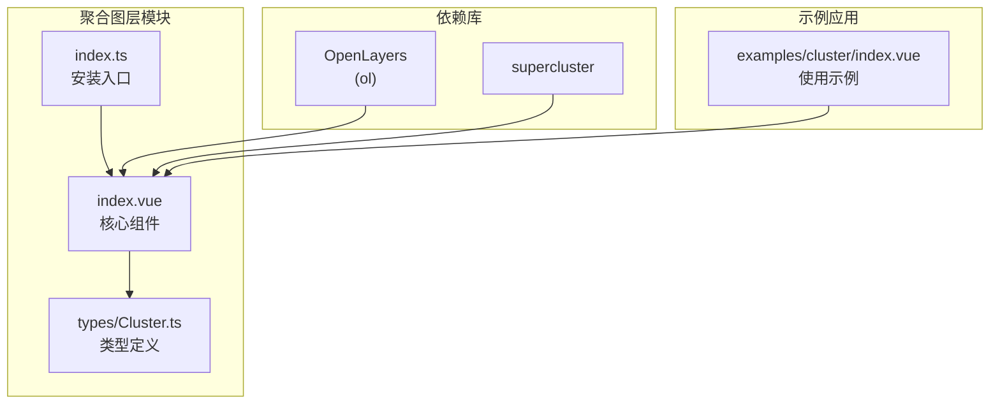
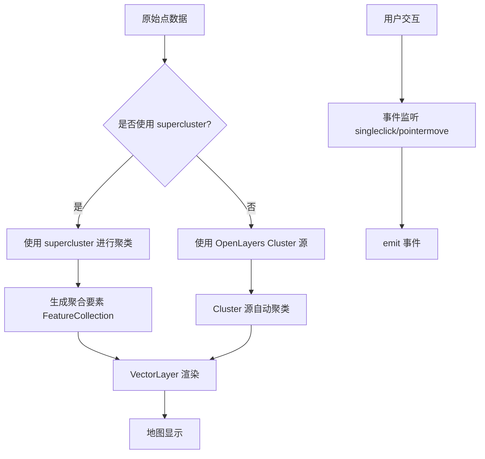
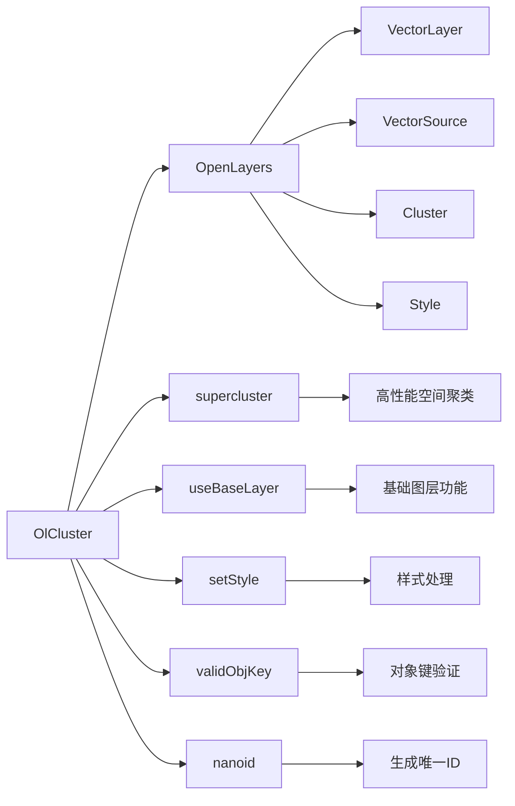

# 聚合图层 (OlCluster)

<cite>
**本文档引用文件**  
- [index.vue](file://src/packages/layers/cluster/index.vue#L1-L270)
- [index.ts](file://src/packages/layers/cluster/index.ts#L1-L7)
- [index.vue](file://src/examples/cluster/index.vue#L1-L145)
- [Cluster.ts](file://src/packages/types/Cluster.ts#L1-L22)
- [feature.ts](file://src/packages/feature/feature.ts#L64-L347)
</cite>

## 目录
1. [简介](#简介)
2. [项目结构](#项目结构)
3. [核心组件](#核心组件)
4. [架构概述](#架构概述)
5. [详细组件分析](#详细组件分析)
6. [依赖分析](#依赖分析)
7. [性能考量](#性能考量)
8. [故障排除指南](#故障排除指南)
9. [结论](#结论)

## 简介
本文档深入解析基于 `supercluster` 库实现的聚合图层（OlCluster），重点介绍其在处理大规模点数据时的聚类算法、性能优化机制及交互行为定制能力。通过分析 `src/packages/layers/cluster` 模块与示例 `src/examples/cluster/index.vue`，全面展示从原始地理数据到动态层级化聚合的完整流程。文档涵盖聚类参数调节、样式自定义、点击展开交互、动态数据更新维护等关键功能，旨在为开发者提供一份详尽的技术参考。

## 项目结构
聚合图层模块位于 `src/packages/layers/cluster` 目录下，采用 Vue 3 的组合式 API 构建，包含核心组件 `index.vue` 和安装入口 `index.ts`。该模块依赖 OpenLayers 的 `VectorLayer` 和 `Cluster` 源，并通过 `supercluster` 实现高性能空间聚类。示例文件位于 `src/examples/cluster/index.vue`，演示了如何集成和使用该组件。



**图示来源**
- [index.vue](file://src/packages/layers/cluster/index.vue#L1-L270)
- [index.ts](file://src/packages/layers/cluster/index.ts#L1-L7)
- [Cluster.ts](file://src/packages/types/Cluster.ts#L1-L22)

**本节来源**
- [index.vue](file://src/packages/layers/cluster/index.vue#L1-L270)
- [index.ts](file://src/packages/layers/cluster/index.ts#L1-L7)

## 核心组件
`OlCluster` 组件的核心功能是将大量点要素进行空间聚类，以提升地图渲染性能并改善用户体验。其主要通过 `props` 接收配置，利用 `supercluster` 或 OpenLayers 内置的 `Cluster` 源进行聚类计算，并通过自定义样式函数渲染聚合点。

**关键属性 (Props)**
- **layerId**: 图层唯一标识符
- **visible**: 图层可见性
- **clusterOptions**: OpenLayers `Cluster` 源的配置选项，如 `distance`（聚类距离）
- **clusterStyle**: 聚合点的样式配置
- **layerStyle**: 原始点要素的样式配置
- **superCluster**: `supercluster` 库的配置选项，用于替代 OpenLayers 内置聚类

**关键事件 (Emits)**
- **singleclick**: 单击事件，返回事件对象和被点击的要素
- **pointermove**: 鼠标移动事件
- **sourceready**: 图层数据源准备就绪

**本节来源**
- [index.vue](file://src/packages/layers/cluster/index.vue#L20-L59)
- [Cluster.ts](file://src/packages/types/Cluster.ts#L1-L22)

## 架构概述
`OlCluster` 的架构围绕 OpenLayers 的图层和源模型构建，通过条件判断选择使用 `supercluster` 或内置 `Cluster` 源，实现了灵活的聚类策略。



**图示来源**
- [index.vue](file://src/packages/layers/cluster/index.vue#L61-L196)
- [feature.ts](file://src/packages/feature/feature.ts#L64-L139)

## 详细组件分析

### 聚类算法与参数调节
`OlCluster` 支持两种聚类实现：OpenLayers 内置的 `Cluster` 源和更高效的 `supercluster` 库。

#### OpenLayers 内置聚类
当未提供 `superCluster` 属性时，组件使用 OpenLayers 的 `Cluster` 源。其核心参数为 `distance`，定义了聚类半径（像素单位）。
```typescript
cluster_source.value = new Cluster({
  ...props.clusterOptions, // 包含 distance 等选项
  source: vector_source.value,
});
```
- **distance**: 值越大，聚类越粗粒度，聚合点越少；值越小，聚类越精细，聚合点越多。可通过示例中的滑块动态调节。

#### Supercluster 高性能聚类
当提供 `superCluster` 属性时，组件使用 `supercluster` 库。该库采用 R-tree 索引和分治算法，性能远超内置聚类，尤其适合处理数万甚至数十万点数据。
```typescript
const superCluster = layer.value.get("superCluster");
if (superCluster) {
  clusters = new Supercluster(superCluster); // 初始化
  clusters.load(geoFeatures.features); // 加载数据
  const clusterFeatures = clusters.getClusters(extent, zoom); // 获取视图范围内的聚合点
}
```
- **minPoints**: 定义形成聚合点所需的最小点数。
- **radius**: 聚类半径（与 `distance` 类似）。
- **maxZoom**: 聚类生效的最大缩放级别。

**本节来源**
- [index.vue](file://src/packages/layers/cluster/index.vue#L61-L196)
- [feature.ts](file://src/packages/feature/feature.ts#L64-L139)

### 自定义聚合图标样式
组件通过 `clusterStyle` 属性支持高度可定制的聚合点样式。样式函数利用缓存（`styleCache`）避免重复创建样式对象，提升性能。

#### 样式配置
`clusterStyle` 可以是单个样式对象或样式数组。
- **单个样式**: 所有聚合点使用同一图标和颜色。
- **样式数组**: 支持根据聚合点数量（`point_count`）动态切换样式。
  - **基于范围**: 使用 `min` 和 `max` 属性定义数量区间。
  ```typescript
  if (validObjKey(e, "min") || validObjKey(e, "max")) {
    if (min < size && size <= max) {
      styleOptions = clusterFeatureStyle(e, size.toString());
    }
  }
  ```
  - **基于平均值**: 若未定义范围，则根据总点数平均分配样式。

#### 样式应用
`clusterFeatureStyle` 函数用于动态更新文本内容（聚合数量）：
```typescript
const clusterFeatureStyle = (style: ClusterStyle, text: string) => {
  const textStyle = { ...style.text, text };
  return { ...style, text: textStyle };
};
```

**本节来源**
- [index.vue](file://src/packages/layers/cluster/index.vue#L61-L126)
- [Cluster.ts](file://src/packages/types/Cluster.ts#L1-L22)

### 交互行为：点击展开
组件通过监听 `singleclick` 事件实现点击聚合点展开子点的功能。

#### 示例实现分析
在 `examples/cluster/index.vue` 中：
1.  **事件处理**: `onClickClusterLayer` 函数接收点击事件和要素。
2.  **判断类型**: 检查 `feature.get("cluster")` 判断是否为聚合点。
3.  **获取子点**: 若为聚合点且数量较少（`count <= 10`），调用 `getLeaves(id, Infinity)` 方法获取所有子点。
    ```typescript
    const children = clusterRef.value?.getLeaves(id, Infinity);
    ```
4.  **状态管理**: 将子点列表存储在 `clusterOverlay.list` 中，并通过 `ol-overlay` 组件在地图上显示一个列表弹窗。

#### `getLeaves` 方法实现
该方法在 `src/packages/feature/feature.ts` 中定义：
```typescript
const getLeaves = (id: number, limit?: number, offset?: number) => {
  if (!clusters) {
    throw new Error("SuperCluster is not initialized");
  } else {
    return clusters.getLeaves(id, limit, offset);
  }
};
```
此方法直接调用 `supercluster` 实例的 `getLeaves`，根据聚合点的 `cluster_id` 查询其包含的原始点。

**本节来源**
- [index.vue](file://src/packages/layers/cluster/index.vue#L20-L59)
- [index.vue](file://src/examples/cluster/index.vue#L51-L85)
- [feature.ts](file://src/packages/feature/feature.ts#L274-L347)

### 性能提升机制
`OlCluster` 通过以下方式显著提升性能：
1.  **减少渲染节点**: 将成千上万个点要素聚合成少量聚合点，极大减少了浏览器需要渲染的图形数量。
2.  **高效聚类算法**: 使用 `supercluster` 库，其时间复杂度接近 O(n log n)，远优于暴力遍历。
3.  **样式缓存**: 在 `style` 函数中使用 `styleCache` 对象，避免为相同数量的聚合点重复创建样式实例。
4.  **按需加载**: `supercluster` 结合地图视图范围（`extent`）和缩放级别（`zoom`）进行聚类，只计算当前可见区域的数据。

**本节来源**
- [index.vue](file://src/packages/layers/cluster/index.vue#L61-L196)
- [feature.ts](file://src/packages/feature/feature.ts#L64-L139)

### 与矢量图层协同工作
`OlCluster` 本质上是一个 `VectorLayer`，因此可以无缝集成到 OpenLayers 的图层管理中。
- **叠加顺序**: 通过 `z-index` 属性控制图层叠加顺序。
- **与其他图层共存**: 可与 `ol-tile`（瓦片图层）、`ol-heatmap`（热力图）等其他图层同时使用。
- **最佳实践**: 将 `OlCluster` 置于基础底图之上，业务点要素之下，确保聚合点清晰可见。

**本节来源**
- [index.vue](file://src/examples/cluster/index.vue#L100-L110)

### 动态数据更新
当原始数据（`geoJson`）发生变化时，组件通过 `watch` 监听器自动更新聚类状态。
```typescript
watch(
  [() => props.geoJson, () => props.geometries],
  ([newFirst, newLast], [oldFirst, oldLast]) => {
    resetFeatures(props.geoJson || props.geometries);
  },
  {
    deep: true,
  },
);
```
`resetFeatures` 函数会清除现有数据源，并重新调用 `addFeatures` 流程，确保聚类结果与最新数据同步。

**本节来源**
- [feature.ts](file://src/packages/feature/feature.ts#L274-L347)

## 依赖分析
`OlCluster` 组件依赖于多个内部和外部模块。



**图示来源**
- [index.vue](file://src/packages/layers/cluster/index.vue#L1-L270)
- [index.ts](file://src/packages/layers/cluster/index.ts#L1-L7)

**本节来源**
- [index.vue](file://src/packages/layers/cluster/index.vue#L1-L270)

## 性能考量
- **数据量**: 对于小于 1,000 个点，内置 `Cluster` 源已足够。对于更大规模数据，强烈推荐使用 `superCluster`。
- **样式复杂度**: 避免在 `clusterStyle` 中使用过于复杂的 SVG 图标或大量文本，以减少渲染开销。
- **事件监听**: 仅监听必要的事件（如 `singleclick`），避免 `pointermove` 等高频事件造成性能瓶颈。
- **内存管理**: 组件在 `onBeforeUnmount` 钩子中通过 `dispose` 函数移除所有事件监听，防止内存泄漏。

## 故障排除指南
- **问题**: 聚合点不显示。
  - **检查**: 确认 `geoJson` 数据已正确加载且包含 `Point` 类型的要素。
  - **检查**: 确认 `layerStyle` 或 `clusterStyle` 配置正确，特别是 `icon.src` 路径是否存在。
- **问题**: 点击事件无响应。
  - **检查**: 确认 `@singleclick` 事件已正确绑定。
  - **检查**: 确认 `clusterRef` 的 `ref` 已正确设置，以便调用 `getLeaves`。
- **问题**: 动态更新数据后聚类未刷新。
  - **检查**: 确保传入的 `geoJson` 是一个响应式引用（`ref` 或 `reactive`），并且其引用已改变（`watch` 的 `deep` 选项可监听内部变化）。

**本节来源**
- [index.vue](file://src/packages/layers/cluster/index.vue#L20-L59)
- [index.vue](file://src/examples/cluster/index.vue#L51-L85)

## 结论
`OlCluster` 组件是一个功能强大且性能优越的地图聚合解决方案。它通过封装 `supercluster` 和 OpenLayers 的聚类能力，为开发者提供了一个简洁易用的 API。通过合理配置 `distance`、`minPoints` 等参数，结合自定义样式和交互逻辑，可以有效处理大规模点数据，显著提升地图应用的流畅度和用户体验。其模块化设计和良好的事件系统也便于与其他功能组件集成，是构建高性能地理信息应用的理想选择。