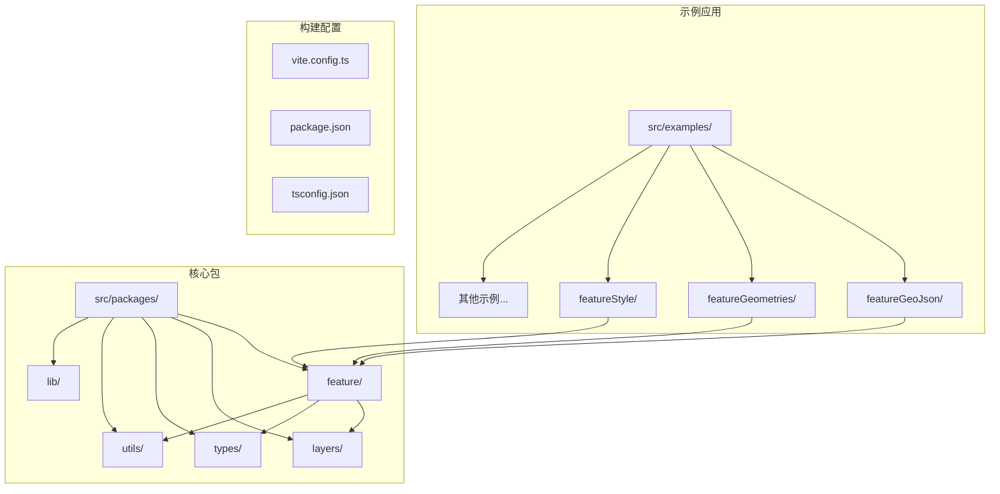
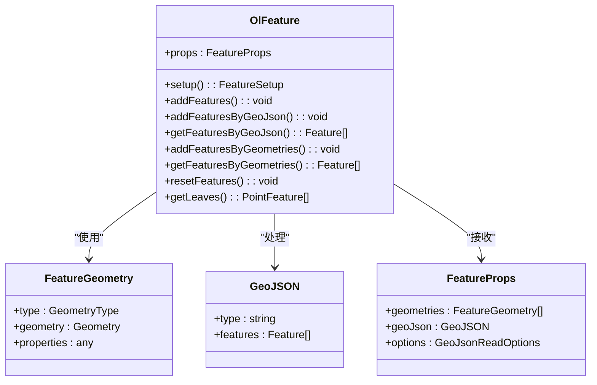
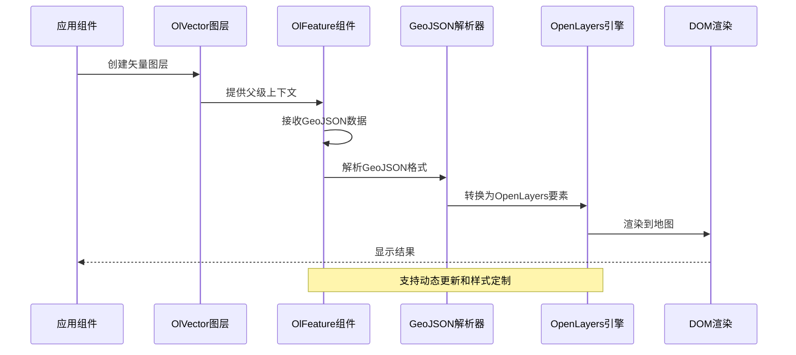
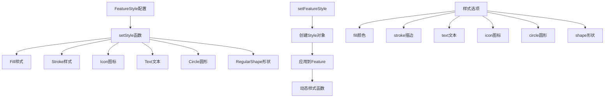
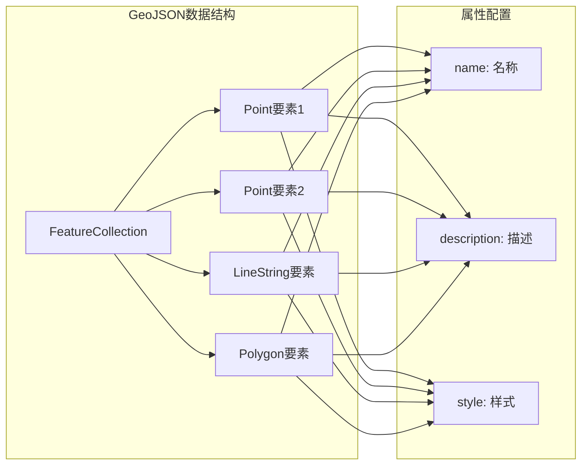
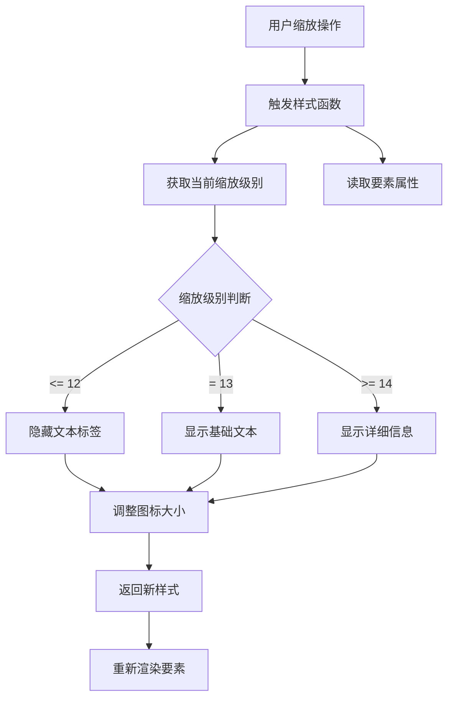
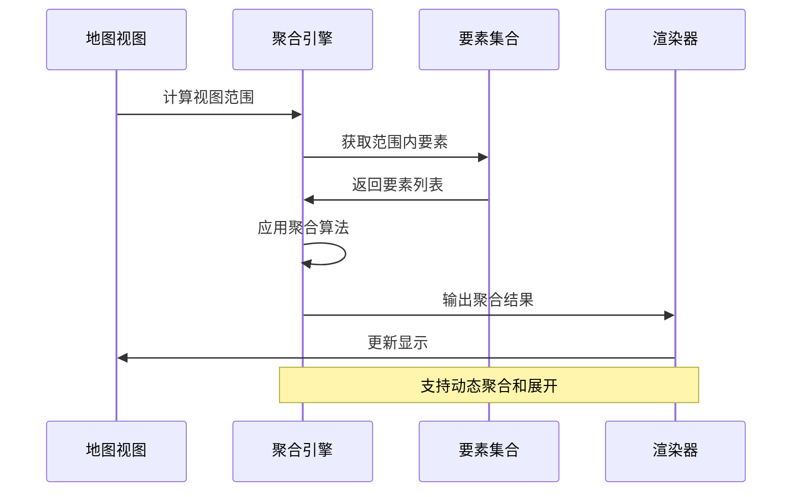
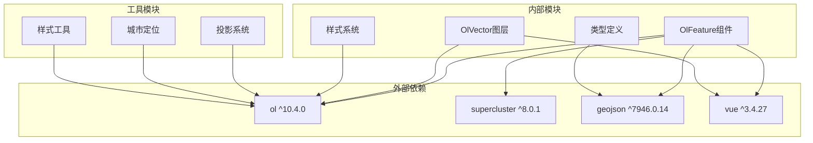

# GeoJSON特征示例

<cite>
**本文档引用的文件**
- [src/examples/featureGeoJson/index.vue](file://src/examples/featureGeoJson/index.vue)
- [src/packages/feature/feature.ts](file://src/packages/feature/feature.ts)
- [src/packages/types/Feature.ts](file://src/packages/types/Feature.ts)
- [src/packages/utils/style.ts](file://src/packages/utils/style.ts)
- [src/packages/layers/vector/index.vue](file://src/packages/layers/vector/index.vue)
- [src/examples/featureGeometries/index.vue](file://src/examples/featureGeometries/index.vue)
- [src/examples/featureStyle/index.vue](file://src/examples/featureStyle/index.vue)
- [package.json](file://package.json)
</cite>

## 目录
1. [简介](#简介)
2. [项目结构](#项目结构)
3. [核心组件](#核心组件)
4. [架构概览](#架构概览)
5. [详细组件分析](#详细组件分析)
6. [依赖关系分析](#依赖关系分析)
7. [性能考虑](#性能考虑)
8. [故障排除指南](#故障排除指南)
9. [结论](#结论)

## 简介

本项目是一个基于Vue 3和OpenLayers的地图可视化框架，专注于GeoJSON特征的展示和管理。本文档重点介绍GeoJSON特征示例的实现原理、架构设计和最佳实践。

该框架提供了完整的地理信息系统（GIS）解决方案，支持多种几何类型（点、线、面、圆形等）的GeoJSON数据处理，具备样式定制、聚合显示、动态更新等功能特性。

## 项目结构

项目采用模块化架构设计，主要包含以下核心目录：

**图表来源**
- [src/examples/featureGeoJson/index.vue](file://src/examples/featureGeoJson/index.vue#L1-L121)
- [src/packages/feature/feature.ts](file://src/packages/feature/feature.ts#L1-L372)

**章节来源**
- [src/examples/featureGeoJson/index.vue](file://src/examples/featureGeoJson/index.vue#L1-L121)
- [package.json](file://package.json#L1-L82)

## 核心组件

### OlFeature组件

OlFeature是GeoJSON特征的核心组件，负责将GeoJSON数据转换为OpenLayers可识别的要素对象。

**图表来源**
- [src/packages/feature/feature.ts](file://src/packages/feature/feature.ts#L43-L372)
- [src/packages/types/Feature.ts](file://src/packages/types/Feature.ts#L52-L78)

### 特征类型系统

框架支持多种几何类型的GeoJSON特征：

| 几何类型 | 支持状态 | 描述 |
|---------|----------|------|
| Point | ✅ 完全支持 | 二维坐标点 |
| LineString | ✅ 完全支持 | 折线路径 |
| Polygon | ✅ 完全支持 | 多边形区域 |
| MultiPoint | ✅ 完全支持 | 多个点集合 |
| MultiLineString | ✅ 完全支持 | 多条折线 |
| MultiPolygon | ✅ 完全支持 | 多个多边形 |
| Circle | ✅ 完全支持 | 基于中心点和半径的圆形 |
| GeometryCollection | ✅ 完全支持 | 几何对象集合 |

**章节来源**
- [src/packages/feature/feature.ts](file://src/packages/feature/feature.ts#L229-L283)
- [src/packages/types/Feature.ts](file://src/packages/types/Feature.ts#L15-L51)

## 架构概览

### 数据流架构

**图表来源**
- [src/packages/feature/feature.ts](file://src/packages/feature/feature.ts#L68-L157)
- [src/packages/layers/vector/index.vue](file://src/packages/layers/vector/index.vue#L32-L34)

### 样式系统架构

**图表来源**
- [src/packages/utils/style.ts](file://src/packages/utils/style.ts#L65-L135)

**章节来源**
- [src/packages/utils/style.ts](file://src/packages/utils/style.ts#L1-L136)

## 详细组件分析

### GeoJSON特征示例实现

#### 基础GeoJSON特征示例

该示例展示了如何使用GeoJSON格式定义各种类型的地理要素：

**图表来源**
- [src/examples/featureGeoJson/index.vue](file://src/examples/featureGeoJson/index.vue#L12-L77)

#### 几何对象特征示例

与GeoJSON格式相比，几何对象格式提供了更直接的JavaScript对象定义方式：

| 特征类型 | 几何对象结构 | 属性字段 |
|---------|-------------|----------|
| Point | `{type: "Point", geometry: {coordinates: [x,y]}}` | coordinates |
| Circle | `{type: "Circle", geometry: {center: [x,y], radius: 800}}` | center, radius |
| LineString | `{type: "LineString", geometry: {coordinates: [[x1,y1],[x2,y2],...]}}` | coordinates |
| Polygon | `{type: "Polygon", geometry: {coordinates: [[[x1,y1],[x2,y2],...]]}}` | coordinates |

**章节来源**
- [src/examples/featureGeometries/index.vue](file://src/examples/featureGeometries/index.vue#L11-L77)

### 动态样式定制

#### 样式函数实现

样式函数允许根据地图缩放级别动态调整要素显示效果：

**图表来源**
- [src/examples/featureStyle/index.vue](file://src/examples/featureStyle/index.vue#L53-L80)

**章节来源**
- [src/examples/featureStyle/index.vue](file://src/examples/featureStyle/index.vue#L1-L98)

### 聚合功能实现

#### Supercluster聚合机制

对于大量点要素，框架集成了Supercluster聚合算法：

**图表来源**
- [src/packages/feature/feature.ts](file://src/packages/feature/feature.ts#L86-L147)

**章节来源**
- [src/packages/feature/feature.ts](file://src/packages/feature/feature.ts#L64-L147)

## 依赖关系分析

### 核心依赖关系

**图表来源**
- [package.json](file://package.json#L28-L45)

### 组件耦合度分析

| 组件 | 内聚性 | 耦合度 | 说明 |
|------|--------|--------|------|
| OlFeature | 高 | 中等 | 专注GeoJSON处理，依赖较少 |
| OlVector | 中等 | 高 | 需要与多个子组件协作 |
| 样式系统 | 高 | 低 | 独立的功能模块 |
| 类型定义 | 高 | 低 | 纯类型声明，无运行时依赖 |

**章节来源**
- [package.json](file://package.json#L28-L45)

## 性能考虑

### 优化策略

1. **懒加载机制**：仅在需要时加载和解析GeoJSON数据
2. **聚合优化**：对大量点要素使用Supercluster进行空间索引
3. **内存管理**：及时清理不再使用的要素和监听器
4. **渲染优化**：使用requestAnimationFrame控制重绘频率

### 性能监控

建议监控以下指标：
- 要素数量与渲染时间的关系
- 聚合算法的计算开销
- 样式函数的执行频率
- 内存使用情况

## 故障排除指南

### 常见问题及解决方案

#### GeoJSON解析错误

**问题症状**：要素无法正确显示或出现解析异常

**可能原因**：
- GeoJSON格式不规范
- 坐标值超出有效范围
- 缺少必需的属性字段

**解决方法**：
1. 验证GeoJSON格式的有效性
2. 检查坐标系统的匹配性
3. 确保必需属性的完整性

#### 样式显示异常

**问题症状**：要素样式不符合预期

**可能原因**：
- 样式配置参数错误
- 样式函数逻辑问题
- 图标资源加载失败

**解决方法**：
1. 检查样式配置参数的语法
2. 验证样式函数的执行逻辑
3. 确认资源路径的正确性

#### 性能问题

**问题症状**：地图响应缓慢或卡顿

**可能原因**：
- 要素数量过多
- 样式计算过于复杂
- 监听器未正确清理

**解决方法**：
1. 实施要素分页或聚合
2. 简化样式计算逻辑
3. 确保组件卸载时清理资源

**章节来源**
- [src/packages/feature/feature.ts](file://src/packages/feature/feature.ts#L310-L356)

## 结论

本项目提供了一个完整且高效的GeoJSON特征处理解决方案。通过模块化的架构设计和丰富的功能特性，开发者可以轻松地在Vue应用中集成地图功能。

主要优势包括：
- **灵活的数据输入**：支持GeoJSON和几何对象两种数据格式
- **强大的样式系统**：支持静态和动态样式定制
- **高性能渲染**：集成聚合算法优化大数据量场景
- **易于扩展**：清晰的模块边界便于功能扩展

建议在实际项目中根据具体需求选择合适的数据格式，并合理配置样式和性能参数，以获得最佳的用户体验。