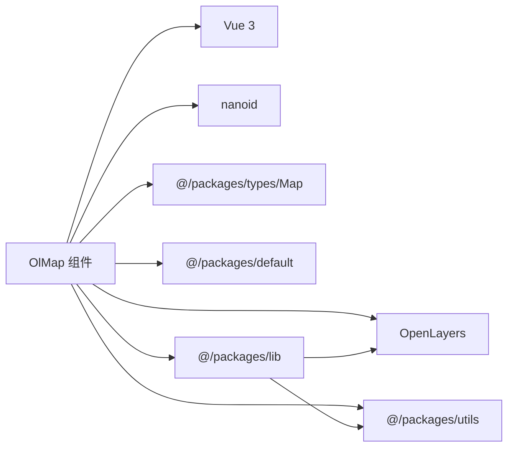

# OlMap 地图容器

<cite>
**本文档引用的文件**   
- [index.vue](file://src/packages/map/index.vue#L1-L219)
- [Map.ts](file://src/packages/types/Map.ts#L1-L28)
- [default.ts](file://src/packages/default.ts#L1-L164)
- [index.ts](file://src/packages/lib/index.ts#L1-L45)
- [index.vue](file://src/examples/map/index.vue#L1-L24)
</cite>

## 目录
1. [简介](#简介)
2. [项目结构](#项目结构)
3. [核心组件](#核心组件)
4. [架构概述](#架构概述)
5. [详细组件分析](#详细组件分析)
6. [依赖分析](#依赖分析)
7. [性能考虑](#性能考虑)
8. [故障排除指南](#故障排除指南)
9. [结论](#结论)

## 简介
`OlMap` 是一个基于 Vue 3 和 OpenLayers 的地图根容器组件，作为整个地图应用的核心，负责初始化地图实例、管理地图状态，并通过依赖注入机制将地图实例共享给所有子组件。该组件封装了 OpenLayers 的 `Map` 类，提供了简洁的 Vue 式 API，支持通过 `props` 配置地图的中心点、缩放级别、投影坐标系等核心参数，并通过 `emit` 暴露关键的地图事件。本文档将深入分析其设计原理、实现细节和使用方法。

## 项目结构
项目采用模块化设计，核心功能按功能划分在 `src/packages` 目录下。`OlMap` 组件位于 `src/packages/map/` 目录中，其核心实现文件为 `index.vue`。`types` 目录定义了全局类型，`lib` 目录封装了 OpenLayers 的原生类，`default.ts` 提供了全局默认配置。示例代码位于 `src/examples` 目录下，其中 `map/index.vue` 展示了 `OlMap` 的基本用法。

```mermaid
graph TB
subgraph "核心组件"
OlMap["OlMap (src/packages/map/index.vue)"]
Lib["lib/index.ts"]
Types["types/Map.ts"]
Default["default.ts"]
end
subgraph "示例"
Example["map/index.vue"]
end
OlMap --> Lib : "使用"
OlMap --> Types : "导入类型"
OlMap --> Default : "读取默认配置"
Example --> OlMap : "使用组件"
```

**图示来源**
- [index.vue](file://src/packages/map/index.vue#L1-L219)
- [index.ts](file://src/packages/lib/index.ts#L1-L45)
- [Map.ts](file://src/packages/types/Map.ts#L1-L28)
- [default.ts](file://src/packages/default.ts#L1-L164)
- [index.vue](file://src/examples/map/index.vue#L1-L24)

## 核心组件
`OlMap` 组件是整个地图应用的根容器，其核心作用是创建并管理 OpenLayers 的 `Map` 实例。它通过 Vue 3 的 `setup` 语法和 `provide` 机制，将地图实例（`mapInstance`）注入到所有后代组件中，实现了组件间的依赖共享。组件通过 `props` 接收初始化配置，并在 `onMounted` 生命周期钩子中调用 `init` 函数来创建地图实例。同时，它通过 `defineExpose` 暴露了 `getMap`、`getLayerById` 等方法，允许父组件直接访问底层地图实例进行高级操作。

**本节来源**
- [index.vue](file://src/packages/map/index.vue#L1-L219)

## 架构概述
`OlMap` 组件的架构遵循了清晰的分层模式。最上层是 Vue 组件层（`index.vue`），负责处理模板、`props`、`emit` 和生命周期。中间是配置管理层，通过 `inject` 从 `default.ts` 提供的全局配置中获取默认的视图、控件和交互设置。最底层是 OpenLayers 封装层（`lib/index.ts`），直接与 OpenLayers API 交互，创建 `Map` 和 `View` 对象。这种分层设计使得组件既保持了与 OpenLayers 的紧密集成，又提供了灵活的 Vue 式配置接口。

```mermaid
graph TD
A[Vue 组件层<br/>index.vue] --> B[配置管理层<br/>inject $OlMapConfig]
B --> C[OpenLayers 封装层<br/>lib/index.ts]
C --> D[OpenLayers 原生库]
A --> E[子组件<br/>如 OlTile, OlVector]
E --> A : "通过 provide 获取 map"
```

**图示来源**
- [index.vue](file://src/packages/map/index.vue#L1-L219)
- [default.ts](file://src/packages/default.ts#L1-L164)
- [index.ts](file://src/packages/lib/index.ts#L1-L45)

## 详细组件分析

### OlMap 组件分析
`OlMap` 是一个 Vue 3 的 `<script setup>` 组件，其主要功能是作为地图的根容器。

#### 属性 (Props) 分析
组件通过 `Props` 接口继承了 `VMap` 类型，并扩展了 `width` 和 `height` 两个私有属性。
```typescript
interface Props extends VMap {
  width?: string | number;
  height?: string | number;
}
```
- **`center`**: 定义地图视图的中心坐标，通常为 `[经度, 纬度]` 的数组。例如，在 `src/examples/map/index.vue` 中，通过 `city: "厦门"` 间接设置了中心点。
- **`zoom`**: 定义地图的初始缩放级别。数值越大，地图显示越详细。
- **`projection`**: 定义地图的投影坐标系，默认为 `"EPSG:4326"`（WGS84 经纬度坐标系）。
- **`rotation`**: 定义地图的旋转角度（弧度）。
- **`width` / `height`**: 定义地图容器的尺寸，默认为 `"100%"`。支持数字（自动转换为像素）或字符串（如 `"500px"`）。

这些 `props` 的默认值通过 `withDefaults` 设置：
```typescript
const props = withDefaults(defineProps<Props>(), {
  width: "100%",
  height: "100%",
  target: "",
});
```

#### 初始化与生命周期
组件在 `onMounted` 钩子中调用 `init` 函数来初始化地图。
```typescript
onMounted(() => {
  init().then(() => {
    eventBinding();
  });
});
```
`init` 函数是一个返回 `Promise` 的异步函数，其核心逻辑如下：
1.  **合并配置**: 优先使用通过 `inject` 注入的全局配置 `$OlMapConfig`，否则使用 `defaultOlMapConfig` 中的默认值。
2.  **创建选项**: 将组件的 `props` 与生成的 `targetId` 合并成 `options` 对象。
3.  **继承配置**: 如果全局配置中定义了 `view`、`controls` 或 `interactions`，并且当前 `options` 中没有定义，则将全局配置继承过来。
4.  **创建实例**: 使用 `new OlMap(options)` 创建地图实例，并将其赋值给 `shallowRef` 类型的 `map` 变量。
5.  **触发事件**: 当 `map.value.map` 存在时，认为初始化成功，触发 `load` 事件。

底层的 `OlMap` 类（位于 `lib/index.ts`）负责创建 OpenLayers 的 `Map` 和 `View` 实例。它首先会注册自定义投影，然后创建 `View` 实例。如果 `view` 配置中包含 `city` 属性，它会调用 `getCenterByCity` 函数根据城市名获取中心坐标。

#### 事件 (Emit) 分析
组件通过 `defineEmits<MapEmitsType>` 定义了可触发的事件。
```typescript
export interface MapEmitsType {
  (e: "load"): void;
  (e: "changeZoom", evt: ChangeZoomEvtTyp, map: Map | undefined): void;
  (e: "click", evt: OlMapEvent): void;
  // ... 其他事件
}
```
- **`load`**: 地图初始化完成时触发。这是最常用的事件，表示地图已准备好，可以进行后续操作。
- **`click` / `singleclick`**: 地图被单击时触发。`evt` 参数是 `OlMapEvent` 类型，包含了事件的详细信息，如 `coordinate`（点击的地理坐标）。
- **`moveend`**: 地图视图移动（如拖拽、缩放）结束后触发。常用于在地图停止移动后执行某些操作，如获取当前视图范围。

**代码示例：监听地图点击事件**
```vue
<script setup lang="ts">
import { OlMapInstance, VMap } from "@/packages";

const mapContainer = ref<OlMapInstance>();
const view: VMap["view"] = {
  zoom: 12,
  city: "厦门",
};

const handleClick = (evt: OlMapEvent) => {
  console.log("点击坐标:", evt.coordinate); // 输出点击的地理坐标
};
</script>

<template>
  <ol-map ref="mapContainer" :view="view" @click="handleClick">
    <ol-tile tile-type="BAIDU"></ol-tile>
  </ol-map>
</template>
```

#### 依赖注入 (Provide)
组件通过 `provide("VMap", map)` 将 `map` 实例提供给所有后代组件。这使得 `OlTile`、`OlVector` 等子组件能够自动获取地图实例，并将其添加到地图中，无需手动传递。

#### 暴露的方法 (Expose)
组件通过 `defineExpose` 暴露了多个方法，供父组件通过 `ref` 调用：
- **`getMap()`**: 返回底层的 OpenLayers `Map` 实例，可用于执行原生 API 操作。
- **`getLayerById(id)`**: 根据 ID 获取图层对象。
- **`panTo(params)`**: 平滑地将地图移动到指定位置。
- **`flyTo(params)`**: 以飞行动画效果将地图移动到指定位置。

**本节来源**
- [index.vue](file://src/packages/map/index.vue#L1-L219)
- [Map.ts](file://src/packages/types/Map.ts#L1-L28)
- [index.ts](file://src/packages/lib/index.ts#L1-L45)
- [index.vue](file://src/examples/map/index.vue#L1-L24)

## 依赖分析
`OlMap` 组件具有清晰的依赖关系。



**图示来源**
- [index.vue](file://src/packages/map/index.vue#L1-L219)
- [index.ts](file://src/packages/lib/index.ts#L1-L45)

## 性能考虑
- **异步初始化**: `init` 函数返回 `Promise`，避免了同步阻塞，提升了应用启动的响应速度。
- **浅层引用**: 使用 `shallowRef` 存储 `map` 实例，因为 `map` 对象本身非常复杂，`shallowRef` 可以避免对深层属性进行不必要的响应式追踪，提高性能。
- **事件清理**: 在 `onBeforeUnmount` 钩子中调用 `dispose` 函数，移除所有地图事件监听器，防止内存泄漏。

## 故障排除指南
- **问题：地图容器未显示或显示为空白。**
  - **原因**: 最常见的原因是父元素没有设置固定的高度。`OlMap` 的默认高度是 `"100%"`，如果父元素高度为 0，地图容器也会是 0。
  - **解决方案**: 确保 `OlMap` 的父元素（或祖先元素）有明确的高度，例如在 CSS 中设置 `height: 100vh;` 或 `height: 500px;`。

- **问题：地图无法响应点击事件。**
  - **原因**: 可能是地图容器被其他 DOM 元素遮挡。
  - **解决方案**: 检查浏览器开发者工具的元素面板，确认地图容器 `<div :id="targetId">` 没有被其他元素覆盖。

- **问题：多个地图实例之间出现冲突。**
  - **原因**: 如果未指定 `target` prop，组件会使用 `nanoid()` 生成唯一的 ID。但在某些极端情况下，ID 冲突或全局配置被错误共享可能导致问题。
  - **解决方案**: 为每个 `OlMap` 实例显式指定唯一的 `target` prop。如果使用全局配置，确保其作用域正确。

**本节来源**
- [index.vue](file://src/packages/map/index.vue#L1-L219)

## 结论
`OlMap` 组件是一个设计精良的地图根容器，它成功地将 OpenLayers 的强大功能与 Vue 3 的响应式系统和组合式 API 相结合。通过 `props` 进行声明式配置，通过 `emit` 响应用户交互，通过 `provide` 实现依赖共享，并通过 `defineExpose` 提供底层访问能力，`OlMap` 为构建复杂的地图应用提供了一个坚实、灵活且易于使用的基石。理解其初始化流程、事件机制和依赖注入模式，是有效使用该组件库的关键。