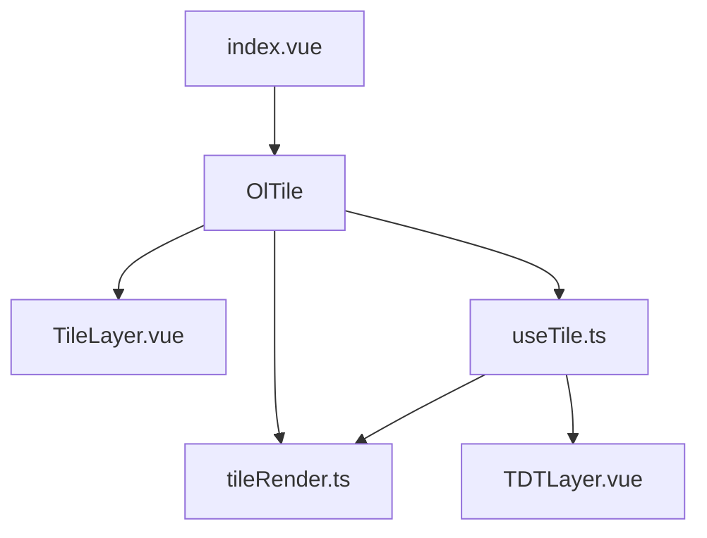
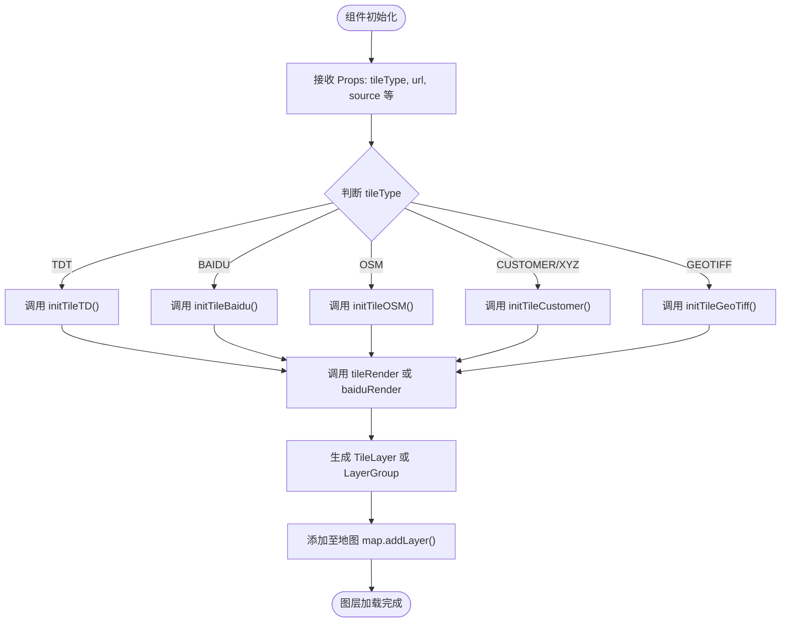
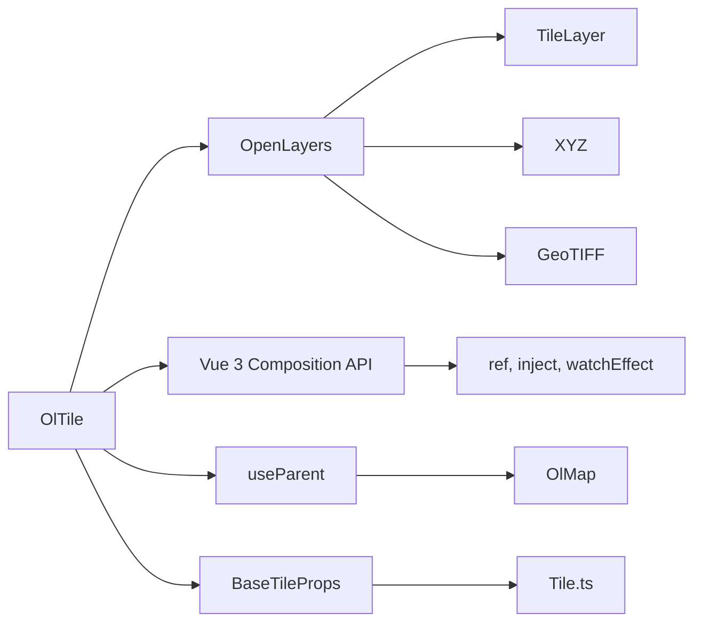

# OlTile 瓦片图层

<cite>
**本文档引用文件**  
- [TileLayer.vue](file://src/packages/layers/tile/TileLayer.vue)
- [useTile.ts](file://src/packages/layers/tile/useTile.ts)
- [tileRender.ts](file://src/packages/layers/tile/tileRender.ts)
- [TDTLayer.vue](file://src/packages/layers/tile/TDTLayer.vue)
- [index.vue](file://src/examples/tile/index.vue)
- [Tile.ts](file://src/packages/types/Tile.ts)
</cite>

## 目录
1. [简介](#简介)
2. [项目结构](#项目结构)
3. [核心组件](#核心组件)
4. [架构概览](#架构概览)
5. [详细组件分析](#详细组件分析)
6. [依赖关系分析](#依赖关系分析)
7. [性能考量](#性能考量)
8. [故障排查指南](#故障排查指南)
9. [结论](#结论)

## 简介
`OlTile` 是一个基于 Vue 3 和 OpenLayers 的瓦片图层组件，用于在地图中加载和管理各类瓦片服务（如天地图、百度地图、高德地图、OSM 等）。该组件通过组合式 API 实现图层状态管理，并支持动态切换图层类型、透明度控制、图层可见性管理等功能。它必须作为 `OlMap` 的插槽内容使用，以确保正确挂载到地图实例中。

本文档将深入解析 `OlTile` 的实现原理、核心逻辑、支持的属性与事件，并结合示例说明其使用方式。

## 项目结构
`OlTile` 组件位于 `/src/packages/layers/tile/` 目录下，主要由以下几个文件构成：

- **TileLayer.vue**：主组件入口，负责接收 props 并调用 `useTile` 创建图层。
- **useTile.ts**：组合式函数，封装了图层初始化、渲染、添加至地图等核心逻辑。
- **tileRender.ts**：提供多种瓦片源的渲染函数，如通用 XYZ、百度、OSM、GeoTIFF 等。
- **TDTLayer.vue**：天地图专用组件，封装了天地图的配置逻辑。
- **index.vue**：位于示例目录，展示了多种瓦片服务的实际配置与使用方式。



**图示来源**  
- [TileLayer.vue](file://src/packages/layers/tile/TileLayer.vue)
- [useTile.ts](file://src/packages/layers/tile/useTile.ts)
- [tileRender.ts](file://src/packages/layers/tile/tileRender.ts)

## 核心组件
`OlTile` 的核心功能由 `useTile.ts` 驱动，其主要职责包括：

- 根据 `tileType` 动态选择对应的图层初始化方法。
- 调用 `tileRender.ts` 中的渲染函数创建 OpenLayers 的 `TileLayer` 实例。
- 将图层添加到地图实例中，并支持图层组（LayerGroup）管理。
- 提供图层可见性、重置、清除等操作接口。

关键数据结构定义在 `Tile.ts` 中，包括 `BaseTileProps` 接口和 `enumTile` 枚举。

**组件来源**  
- [useTile.ts](file://src/packages/layers/tile/useTile.ts#L1-L327)
- [Tile.ts](file://src/packages/types/Tile.ts#L1-L66)

## 架构概览
`OlTile` 的整体架构遵循“配置驱动 + 渲染分离”的设计模式：



**图示来源**  
- [useTile.ts](file://src/packages/layers/tile/useTile.ts#L50-L200)
- [tileRender.ts](file://src/packages/layers/tile/tileRender.ts#L1-L96)

## 详细组件分析

### TileLayer.vue 分析
`TileLayer.vue` 是 `OlTile` 的 Vue 组件入口，使用 `defineProps` 接收 `BaseTileProps` 类型的属性，并通过 `useTile` 获取图层实例。

```vue
<script lang="ts" setup>
import { BaseTileProps } from "@/packages/types";
import { useTile } from "@/packages/hooks/tile.ts";

const props = withDefaults(defineProps<BaseTileProps>(), {
  layerId: "",
  visible: true,
});

const { getLayer } = useTile(props);
const layer = getLayer();
const { addLayer } = useParent();
if (layer) addLayer(layer);
</script>
```

该组件通过 `useParent` 将图层注册到父级容器（如 `OlMap`），确保图层能正确挂载。

**组件来源**  
- [TileLayer.vue](file://src/packages/layers/tile/TileLayer.vue#L1-L22)

### useTile.ts 深度解析
`useTile.ts` 是 `OlTile` 的核心逻辑文件，其主要函数为 `tileLayer($props)`，根据 `tileType` 分发不同的初始化函数。

#### 支持的 tileType 类型
通过 `enumTile` 定义，支持以下类型：
- `TDT`：天地图矢量图
- `TDT_SATELLITE`：天地图卫星影像
- `BAIDU`：百度地图矢量图
- `BAIDU_SATELLITE`：百度地图卫星影像
- `AMAP`：高德地图矢量图
- `OSM`：OpenStreetMap
- `GEOTIFF`：GeoTIFF 格式瓦片
- `CUSTOMER` / `XYZ`：自定义 XYZ 服务

#### 动态图层创建逻辑
```ts
switch (props.tileType.toUpperCase()) {
  case "TDT":
    initTileTD();
    break;
  case "BAIDU":
    initTileBaidu();
    break;
  // ...其他类型
  default:
    initTile();
}
```

每种类型调用对应的初始化函数，最终通过 `tileRender` 或专用渲染函数（如 `baiduRender`）创建 `TileLayer`。

#### 百度地图特殊处理
百度地图使用自定义 `tileUrlFunction` 处理坐标系转换（BD-09），并设置原点为 `[0, 0]`，Y 轴反向。

```ts
tileUrlFunction: function (tileCoord: number[]) {
  const z = tileCoord[0];
  const x = tileCoord[1];
  const y = -tileCoord[2] - 1;
  return url.replace("{x}", x.toString()).replace("{y}", y.toString()).replace("{z}", z.toString());
}
```

**组件来源**  
- [useTile.ts](file://src/packages/layers/tile/useTile.ts#L50-L327)
- [tileRender.ts](file://src/packages/layers/tile/tileRender.ts#L50-L75)

### tileRender.ts 渲染逻辑
该文件提供通用的瓦片渲染函数：

- `tileRender`：通用 XYZ 源渲染，支持自定义 `tileGrid`。
- `baiduRender`：百度地图专用渲染，处理 BD-09 坐标系。
- `OSMRender`：OSM 专用渲染。
- `geotiffRender`：支持 WebGL 渲染 GeoTIFF 图层。

```ts
const tileRender = (layerOptions, sourceOptions) => {
  const tileGrid = getTileGrid(sourceOptions);
  return new TileLayer({
    ...layerOptions,
    source: new XYZ({ ...sourceOptions, tileGrid }),
  });
};
```

**组件来源**  
- [tileRender.ts](file://src/packages/layers/tile/tileRender.ts#L1-L96)

## 依赖关系分析
`OlTile` 依赖以下模块：



**图示来源**  
- [useTile.ts](file://src/packages/layers/tile/useTile.ts)
- [tileRender.ts](file://src/packages/layers/tile/tileRender.ts)

## 性能考量
- **高缩放级别性能**：建议使用 `WebGLTileLayer` 渲染 GeoTIFF 或大图瓦片，提升渲染效率。
- **跨域问题**：确保瓦片服务支持 CORS，或配置代理服务器。
- **图层缓存**：OpenLayers 自带瓦片缓存机制，合理设置 `tileGrid` 可减少重复请求。
- **动态切换优化**：使用 `resetTile` 方法可安全替换图层，避免内存泄漏。

## 故障排查指南
### 常见问题
1. **瓦片加载失败（跨域）**
   - 现象：浏览器报 `CORS error`
   - 解决方案：配置代理服务器或使用支持 CORS 的瓦片服务。

2. **百度地图无法显示**
   - 原因：未配置 `ak` 或 URL 模板错误
   - 解决方案：检查 `baiduRender` 中的 `ak` 是否传入，URL 是否正确替换 `{x}{y}{z}`

3. **天地图无标注**
   - 原因：仅加载了底图未加载标注层
   - 解决方案：`initTileTD` 会自动创建底图和标注图层组（LayerGroup）

4. **图层不显示**
   - 检查 `visible` 属性是否为 `true`
   - 检查 `zIndex` 是否被其他图层覆盖
   - 确保 `OlTile` 作为 `OlMap` 的插槽内容使用

**问题来源**  
- [useTile.ts](file://src/packages/layers/tile/useTile.ts#L100-L150)
- [tileRender.ts](file://src/packages/layers/tile/tileRender.ts#L60-L75)

## 结论
`OlTile` 是一个功能强大且灵活的瓦片图层组件，支持多种主流地图服务的集成。其通过 `useTile` 组合式函数实现了图层的统一管理，并利用 `tileRender.ts` 提供了可扩展的渲染能力。结合 `TDTLayer.vue` 等专用组件，开发者可以快速构建多源地图应用。建议在生产环境中注意跨域配置与性能优化，以确保地图流畅运行。