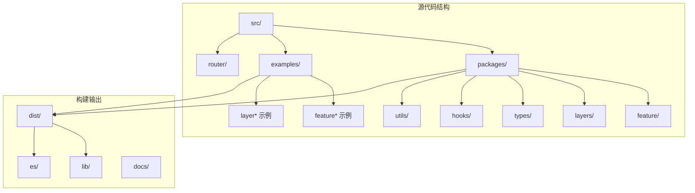
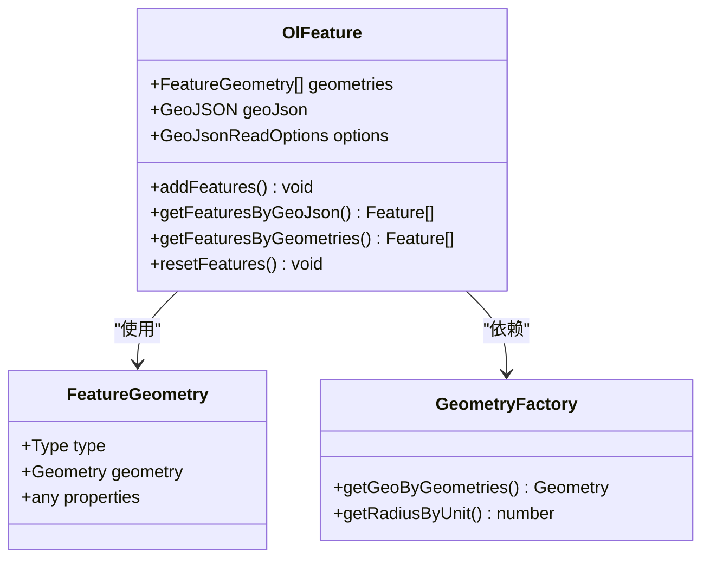
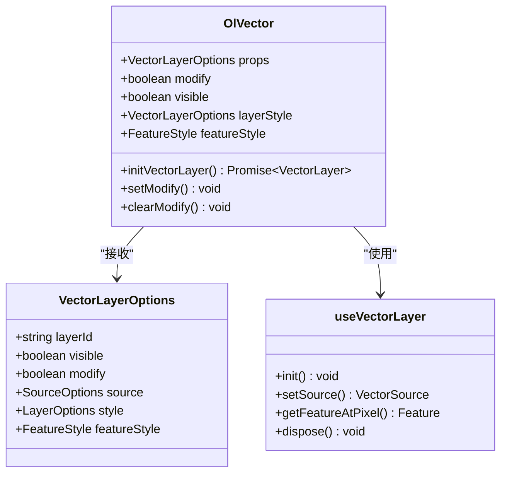
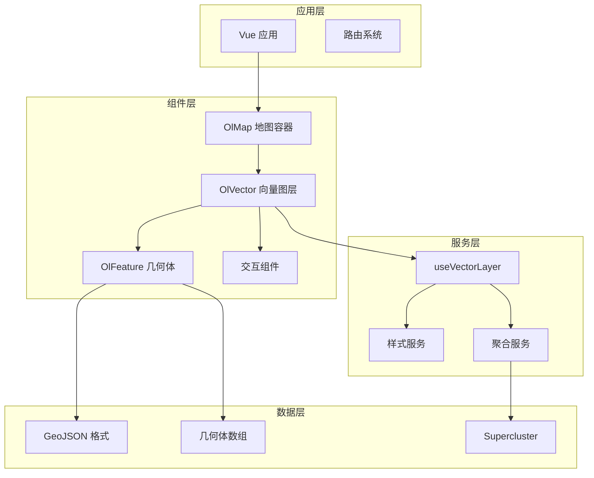
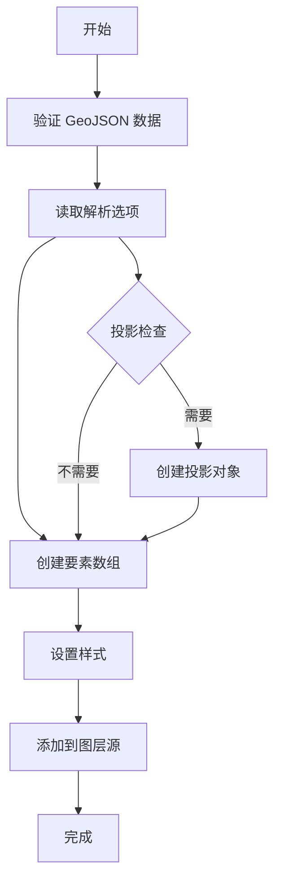
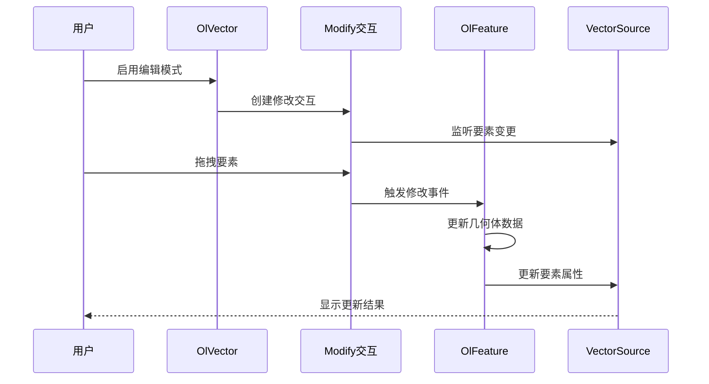
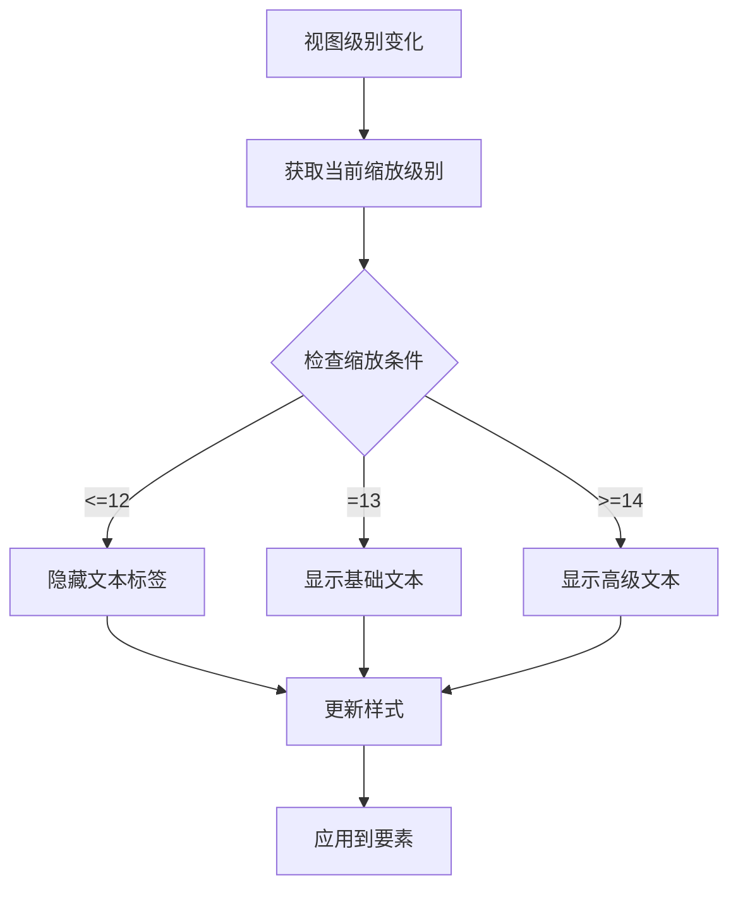
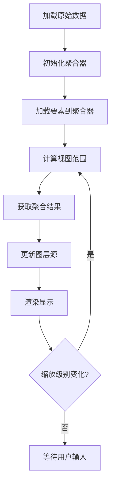

# 几何体特征示例

<cite>
**本文档引用的文件**
- [README.md](file://README.md)
- [package.json](file://package.json)
- [featureGeometries 示例](file://src/examples/featureGeometries/index.vue)
- [featureGeoJson 示例](file://src/examples/featureGeoJson/index.vue)
- [featureStyle 示例](file://src/examples/featureStyle/index.vue)
- [modifyFeature 示例](file://src/examples/modifyFeature/index.vue)
- [OlFeature 组件](file://src/packages/feature/feature.ts)
- [OlVector 图层](file://src/packages/layers/vector/index.vue)
- [向量图层 Hook](file://src/packages/hooks/vector.ts)
- [Feature 类型定义](file://src/packages/types/Feature.ts)
- [工具函数集合](file://src/packages/utils/index.ts)
</cite>

## 目录
1. [简介](#简介)
2. [项目结构](#项目结构)
3. [核心组件](#核心组件)
4. [架构概览](#架构概览)
5. [详细组件分析](#详细组件分析)
6. [依赖关系分析](#依赖关系分析)
7. [性能考虑](#性能考虑)
8. [故障排除指南](#故障排除指南)
9. [结论](#结论)

## 简介

v3-ol-map 是一个基于 Vue 3 和 OpenLayers 10 的地理信息系统组件库。该项目专注于提供直观易用的地理可视化解决方案，特别强调几何体特征的创建、管理和交互。

本项目的核心优势在于：
- **原生 API 集成**：尽可能使用 OpenLayers 原生 API，通过 props 传递参数
- **类型安全**：完整的 TypeScript 类型定义
- **灵活配置**：支持多种数据格式和样式配置
- **交互性强**：内置编辑、移动、测量等交互功能

## 项目结构

项目采用模块化架构，主要包含以下核心目录：



**图表来源**
- [项目结构](file://src/packages/feature/feature.ts#L1-L50)
- [示例文件](file://src/examples/featureGeometries/index.vue#L1-L50)

**章节来源**
- [README.md](file://README.md#L1-L131)
- [package.json](file://package.json#L1-L82)

## 核心组件

### OlFeature 几何体特征组件

OlFeature 组件是整个几何体系统的核心，负责处理各种类型的地理要素：



**图表来源**
- [OlFeature 组件](file://src/packages/feature/feature.ts#L43-L372)
- [Feature 类型定义](file://src/packages/types/Feature.ts#L52-L65)

### OlVector 向量图层组件

OlVector 组件提供完整的向量图层管理功能：



**图表来源**
- [OlVector 图层](file://src/packages/layers/vector/index.vue#L16-L35)
- [向量图层 Hook](file://src/packages/hooks/vector.ts#L38-L303)

**章节来源**
- [OlFeature 组件](file://src/packages/feature/feature.ts#L1-L372)
- [OlVector 图层](file://src/packages/layers/vector/index.vue#L1-L106)
- [向量图层 Hook](file://src/packages/hooks/vector.ts#L1-L303)

## 架构概览

项目采用分层架构设计，确保组件间的松耦合和高内聚：



**图表来源**
- [项目结构](file://src/packages/feature/feature.ts#L1-L50)
- [OlVector 图层](file://src/packages/layers/vector/index.vue#L1-L50)

## 详细组件分析

### 几何体数据格式支持

项目支持两种主要的几何体数据格式：

#### 1. GeoJSON 格式

GeoJSON 是最常用的地理数据交换格式：



**图表来源**
- [OlFeature 组件](file://src/packages/feature/feature.ts#L159-L196)

#### 2. 自定义几何体格式

项目提供了更灵活的自定义几何体格式：

| 几何体类型 | 属性 | 描述 |
|-----------|------|------|
| Point | coordinates: number[] | 点坐标 |
| LineString | coordinates: number[][] | 线段坐标数组 |
| Polygon | coordinates: number[][][] | 多边形坐标数组 |
| Circle | center: number[], radius: number | 圆心坐标和半径 |
| MultiPoint | coordinates: number[][] \| number[] | 多个点 |
| MultiLineString | coordinates: number[][][] \| number[][] | 多条线 |
| MultiPolygon | coordinates: number[][][][] \| number[][][] | 多个多边形 |

**章节来源**
- [featureGeometries 示例](file://src/examples/featureGeometries/index.vue#L11-L77)
- [featureGeoJson 示例](file://src/examples/featureGeoJson/index.vue#L11-L77)
- [Feature 类型定义](file://src/packages/types/Feature.ts#L15-L51)

### 编辑功能实现

项目内置了强大的要素编辑功能：



**图表来源**
- [OlVector 图层](file://src/packages/layers/vector/index.vue#L60-L72)
- [向量图层 Hook](file://src/packages/hooks/vector.ts#L82-L104)

**章节来源**
- [modifyFeature 示例](file://src/examples/modifyFeature/index.vue#L1-L108)
- [OlVector 图层](file://src/packages/layers/vector/index.vue#L60-L72)
- [向量图层 Hook](file://src/packages/hooks/vector.ts#L82-L104)

### 样式系统

项目提供了灵活的样式配置系统：

#### 动态样式函数



**图表来源**
- [featureStyle 示例](file://src/examples/featureStyle/index.vue#L53-L80)

**章节来源**
- [featureStyle 示例](file://src/examples/featureStyle/index.vue#L1-L98)

## 依赖关系分析

项目的主要依赖关系如下：

```mermaid
graph TB
subgraph "核心依赖"
OL[OpenLayers 10]
VUE[Vue 3.4.27]
TS[TypeScript]
end
subgraph "地理处理"
TURF[@turf/turf]
SUPERCLUSTER[supercluster]
PROJ4[proj4]
end
subgraph "可视化"
ECHARTS[ol-echarts]
WIND[ol-wind]
WIND_CORE[wind-core]
end
subgraph "工具库"
NANOID[nanoid]
QSD[qs]
SIMPLIFY[simplify-js]
THROTTLE[throttle-debounce]
end
VUE --> OL
TS --> OL
TURF --> OL
SUPERCLUSTER --> OL
ECHARTS --> OL
WIND --> OL
WIND_CORE --> WIND
```

**图表来源**
- [package.json](file://package.json#L28-L44)

**章节来源**
- [package.json](file://package.json#L1-L82)

## 性能考虑

### 聚合优化

项目实现了 Supercluster 聚合功能来处理大量要素：



**图表来源**
- [OlFeature 组件](file://src/packages/feature/feature.ts#L86-L147)

### 内存管理

项目采用了多种内存管理策略：

1. **懒加载机制**：组件按需初始化
2. **事件监听器清理**：组件卸载时自动清理
3. **源数据缓存**：避免重复创建相同数据
4. **样式缓存**：优化样式渲染性能

## 故障排除指南

### 常见问题及解决方案

#### 1. 要素不显示问题

**症状**：要素添加后不显示

**可能原因**：
- 缺少样式配置
- 投影设置错误
- 坐标系不匹配

**解决方法**：
```typescript
// 确保设置样式参数
const layerStyle = {
  'stroke-color': '#409eff',
  'stroke-width': 3,
  'fill-color': 'rgba(64, 158, 255, 0.2)'
}

// 检查投影设置
const options = {
  dataProjection: 'EPSG:4326',
  featureProjection: 'EPSG:3857'
}
```

#### 2. 编辑功能失效

**症状**：要素无法编辑

**可能原因**：
- 修改模式未启用
- 交互冲突
- 权限问题

**解决方法**：
```typescript
// 确保启用修改模式
<ol-vector :modify="true" @modifyend="handleModifyEnd">
  <ol-feature :geometries="geometryData" />
</ol-vector>

// 检查事件处理
const handleModifyEnd = (event) => {
  console.log('修改完成:', event);
}
```

#### 3. 性能问题

**症状**：大量要素时性能下降

**解决方法**：
- 启用聚合功能
- 限制显示要素数量
- 优化样式复杂度

**章节来源**
- [OlVector 图层](file://src/packages/layers/vector/index.vue#L42-L58)
- [向量图层 Hook](file://src/packages/hooks/vector.ts#L234-L236)

## 结论

v3-ol-map 提供了一个功能完整、性能优异的地理信息系统组件库。其核心特点包括：

1. **类型安全**：完整的 TypeScript 支持，提供准确的类型定义
2. **灵活配置**：支持多种数据格式和样式配置
3. **强大功能**：内置编辑、聚合、动画等高级功能
4. **高性能**：优化的渲染和内存管理机制
5. **易于使用**：直观的 API 设计和丰富的示例

该库特别适合需要复杂地理可视化的应用场景，如地图应用、GIS 系统、位置服务等。通过合理的配置和使用，可以快速构建专业的地理信息系统。