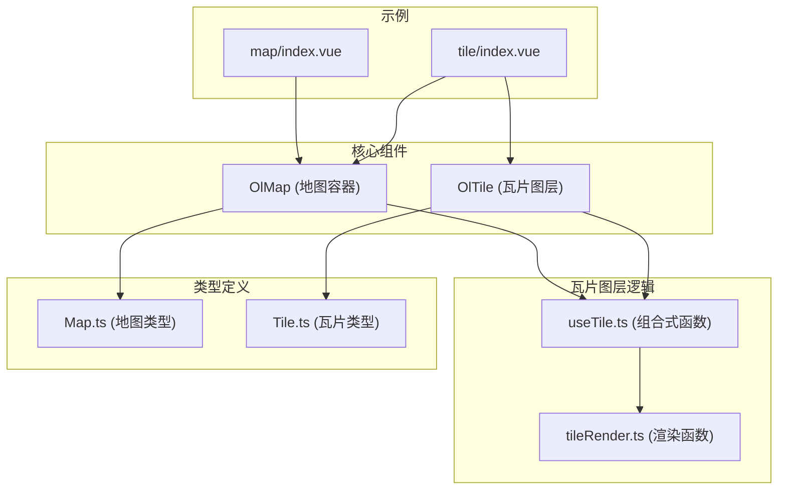
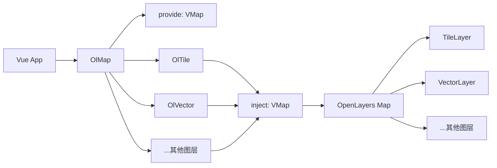
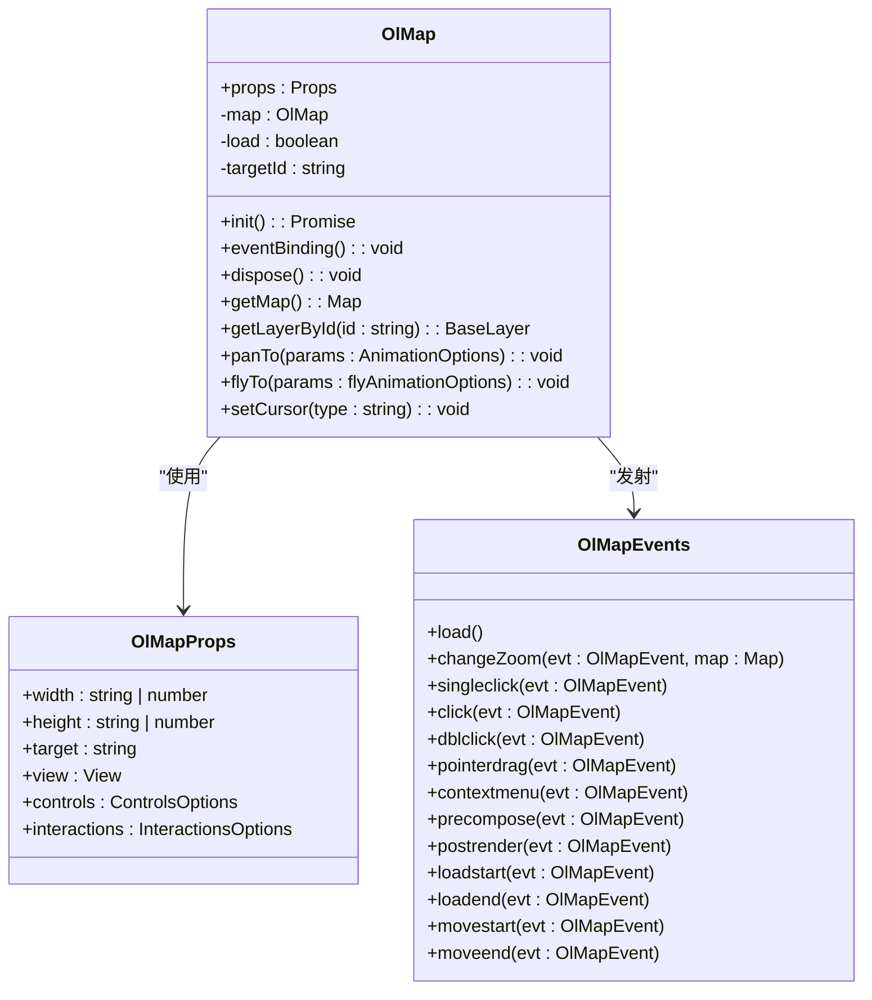
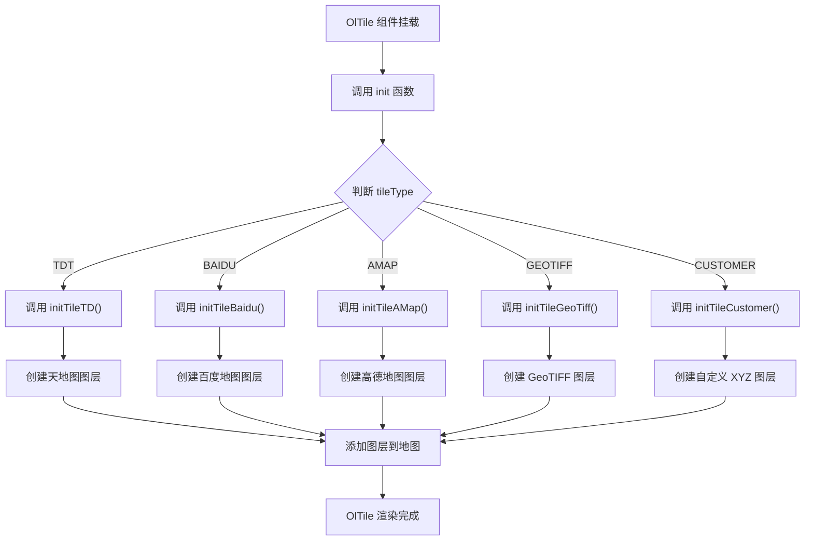
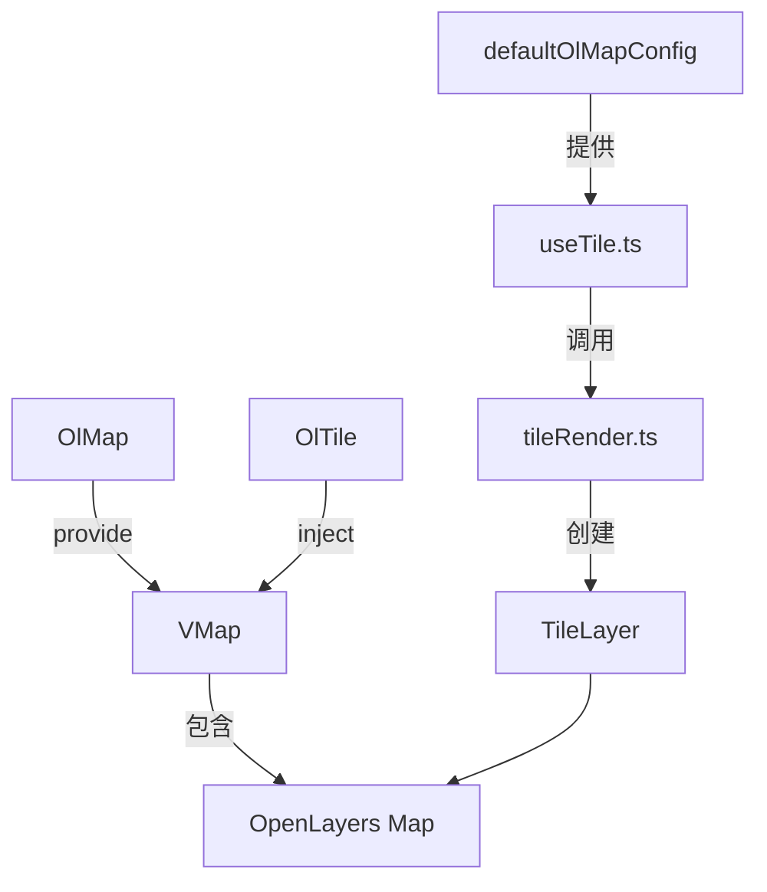

# 基础组件

<cite>
**本文档引用的文件**  
- [OlMap/index.vue](file://src/packages/map/index.vue)
- [tile/index.vue](file://src/packages/layers/tile/index.vue)
- [useTile.ts](file://src/packages/layers/tile/useTile.ts)
- [tileRender.ts](file://src/packages/layers/tile/tileRender.ts)
- [index.vue](file://src/examples/map/index.vue)
- [index.vue](file://src/examples/tile/index.vue)
- [Map.ts](file://src/packages/types/Map.ts)
- [Tile.ts](file://src/packages/types/Tile.ts)
</cite>

## 目录
1. [简介](#简介)
2. [项目结构](#项目结构)
3. [核心组件](#核心组件)
4. [架构概览](#架构概览)
5. [详细组件分析](#详细组件分析)
6. [依赖关系分析](#依赖关系分析)
7. [性能考虑](#性能考虑)
8. [故障排除指南](#故障排除指南)
9. [结论](#结论)

## 简介
本文档详细介绍了 `v3-ol-map` 项目中的两个核心基础组件：`OlMap` 地图容器和 `OlTile` 瓦片图层。`OlMap` 作为所有地图组件的根容器，通过 Vue 的 `provide/inject` 机制向下传递地图实例和配置。`OlTile` 组件封装了 OpenLayers 的 `TileLayer`，支持天地图、百度地图、高德地图、OSM、GeoTIFF 等多种瓦片服务。文档结合 `src/examples/map` 和 `src/examples/tile` 中的实际案例，深入解析了组件的实现机制、使用方式、属性、事件和插槽模式，并提供了性能优化建议。

## 项目结构
项目采用模块化设计，核心功能组件位于 `src/packages` 目录下，按功能划分为 `map`、`layers`、`controls`、`interaction` 等子模块。`src/examples` 目录存放了各个组件的使用示例。`OlMap` 作为地图的根容器，位于 `src/packages/map/index.vue`。`OlTile` 作为瓦片图层组件，位于 `src/packages/layers/tile/index.vue`，其核心逻辑由 `useTile.ts` 和 `tileRender.ts` 两个组合式函数文件实现。



**图源**
- [OlMap/index.vue](file://src/packages/map/index.vue)
- [tile/index.vue](file://src/packages/layers/tile/index.vue)
- [useTile.ts](file://src/packages/layers/tile/useTile.ts)
- [tileRender.ts](file://src/packages/layers/tile/tileRender.ts)

## 核心组件
`OlMap` 和 `OlTile` 是构建地图应用的基石。`OlMap` 负责初始化 OpenLayers 的 `Map` 实例，管理地图的生命周期，并通过 `provide` 提供地图实例供子组件使用。`OlTile` 则负责根据 `tileType` 属性创建并管理不同类型的瓦片图层，如天地图、百度地图等，并将其添加到 `OlMap` 中。

**节源**
- [OlMap/index.vue](file://src/packages/map/index.vue#L1-L218)
- [tile/index.vue](file://src/packages/layers/tile/index.vue#L1-L63)

## 架构概览
整个地图组件库基于 Vue 3 的组合式 API 和 OpenLayers 库构建。`OlMap` 作为应用的入口，初始化地图并提供上下文。其他地图组件（如 `OlTile`、`OlVector` 等）作为 `OlMap` 的子组件，通过 `inject` 获取地图实例，并在挂载时将自身创建的图层添加到地图中。这种设计模式实现了组件间的松耦合和高内聚。



**图源**
- [OlMap/index.vue](file://src/packages/map/index.vue#L1-L218)
- [useTile.ts](file://src/packages/layers/tile/useTile.ts#L1-L327)

## 详细组件分析

### OlMap 组件分析
`OlMap` 组件是所有地图功能的根容器。它封装了 OpenLayers 的 `Map` 类，并通过 Vue 的响应式系统和生命周期钩子进行管理。

#### 实现机制
`OlMap` 在 `onMounted` 钩子中调用 `init` 函数来创建 `OlMap` 实例。该实例会根据 `props` 和从 `inject` 获取的全局配置（`$OlMapConfig`）来初始化地图的视图（`view`）、控件（`controls`）和交互（`interactions`）。创建成功后，它会通过 `provide("VMap", map)` 将地图实例暴露给所有后代组件。

#### 属性（Props）
`OlMap` 的属性继承自 OpenLayers 的 `MapOptions`，并扩展了 `width` 和 `height` 用于设置容器尺寸。
- **`width`**: 地图容器的宽度，默认为 `"100%"`。
- **`height`**: 地图容器的高度，默认为 `"100%"`。
- **`target`**: 地图容器的 DOM 元素 ID，若未提供则自动生成。
- **`view`**: 地图视图配置，如 `center`、`zoom`、`projection` 等。
- **`controls`**: 地图控件配置。
- **`interactions`**: 地图交互配置。

#### 事件（Events）
`OlMap` 捕获并重新发射了 OpenLayers 地图的核心事件。
- **`load`**: 地图初始化完成后触发。
- **`changeZoom`**: 地图缩放级别改变时触发。
- **`singleclick`**, **`click`**, **`dblclick`**: 鼠标点击事件。
- **`pointerdrag`**: 鼠标拖拽事件。
- **`contextmenu`**: 右键菜单事件。
- **`precompose`**, **`postrender`**: 地图渲染事件。
- **`loadstart`**, **`loadend`**: 地图加载事件。
- **`movestart`**, **`moveend`**: 地图移动事件。

#### 方法与暴露（Expose）
`OlMap` 通过 `defineExpose` 暴露了多个方法供父组件调用。
- **`getMap()`**: 获取底层的 OpenLayers `Map` 实例。
- **`getLayerById(id)`**: 根据 ID 获取图层对象。
- **`panTo(params)`**: 平滑移动到指定位置。
- **`flyTo(params)`**: 飞行动画移动到指定位置。
- **`setCursor(type)`**: 强制设置鼠标光标样式。



**图源**
- [OlMap/index.vue](file://src/packages/map/index.vue#L1-L218)
- [Map.ts](file://src/packages/types/Map.ts#L1-L27)

**节源**
- [OlMap/index.vue](file://src/packages/map/index.vue#L1-L218)

### OlTile 组件分析
`OlTile` 组件用于创建和管理各种类型的瓦片图层。

#### 实现机制
`OlTile` 组件本身非常轻量，其核心逻辑在 `useTileLayer` 函数（即 `useTile.ts`）中实现。`OlTile` 在 `onMounted` 时调用 `init` 函数，该函数根据 `props.tileType` 的值，通过 `switch` 语句调用不同的初始化函数（如 `initTileTD`、`initTileBaidu` 等）来创建对应的瓦片图层。创建的图层会被添加到由 `inject("VMap")` 获取的地图实例中。

#### 属性（Props）
- **`tileType`**: 瓦片图层类型，如 `"TDT"`、`"BAIDU"`、`"AMAP"`、`"GEOTIFF"` 等。
- **`layerId`**: 图层的唯一标识符，若未提供则自动生成。
- **`visible`**: 图层是否可见，默认为 `true`。
- **`source`**: 图层数据源配置，是一个包含 `url`、`projection` 等信息的对象。
- **`zIndex`**: 图层的堆叠顺序。

#### 支持的瓦片服务
`useTile.ts` 文件中的 `init` 函数通过 `switch` 语句支持多种瓦片服务：
- **天地图 (TDT)**: 支持矢量图、卫星影像、地形图。
- **百度地图 (BAIDU)**: 支持矢量图、卫星影像、午夜蓝主题。
- **高德地图 (AMAP)**: 支持矢量图、卫星影像。
- **OSM**: 开放街道地图。
- **GeoTIFF**: 支持加载 GeoTIFF 格式的栅格数据。
- **CUSTOMER/XYZ**: 支持自定义 XYZ 格式的瓦片服务。

#### 代码示例
以下代码展示了如何在模板中使用 `OlMap` 和 `OlTile`：

```vue
<template>
  <ol-map ref="mapContainer" :view="view" @singleclick="handleClick">
    <!-- 添加百度地图瓦片图层 -->
    <ol-tile tile-type="BAIDU" :preload="Infinity"></ol-tile>
    <!-- 添加高德卫星图瓦片图层 -->
    <ol-tile tile-type="AMAP_SATELLITE"></ol-tile>
  </ol-map>
</template>

<script setup lang="ts">
import { ref } from "vue";
import { OlMapInstance, VMap } from "@/packages";

const mapContainer = ref<OlMapInstance>();
const view: VMap["view"] = {
  zoom: 12,
  city: "厦门",
};
const handleClick = () => {
  console.log(mapContainer.value?.getMap());
};
</script>
```



**图源**
- [tile/index.vue](file://src/packages/layers/tile/index.vue#L1-L63)
- [useTile.ts](file://src/packages/layers/tile/useTile.ts#L1-L327)
- [tileRender.ts](file://src/packages/layers/tile/tileRender.ts#L1-L96)

**节源**
- [useTile.ts](file://src/packages/layers/tile/useTile.ts#L1-L327)

## 依赖关系分析
`OlMap` 和 `OlTile` 组件之间存在明确的依赖关系。`OlTile` 依赖于 `OlMap` 提供的地图实例。这种依赖通过 Vue 的 `provide/inject` 机制实现，避免了通过 `props` 逐层传递的繁琐。`useTile.ts` 依赖于 `tileRender.ts` 中的渲染函数来创建具体的图层实例。`defaultOlMapConfig` 提供了天地图、百度地图、高德地图等服务的默认 URL 配置。



**图源**
- [OlMap/index.vue](file://src/packages/map/index.vue#L1-L218)
- [useTile.ts](file://src/packages/layers/tile/useTile.ts#L1-L327)
- [tileRender.ts](file://src/packages/layers/tile/tileRender.ts#L1-L96)

## 性能考虑
1. **图层预加载**: 对于 `OlTile` 组件，可以通过设置 `preload` 属性（如 `:preload="Infinity"`）来预加载所有层级的瓦片，提升地图平移和缩放时的流畅度，但会增加初始加载时间和网络流量。
2. **渲染模式选择**: 对于 `GeoTIFF` 图层，组件使用了 `WebGLTile` 而非 `Raster`，这利用了 GPU 加速，能显著提升大尺寸栅格数据的渲染性能。
3. **坐标系与分辨率**: 百度地图使用了自定义的 `BD:09` 坐标系和分辨率，`baiduRender` 函数中通过 `tileUrlFunction` 正确地转换了瓦片坐标，确保了地图的正确显示。
4. **事件管理**: `OlMap` 在组件卸载时 (`onBeforeUnmount`) 调用 `dispose` 函数清理事件监听器，防止内存泄漏。

## 故障排除指南
- **地图不显示**: 检查 `OlMap` 的 `width` 和 `height` 是否有值，确保容器有实际尺寸。
- **瓦片图层加载失败**: 检查 `tileType` 是否正确，对于天地图和百度地图，确认 `ak`（访问密钥）已在 `defaultOlMapConfig` 或全局配置中正确设置。
- **地图交互无响应**: 确保 `OlMap` 已成功初始化并触发了 `load` 事件，子组件应在 `load` 为 `true` 后才进行操作。
- **坐标偏移**: 当使用百度地图时，确保所有数据都经过了从 `EPSG:3857` 到 `BD:09` 的坐标转换。

## 结论
`OlMap` 和 `OlTile` 组件通过封装 OpenLayers 的复杂性，为开发者提供了一个简洁、易用且功能强大的地图组件库。`OlMap` 作为根容器，通过 `provide/inject` 机制实现了地图实例的全局共享。`OlTile` 组件则通过组合式函数和条件渲染，灵活地支持了多种主流的瓦片地图服务。结合提供的示例代码，开发者可以快速构建出功能丰富的地图应用。遵循性能优化建议，可以进一步提升应用的用户体验。