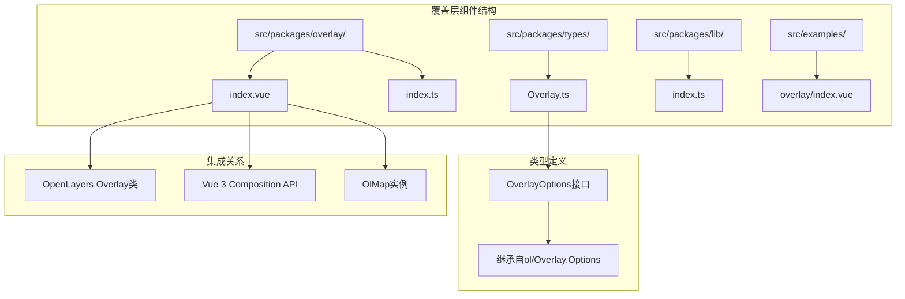
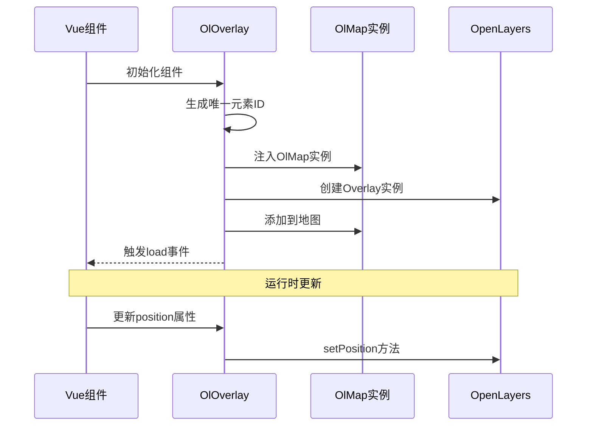
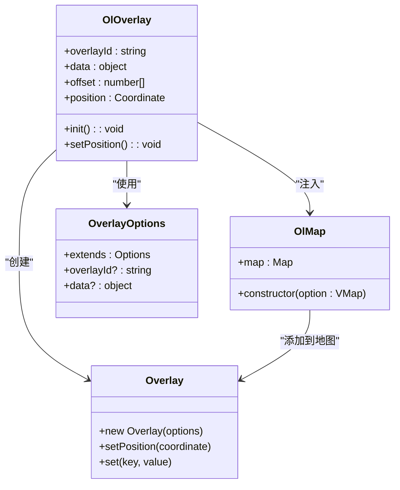
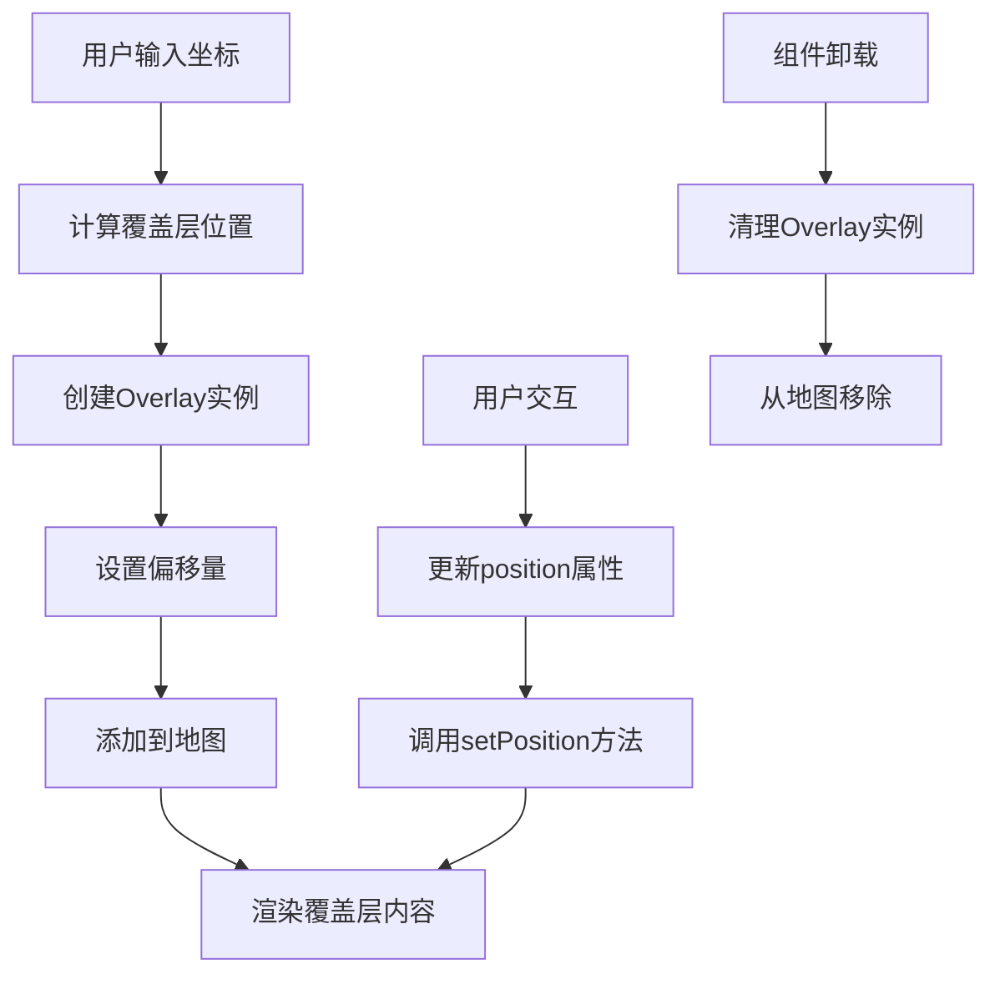
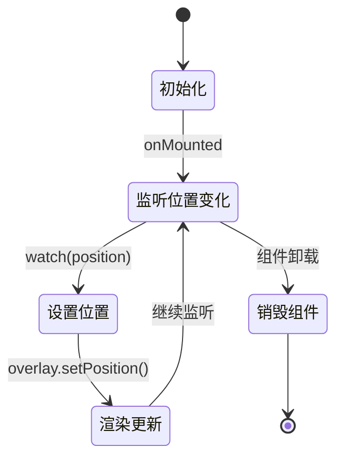
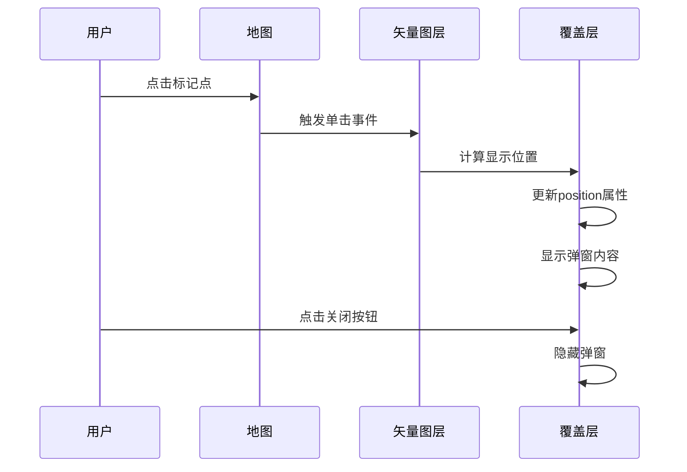
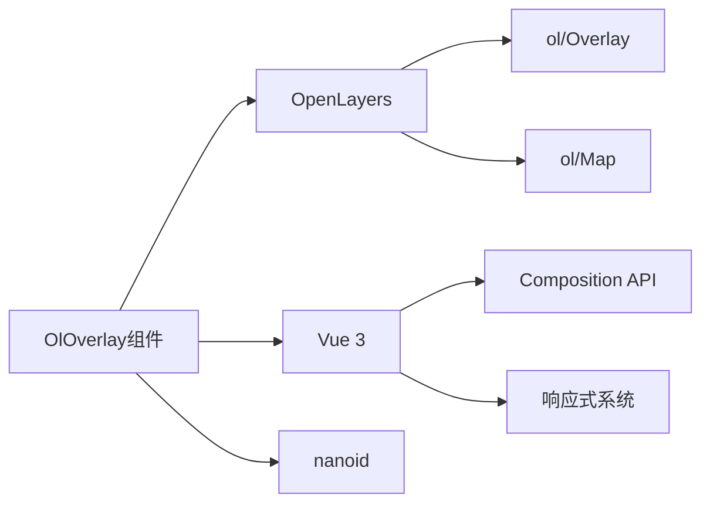
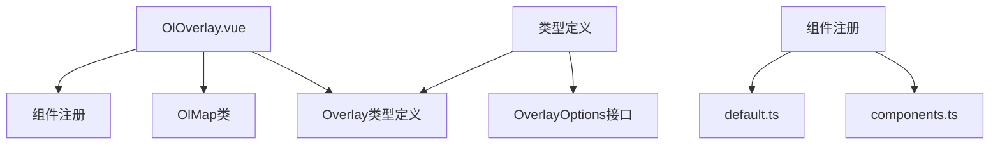

# 覆盖层组件

<cite>
**本文档引用的文件**
- [src/packages/overlay/index.vue](file://src/packages/overlay/index.vue)
- [src/packages/overlay/index.ts](file://src/packages/overlay/index.ts)
- [src/packages/types/Overlay.ts](file://src/packages/types/Overlay.ts)
- [src/packages/lib/index.ts](file://src/packages/lib/index.ts)
- [src/examples/overlay/index.vue](file://src/examples/overlay/index.vue)
- [src/packages/components.ts](file://src/packages/components.ts)
- [src/packages/default.ts](file://src/packages/default.ts)
- [src/packages/utils/index.ts](file://src/packages/utils/index.ts)
</cite>

## 目录
1. [简介](#简介)
2. [项目结构](#项目结构)
3. [核心组件](#核心组件)
4. [架构概览](#架构概览)
5. [详细组件分析](#详细组件分析)
6. [依赖关系分析](#依赖关系分析)
7. [性能考虑](#性能考虑)
8. [故障排除指南](#故障排除指南)
9. [结论](#结论)

## 简介

覆盖层组件（OlOverlay）是基于 OpenLayers 的 Vue 3 地图组件库中的重要组成部分，用于在地图上创建可交互的弹出窗口和信息展示层。该组件允许开发者在地图的特定坐标位置显示自定义内容，支持动态定位、样式定制和事件处理。

OlOverlay 组件通过与 OpenLayers 的 Overlay 类集成，提供了灵活的地图覆盖功能，包括标记点信息弹窗、自定义提示框、工具提示等多种应用场景。

## 项目结构

覆盖层组件在项目中的组织结构如下：

**图表来源**
- [src/packages/overlay/index.vue](file://src/packages/overlay/index.vue#L1-L61)
- [src/packages/overlay/index.ts](file://src/packages/overlay/index.ts#L1-L7)
- [src/packages/types/Overlay.ts](file://src/packages/types/Overlay.ts#L1-L7)

**章节来源**
- [src/packages/overlay/index.vue](file://src/packages/overlay/index.vue#L1-L61)
- [src/packages/overlay/index.ts](file://src/packages/overlay/index.ts#L1-L7)
- [src/packages/types/Overlay.ts](file://src/packages/types/Overlay.ts#L1-L7)

## 核心组件

### OlOverlay 组件概述

OlOverlay 是一个基于 Vue 3 Composition API 的组件，主要特点包括：

- **响应式定位**：支持通过 `position` 属性动态更新覆盖层位置
- **灵活配置**：继承 OpenLayers Overlay 的所有配置选项
- **数据绑定**：支持通过 `data` 属性传递自定义数据
- **事件处理**：提供 `load` 事件用于初始化完成通知

### 主要属性配置

| 属性名 | 类型 | 默认值 | 描述 |
|--------|------|--------|------|
| overlayId | string | "" | 覆盖层唯一标识符 |
| data | object | {} | 自定义数据对象 |
| offset | number[] | [0, 0] | 偏移量设置 |
| position | Coordinate | undefined | 地理坐标位置 |

### 核心功能实现

组件通过以下核心流程实现功能：

**图表来源**
- [src/packages/overlay/index.vue](file://src/packages/overlay/index.vue#L28-L48)
- [src/packages/lib/index.ts](file://src/packages/lib/index.ts#L9-L45)

**章节来源**
- [src/packages/overlay/index.vue](file://src/packages/overlay/index.vue#L13-L48)
- [src/packages/types/Overlay.ts](file://src/packages/types/Overlay.ts#L3-L6)

## 架构概览

### 组件架构设计

**图表来源**
- [src/packages/overlay/index.vue](file://src/packages/overlay/index.vue#L1-L61)
- [src/packages/lib/index.ts](file://src/packages/lib/index.ts#L9-L45)
- [src/packages/types/Overlay.ts](file://src/packages/types/Overlay.ts#L1-L7)

### 数据流架构

**图表来源**
- [src/packages/overlay/index.vue](file://src/packages/overlay/index.vue#L28-L51)
- [src/packages/utils/index.ts](file://src/packages/utils/index.ts#L41-L92)

## 详细组件分析

### 组件实现细节

#### 初始化流程

组件的初始化过程包含以下关键步骤：

1. **元素ID生成**：使用 `nanoid()` 生成唯一标识符
2. **实例注入**：通过 `inject()` 获取 OlMap 实例
3. **Overlay创建**：构造 OpenLayers Overlay 对象
4. **地图集成**：将覆盖层添加到地图中
5. **事件触发**：向父组件发送加载完成事件

#### 响应式更新机制

**图表来源**
- [src/packages/overlay/index.vue](file://src/packages/overlay/index.vue#L28-L34)

#### 核心方法实现

组件的关键方法包括：

- **init() 方法**：负责组件初始化和 Overlay 实例创建
- **setPosition() 方法**：处理位置更新逻辑
- **watch() 监听器**：监控 position 属性变化

**章节来源**
- [src/packages/overlay/index.vue](file://src/packages/overlay/index.vue#L35-L51)

### 使用示例分析

#### 基础使用模式

在示例应用中，OlOverlay 组件展示了典型的应用场景：

**图表来源**
- [src/examples/overlay/index.vue](file://src/examples/overlay/index.vue#L107-L129)

#### 高级配置选项

组件支持多种配置选项以满足不同需求：

- **定位方式**：支持多种定位策略（如 bottom-center）
- **样式定制**：通过 CSS 类名进行样式控制
- **交互功能**：支持关闭按钮等交互元素

**章节来源**
- [src/examples/overlay/index.vue](file://src/examples/overlay/index.vue#L154-L164)

## 依赖关系分析

### 外部依赖

覆盖层组件依赖于以下外部库：

**图表来源**
- [src/packages/overlay/index.vue](file://src/packages/overlay/index.vue#L1-L8)

### 内部依赖关系

组件之间的依赖关系如下：

**图表来源**
- [src/packages/components.ts](file://src/packages/components.ts#L15-L29)
- [src/packages/default.ts](file://src/packages/default.ts#L34-L64)

**章节来源**
- [src/packages/components.ts](file://src/packages/components.ts#L15-L29)
- [src/packages/default.ts](file://src/packages/default.ts#L34-L64)

## 性能考虑

### 性能优化策略

1. **懒加载机制**：组件在挂载时才创建 Overlay 实例
2. **响应式更新**：仅在 position 变化时更新位置
3. **内存管理**：组件销毁时自动清理 Overlay 实例

### 最佳实践建议

- 合理设置 offset 参数以避免覆盖层重叠
- 使用合适的定位策略确保内容可见性
- 在大量覆盖层场景下考虑性能影响
- 及时清理不再使用的覆盖层实例

## 故障排除指南

### 常见问题及解决方案

#### 问题1：覆盖层不显示
**可能原因**：
- position 属性未正确设置
- 元素ID生成冲突
- 地图实例未正确注入

**解决方法**：
- 确保 position 属性为有效的地理坐标
- 检查 overlayId 是否唯一
- 验证 OlMap 实例是否正确提供

#### 问题2：覆盖层位置错误
**可能原因**：
- 坐标系统不匹配
- 偏移量设置不当
- 定位策略选择错误

**解决方法**：
- 确认坐标使用正确的投影系统
- 调整 offset 参数以适应显示效果
- 选择合适的定位策略（如 top-center、bottom-center）

#### 问题3：性能问题
**可能原因**：
- 频繁的位置更新
- 大量覆盖层同时存在
- DOM 操作过多

**解决方法**：
- 优化位置更新频率
- 考虑使用虚拟滚动技术
- 减少不必要的 DOM 操作

**章节来源**
- [src/packages/overlay/index.vue](file://src/packages/overlay/index.vue#L18-L22)
- [src/packages/overlay/index.vue](file://src/packages/overlay/index.vue#L24-L25)

## 结论

OlOverlay 覆盖层组件作为 v3-ol-map 地图组件库的重要组成部分，提供了强大而灵活的地图覆盖功能。通过与 OpenLayers 的深度集成和 Vue 3 响应式系统的结合，该组件能够满足各种复杂的地图交互需求。

组件的主要优势包括：

1. **易用性**：简洁的 API 设计和直观的使用方式
2. **灵活性**：丰富的配置选项和自定义能力
3. **性能**：优化的渲染机制和内存管理
4. **扩展性**：良好的架构设计便于功能扩展

未来可以考虑的功能增强方向包括：
- 更多的定位策略支持
- 动画效果的丰富化
- 与更多地图交互功能的集成
- 性能监控和优化工具