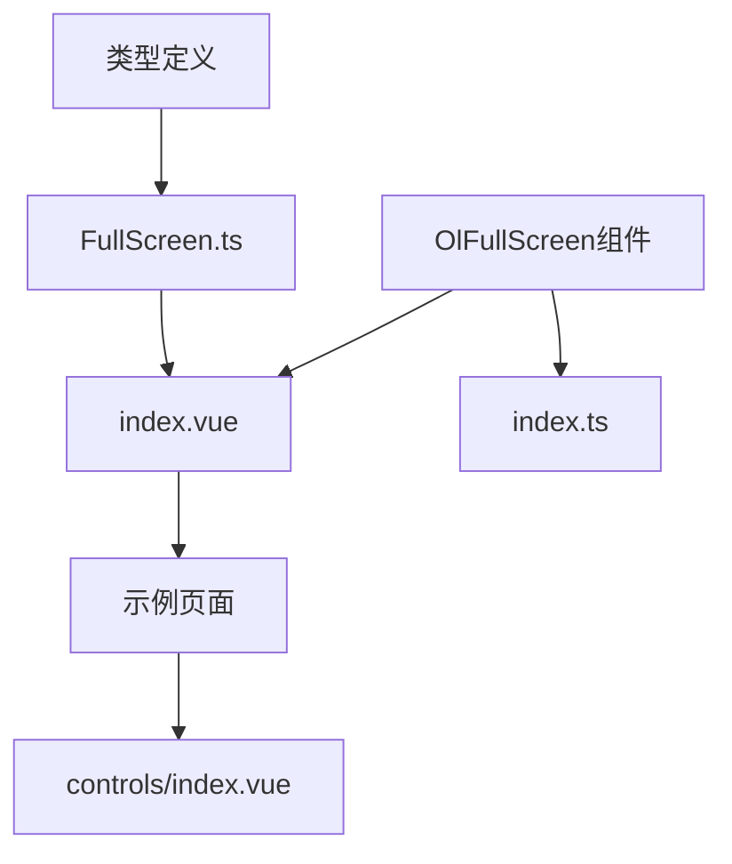
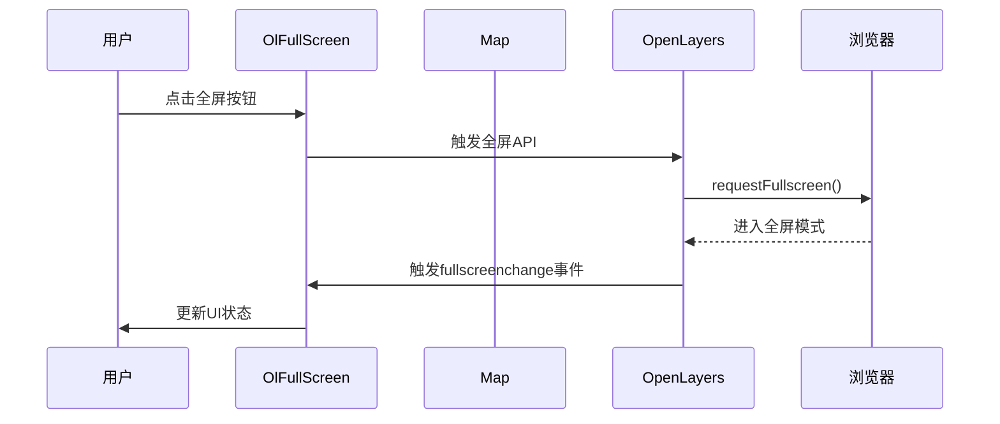

# 全屏控制 (OlFullScreen)

<cite>
**本文档引用文件**  
- [index.vue](file://src/packages/controls/FullScreen/index.vue#L1-L34)
- [FullScreen.ts](file://src/packages/types/FullScreen.ts#L1-L7)
- [index.vue](file://src/examples/controls/index.vue#L1-L36)
</cite>

## 目录
1. [简介](#简介)
2. [项目结构](#项目结构)
3. [核心组件分析](#核心组件分析)
4. [实现机制详解](#实现机制详解)
5. [属性与配置](#属性与配置)
6. [事件监听与状态同步](#事件监听与状态同步)
7. [使用示例](#使用示例)
8. [常见问题与解决方案](#常见问题与解决方案)

## 简介
`OlFullScreen` 是一个基于 Vue 3 Composition API 封装的全屏地图控制组件，用于在 OpenLayers 地图应用中提供一键进入/退出全屏的功能。该组件封装了 OpenLayers 原生的 `FullScreenControl` 类，并通过 `props` 暴露配置项（如触发图标、提示文本等），支持响应式更新和状态管理。用户可通过点击按钮触发全屏切换，并可通过 `v-model` 绑定全屏状态。

**Section sources**
- [index.vue](file://src/packages/controls/FullScreen/index.vue#L1-L34)

## 项目结构
`OlFullScreen` 组件位于项目的 `/src/packages/controls/FullScreen/` 目录下，包含两个主要文件：
- `index.vue`：组件主文件，实现全屏控制逻辑
- `index.ts`：用于注册组件的安装模块

类型定义位于 `/src/packages/types/FullScreen.ts`，统一导出 OpenLayers 的 `FullScreen` 控件选项类型。

此外，在示例目录 `/src/examples/controls/index.vue` 中展示了该组件的实际使用方式。



**Diagram sources**
- [index.vue](file://src/packages/controls/FullScreen/index.vue#L1-L34)
- [FullScreen.ts](file://src/packages/types/FullScreen.ts#L1-L7)
- [index.vue](file://src/examples/controls/index.vue#L1-L36)

## 核心组件分析
`OlFullScreen` 是一个典型的 Vue 3 `<script setup>` 风格组件，利用 `shallowRef` 和 `watchEffect` 实现响应式控制。其核心功能是将 OpenLayers 的 `FullScreen` 控件实例化并添加到地图容器中。

组件通过 `inject("VMap")` 获取地图实例，确保与父级 `OlMap` 组件的上下文连接。初始化时创建 `FullScreen` 控件，并通过 `map.addControl()` 注册到地图上。

```vue
<script setup lang="ts">
import { inject, shallowRef, watchEffect, unref } from "vue";
import OlMap from "@/packages/lib";
import { FullScreen } from "ol/control";
import { FullScreenOptions } from "@/packages";

const VMap = inject("VMap") as OlMap;
const map = unref(VMap).map;

const props = withDefaults(defineProps<FullScreenOptions>(), {});
const fullScreen = shallowRef<FullScreen>();

const init = () => {
  fullScreen.value = new FullScreen({ ...props });
  map.addControl(fullScreen.value);
};

watchEffect(() => {
  if (fullScreen.value) map.removeControl(fullScreen.value);
  init();
});
</script>
```

**Section sources**
- [index.vue](file://src/packages/controls/FullScreen/index.vue#L1-L34)

## 实现机制详解
### Vue 3 Composition API 集成
组件使用 `defineProps<FullScreenOptions>()` 接收外部传入的配置参数，并通过 `withDefaults` 设置默认值。`FullScreenOptions` 类型来自 OpenLayers 的 `ol/control/FullScreen` 模块，确保类型安全。

### OpenLayers 控件封装
`OlFullScreen` 实质是对 OpenLayers 原生 `FullScreen` 类的封装。通过 `new FullScreen({ ...props })` 创建控件实例，并调用 `map.addControl()` 将其注入地图 UI。

### 响应式更新机制
使用 `watchEffect` 监听 `props` 变化。每当配置项变更时，自动移除旧控件并重新初始化，确保界面与配置同步。

### 依赖注入
通过 `inject("VMap")` 获取由 `OlMap` 提供的地图实例，实现父子组件间的数据传递，避免深层 prop 传递。



**Diagram sources**
- [index.vue](file://src/packages/controls/FullScreen/index.vue#L1-L34)

## 属性与配置
`OlFullScreen` 支持以下来自 OpenLayers 的原生配置属性：

:trigger: 全屏触发元素的 DOM 节点或 CSS 选择器  
:tipLabel: 悬停提示文本，默认为 "全屏"  
:className: 自定义 CSS 类名  
:label: 触发按钮内的文本或图标  
:labelActive: 激活状态下的按钮文本或图标  
:target: 全屏目标容器  

示例：自定义图标与提示文本
```vue
<ol-full-screen
  :tip-label="'切换全屏模式'"
  :label="'🔍'"
  :label-active="'❌'"
/>
```

**Section sources**
- [FullScreen.ts](file://src/packages/types/FullScreen.ts#L1-L7)

## 事件监听与状态同步
虽然当前代码未显式监听 `document.fullscreenchange` 事件，但 OpenLayers 的 `FullScreen` 控件内部已自动处理此逻辑。当全屏状态改变时，控件会自动更新其 UI 状态（如按钮图标切换）。

若需在外部同步全屏状态，可通过 `v-model` 绑定变量（需扩展组件支持），或通过 `ref` 获取组件实例后访问其内部状态。

未来可扩展如下逻辑以暴露状态：
```ts
const isFullscreen = ref(false);
document.addEventListener('fullscreenchange', () => {
  isFullscreen.value = !!document.fullscreenElement;
});
```

## 使用示例
在 `src/examples/controls/index.vue` 中，`OlFullScreen` 被集成到地图控制栏中，与其他控件协同工作：

```vue
<template>
  <ol-map :controls="controls">
    <ol-tile tile-type="BAIDU"></ol-tile>
    <ol-overview tile-type="AMAP"></ol-overview>
    <ol-zoom-slider></ol-zoom-slider>
    <ol-full-screen></ol-full-screen>
    <ol-scale-line></ol-scale-line>
  </ol-map>
</template>
```

该布局将全屏按钮与其他地图控件（缩放滑块、比例尺、鹰眼图）并列显示，符合标准 GIS 应用交互习惯。

**Section sources**
- [index.vue](file://src/examples/controls/index.vue#L1-L36)

## 常见问题与解决方案
### 问题1：点击全屏按钮无反应
**原因**：浏览器安全策略限制，全屏操作必须由用户手势（如点击）触发，不能由脚本自动执行。

**解决方案**：确保调用 `requestFullscreen()` 的行为直接由用户点击事件触发，避免异步延迟或间接调用。

### 问题2：全屏后地图渲染异常
**原因**：地图容器尺寸变化未触发重绘。

**解决方案**：在全屏切换后手动触发地图重绘：
```ts
map.updateSize();
```

### 问题3：自定义样式不生效
**原因**：组件使用 `scoped` 样式，无法穿透影响 OpenLayers 生成的 DOM。

**解决方案**：在全局样式中覆盖 `.ol-full-screen` 类，或使用 `:deep()` 穿透：
```css
:deep(.ol-full-screen) {
  bottom: 10px;
  right: 10px;
}
```

### 问题4：移动端兼容性问题
**原因**：部分移动浏览器不支持全屏 API 或需特殊前缀。

**解决方案**：检测浏览器兼容性并降级处理：
```ts
if (!document.fullscreenEnabled) {
  alert("当前浏览器不支持全屏功能");
}
```

**Section sources**
- [index.vue](file://src/packages/controls/FullScreen/index.vue#L1-L34)